# Définir lʼenchaînement des pages des formulaires web{#defining-web-forms-page-sequencing}


Le formulaire peut contenir une ou plusieurs pages. Il est créé à l’aide d’un diagramme qui vous permet de séquencer les pages, les tests, l’exécution de scripts, le saut de page et l’enregistrement des étapes. Le mode de conception de diagramme global est identique à celui d’un workflow Campaign.

## À propos des pages précédente et suivante {#about-previous-page-and-next-page}

Pour chaque page, il est possible de supprimer les boutons **[!UICONTROL Suivant]** ou **[!UICONTROL Précédent]**. Pour cela, sélectionnez la page concernée et cochez l&#39;option **[!UICONTROL Ne pas autoriser le passage à la page suivante]** ou **[!UICONTROL Ne pas autoriser le retour à la page précédente]** .

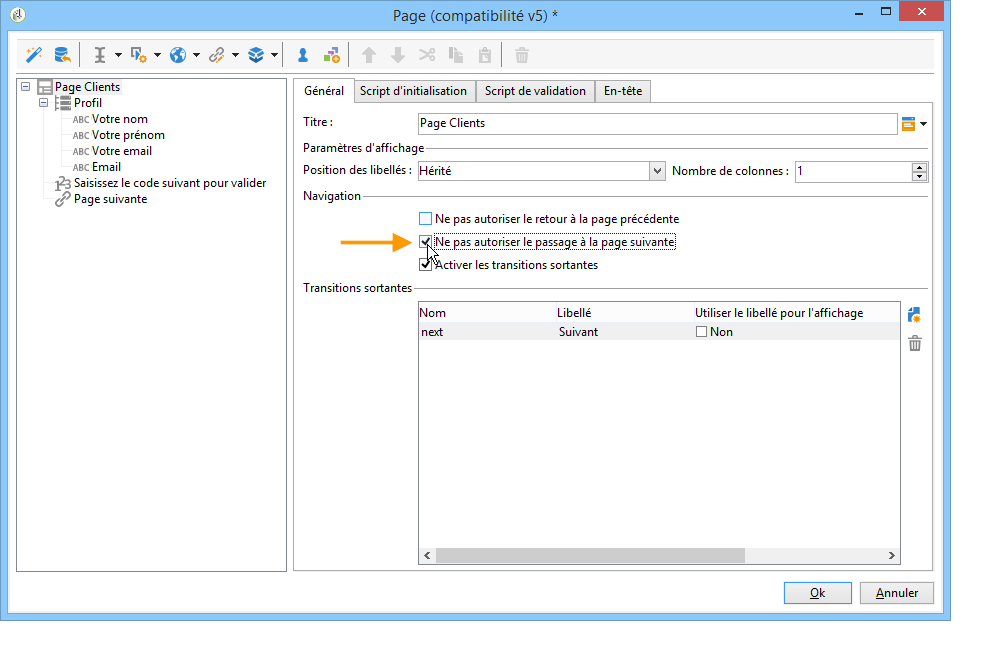

Vous pouvez remplacer ces boutons par des liens. Pour plus d&#39;informations, consultez la section [Insérer du contenu HTML](static-elements-in-a-web-form.md#inserting-html-content).

## Insérer un saut {#inserting-a-jump}

L&#39;objet **[!UICONTROL Saut]** permet d&#39;accéder à une autre page ou un autre formulaire lorsque l&#39;utilisateur clique sur le bouton **[!UICONTROL Suivant]**.

La destination peut être :

* Une autre page du formulaire. Pour cela, sélectionnez l&#39;option **[!UICONTROL Activité interne]**, puis indiquez la page souhaitée, comme illustré ci-dessous :

  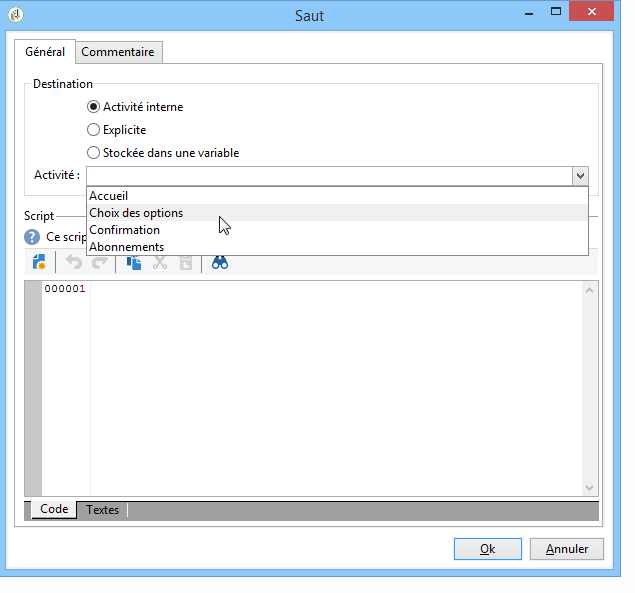

* Un autre formulaire. Pour cela, sélectionnez l&#39;option **[!UICONTROL Explicite]** et indiquez le formulaire de destination.

  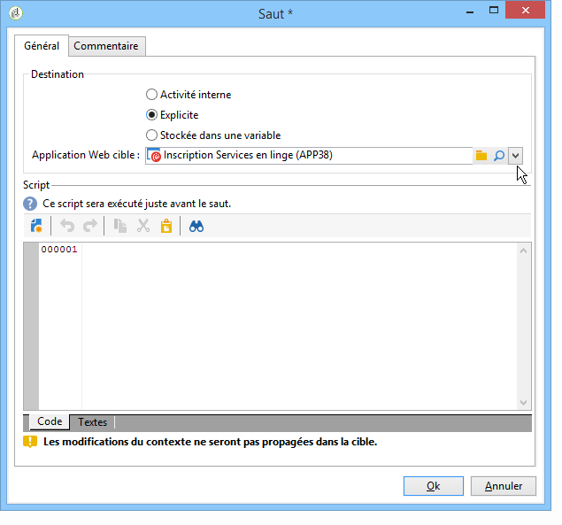

* La destination peut être stockée dans une variable. Dans ce cas, il suffit de la sélectionner dans la liste déroulante, comme dans l&#39;exemple suivant :

  

* L&#39;onglet **[!UICONTROL Commentaire]** permet de saisir des informations qui seront visibles par l&#39;opérateur lorsqu&#39;il clique sur l&#39;objet dans le diagramme.

  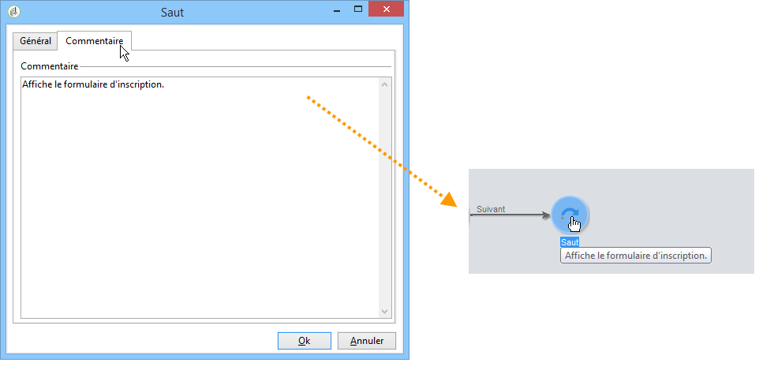

## Exemple : accéder à un autre formulaire en fonction d&#39;un paramètre de l&#39;URL {#example--accessing-another-form-according-to-a-parameter-of-the-url}

Dans cet exemple nous allons paramétrer un formulaire Web qui permet, à la validation, d&#39;afficher un autre formulaire, désigné par un paramètre de l&#39;URL. Les étapes sont les suivantes :

1. Insérez un saut à la fin d&#39;un formulaire : le saut remplace alors la boîte de **[!UICONTROL Fin]**.

   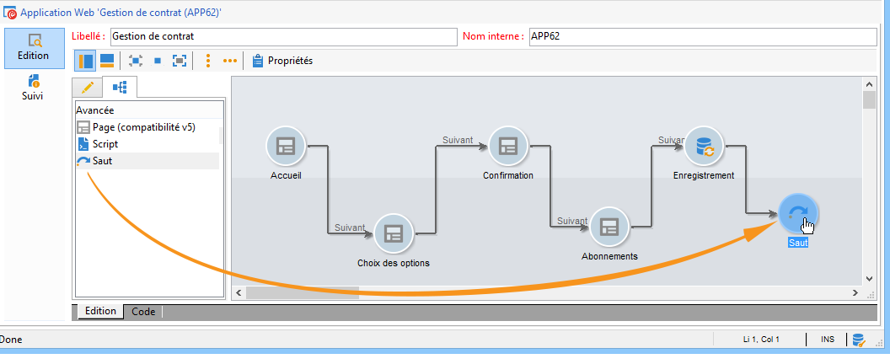

1. Dans les propriétés du formulaire, ajoutez un paramètre (**next**) stocké dans une variable locale (**next**). Les variables locales sont détaillées dans la section [Stocker les données dans une variable locale](web-forms-answers.md#storing-data-in-a-local-variable).

   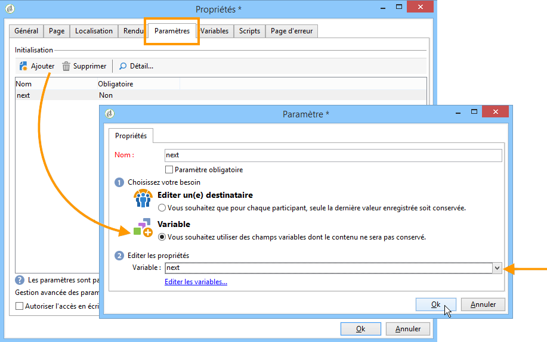

1. Editez l&#39;objet **[!UICONTROL Saut]**, choisissez l&#39;option **[!UICONTROL Stockée dans une variable]** et sélectionnez la variable **next** dans la liste déroulante.

   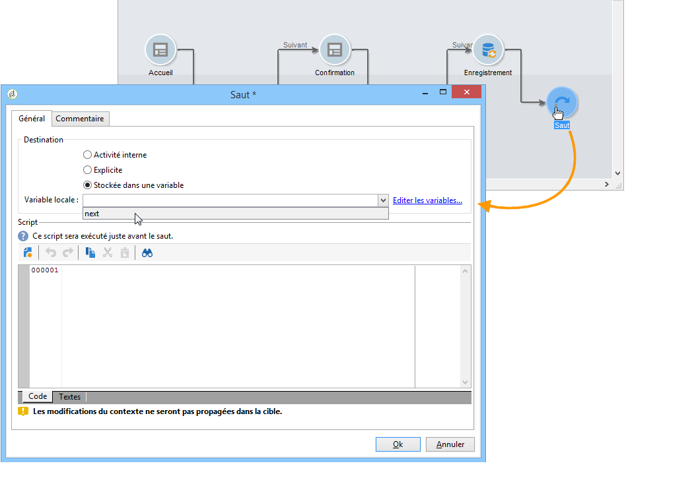

1. L&#39;URL de diffusion doit contenir le nom interne du formulaire de destination, par exemple :

   ```
   https://[myserver]/webForm/APP62?&next=APP22
   ```

   Ainsi, lorsque l&#39;utilisateur clique sur le bouton **[!UICONTROL Valider]**, le formulaire **APP22** est affiché.

## Insérer un lien vers une autre page du formulaire {#inserting-a-link-to-another-page-of-the-form}

Vous pouvez insérer des liens vers d&#39;autres pages du formulaire. Vous devez ajouter dans la page un élément statique de type **[!UICONTROL Lien]**. Voir à ce sujet la section [Insérer un lien](static-elements-in-a-web-form.md#inserting-a-link).

## Affichage conditionnel des pages {#conditional-page-display}

### Affichage en fonction des réponses {#display-based-on-responses}

La boîte de **[!UICONTROL Test]** permet de conditionner l&#39;enchaînement des pages dans un formulaire. Elle permet de définir différents embranchements en fonction du résultat d&#39;un test. Vous pouvez ainsi afficher des pages différentes en fonction des réponses fournies par l&#39;utilisateur.

Par exemple, vous pouvez afficher une page différente pour les clients ayant déjà commandé sur internet, et une autre pour ceux ayant effectué plus de dix commandes. Pour cela, dans la première page du formulaire, insérez une zone de saisie de type **[!UICONTROL Nombre]** pour que l&#39;utilisateur indique le nombre de commandes passées.

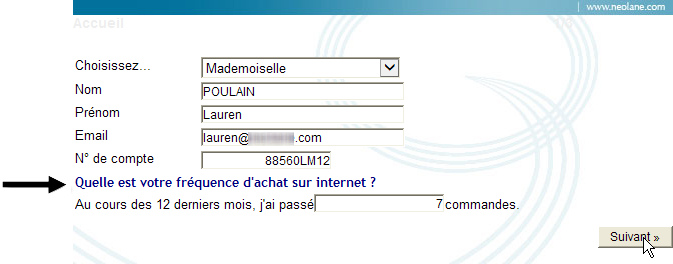

Vous pouvez stocker cette information dans un champ de la base de données ou utiliser une variable locale, selon vos besoins.

>[!NOTE]
>
>Les modes de stockage sont détaillés dans les [champs de stockage des réponses](web-forms-answers.md#response-storage-fields).

Dans notre exemple, nous allons utiliser une variable :

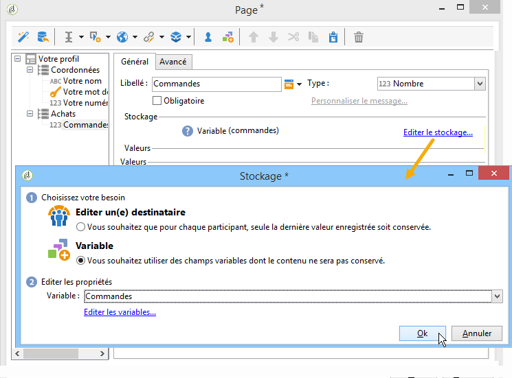

Dans le diagramme du formulaire, insérez ensuite une boîte de test afin de définir les conditions. Pour chaque condition, un nouveau branchement sera ajouté en sortie de la boîte de test.

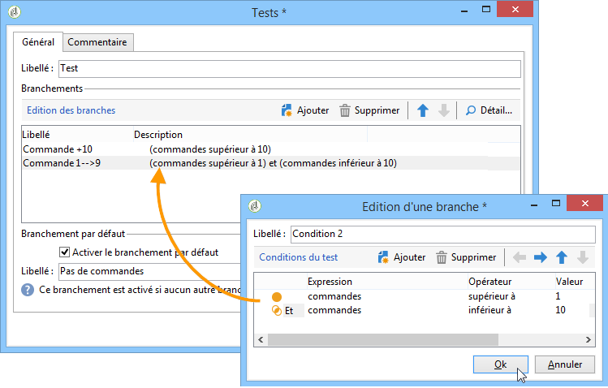

Cochez l&#39;option **[!UICONTROL Activer le branchement par défaut]** pour ajouter une transition pour les cas où aucune des conditions n&#39;est vraie. Cette option n&#39;est pas utile si tous les cas possibles sont couverts par les conditions définies.

Définissez ensuite l&#39;enchaînement des pages lorsque l&#39;une ou l&#39;autre des conditions est vérifiée, par exemple :

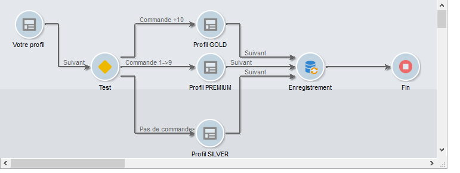

### Affichage en fonction des paramètres {#display-based-on-parameters}

Vous pouvez également personnaliser l&#39;enchaînement des pages en fonction des paramètres d&#39;initialisation du formulaire web ou en fonction de valeurs stockées en base. Pour plus d&#39;informations, consultez la section [Paramètres d&#39;URL de formulaire](defining-web-forms-properties.md#form-url-parameters).

## Ajouter des scripts {#adding-scripts}

L&#39;objet **[!UICONTROL Script]** vous permet de saisir directement un script Javascript par exemple pour modifier la valeur d&#39;un champ, récupérer des données dans la base ou appeler une API Adobe Campaign.

## Personnaliser la page de fin {#personalizing-the-end-page}

Vous devez positionner une page de fin à la fin du diagramme. La page de fin est affichée lorsque l&#39;utilisateur clique sur le bouton **[!UICONTROL Valider]** du formulaire Web.

Pour personnaliser cette page, double-cliquez sur l&#39;objet **[!UICONTROL Fin]** et saisissez le contenu de la page dans l&#39;éditeur central.

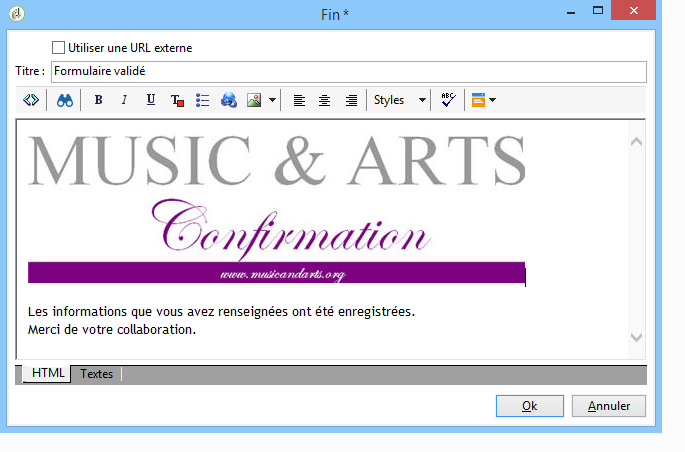

* Vous pouvez copier et coller un contenu HTML existant. Pour cela, cliquez sur le bouton **[!UICONTROL Afficher le code source]** et insérez le code HTML.
* Vous pouvez utiliser une URL externe : pour cela, cochez l&#39;option correspondante et saisissez l&#39;URL de la page à afficher.
