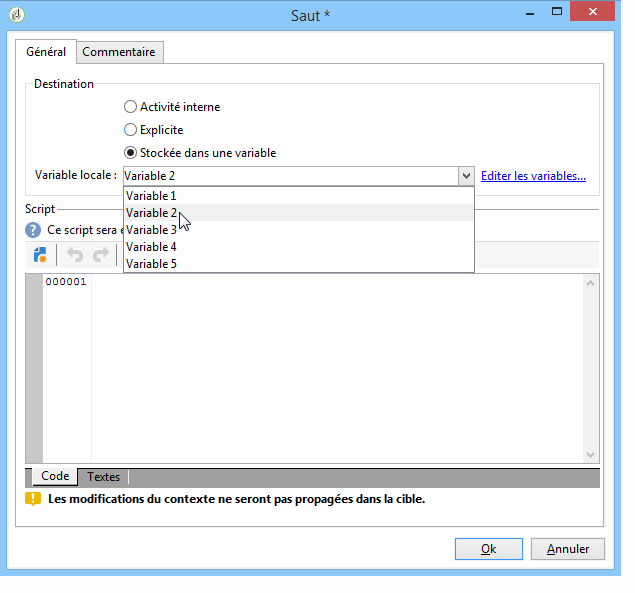

# Définir l&#39;enchaînement des pages des formulaires web{#defining-web-forms-page-sequencing}

Le formulaire peut contenir une ou plusieurs pages. Il est construit au travers d&#39;un diagramme qui permet d&#39;enchaîner les pages et les étapes de test, d&#39;exécution de script, d&#39;enregistrement et les sauts. Le mode de construction du diagramme est le même que pour un workflow.

## A propos des pages précédente et suivante {#about-previous-page-and-next-page}

Pour chaque page, vous pouvez supprimer les boutons **[!UICONTROL Next]** ou **[!UICONTROL Previous]** . Pour ce faire, sélectionnez la page concernée et sélectionnez l’option **[!UICONTROL Disable next page]** ou **[!UICONTROL Disallow returning to the previous page]** .


Vous pouvez remplacer ces boutons par des liens. Voir [Insertion de contenu](../../web/using/static-elements-in-a-web-form.md#inserting-html-content)HTML.

## Insérer un saut {#inserting-a-jump}

The **[!UICONTROL Jump]** object gives access to another page or another form when the user clicks **[!UICONTROL Next]**.

La destination peut être :

* Une autre page du formulaire. Pour ce faire, sélectionnez **[!UICONTROL Internal activity]** puis spécifiez une page, comme ci-dessous :

   

* Un autre formulaire. To do this, select the **[!UICONTROL Explicit]** option and specify the destination form.

   

* La destination peut être stockée dans une variable. Dans ce cas, il suffit de la sélectionner dans la liste déroulante, comme dans l&#39;exemple suivant :

   

* The **[!UICONTROL Comment]** tab lets you enter information that will be visible by the operator when they click the object in the diagram.

   

## Example: accessing another form according to a parameter of the URL {#example--accessing-another-form-according-to-a-parameter-of-the-url}

Dans cet exemple nous allons paramétrer un formulaire Web qui permet, à la validation, d&#39;afficher un autre formulaire, désigné par un paramètre de l&#39;URL. Les étapes sont les suivantes :

1. Insert a jump at the end of a form: this replaces the **[!UICONTROL End]** box.

   

1. Dans les propriétés du formulaire, ajoutez un paramètre (**next**) stocké dans une variable locale (**next**). Les variables locales sont détaillées dans la section [Stockage des données dans une variable](../../web/using/web-forms-answers.md#storing-data-in-a-local-variable)locale.

   

1. Edit the **[!UICONTROL Jump]** object, select the **[!UICONTROL Stored in a variable]** option and select the **next** variable from the drop-down box.

   

1. L&#39;URL de diffusion doit contenir le nom interne du formulaire de destination, par exemple :

   ```
   https://[myserver]/webForm/APP62?&next=APP22
   ```

   When the user clicks the **[!UICONTROL Approve]** button, form **APP22** is displayed.

## Insérer un lien vers une autre page du formulaire {#inserting-a-link-to-another-page-of-the-form}

Vous pouvez insérer des liens vers d’autres pages du formulaire. Pour ce faire, ajoutez un élément statique de **[!UICONTROL Link]** type à la page. Pour plus d&#39;informations, reportez-vous à la section [Insertion d&#39;un lien](../../web/using/static-elements-in-a-web-form.md#inserting-a-link).

## Conditionner l&#39;affichage des pages {#conditional-page-display}

### Affichage en fonction des réponses {#display-based-on-responses}

La **[!UICONTROL Test]** zone permet de conditionner le séquencement des pages dans un formulaire. Il vous permet de définir différentes lignes de branche en fonction des résultats du test. Vous pouvez ainsi afficher différentes pages en fonction des réponses fournies par les utilisateurs.

Par exemple, vous pouvez afficher une page différente pour les clients qui ont déjà commandé en ligne, et une autre pour ceux qui ont passé plus de dix commandes. Pour ce faire, dans la première page du formulaire, insérez un champ de saisie de **[!UICONTROL Number]** type afin que l’utilisateur indique le nombre de commandes qu’il a passées.


Vous pouvez stocker cette information dans un champ de la base de données ou utiliser une variable locale, selon vos besoins.

>[!NOTE]
>
>Les modes de stockage sont détaillés dans les champs [de stockage](../../web/using/web-forms-answers.md#response-storage-fields)Réponse.

Dans notre exemple, nous allons utiliser une variable :


Dans le diagramme du formulaire, insérez ensuite une boîte de test afin de définir les conditions. Pour chaque condition, un nouveau branchement sera ajouté en sortie de la boîte de test.


Sélectionnez l’ **[!UICONTROL Activate the default branching]** option pour ajouter une transition dans les cas où aucune des conditions n’est vraie. Cette option est inutile si chaque cas possible est couvert par les conditions définies.

Définissez ensuite l&#39;enchaînement des pages lorsque l&#39;une ou l&#39;autre des conditions est vérifiée, par exemple :


### Affichage en fonction des paramètres {#display-based-on-parameters}

Vous pouvez également personnaliser le séquencement des pages en fonction des paramètres d’initialisation du formulaire Web ou des valeurs stockées dans la base de données. Voir Paramètres [d’URL de](../../web/using/defining-web-forms-properties.md#form-url-parameters)formulaire.

## Ajouter des scripts {#adding-scripts}

L&#39;objet **[!UICONTROL Script]** vous permet de saisir directement un script Javascript par exemple pour modifier la valeur d&#39;un champ, récupérer des données dans la base ou appeler une API Adobe Campaign.

## Personnaliser la page de fin {#personalizing-the-end-page}

Vous devez placer une page de fin à la fin du diagramme. La page de fin s’affiche lorsque l’utilisateur clique sur le **[!UICONTROL Approve]** bouton dans le formulaire Web.

To personalize this page, double-click **[!UICONTROL End]** and enter the content of the page in the central editor.


* Vous pouvez copier et coller du contenu HTML existant. Pour ce faire, cliquez sur **[!UICONTROL Display source code]** et insérez le code HTML.
* Vous pouvez utiliser une URL externe : pour cela, cochez l&#39;option correspondante et saisissez l&#39;URL de la page à afficher.

