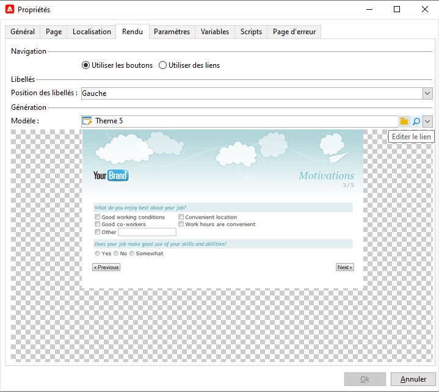

# Définir les propriétés des formulaires web{#defining-web-forms-properties}

Vous pouvez configurer et personnaliser entièrement les formulaires web pour répondre à vos besoins. Les paramètres doivent être renseignés dans la fenêtre des propriétés.

La fenêtre des propriétés est accessible à partir du bouton **[!UICONTROL Propriétés]** situé dans la barre d’outils du formulaire web. Cette fenêtre permet d’accéder à un ensemble de paramètres spécifiques au formulaire web. Certains paramètres peuvent être issus du paramétrage du modèle.

## Propriétés générales du formulaire {#overall-form-properties}

Dans l&#39;onglet **[!UICONTROL Général]** de la fenêtre des propriétés, vous pouvez modifier le **Libellé** du formulaire. Il est fortement déconseillé de modifier le **Nom interne**.

Le modèle de formulaire est choisi lors de la création du formulaire. Il ne peut pas être modifié ultérieurement. Pour plus d’informations sur la création et la gestion des modèles de formulaire, voir [Utiliser un modèle de formulaire web](using-a-web-form-template.md).

## Stockage des données d&#39;un formulaire {#form-data-storage}

Par défaut, les champs des formulaires Web sont stockés dans la table des destinataires. Vous pouvez modifier la table utilisée en sélectionnant une nouvelle table dans le champ **[!UICONTROL Type de document]**. L&#39;icône **[!UICONTROL Loupe]** permet de visualiser le contenu du tableau sélectionné.

Les réponses fournies sont stockées par défaut dans la table **Réponse à un formulaire d&#39;un destinataire**.

## Paramétrer une page d&#39;erreur {#setting-up-an-error-page}

Vous pouvez paramétrer une page d&#39;erreur : cette page est affichée en cas d&#39;erreur lors de l&#39;exécution du formulaire.

La page d&#39;erreur est définie dans l&#39;onglet correspondant de la fenêtre des propriétés du formulaire.

Par défaut, elle affiche les informations suivantes :

Le contenu des chaînes affichées est défini dans l&#39;onglet **[!UICONTROL Page d’erreur]** de la fenêtre des propriétés. L’onglet **[!UICONTROL HTML]** affiche le rendu, tandis que l’onglet **[!UICONTROL Textes]** vous permet de modifier les chaînes de texte et d’ajouter du texte si nécessaire :

## Localisation d&#39;un formulaire {#form-localization}

L&#39;onglet **[!UICONTROL Localisation]** permet de sélectionner les langues de conception et d&#39;affichage du formulaire Web.

Voir [Traduire un formulaire web](translating-a-web-form.md).

## Navigation dans un formulaire et rendu {#form-browsing-and-rendering}

L&#39;onglet **[!UICONTROL Rendu]** permet de définir le type de navigation entre les pages du formulaire Web et le modèle de rendu utilisé.

Vous pouvez choisir de naviguer via des liens ou des boutons.

Par défaut, les éléments de navigation sont des boutons. Ils permettent d&#39;effectuer les actions suivantes :

* Valider la page en cours et afficher la page suivante, en cliquant sur **[!UICONTROL Suivant]**. Ce bouton est affiché sur toutes les pages sauf la dernière.
* Afficher la page précédente, en cliquant sur **[!UICONTROL Précédent]**. Ce bouton est affiché sur toutes les pages sauf la première.
* Enregistrer les réponses du formulaire, en cliquant sur le bouton **[!UICONTROL Valider]**. Ce bouton n&#39;est affiché que sur la dernière page.

Ces éléments sont affichés en bas de chaque page. Leur positionnement peut être modifié : pour cela, vous devez adapter la feuille de style.

>[!NOTE]
>
>Le bouton **[!UICONTROL Précédent]** peut être masqué sur certaines pages. Pour cela, cochez l&#39;option **[!UICONTROL Ne pas autoriser le retour à la page précédente]** dans la page concernée. Cette option est accessible lorsque la racine de l&#39;arborescence de la page est sélectionnée.

Le champ **[!UICONTROL Modèle]** de l&#39;onglet **[!UICONTROL Rendu]** permet de sélectionner un thème parmi ceux disponibles.

Les thèmes sont enregistrés dans le nœud **[!UICONTROL Administration > Configuration > Rendus des formulaires]** de l’arborescence. Voir [Choisir le modèle de rendu du formulaire](form-rendering.md#selecting-the-form-rendering-template).

Un exemple de rendu est affiché dans la section inférieure de la fenêtre des propriétés. L&#39;icône **[!UICONTROL Editer le lien]** permet de visualiser le paramétrage correspondant au thème sélectionné.

## Logo dans le formulaire {#logo-in-the-form}

Vous pouvez remplacer le logo utilisé dans le formulaire par votre propre logo.

Dans l’onglet **[!UICONTROL Rendu]** dans les **[!UICONTROL propriétés]** de votre application web, cliquez sur l’icône en forme de loupe de votre modèle :

Dans la nouvelle fenêtre, cliquez sur le lien **[!UICONTROL Mise en page]** :

Vous aurez la possibilité de modifier le chemin de l’image du logo ici :

Les images disponibles se trouvent sous **[!UICONTROL Administration]** > **[!UICONTROL Configuration]** > **[!UICONTROL Images]**. Vous pouvez ajouter votre logo ici.

Ces images sont placées dans le répertoire back-end de l’instance. *datakit\nms\fra\img\activities* ou *datakit\nms\eng\img\activities* (eng ou fra, selon la langue de l’instance).

Pour qu’une nouvelle image soit disponible dans ce répertoire (et dans Images), contactez le support Adobe pour apporter des modifications aux répertoires back-end.

Pour les instances sur site, vous pouvez ajouter vous-même des images au datakit.

Il n’est pas nécessaire que l’image chargée soit visible à partir du client Campaign. Le chemin correct est suffisant pour être utilisé comme nouveau logo.

## Textes du formulaire {#texts-in-the-form}

L&#39;onglet **[!UICONTROL Page]** permet de définir le contenu de l’en-tête et du pied de page du formulaire. Voir [Définir les en-têtes et pieds de page](form-rendering.md#defining-headers-and-footers).

Il permet aussi de gérer les traductions. Voir [Traduire un formulaire web](translating-a-web-form.md).

## Accessibilité du formulaire {#accessibility-of-the-form}

Un formulaire web est accessible aux utilisateurs s’il est **[!UICONTROL En ligne]** et si la date actuelle est comprise dans sa période de validité. Le statut du formulaire est modifié au cours de l’étape de publication (voir [Publier un formulaire](publishing-a-web-form.md#publishing-a-form)). Le statut s’affiche dans la section **Projet** de l’onglet **[!UICONTROL Général]** de la fenêtre des propriétés.

La période de validité est comprise entre la date de **[!UICONTROL Démarrage]** et la date de **[!UICONTROL Clôture]**. Si aucune date n&#39;est spécifiée dans ces champs, la validité du formulaire est permanente.

>[!NOTE]
>
>Si le formulaire est fermé, donc si sa période de validité n&#39;est pas atteinte ou est dépassée, ou s&#39;il a été fermé par l&#39;opérateur Adobe Campaign, alors un message s&#39;affiche lorsque l&#39;utilisateur tente d&#39;y accéder. Vous pouvez personnaliser ce message en cliquant sur le lien **[!UICONTROL Personnaliser le message affiché si le formulaire est fermé...]**.

## Contrôle d&#39;accès au formulaire {#form-access-control}

Par défaut, l&#39;accès aux formulaires Web se fait en mode anonyme : tous les opérateurs qui accèdent au formulaire se voient attribuer les droits correspondant à l&#39;opérateur WebApp.

Vous pouvez activer le contrôle d’accès pour l’affichage du formulaire, par exemple lorsque vous diffusez un formulaire sur un site intranet, afin d’authentifier les utilisateurs et utilisatrices. Pour ce faire, affichez la variable **[!UICONTROL Propriétés]** du formulaire concerné et cliquez sur l’option **[!UICONTROL Activer le contrôle d’accès]**, comme illustré ci-dessous :

Lors de l&#39;accès au formulaire, la page d&#39;authentification suivante sera affichée :

Les login et mot de passe sont ceux des opérateurs Adobe Campaign. Pour plus d’informations, consultez [cette section](../../platform/using/access-management.md).

L&#39;option **[!UICONTROL Utiliser un compte spécifique]** permet de circonscrire les droits en lecture ou écriture de l&#39;opérateur accédant au formulaire. Sélectionnez dans la liste déroulante un opérateur ou groupe d&#39;opérateurs référent pour définir ces autorisations.

## Paramètres d&#39;URL de formulaire {#form-url-parameters}

Vous pouvez ajouter des paramètres complémentaires dans l&#39;URL d&#39;un formulaire afin d&#39;en personnaliser le contenu et d&#39;initialiser un contexte. Ainsi, par exemple, la langue d&#39;édition, l&#39;identifiant chiffré du destinataire, sa société, une formule calculée stockée dans une variable, etc. Vous pouvez ainsi donner accès à un même formulaire via plusieurs URL différentes et personnaliser le contenu des pages en fonction de la valeur du ou des paramètres indiqués dans l&#39;URL.

Adobe Campaign propose par défaut des paramètres qui permettent notamment de prévisualiser le formulaire et en contrôler les erreurs. Vous pouvez créer de nouveaux paramètres, attachés au formulaire, et qui peuvent utiliser les valeurs d&#39;un champ de la base ou d&#39;une variable locale.

## Paramètres standards {#standard-parameters}

Par défaut, les paramètres suivants sont disponibles :

* **id** pour indiquer l&#39;identifiant chiffré.
* **lang** pour modifier la langue d&#39;affichage.
* **origin** pour indiquer l&#39;origine du répondant.
* **_uuid** permet de visualiser un formulaire avant publication et d’effectuer le tracking des erreurs. Ce paramètre est réservé à une utilisation interne (création et débogage) : lorsque vous accédez au formulaire web via cette URL, les enregistrements créés ne sont pas pris en compte dans le tracking (rapports). L&#39;origine est alors forcée à la valeur **[!UICONTROL Adobe Campaign]**.

  S&#39;utilise avec les paramètres **_preview** et/ou **_debug** :

  **_preview** pour afficher la dernière version enregistrée. Ce paramètre ne doit être utilisé qu&#39;en phase de test.

  **_debug** pour afficher la trace des données renseignées/calculées dans les pages du formulaire. Il est utilisé pour avoir plus d&#39;informations sur les erreurs, y compris lorsque le formulaire a été publié.

  >[!CAUTION]
  >
  >Lorsque le formulaire est affiché via une URL avec le paramètre **_uuid**, la valeur du paramètre **[!UICONTROL origin]** est forcée à **Adobe Campaign**.

## Ajouter des paramètres {#adding-parameters}

Des paramètres supplémentaires peuvent être ajoutés à partir l&#39;onglet **[!UICONTROL Paramètres]** de la fenêtre des propriétés du formulaire. Ils peuvent être rendus obligatoires, comme dans l&#39;exemple ci-dessous :

Vous devez indiquer un espace de stockage d&#39;où sera récupérée la valeur du paramètre. Pour cela, sélectionnez une des options de stockage puis cliquez sur l&#39;onglet **[!UICONTROL Stockage]** pour sélectionner le champ ou la variable concernée. Les options de stockage sont détaillées dans les [Champs de stockage des réponses](web-forms-answers.md#response-storage-fields).

Le statut du répondant (par exemple 0, 1 ou toute autre valeur) pourra alors être ajouté dans l&#39;URL d&#39;accès au formulaire. Cette information peut être réutilisée dans les pages du formulaire ou dans une boîte de test. Vous pouvez ainsi conditionner les pages affichées en fonction de la valeur du contexte, comme dans l&#39;exemple suivant :

1. Page d&#39;accueil pour les clients (**status=1**):

   

1. Page d&#39;accueil pour les prospects (**status=0**) :

   

1. Page d&#39;accueil pour d&#39;autres profils (par exemple, **status =12**) :

   

Pour paramétrer ce formulaire, créez une boîte de test et positionnez-la au début du diagramme, comme suit :

La boîte de test permet de paramétrer les conditions d&#39;enchaînement des pages :

