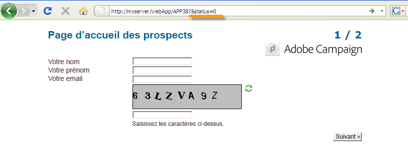
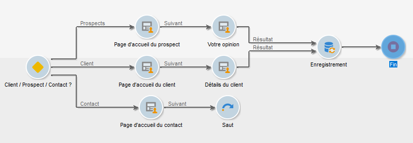

# Définir les propriétés des formulaires web{#defining-web-forms-properties}

Les formulaires Web sont entièrement paramétrables et personnalisables pour répondre à vos besoins. Les paramètres doivent être renseignés dans la fenêtre des propriétés.

La fenêtre de propriétés est accessible via le **[!UICONTROL Properties]** bouton de la barre d’outils du formulaire Web. Cette fenêtre vous permet d&#39;accéder à une plage de paramètres spécifiques au formulaire Web. Certains paramètres peuvent provenir de la configuration du modèle.

## Propriétés générales du formulaire {#overall-form-properties}

Dans l’ **[!UICONTROL General]** onglet de la fenêtre de propriétés, vous pouvez modifier le **libellé** du formulaire. Il est vivement recommandé de ne pas modifier le nom **** interne.

Le modèle de formulaire est choisi lors de la création du formulaire. Il ne peut pas être modifié ultérieurement. Pour plus d’informations sur la création et la gestion des modèles de formulaire, voir [Utilisation d’un modèle](../../web/using/using-a-web-form-template.md)de formulaire Web.

## Stockage des données d&#39;un formulaire {#form-data-storage}

Par défaut, les champs des formulaires Web sont stockés dans le tableau des destinataires. Vous pouvez modifier le tableau utilisé en sélectionnant un nouveau tableau dans le **[!UICONTROL Document type]** champ. L’ **[!UICONTROL Zoom]** icône vous permet d’afficher le contenu du tableau sélectionné.

Par défaut, les réponses sont stockées dans le **[!UICONTROL Answer to a recipient form]** tableau.

## Paramétrer une page d&#39;erreur {#setting-up-an-error-page}

Vous pouvez paramétrer une page d&#39;erreur : cette page est affichée en cas d&#39;erreur lors de l&#39;exécution du formulaire.

La page d&#39;erreur est définie dans l&#39;onglet correspondant de la fenêtre des propriétés du formulaire.

Par défaut, elle affiche les informations suivantes :

Le contenu des chaînes affichées est défini dans l’ **[!UICONTROL Error page]** onglet de la fenêtre des propriétés. L’ **[!UICONTROL HTML]** onglet affiche le rendu et l’ **[!UICONTROL Texts]** onglet permet de modifier les chaînes de texte et d’ajouter du texte si nécessaire :

## Localisation d&#39;un formulaire {#form-localization}

The **[!UICONTROL Localization]** tab lets you select the design and display languages for the Web form.

See [Translating a web form](../../web/using/translating-a-web-form.md).

## Navigation dans un formulaire et rendu {#form-browsing-and-rendering}

The **[!UICONTROL Rendering]** tab lets you define the type of browsing between pages of the Web form and the rendering template used.

Vous pouvez choisir de naviguer via des liens ou des boutons.

Par défaut, les éléments de navigation sont des boutons. Ils permettent d&#39;effectuer les actions suivantes :

* Approve the current page and display the next page by clicking **[!UICONTROL Next]**. This button is displayed on all pages except the last.
* Display the previous page by clicking **[!UICONTROL Previous]**. This button is displayed on all pages except the first.
* Enregistrez les réponses au formulaire en cliquant sur le **[!UICONTROL Approve]** bouton. Ce bouton s’affiche uniquement sur la dernière page.

Ces éléments sont affichés en bas de chaque page. Leur positionnement peut être modifié : pour cela, vous devez adapter la feuille de style.

>[!NOTE]
>
>Il est possible de masquer le **[!UICONTROL Previous]** bouton sur certaines pages. Pour ce faire, accédez à la page concernée et cochez l’ **[!UICONTROL Disallow returning to the previous page]** option. Cette option est accessible lorsque la racine de l’arborescence de la page est sélectionnée.

The **[!UICONTROL Template]** field of the **[!UICONTROL Rendering]** tab lets you select a theme from those available.

Les thèmes sont enregistrés dans le **[!UICONTROL Administration>Configuration>Form rendering]** noeud de l’arborescence. See [Selecting the form rendering template](../../web/using/form-rendering.md#selecting-the-form-rendering-template)

Un exemple de rendu s’affiche dans la partie inférieure de la fenêtre de propriétés. L’ **[!UICONTROL Edit link]** icône vous permet d’afficher la configuration du thème sélectionné.

## Textes du formulaire {#texts-in-the-form}

The **[!UICONTROL Page]** tab lets you define the content of the form header and footer. See [Defining headers and footers](../../web/using/form-rendering.md#defining-headers-and-footers).

Il vous permet également de gérer les traductions. See [Translating a web form](../../web/using/translating-a-web-form.md).

## Accessibilité du formulaire {#accessibility-of-the-form}

Un formulaire Web est accessible aux utilisateurs s’il l’est **[!UICONTROL Online]** et si la date actuelle est comprise dans sa période de validité. L’état du formulaire est modifié au cours de l’étape de publication (voir [Publication d’un formulaire](../../web/using/publishing-a-web-form.md#publishing-a-form)). L’état s’affiche dans la section **Projet** de l’ **[!UICONTROL General]** onglet de la fenêtre des propriétés.

La période de validité s’étend de la **[!UICONTROL Start]** date au **[!UICONTROL End date]**. Si aucune date n’est spécifiée dans ces champs, le formulaire a une validité permanente.

>[!NOTE]
>
>If the form is closed, and therefore its validity period has not been reached or has expired, or if it was closed by the Adobe Campaign operator, a message is displayed when the user attempts to access it. You can personalize this message by clicking **[!UICONTROL Personalize the message displayed if the form is closed...]**.

## Contrôle d&#39;accès au formulaire {#form-access-control}

Par défaut, l&#39;accès aux formulaires Web se fait en mode anonyme : tous les opérateurs qui accèdent au formulaire se voient attribuer les droits correspondant à l&#39;opérateur WebApp.

Vous pouvez activer le contrôle d’accès pour l’affichage du formulaire, par exemple lors de la diffusion d’un formulaire sur un site intranet, afin d’authentifier les utilisateurs. Pour ce faire, affichez la **[!UICONTROL Properties]** fenêtre du formulaire concerné et cliquez sur l’ **[!UICONTROL Enable access control]** option, comme illustré ci-dessous :

Lors de l&#39;accès au formulaire, la page d&#39;authentification suivante sera affichée :

Les login et mot de passe sont ceux des opérateurs Adobe Campaign. Voir à ce sujet [cette section](../../platform/using/access-management.md).

L’ **[!UICONTROL Use a specific account]** option vous permet de limiter l’autorisation de lecture ou d’écriture de l’opérateur qui accède au formulaire. Utilisez la liste déroulante pour sélectionner un opérateur ou un groupe d’opérateurs qui sera chargé d’octroyer ces autorisations.

## Paramètres d&#39;URL de formulaire {#form-url-parameters}

Vous pouvez ajouter des paramètres complémentaires dans l&#39;URL d&#39;un formulaire afin d&#39;en personnaliser le contenu et d&#39;initialiser un contexte. Ainsi, par exemple, la langue d&#39;édition, l&#39;identifiant crypté du destinataire, sa société, une formule calculée stockée dans une variable, etc. Vous pouvez ainsi donner accès à un même formulaire via plusieurs URL différentes et personnaliser le contenu des pages en fonction de la valeur du ou des paramètres indiqués dans l&#39;URL.

Adobe Campaign propose par défaut des paramètres qui permettent notamment de prévisualiser le formulaire et en contrôler les erreurs. Vous pouvez créer de nouveaux paramètres, attachés au formulaire, et qui peuvent utiliser les valeurs d&#39;un champ de la base ou d&#39;une variable locale.

## Paramètres standards {#standard-parameters}

Par défaut, les paramètres suivants sont disponibles :

* **id** pour indiquer l&#39;identifiant crypté.
* **lang** pour modifier la langue d&#39;affichage.
* **origin** pour indiquer l&#39;origine du répondant.
* **_uuid** active l’affichage de formulaire avant la publication et le suivi des erreurs. Ce paramètre est destiné à une utilisation interne (création et débogage) : lorsque vous accédez au formulaire Web via cette URL, les enregistrements créés ne sont pas pris en compte dans le suivi (rapports). L’origine est forcée à la **[!UICONTROL Adobe Campaign]** valeur.

   It is used with the **_preview** parameters and/or ** _debug**:

   **_preview** pour afficher la dernière version enregistrée. Ce paramètre ne doit être utilisé qu&#39;en phase de test.

   **_debug** pour afficher la trace des données renseignées/calculées dans les pages du formulaire. Il est utilisé pour avoir plus d&#39;informations sur les erreurs, y compris lorsque le formulaire a été publié.

   >[!CAUTION]
   >
   >Lorsque le formulaire est affiché via une URL avec le paramètre **_uuid**, la valeur du paramètre **[!UICONTROL origin]** est forcée à **Adobe Campaign**.

## Ajouter des paramètres {#adding-parameters}

Les paramètres peuvent être ajoutés via l’ **[!UICONTROL Parameters...]** onglet de la fenêtre Propriétés du formulaire. Ils peuvent être rendus obligatoires, comme illustré ci-dessous :

Vous devez spécifier un emplacement de stockage à partir duquel la valeur du paramètre sera récupérée. Pour ce faire, sélectionnez l’une des options de stockage, puis cliquez sur l’ **[!UICONTROL Storage]** onglet pour sélectionner le champ ou la variable concernée. Les options de stockage sont détaillées dans les champs [de stockage](../../web/using/web-forms-answers.md#response-storage-fields)Réponse.

Le statut du répondant (par exemple 0, 1 ou toute autre valeur) pourra alors être ajouté dans l&#39;URL d&#39;accès au formulaire. Cette information peut être réutilisée dans les pages du formulaire ou dans une boîte de test. Vous pouvez ainsi conditionner les pages affichées en fonction de la valeur du contexte, comme dans l&#39;exemple suivant :

1. Page d&#39;accueil pour les clients (**status=1**):

   

1. Page d&#39;accueil pour les prospects (**status=0**) :

   

1. Page d&#39;accueil pour d&#39;autres profils (par exemple, **status =12**) :

   

Pour paramétrer ce formulaire, créez une boîte de test et positionnez-la au début du diagramme, comme suit :

La boîte de test permet de paramétrer les conditions d&#39;enchaînement des pages :

