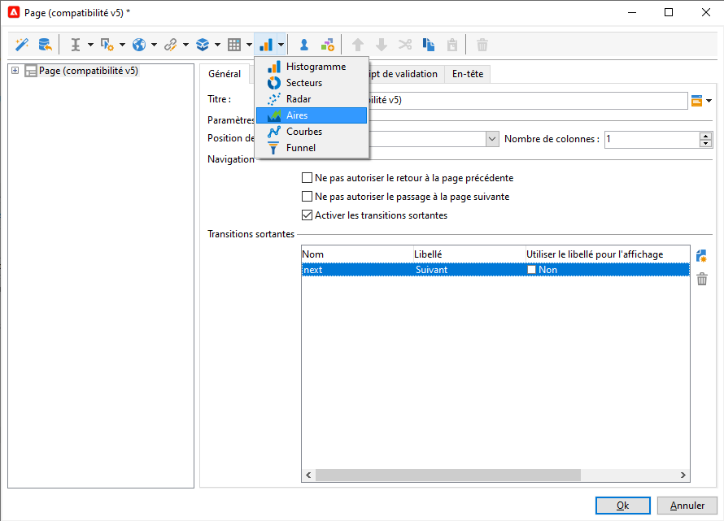

# Créer une application web{#designing-a-web-application}

Les applications web sont créées et gérées suivant le même principe que les [formulaires web](about-web-forms.md).

>[!CAUTION]
>
>Utilisez le sous-onglet **[!UICONTROL Prévisualisation]** pour vérifier les erreurs lors de la conception de l’application web. Notez que le test de profil utilisé pour prévisualiser votre application web doit se trouver dans un dossier avec des **[!UICONTROL droits d’accès]** pour l’opérateur de l’**[!UICONTROL agent d’application web]**.  Tant que l’application web n’est pas publiée, les modifications ne sont pas visibles par les utilisateurs finaux.

## Insérer des graphiques dans une application web {#inserting-charts-in-a-web-application}

Vous pouvez inclure des graphiques dans les applications Web. Pour cela, utilisez la liste déroulante des graphiques dans la barre des tâches et sélectionnez le type de graphique à insérer.

Vous pouvez également sélectionner le menu **[!UICONTROL Ajouter un graphique]**.

## Insérer des tableaux dans une application web {#inserting-tables-in-a-web-application}

Pour ajouter un tableau, utilisez la liste déroulante des tableaux dans la barre des tâches et sélectionnez le type de tableau voulu.

Vous pouvez également sélectionner le type de tableau dans le menu contextuel.

## Applications web de type vues d&#39;ensemble {#overview-type-web-applications}

L&#39;interface d&#39;Adobe Campaign utilise de nombreuses applications web afin d&#39;accéder, gérer et agir sur les destinataires, les diffusions, les opérations, les stocks, etc.

Elles se présentent dans l&#39;interface sous la forme de tableaux de bord et elles ne sont composées que d&#39;une seule page.

Les applications web d&#39;usine sont stockées sous le nœud **[!UICONTROL Administration > Paramétrage > Applications web]**.

## Applications web de type formulaires d&#39;édition {#edit-forms-type-web-applications}

Les applications web de type formulaires d&#39;édition pour un extranet sont caractérisées par :

* Une boîte de préchargement

   Dans la plupart des cas, il est nécessaire de précharger les données à afficher. Les utilisateurs qui accèdent à ces formulaires étant identifiés (via un contrôle d&#39;accès), le préchargement n&#39;est pas nécessairement chiffré.

* Une boîte d&#39;enregistrement
* L&#39;ajout de pages supplémentaires

   Si les applications web de type &quot;Vues d&#39;ensemble&quot; sont toutes composées d&#39;une seule page, les formulaires d&#39;édition peuvent proposer un enchaînement de pages selon des critères précis (tests, sélections, profil de l&#39;opérateur connecté, etc.).

