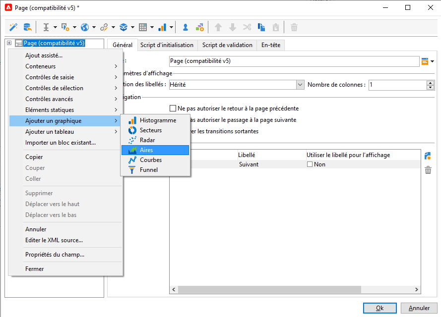

# Concevoir une application web{#designing-a-web-application}

Web applications are created and managed according to the same principle as [online surveys](../../web/using/about-surveys.md).

Toutefois, les différences fonctionnelles sont les suivantes :

* Les applications Web n&#39;utilisent pas de champs archivés. Le stockage des informations ne peut donc se faire que dans des champs de la base ou dans des variables locales.
* Il n&#39;existe aucun rapport intégré sur les applications Web.
* Des champs supplémentaires sont offerts, principalement pour la création de tableaux et de graphiques.

>[!CAUTION]
>
>Il est vivement recommandé de contrôler au fur et à mesure les paramétrages appliqués afin de détecter les éventuelles erreurs suffisamment tôt dans le processus de construction de l&#39;application web. Pour contrôler le rendu d&#39;une modification, enregistrez l&#39;application puis cliquez sur le sous-onglet **[!UICONTROL Prévisualisation]**.
>
>Tant que l&#39;application web n&#39;est pas publiée, les modifications ne sont pas visibles par l&#39;utilisateur final.

## Insérer des graphiques dans une application web {#inserting-charts-in-a-web-application}

Vous pouvez inclure des graphiques dans les applications Web. Pour cela, utilisez la liste déroulante des graphiques dans la barre des tâches et sélectionnez le type de graphique à insérer.

Vous pouvez également sélectionner le menu **[!UICONTROL Ajouter un graphique]**.

## Insérer des tableaux dans une application web {#inserting-tables-in-a-web-application}

Pour ajouter un tableau, utilisez la liste déroulante des tableaux dans la barre des tâches et sélectionnez le type de tableau voulu.

Vous pouvez également sélectionner le type de tableau dans le menu contextuel.

## Applications web de type vues d&#39;ensemble {#overview-type-web-applications}

L&#39;interface d&#39;Adobe Campaign utilise de nombreuses applications web afin d&#39;accéder, gérer et agir sur les destinataires, les diffusions, les opérations, les stocks, etc.

Elles se présentent dans l&#39;interface sous la forme de tableaux de bord et elles ne sont composées que d&#39;une seule page.

Les applications web d&#39;usine sont stockées sous le nœud **[!UICONTROL Administration > Paramétrage > Applications web]**.

## Modification d&#39;applications Web de type formulaire {#edit-forms-type-web-applications}

Les applications web de type formulaires d&#39;édition pour un extranet sont caractérisées par :

* Une boîte de préchargement

   Dans la plupart des cas, il est nécessaire de précharger les données à afficher. Les utilisateurs qui accèdent à ces formulaires étant identifiés (via un contrôle d&#39;accès), le préchargement n&#39;est pas nécessairement crypté.

* Une boîte d&#39;enregistrement
* L&#39;ajout de pages supplémentaires

   Si les applications web de type &quot;Vues d&#39;ensemble&quot; sont toutes composées d&#39;une seule page, les formulaires d&#39;édition peuvent proposer un enchaînement de pages selon des critères précis (tests, sélections, profil de l&#39;opérateur connecté, etc.).

Le fonctionnement de ce type d&#39;applications web est proche de celui des **Questionnaires**, toutefois, elles ne proposent pas la gestion des historiques ni l&#39;archivage des champs. Les utilisateurs y accèdent la plupart du temps via une page de login dans laquelle ils doivent s&#39;identifier.
