# Modifier le contenu{#editing-content}

## Définir une condition de visibilité {#defining-a-visibility-condition}

Vous pouvez spécifier une condition de visibilité sur un élément de la page web : cet élément ne sera visible que si la condition de visibilité est respectée.

Pour ajouter une condition de visibilité, sélectionnez un bloc et saisissez la condition à remplir dans le champ **[!UICONTROL Condition de visibilité]** au moyen de l&#39;éditeur d&#39;expression.

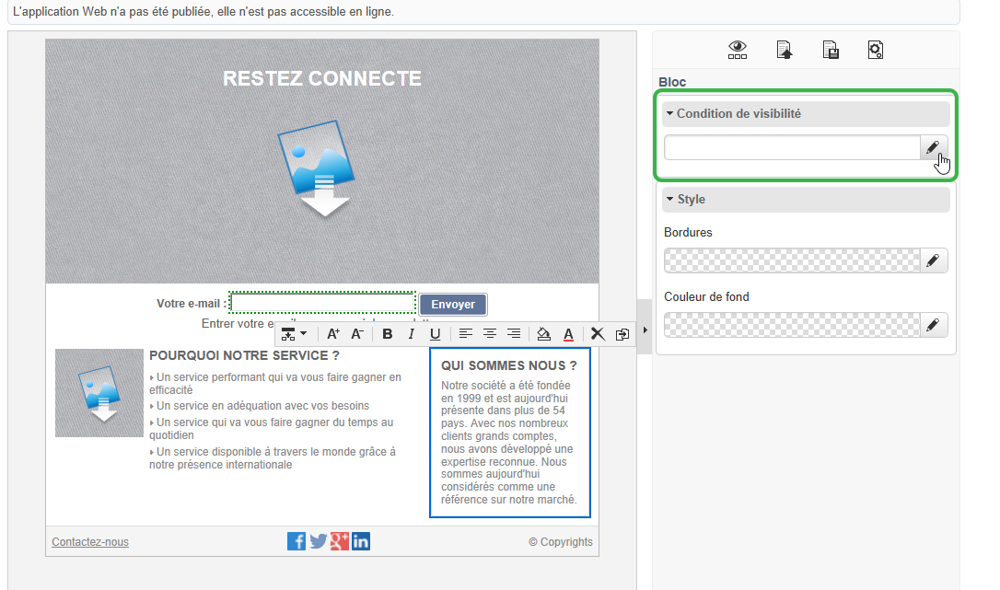

>[!NOTE]
>
>L&#39;édition d&#39;expression avancée est présentée dans [cette page](../../platform/using/about-queries-in-campaign.md).

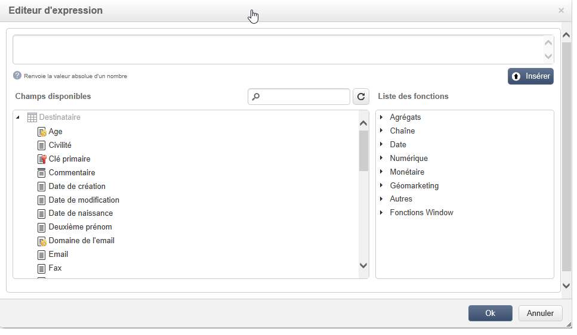

Ces conditions adoptent la syntaxe d’expression XTK (par exemple **ctx.recipient.@email != &quot;&quot;** or **ctx.recipient.@status==&quot;0&quot;**). Par défaut, tous les champs sont visibles.

>[!NOTE]
>
>Les blocs dynamiques non visibles, tels que les menus déroulants, ne peuvent être édités.

## Ajouter une bordure et un arrière-plan {#adding-a-border-and-background}

Vous pouvez ajouter une **bordure** au bloc sélectionné. Les bordures se définissent au travers de trois options : style, taille et couleur.

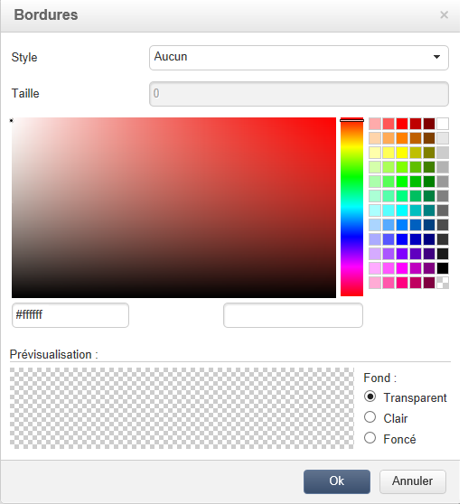

Vous pouvez aussi définir une **couleur d’arrière-plan** en sélectionnant une couleur dans le nuancier.

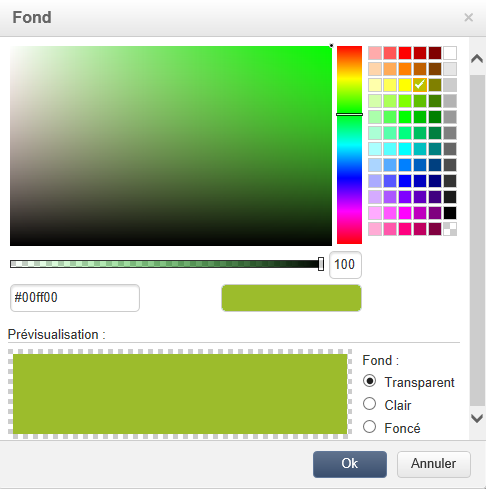

## Editer les formulaires {#editing-forms}

### Modifier les propriétés des données d&#39;un formulaire {#changing-the-data-properties-for-a-form}

Vous pouvez associer des champs de la base à des blocs de type zone de saisie, bouton radio ou case à cocher.

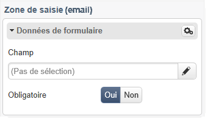

>[!NOTE]
>
>Les champs par défaut sont ceux du schéma de stockage de l&#39;application Web.

La zone de sélection **Champ** permet de sélectionner un champ de la base de données à associer avec le champ du formulaire.

Par défaut, les champs proposés sont ceux du tableau **nms:recipient**.

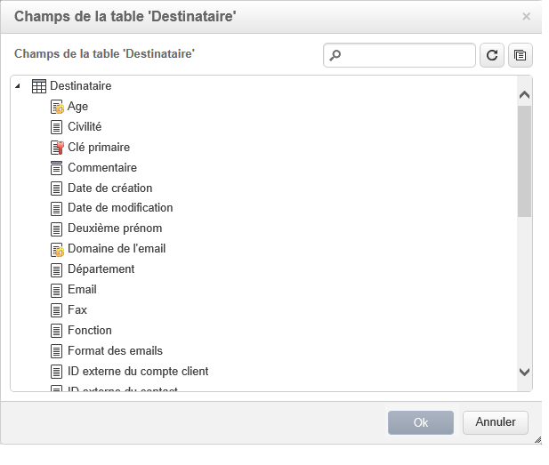

L&#39;option **Champ obligatoire** permet de n&#39;autoriser la validation de la page que si l&#39;utilisateur a renseigné le champ. Si un champ obligatoire n&#39;est pas renseigné, un message d&#39;erreur sera affiché.

Pour les boutons radio et cases à cocher, une **configuration supplémentaire est requise**.

En effet, si le modèle utilisé ne contient pas de valeur par défaut, vous devez les compléter dans l&#39;éditeur.

Pour cela :

* Cliquez sur l&#39;icône **[!UICONTROL Edition]**.

  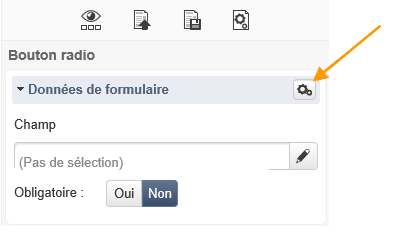

* Complétez le champ **[!UICONTROL Valeur]** avec la valeur de l&#39;énumération associée (définie par le champ sélectionné).

  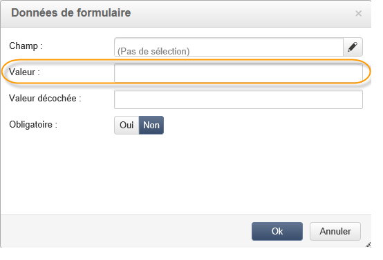

### Modifier les champs de formulaires {#modifying-form-fields}

Les champs de formulaires de type boutons radio, zones de saisie, listes déroulantes, etc., peuvent être modifiés à partir de leur barre d&#39;outils.

Vous pouvez ainsi :

* Supprimer le bloc contenant le champ du formulaire à partir de l&#39;icône **[!UICONTROL Supprimer]**.
* Dupliquer le champ sélectionné en créant un nouveau bloc, à partir de l&#39;icône **[!UICONTROL Dupliquer]**.
* Editer la fenêtre **[!UICONTROL Données de formulaire]** afin d&#39;associer un champ de la base à la zone du formulaire, à partir de l&#39;icône **[!UICONTROL Editer]**.

  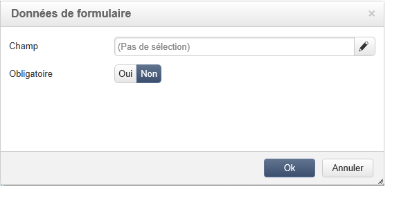

## Ajouter une action sur un bouton {#adding-an-action-to-a-button}

Lorsque l&#39;utilisateur clique sur un bouton, vous pouvez définir une action associée. Pour cela, sélectionnez l&#39;action à réaliser dans la liste déroulante.

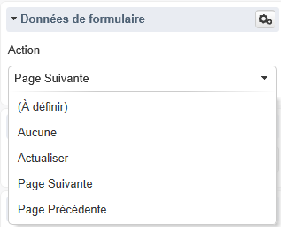

Les actions disponibles sont les suivantes :

* **[!UICONTROL Actualiser]** : actualise la page en cours.
* **[!UICONTROL Page suivante]** : crée un lien vers la prochaine page de l&#39;application Web.
* **[!UICONTROL Page précédente]** : crée un lien vers la page précédente de l&#39;application Web.

>[!NOTE]
>
>La valeur **[!UICONTROL Aucune]** permet de ne pas activer le bouton.

Vous pouvez modifier le libellé associé au bouton dans le champ correspondant.

## Ajouter un lien {#adding-a-link}

Vous pouvez insérer un lien sur tout élément de la page : image, mot, groupe de mots, bloc de texte, etc.

Pour cela, sélectionnez l’élément, puis utilisez la première icône du menu pop-up.

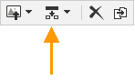

Cette icône permet d&#39;accéder à tous les types de liens disponibles.

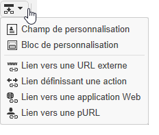

Les blocs de personnalisation et champs de personnalisation ne peuvent être insérés que dans des blocs de type Texte.

>[!NOTE]
>
>Pour chaque type de lien, vous pouvez configurer le mode d’ouverture : sélectionnez la fenêtre cible dans la liste déroulante **Cible**. Cette valeur correspond à la balise HTML **`<target>`**.
>
>La liste des **cibles** disponibles est la suivante :
>
>* Autre (IFrame)
>* Fenêtre la plus en avant (_top)
>* Fenêtre parente (_parent)
>* Nouvelle fenêtre (_blank)
>* Fenêtre courante (_self)
>* Comportement par défaut du navigateur
>

### Lien vers une URL {#link-to-a-url}

L&#39;option **Lien vers une URL externe** permet d&#39;ouvrir n&#39;importe quelle URL à partir du contenu source.

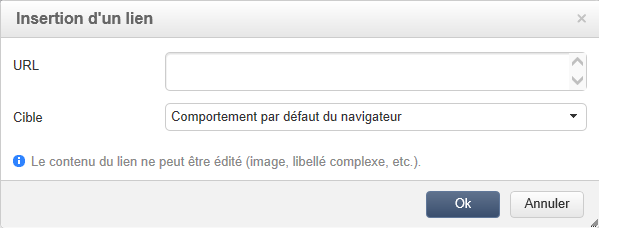

Saisissez l&#39;adresse du lien en question dans le champ **URL**. Le champ URL doit être renseigné comme suit : **https://www.myURL.com**.

### Lien vers une application Web {#link-to-a-web-application}

L&#39;option **Lien vers une application Web** permet d&#39;accéder à une application Web Adobe Campaign.

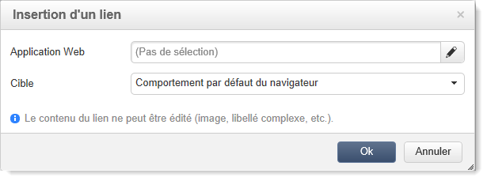

Sélectionnez l&#39;application Web à partir du champ correspondant.

La liste des applications Web proposées correspond aux applications notamment disponibles dans le noeud **[!UICONTROL Ressources > On-Line > Applications Web]**.

### Lien vers une action {#link-to-an-action}

L&#39;option **Lien définissant une action** permet de paramétrer une action lors du clic sur l&#39;élément-source.

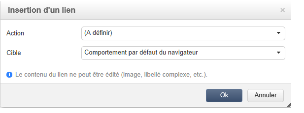

>[!NOTE]
>
>Les actions disponibles sont détaillées dans la section [Ajouter une action sur un bouton](#adding-an-action-to-a-button).

### Supprimer un lien {#delete-a-link}

Lorsqu&#39;un lien a été inséré, la barre d&#39;outils propose deux nouvelles icônes : **Editer le lien** et **Rompre le lien** qui permettent d&#39;interagir avec le lien créé.

* **[!UICONTROL Editer le lien]** permet d&#39;afficher une fenêtre récapitulative de tous les paramètres du lien.
* **[!UICONTROL Rompre le lien]** permet de supprimer, après confirmation, le lien ainsi que tous les paramétrages liés.

>[!NOTE]
>
>Dans le cas d&#39;une suppression de lien, le contenu est conservé.

## Modifier les attributs de la police {#changing-font-attributes}

Lorsque vous sélectionnez un élément de texte, vous pouvez modifier les attributs de la police de caractères (style, format).

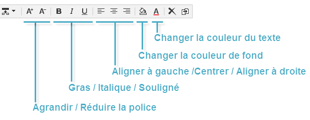

Les options disponibles sont les suivantes :

* Icône **Agrandir la police** : augmente la taille du texte sélectionné (ajouter ``)
* Icône **Réduire la police** : réduit la taille du texte sélectionné (ajouter ``)
* Icône **Gras** : ajoute le style gras au texte sélectionné (entoure le texte de la balise `<strong> </strong>`)
* Icône **Italique** : ajoute le style italique au texte sélectionné (entoure le texte de la balise `<em> </em>`)
* Icône **Souligner** : ajoute le style souligné au texte sélectionné (entoure le texte de la balise``)
* Icône **Aligner à gauche** : aligne le texte à gauche du bloc sélectionné (ajoute style=&quot;text-align: left;&quot;)
* Icône **Centrer** : centre le texte du bloc sélectionné (ajoute style=&quot;text-align: center;&quot;)
* Icône **Aligner à droite** : aligne le texte à droite du bloc sélectionné (ajoute style=&quot;text-align: right;&quot;)
* Icône **Changer la couleur d’arrière-plan** : permet de changer la couleur d’arrière-plan du bloc sélectionné (add style=&quot;background-color: rgba(170, 86, 255, 0.87))
* Icône **Changer la couleur du texte** : permet de changer la couleur de tout le texte dans le bloc ou seulement celle du texte sélectionné (``)

>[!NOTE]
>
>* Icône **Supprimer** : supprime le bloc et tout son contenu.
>
>* Icône **Dupliquer** : duplique le bloc et également tous les styles rattachés au bloc.

## Gestion des images et animations {#managing-images-and-animations}

Le Digital Content Editor permet de travailler avec **tous types d&#39;images** dont le format est compatible avec les navigateurs.

>[!CAUTION]
>
>Vous ne devez pas appeler de fichiers externes dans une balise **script** de la page HTML. Ces fichiers ne seront pas importés sur le serveur Adobe Campaign.

### Ajouter / Supprimer / Dupliquer une image {#adding---deleting---duplicating-an-image}

Pour insérer une image, sélectionnez un bloc de type Image et cliquez sur l&#39;icône **Image**.

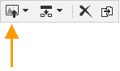

Sélectionnez un fichier image enregistré en local.

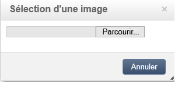

L’icône **Supprimer** supprime la balise contenant l’image.

L’icône **Dupliquer** duplique la balise et son contenu.

>[!CAUTION]
>
>Lors de la duplication d&#39;une image, les identifiants relatifs à la nouvelle image sont supprimés.

### Modifier les propriétés d&#39;une image {#editing-image-properties}

Lorsque vous sélectionnez un bloc contenant une image, vous accédez aux propriétés suivantes :

* **Légende** permet de définir une légende associée à l&#39;image (correspond à l&#39;attribut HTML **alt**).
* **Dimensions** permet de spécifier, en pixels, de la taille de l&#39;image.

  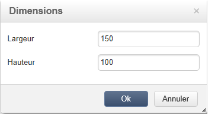

## Ajouter du contenu de personnalisation {#adding-personalization-content}

### Insertion d&#39;un champ de personnalisation {#inserting-a-personalization-field}

L&#39;option **Champ de personnalisation** de l&#39;icône d&#39;insertion permet d&#39;ajouter un champ de la base de données dans le contenu, par exemple le prénom du destinataire. Cette option n&#39;est disponible que pour les blocs de type Texte.

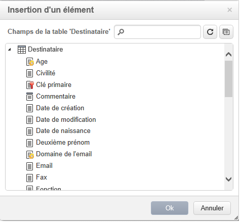

Par défaut, les champs proposés sont ceux de la table **[!UICONTROL Destinataire]**. Au besoin, éditez les propriétés de l&#39;application Web pour sélectionner une autre table.

Le nom du champ apparaît dans l&#39;éditeur, surligné en jaune. Il sera remplacé, lors de la génération de la personnalisation (par exemple, lors de la prévisualisation d&#39;une landing page), par la valeur correspondant au profil du destinataire ciblé.

Un exemple est présenté dans la section [Insertion d’un champ de personnalisation](creating-a-landing-page.md#inserting-a-personalization-field).

### Insérer un bloc de personnalisation {#inserting-a-personalization-block}

L&#39;option **Bloc de personnalisation** permet d&#39;insérer des blocs dynamiques et personnalisés dans le contenu. Vous pouvez par exemple ajouter un logo ou un message de salutations. Elle n&#39;est disponible que pour les blocs de type Texte.

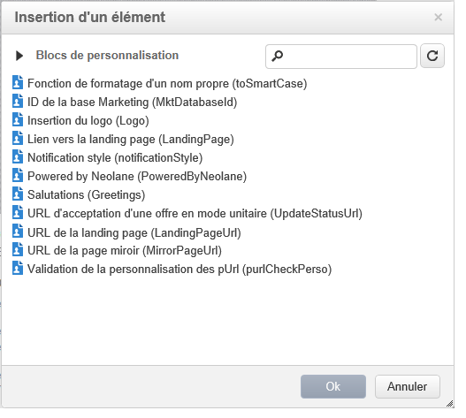

Après l&#39;insertion, le nom du bloc de personnalisation apparaît dans l&#39;éditeur, surligné en jaune. Il sera automatiquement adapté au profil du destinataire lors de la génération de la personnalisation.

Pour plus d’informations sur les blocs de personnalisation natifs  et sur la définition des blocs de personnalisation personnalisés, consultez [cette page](../../delivery/using/personalization-blocks.md).
