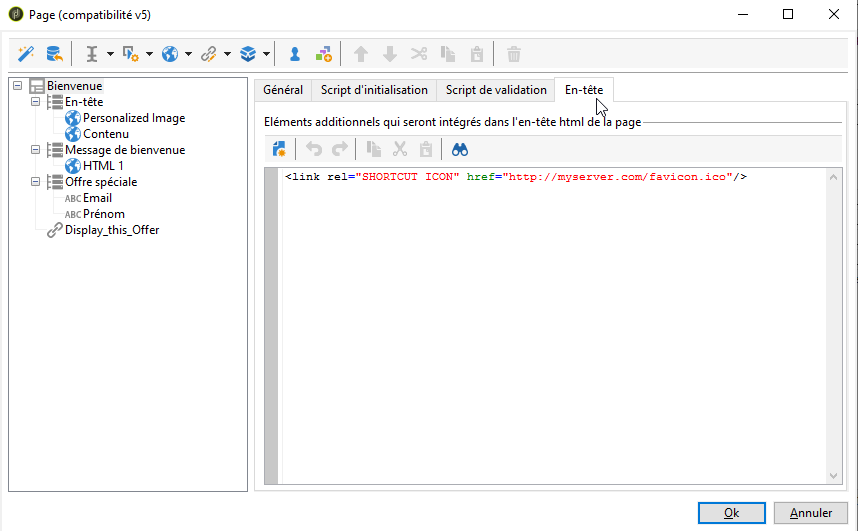

# Rendu du formulaire{#form-rendering}

## Choisir le modèle de rendu du formulaire {#selecting-the-form-rendering-template}

Les paramètres du formulaire vous permettent de sélectionner le modèle utilisé pour générer les pages. Pour y accéder, cliquez sur le **[!UICONTROL Settings]** bouton dans la barre d’outils des détails du formulaire, puis sélectionnez l’ **[!UICONTROL Rendering]** onglet. Par défaut, plusieurs modèles (feuilles de style) sont disponibles.

La section inférieure de l&#39;éditeur permet de visualiser un exemple de rendu du modèle sélectionné.

La loupe permet d&#39;éditer le modèle sélectionné.

Vous pouvez modifier ou remplacer ces modèles. Pour ce faire, cliquez sur le **[!UICONTROL Page layout...]** lien et personnalisez les informations.

Vous pouvez ainsi :

* Modifier l&#39;image utilisée comme logo et adapter sa taille,
* Indiquer également le chemin d&#39;accès à l&#39;image d&#39;aperçu proposée aux utilisateurs lorsqu&#39;ils sélectionnent ce modèle de rendu.

The **[!UICONTROL Headers/Footers]** tab lets you change the information displayed in the headers and footers of each form page using this template.

Chaque ligne de la **[!UICONTROL Page headers]** section et **[!UICONTROL Page footers]** correspond à une ligne de la page HTML. Cliquez sur **[!UICONTROL Add]** pour créer une ligne.

Select an existing line and click the **[!UICONTROL Detail]** button to personalize it.

Vous pouvez modifier le contenu de la ligne, ajouter des bordures et modifier les attributs de police à l’aide des onglets appropriés. Cliquez sur **[!UICONTROL OK]** pour confirmer ces modifications.

Les champs **[!UICONTROL Position]** permettent de définir la position des éléments dans l&#39;en-tête et dans le pied de page.

>[!NOTE]
>
>Les modèles de rendu sont stockés dans le **[!UICONTROL Administration > Configuration > Form rendering]** noeud.\
>Pour plus d’informations, reportez-vous à la section [Personnalisation du rendu de formulaire.](#customizing-form-rendering)

## Personnaliser le rendu du formulaire {#customizing-form-rendering}

### Adapter la mise en page des éléments {#changing-the-layout-of-elements}

Vous pouvez surcharger la feuille de style au niveau de chaque élément du formulaire (champs de saisie, images, boutons radio, etc.).

To do this, use the **[!UICONTROL Advanced]** tab.

Il permet de définir les propriétés suivantes :

* **[!UICONTROL Label position]**: voir [Définition de la position des étiquettes](../../web/using/defining-web-forms-layout.md#defining-the-position-of-labels),
* **[!UICONTROL Label format]**: Retour à la ligne ou Pas de retour à la ligne,
* **[!UICONTROL Number of cells]** : voir [Positionnement des champs de la page](../../web/using/defining-web-forms-layout.md#positioning-the-fields-on-the-page),
* **[!UICONTROL Horizontal alignment]** (Gauche, Droite, Centré) et **[!UICONTROL Vertical alignment]** (Haut, Bas, Milieu),
* **[!UICONTROL Width]** de la zone: cette valeur peut être exprimée en pourcentage ou en points, points ou pixels (valeur par défaut),
* Maximum **[!UICONTROL Length]**: Maximum number of characters allowed (for Text, Number and Password type controls),
* **[!UICONTROL Lines]**: nombre de lignes pour une zone de **[!UICONTROL Multi-line text]** type,
* **[!UICONTROL Style inline]**: vous permet de surcharger la feuille de style CSS avec des paramètres supplémentaires. **Elles sont séparées par**; comme illustré dans l’exemple ci-dessous :

   

### Définir les en-têtes et pieds de page {#defining-headers-and-footers}

Les champs sont enchaînés dans une arborescence dont la racine porte le nom de la page. Sélectionnez-la pour modifier ce nom.

Le titre de la fenêtre doit être saisi dans l’ **[!UICONTROL Page]** onglet de la fenêtre de propriétés du formulaire. Vous pouvez également ajouter un contenu défini à l’en-tête et au pied de page (ces informations s’afficheront sur chaque page). Ce contenu est entré dans les sections correspondantes de l’ **[!UICONTROL Texts]** onglet, comme illustré ci-dessous :

### Ajouter des éléments dans l&#39;en-tête HTML {#adding-elements-to-html-header}

Vous pouvez entrer des éléments supplémentaires à insérer dans l’en-tête HTML d’une page de formulaire. Pour ce faire, saisissez les éléments dans l’ **[!UICONTROL Header]** onglet de la page correspondante.

Ainsi, par exemple, vous pouvez y référencer une icône qui sera affichée dans la barre de titre de la page.

## Définir les paramètres de contrôle {#defining-control-settings}

Lorsque l’utilisateur remplit le formulaire, une vérification est automatiquement effectuée sur certains champs selon leur format ou leur configuration. Cela vous permet de rendre certains champs obligatoires (voir [Définition des champs](#defining-mandatory-fields)obligatoires) ou de vérifier le format des données saisies (voir [Vérification du format](#checking-data-format)des données). Les vérifications sont effectuées lors de l’approbation de la page (en cliquant sur un lien ou un bouton qui active une transition de sortie).

### Définir les champs obligatoires {#defining-mandatory-fields}

Pour rendre obligatoire le renseignement d&#39;un champ, vous devez cocher l&#39;option correspondante lors de la création du champ.

Lorsque l&#39;utilisateur valide la page, si le champ n&#39;est pas renseigné, le message d&#39;erreur sera le suivant :

Vous pouvez personnaliser ce message en cliquant sur le **[!UICONTROL Personalize this message]** lien.

Lorsque l&#39;utilisateur valide la page, si le champ n&#39;est pas renseigné, le message d&#39;erreur sera le suivant :

### Contrôler le format des données {#checking-data-format}

Pour les contrôles du formulaire dont les valeurs seront stockées dans un champ existant de la base de données, les règles du champ de stockage sont appliquées.

Pour les contrôles du formulaire dont les valeurs seront stockées dans une variable, les règles de validation dépendent du format de la variable.

For example, if you create a **[!UICONTROL Number]** check to store the client number, as shown below:

L&#39;utilisateur devra saisir un nombre entier dans le champ correspondant du formulaire.

## Définir l&#39;affichage conditionnel des champs {#defining-fields-conditional-display}

Vous pouvez conditionner l&#39;affichage des champs de la page en fonction des valeurs sélectionnées par l&#39;utilisateur. Le conditionnement peut s&#39;appliquer à un champ ou à un groupe de champs (lorsqu&#39;ils sont regroupés dans un conteneur).

For each element of the page, the **[!UICONTROL Visibility]** section lets you define the display conditions.

Les conditions peuvent porter sur la valeur de champs de la base ou de variables.

Dans la fenêtre de sélection d&#39;un champ, vous pouvez sélectionner parmi les données disponibles :

* L&#39;arborescence principale contient les paramètres du contexte du formulaire. Les paramètres par défaut sont l&#39;Identifiant (qui correspond à l&#39;identifiant crypté du destinataire), la Langue et l&#39;Origine.

   Pour plus d&#39;informations à ce propos, Voir à ce propos consultez [cette page](../../web/using/defining-web-forms-properties.md#form-url-parameters).

* The **[!UICONTROL Recipients]** sub-tree contains the input fields inserted into the form and stored in the database.

   Pour plus d’informations, reportez-vous à la section [Stockage de données dans la base de données](../../web/using/web-forms-answers.md#storing-data-in-the-database).

* La **[!UICONTROL Variables]** sous-arborescence contient les variables disponibles pour ce formulaire. Pour plus d’informations, reportez-vous à la section [Stockage de données dans une variable](../../web/using/web-forms-answers.md#storing-data-in-a-local-variable)locale.

Pour plus d’informations, reportez-vous au cas d’utilisation disponible ici : [Affichage de différentes options selon les valeurs](../../web/using/use-cases--web-forms.md#displaying-different-options-depending-on-the-selected-values)sélectionnées.

Vous pouvez également conditionner l’affichage des pages du formulaire à l’aide de l’ **[!UICONTROL Test]** objet. Pour plus d&#39;informations à ce propos, Voir à ce propos consultez [cette page](../../web/using/defining-web-forms-page-sequencing.md#conditional-page-display).

## Importer des éléments depuis un formulaire existant {#importing-elements-from-an-existing-form}

Vous pouvez importer des champs ou des containers issus d&#39;autres formulaires Web. Ainsi, vous pouvez créer une bibliothèque de blocs réutilisables qui seront insérés dans les formulaires, par exemple le pavé adresse, la zone d&#39;inscription à vos newsletters, etc.

Pour importer un élément dans un formulaire, les étapes sont les suivantes :

1. Edit the page which you want to insert one or more elements into, then click **[!UICONTROL Import an existing block]** in the toolbar.

   

1. Sélectionnez le formulaire Web contenant les champs à importer et choisissez les conteneurs et les champs à importer.

   

   >[!NOTE]
   >
   >The **[!UICONTROL Edit link]** icon to the right of the source form name lets you view the selected Web form.

1. Click **[!UICONTROL Ok]** to confirm insertion.

   

