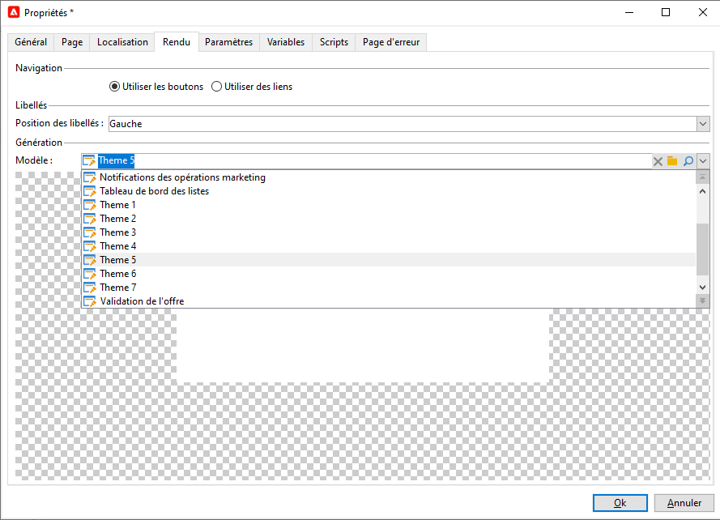
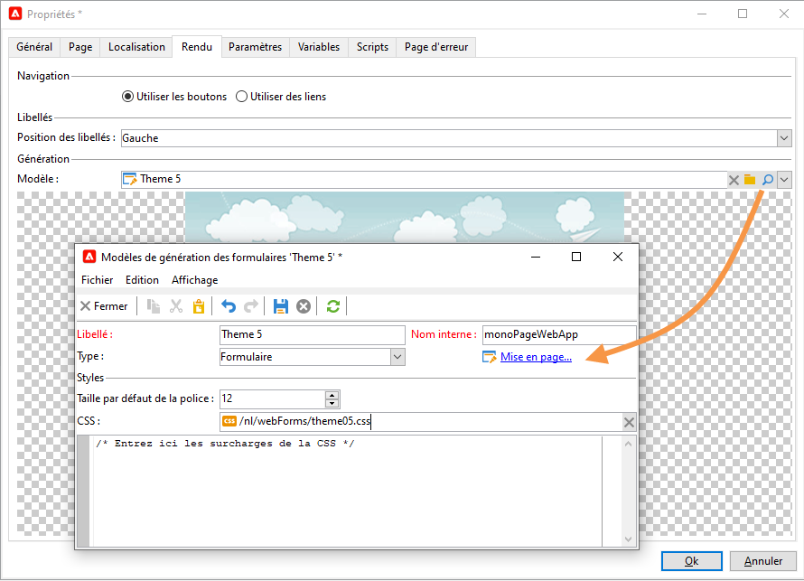

# Rendu du formulaire{#form-rendering}

## Choisir le modèle de rendu du formulaire {#selecting-the-form-rendering-template}

Les paramètres du formulaire permettent de sélectionner le modèle utilisé pour générer les pages. Pour y accéder, cliquez sur le bouton **[!UICONTROL Propriétés]** dans la barre d’outils des détails du formulaire, puis sélectionnez l’onglet **[!UICONTROL Rendu]**. Plusieurs modèles (feuilles de style) sont disponibles par défaut.

La section inférieure de l&#39;éditeur permet de visualiser un exemple de rendu du modèle sélectionné.

La loupe permet d&#39;éditer le modèle sélectionné.

Vous pouvez modifier ou remplacer ces modèles. Pour cela, cliquez sur le lien **[!UICONTROL Mise en page]** et personnalisez les informations.

Vous pouvez ainsi :

* Modifier l&#39;image utilisée comme logo et adapter sa taille,
* Indiquer également le chemin d&#39;accès à l&#39;image d&#39;aperçu proposée aux utilisateurs lorsqu&#39;ils sélectionnent ce modèle de rendu.

L&#39;onglet **[!UICONTROL En-têtes/Pieds]** permet de modifier les informations affichées en en-tête et pied de page de chacune des pages des formulaires utilisant ce modèle.

Chaque ligne des sections **[!UICONTROL En-têtes de page]** et **[!UICONTROL Pieds de page]** correspond à une ligne dans la page HTML. Cliquez sur **[!UICONTROL Ajouter]** pour créer une nouvelle ligne.

Sélectionnez une ligne existante et cliquez sur le bouton **[!UICONTROL Détail]** pour la personnaliser.

Vous pouvez modifier le contenu de la ligne, ajouter des bordures et changer les attributs de la police de caractères utilisée à partir des onglets correspondants. Cliquez sur **[!UICONTROL OK]** pour valider ces modifications.

Les champs **[!UICONTROL Position]** permettent de définir la position des éléments dans l&#39;en-tête et dans le pied de page.

>[!NOTE]
>
>Les modèles de rendus sont stockés dans le nœud **[!UICONTROL Administration > Paramétrage > Rendus des formulaires]**.\
>Pour plus d&#39;informations, voir la section [Personnaliser le rendu du formulaire](#customizing-form-rendering).

## Personnaliser le rendu du formulaire {#customizing-form-rendering}

### Adapter la disposition des éléments {#changing-the-layout-of-elements}

Vous pouvez surcharger la feuille de style au niveau de chaque élément du formulaire (champs de saisie, images, boutons radio, etc.).

Pour cela, utilisez l&#39;onglet **[!UICONTROL Avancé]**.

Il permet de définir les propriétés suivantes :

* **[!UICONTROL Position du libellé]** : voir [Définir la position des libellés](defining-web-forms-layout.md#defining-the-position-of-labels),
* **[!UICONTROL Format du libellé]** : Retour à la ligne ou Pas de retour à la ligne,
* **[!UICONTROL Nombre de cellules]** : voir la section [Placer les champs de la page](defining-web-forms-layout.md#positioning-the-fields-on-the-page),
* **[!UICONTROL Alignement horizontal]** (Gauche, Droite, Centré) et **[!UICONTROL vertical]** (Haut, Bas, Milieu),
* **[!UICONTROL Largeur]** de la zone : elle peut être exprimée en pourcentage, en em, en points ou en pixels (valeur par défaut),
* **[!UICONTROL Longueur]** maximale : nombre de caractères maximum autorisé (pour un contrôle de type Texte, Nombre, Mot de passe),
* **[!UICONTROL Lignes]** : nombre de lignes pour une zone de type **[!UICONTROL Texte Multi-lignes]**,
* **[!UICONTROL Style intégré]** : permet de surcharger la feuille de style CSS avec des paramètres supplémentaires. Ces derniers sont séparés à l’aide des caractères **;** comme illustré dans l’exemple ci-dessous :

  

### Définir les en-têtes et pieds de page {#defining-headers-and-footers}

Les champs sont enchaînés dans une arborescence dont la racine porte le nom de la page. Sélectionnez-la pour modifier ce nom.

Le titre de la fenêtre doit être saisi dans l&#39;onglet **[!UICONTROL Page]** de la fenêtre des propriétés du formulaire. Vous pouvez également ajouter un contenu fixe à l’en-tête et au pied de page (ces informations figureront sur chacune des pages). Ce contenu doit être saisi dans les sections correspondantes de l&#39;onglet **[!UICONTROL Textes]**, comme dans l&#39;exemple ci-dessous :

### Ajouter des éléments dans l&#39;en-tête HTML {#adding-elements-to-html-header}

Vous pouvez saisir des élément additionnels à insérer dans l&#39;en-tête HTML d&#39;une page de formulaire. Pour cela, saisissez ces éléments dans l&#39;onglet **[!UICONTROL En-tête]** de la page visée.

Ainsi, par exemple, vous pouvez y référencer une icône qui sera affichée dans la barre de titre de la page.

## Définir les paramètres de contrôle {#defining-control-settings}

Lorsque l&#39;utilisateur renseigne le formulaire, une vérification de certains champs est automatiquement effectuée selon leur format ou leur configuration. Vous pouvez ainsi rendre certains champs obligatoires (voir la section [Définir les champs obligatoires](#defining-mandatory-fields)) ou vérifier le format des données saisies (voir la section [Contrôler le format des données](#checking-data-format)). Les vérifications sont effectuées lors de la validation de la page (en cliquant sur un lien ou un bouton qui active une transition de sortie).

### Définir les champs obligatoires {#defining-mandatory-fields}

Pour rendre obligatoire le renseignement d&#39;un champ, vous devez cocher l&#39;option correspondante lors de la création du champ.

Lorsque l’utilisateur ou l’utilisatrice valide la page, si le champ n’est pas renseigné, le message d’erreur sera le suivant :

Vous pouvez personnaliser ce message en cliquant sur le lien **[!UICONTROL Personnaliser ce message]**.

Lorsque l’utilisateur ou l’utilisatrice valide la page, si le champ n’est pas renseigné, le message d’erreur sera le suivant :

### Contrôler le format des données {#checking-data-format}

Pour les contrôles du formulaire dont les valeurs seront stockées dans un champ existant de la base de données, les règles du champ de stockage sont appliquées.

Pour les contrôles du formulaire dont les valeurs seront stockées dans une variable, les règles de validation dépendent du format de la variable.

Par exemple, si vous créez un contrôle de type **[!UICONTROL Nombre]** pour stocker le numéro du client, comme dans l&#39;exemple suivant :

L&#39;utilisateur devra saisir un nombre entier dans le champ correspondant du formulaire.

## Définir l&#39;affichage conditionnel des champs {#defining-fields-conditional-display}

Vous pouvez conditionner l&#39;affichage des champs de la page en fonction des valeurs sélectionnées par l&#39;utilisateur. Le conditionnement peut s&#39;appliquer à un champ ou à un groupe de champs (lorsqu&#39;ils sont regroupés dans un conteneur).

Pour chaque élément de la page, la section **[!UICONTROL Visibilité]** permet de définir la ou les conditions d&#39;affichage.

Les conditions peuvent porter sur la valeur de champs de la base ou de variables.

Dans la fenêtre de sélection d&#39;un champ, vous pouvez sélectionner parmi les données disponibles :

* L&#39;arborescence principale contient les paramètres du contexte du formulaire. Les paramètres par défaut sont l&#39;Identifiant (qui correspond à l&#39;identifiant chiffré du destinataire), la Langue et l&#39;Origine.

  Voir à ce propos [cette page](defining-web-forms-properties.md#form-url-parameters).

* La sous-arborescence **[!UICONTROL Destinataires]** contient les champs de saisie insérés dans le formulaire et stockés dans la base de données.

  Pour plus d&#39;informations, voir la section [Stockage des données dans la base de données](web-forms-answers.md#storing-data-in-the-database).

* La sous-arborescence **[!UICONTROL Variables]** contient les variables disponibles pour ce formulaire. Pour plus d&#39;informations, voir la section [Stocker les données dans une variable locale](web-forms-answers.md#storing-data-in-a-local-variable).

Pour plus d&#39;informations, reportez-vous au cas d&#39;utilisation disponible ici : [Afficher différentes options en fonction de la valeur sélectionnée](use-cases-web-forms.md#displaying-different-options-depending-on-the-selected-values).

Vous pouvez aussi conditionner l&#39;affichage des pages du formulaire via l&#39;objet **[!UICONTROL Test]**. Pour en savoir plus à ce sujet, consultez cette [page](defining-web-forms-page-sequencing.md#conditional-page-display).

## Importer des éléments depuis un formulaire existant {#importing-elements-from-an-existing-form}

Vous pouvez importer des champs ou des containers issus d&#39;autres formulaires Web. Ainsi, vous pouvez créer une bibliothèque de blocs réutilisables qui seront insérés dans les formulaires, par exemple le pavé adresse, la zone d&#39;inscription à vos newsletters, etc.

Pour importer un élément dans un formulaire, les étapes sont les suivantes :

1. Editez la page dans laquelle vous souhaitez inclure un ou plusieurs éléments et cliquez sur le bouton **[!UICONTROL Importer un bloc existant]** de la barre d&#39;outils.

   

1. Sélectionnez le formulaire Web contenant les champs à importer et choisissez les conteneurs et les champs à importer.

   

   >[!NOTE]
   >
   >L&#39;icône **[!UICONTROL Editer le lien]** située à droite du nom du formulaire source permet de visualiser le formulaire Web sélectionné.

1. Cliquez sur **[!UICONTROL Ok]** pour valider l&#39;insertion des éléments.

   
