# Prise en main des questionnaires{#getting-started-with-surveys}

Nous vous proposons ici d&#39;aborder rapidement, en sept étapes clés, la création d&#39;un questionnaire simple, selon le modèle suivant :

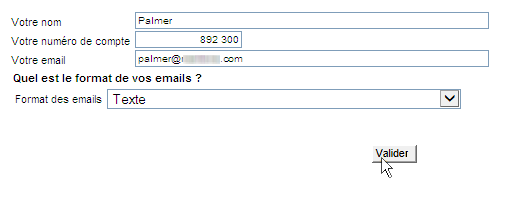

Ces étapes sont les suivantes :

1. [Etape 1 - Créer un questionnaire](#step-1---creating-a-survey),
1. [Etape 2 - Sélectionner le modèle](#step-2---selecting-the-template),
1. [Etape 3 - Construire le questionnaire](#step-3---building-the-survey),
1. [Etape 4 - Créer le contenu de la page](#step-4---creating-the-page-content),
1. [Etape 5 - Enregistrer les données de l&#39;enquête](#step-5---storing-the-survey-data-),
1. [Etape 6 - Publier les pages](#step-6---publishing-the-pages),
1. [Etape 7 - Partager votre questionnaire en ligne](#step-7---sharing-your-online-survey).

## Etape 1 - Créer un questionnaire {#step-1---creating-a-survey}

Pour créer une enquête, accédez à l&#39;onglet **[!UICONTROL Campaigns]** ou **[!UICONTROL Profiles and targets]** et cliquez sur le **[!UICONTROL Web Applications]** menu. Click the **[!UICONTROL Create]** button above the list of forms.

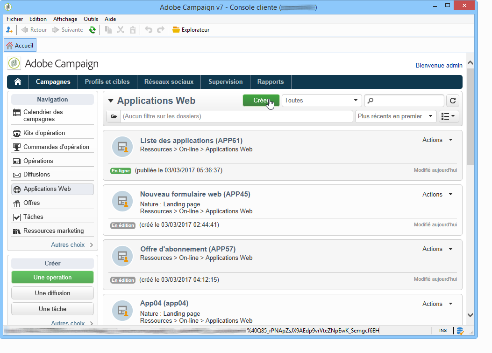

## Etape 2 - Sélectionner le modèle {#step-2---selecting-the-template}

Sélectionnez un modèle d&#39;enquête, puis donnez-lui un nom. Ce nom ne sera pas visible par les utilisateurs finaux, mais il permet d&#39;identifier l&#39;enquête dans Adobe Campaign. Cliquez sur **[!UICONTROL Save]** pour ajouter l&#39;enquête à la liste des applications Web.

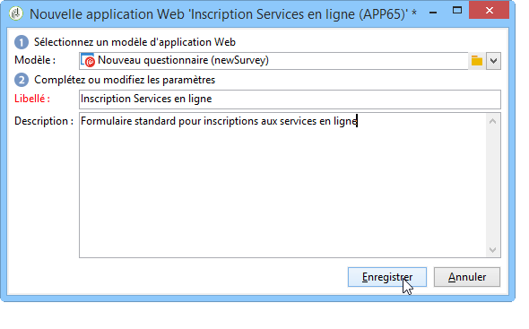

## Etape 3 - Construire le questionnaire {#step-3---building-the-survey}

Les questionnaires sont construits dans un diagramme où sont positionnées : la ou les pages où seront créés les contenus, les étapes de préchargement et d&#39;enregistrement des données, et des étapes de tests. Il est également possible d&#39;insérer des scripts et des requêtes.

To build the chart, click the **[!UICONTROL Edit]** form of the survey.

Un questionnaire doit contenir **au minimum** les trois composants suivants : une page, une boîte d&#39;enregistrement et une page de fin.

* Pour créer une , sélectionnez l&#39;objet **[!UICONTROL Page]** Page dans la section gauche de l&#39;éditeur et déposez-le dans la section centrale, comme ci-dessous :

   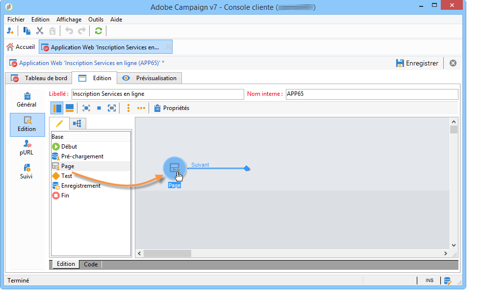

* Next, select the **[!UICONTROL Storage]** object and place it on the output transition of the page.
* Finally, select the **[!UICONTROL End]** object and place it on the end of the output transition of the storage box to obtain the following diagram:

   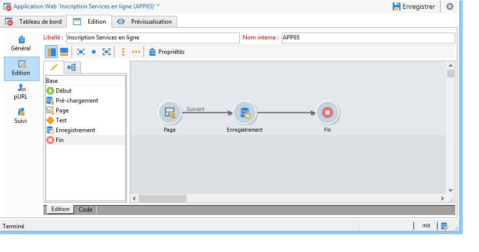

## Etape 4 - Créer le contenu de la page {#step-4---creating-the-page-content}

Dans l’exemple suivant, nous utilisons une page de **[!UICONTROL Page (v5 compatibility)]** type. Ce type de page est accessible via le menu avancé de l’ **[!UICONTROL Edit]** onglet.

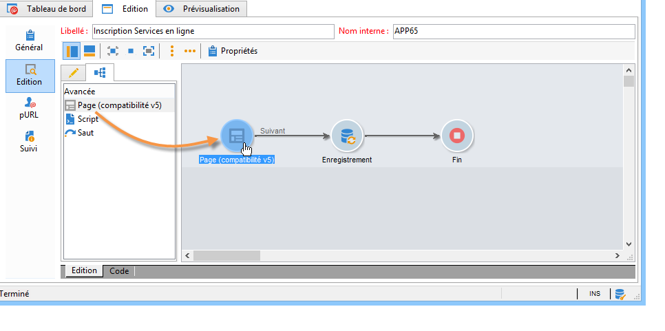

* Ajouter des champs de saisie

   Pour créer le contenu de la page, vous devez le modifier : pour ce faire, double-cliquez sur l’ **[!UICONTROL Page]** objet. Cliquez sur la première icône de la barre d’outils pour ouvrir l’assistant de création de champs. Pour créer un champ d’entrée pour le nom d’utilisateur à stocker dans le champ correspondant du profil du destinataire, sélectionnez **[!UICONTROL Edit a recipient]**.

   

   Cliquez sur le **[!UICONTROL Next]** bouton pour sélectionner le champ de stockage des données dans la base de données. Dans ce cas, le champ &quot;Nom&quot;.

   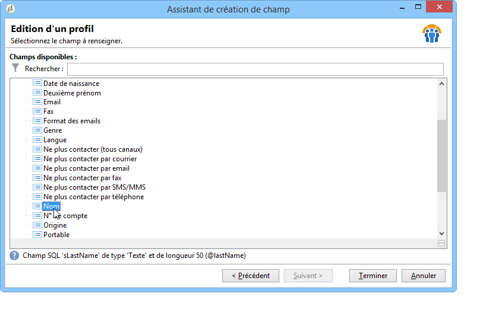

   Click **[!UICONTROL Finish]** to confirm field creation.

   Par défaut, lorsque les informations sont stockées dans un champ déjà existant de la base de données, le libellé du champ reprend le nom du champ sélectionné, soit dans notre exemple &#39;Nom&#39;. Vous pouvez modifier ce libellé, comme dans l&#39;exemple ci-dessous :

   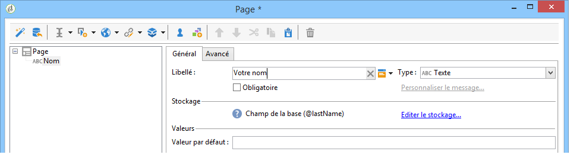

   Créez à présent un champ de saisie pour le numéro de compte de l&#39;utilisateur : répétez l&#39;opération et choisissez le champ &#39;N° de compte&#39;. 

   Ajoutez de la même façon un champ pour permettre à l&#39;utilisateur de saisir son email.

* To create a question, right-click the last element in the tree, and select **[!UICONTROL Containers > Question]** , or click the **[!UICONTROL Containers]** icon and select **[!UICONTROL Question]**.

   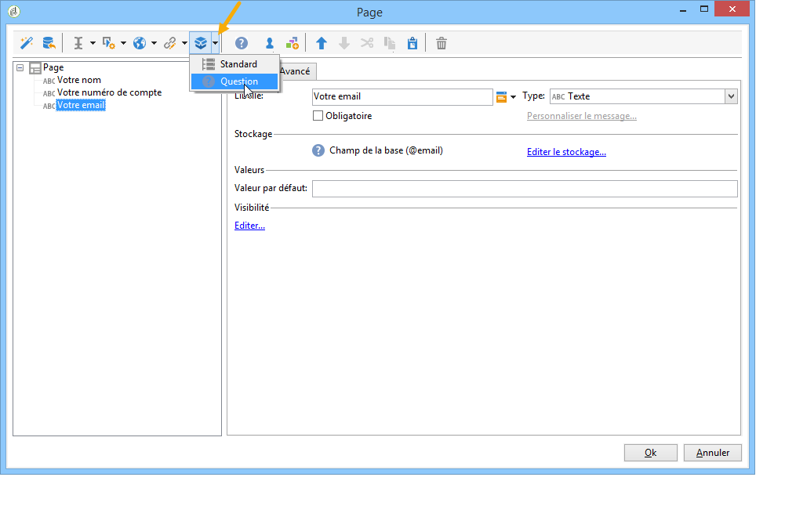

   Entrez l&#39;étiquette de la question et insérez le ou les champs de réponse comme sous-branche de la question. Pour ce faire, le noeud lié à la question doit être sélectionné lorsque vous créez le champ de réponse. Ajoutez une **[!UICONTROL drop-down listx]** icône à l’aide de l’ **[!UICONTROL Selection controls]** icône ou en cliquant avec le bouton droit de la souris, comme illustré ci-dessous :

   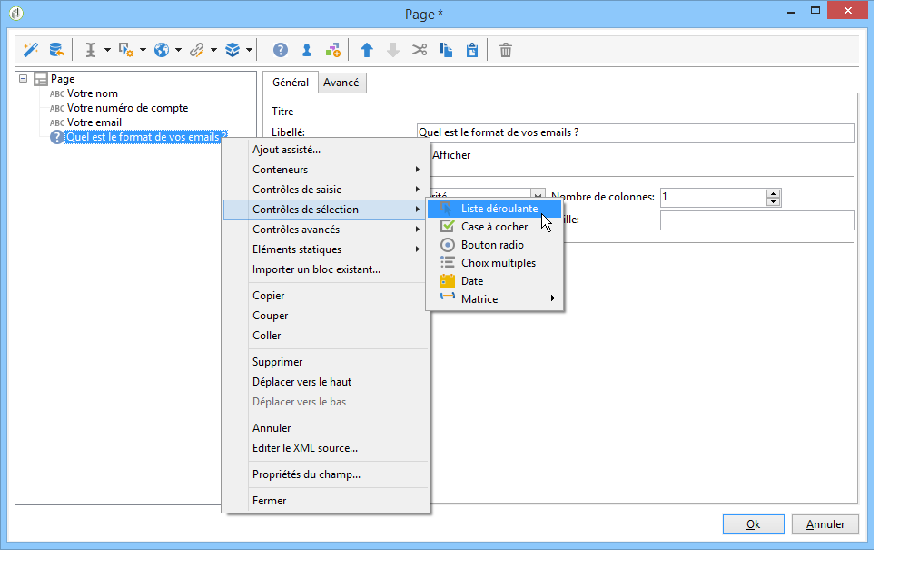

   Sélectionnez un espace de stockage : choisissez un champ de type énumération afin de récupérer automatiquement les valeurs (ici, le format des emails).

   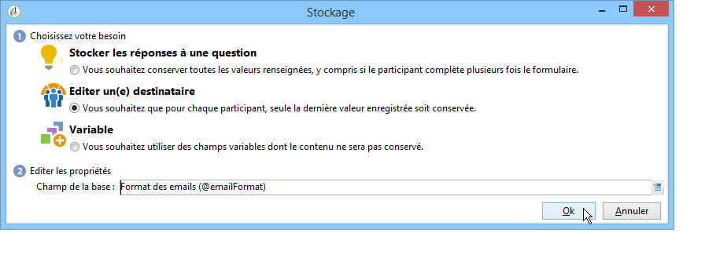

   Dans l’ **[!UICONTROL General]** onglet, cliquez sur le **[!UICONTROL Initialize the list of values from the database]** lien : la table des valeurs est saisie automatiquement.

   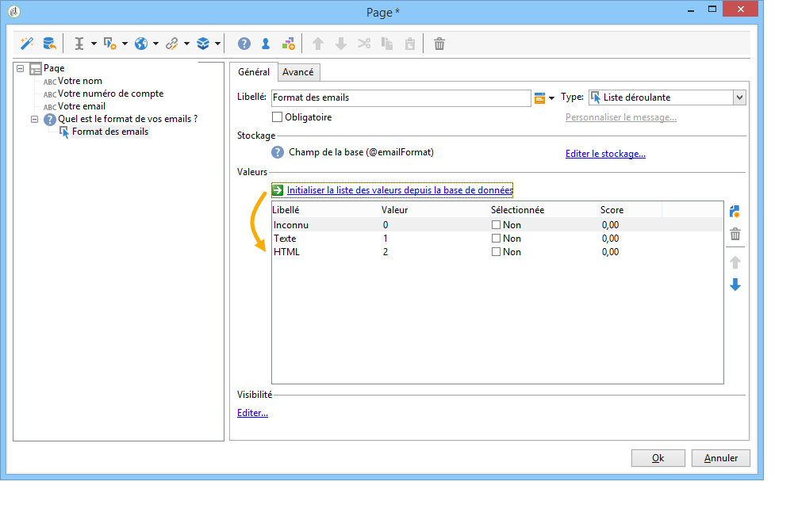

   Click **[!UICONTROL OK]** to close the editor, and **[!UICONTROL Save]** to save changes.

   >[!NOTE]
   >
   >Pour chaque champ ou question, vous pouvez adapter la mise en page à vos besoins, grâce aux options de l&#39; **[!UICONTROL Advanced]** onglet. La mise en page des écrans de l&#39;enquête est détaillée dans [cette section](../../web/using/about-web-forms.md).

   In the detail screen, click the **[!UICONTROL Preview]** tab to view the rendering of the survey you have just created.

   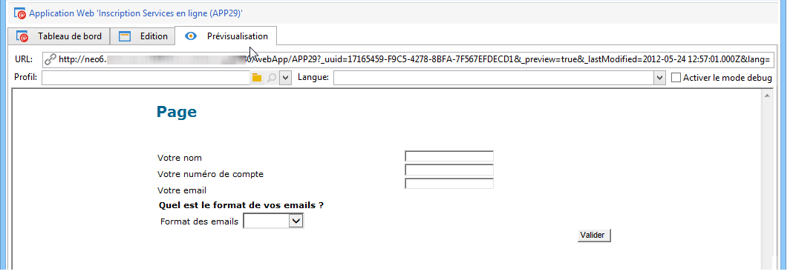

## Etape 5 - Enregistrer les données de l&#39;enquête {#step-5---storing-the-survey-data-}

La boîte d&#39;enregistrement permet de sauvegarder les réponses fournies par les utilisateurs dans la base de données. Vous devez sélectionner une clé de réconciliation afin d&#39;identifier les profils déjà présents dans la base de données.

Pour cela, éditez la boîte et cochez le champ qui sera utilisé comme clé de réconciliation à l&#39;enregistrement des données.

Dans l&#39;exemple ci-dessous, lors de l&#39;enregistrement (validation), si un profil est enregistré en base avec le même numéro de compte que celui saisi dans le formulaire, le profil sera mis à jour. Si le profil n&#39;existe pas, il sera créé.

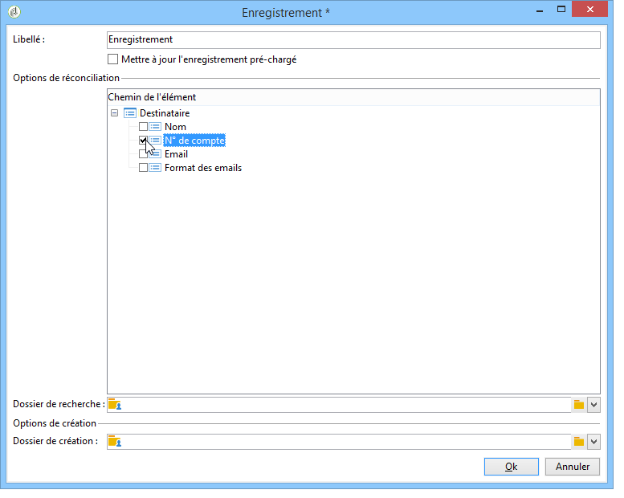

Click **[!UICONTROL OK]** to confirm, then click **[!UICONTROL Save]** to save the survey

## Etape 6 - Publier les pages {#step-6---publishing-the-pages}

Afin de permettre aux utilisateurs d&#39;accéder aux pages HTML, le questionnaire doit être rendu disponible : il ne doit plus être en édition mais en production. Pour mettre en production un questionnaire, vous devez le publier. Pour cela :

* Click the **[!UICONTROL Publish]** button located above the survey dashboard.
* Click **[!UICONTROL Start]** to launch publication and close the wizard.

   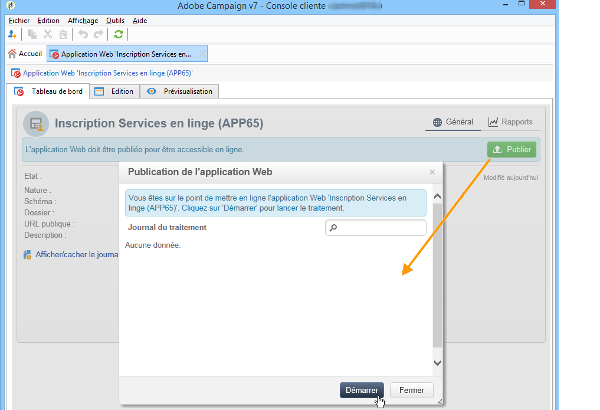

   Le statut du questionnaire est alors modifié : il est **En ligne**.

   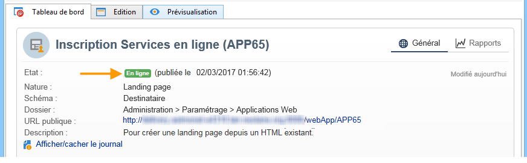

## Etape 7 - Partager votre questionnaire en ligne {#step-7---sharing-your-online-survey}

Une fois en production, le questionnaire est accessible sur le serveur et vous pouvez le diffuser. L&#39;URL d&#39;accès au questionnaire est affichée dans le tableau de bord.

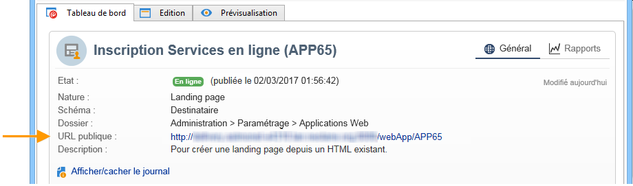

Pour diffuser le questionnaire, vous pouvez envoyer un message contenant le lien d&#39;accès au questionnaire à la population cible ou positionner l&#39;URL d&#39;accès au questionnaire sur une page web, par exemple.

Vous pouvez ensuite suivre les réponses des utilisateurs au travers des rapports et des logs. Voir [Suivre les réponses](../../web/using/publish--track-and-use-collected-data.md#response-tracking).

>[!CAUTION]
>
>L&#39;URL publique contient le nom interne du questionnaire. En cas de modification du nom interne, l&#39;URL automatiquement mise à jour : tous les liens vers le questionnaires doivent alors être mis à jour.
>
>Si des diffusions contenant un lien vers le formulaire ont déjà été envoyées, ce lien ne fonctionnera plus.

