# Publier, suivre et utiliser les données collectées{#publish-track-and-use-collected-data}

Une fois le formulaire créé, configuré et publié, vous pouvez partager le lien avec votre public et suivre les réponses.

>[!NOTE]
>
>Le cycle de vie d’un questionnaire sous Adobe Campaign ainsi que ses modes de publication et de diffusion sont similaires à ceux d’un formulaire web : ils sont présentés dans [cette section](../../web/using/about-web-forms.md).

## Tableau de bord du questionnaire {#survey-dashboard}

Chaque enquête possède son propre tableau de bord qui vous permet d&#39;afficher son état, sa description, son URL publique et son calendrier de disponibilité. Il vous permet également d’afficher les rapports disponibles. Pour en savoir plus, consultez [Rapports sur les enquêtes](#reports-on-surveys).

L&#39;URL publique du questionnaire est affichée dans le tableau de bord :

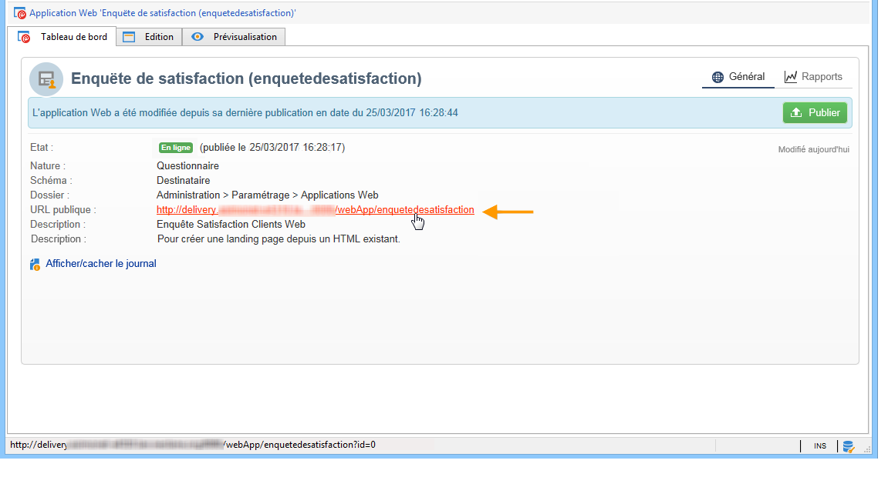

## Suivre les réponses {#response-tracking}

Vous pouvez suivre les réponses au questionnaire dans les logs et dans les rapports.

### Les logs de questionnaires {#survey-logs}

Pour chaque enquête diffusée, vous pouvez suivre les réponses dans l&#39; **[!UICONTROL Logs]** onglet. Cet onglet affiche la liste des utilisateurs qui ont répondu à l&#39;enquête et leur origine :

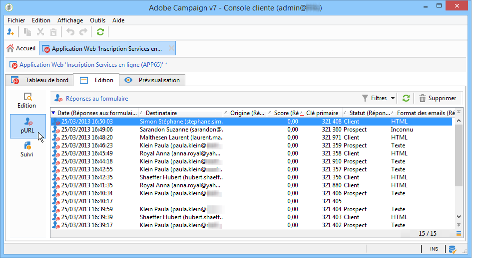

Cliquez deux fois sur une ligne pour afficher le formulaire de l&#39;enquête tel qu&#39;il est rempli par le participant. Vous pouvez parcourir l&#39;enquête dans son intégralité et accéder aux réponses dans leur intégralité. Ils peuvent être exportés dans un fichier externe. For more on this, refer to [Exporting answers](#exporting-answers).

L&#39;origine est une information indiquée dans l&#39;URL du questionnaire en y ajoutant les caractères suivants :

```
?origin=xxx
```

pendant que l&#39;enquête est en cours de modification, son URL contient le paramètre **[!UICONTROL __uuid]**, ce qui indique qu&#39;il est en phase de test et qu&#39;il n&#39;est pas encore en ligne. Lorsque vous accédez à l&#39;enquête via cette URL, les enregistrements créés ne sont pas pris en compte dans le suivi (rapports). L’origine est forcée à la valeur **[!UICONTROL Adobe Campaign]**.

Pour plus d&#39;informations sur les paramètres d&#39;URL, consultez [cette page](../../web/using/defining-web-forms-properties.md#form-url-parameters).

### Les rapports sur les questionnaires {#reports-on-surveys}

Le tableau de bord permet d&#39;accéder aux rapports sur le questionnaire. Cliquez sur le nom d&#39;un rapport pour le visualiser.

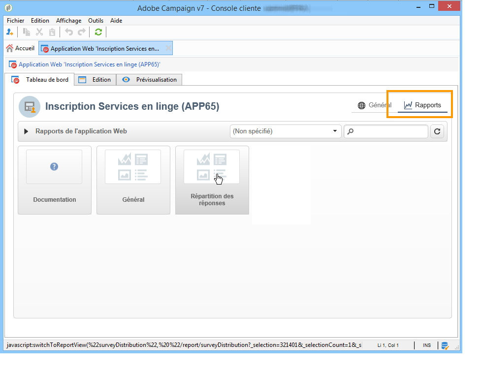

La structure du questionnaire est synthétisée dans le rapport **[!UICONTROL Documentation]**.

Deux autres rapports sur les enquêtes Web sont disponibles dans l&#39; **[!UICONTROL Reports]** onglet des enquêtes : **[!UICONTROL General]** et **[!UICONTROL Breakdown of responses]**.

* Général

   Ce rapport regroupe des informations générales sur le questionnaire : l&#39;évolution du nombre de réponses dans le temps, la répartition par origines et par langues.

   Exemple de rapport général :

   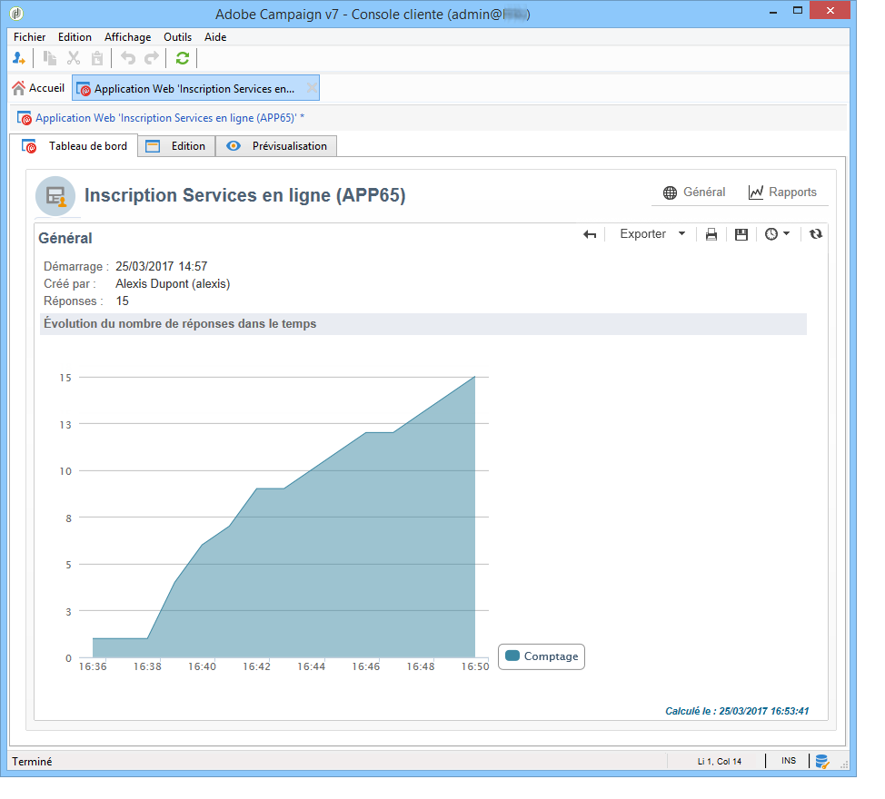

* Répartition des réponses

   Ce rapport présente la ventilation des réponses pour chaque question. Cette ventilation n’est disponible que pour les réponses données aux champs stockés dans des conteneurs de **[!UICONTROL Question]** type. Elle n’est valide que pour les contrôles de sélection (aucune ventilation sur les champs de texte, par exemple).

   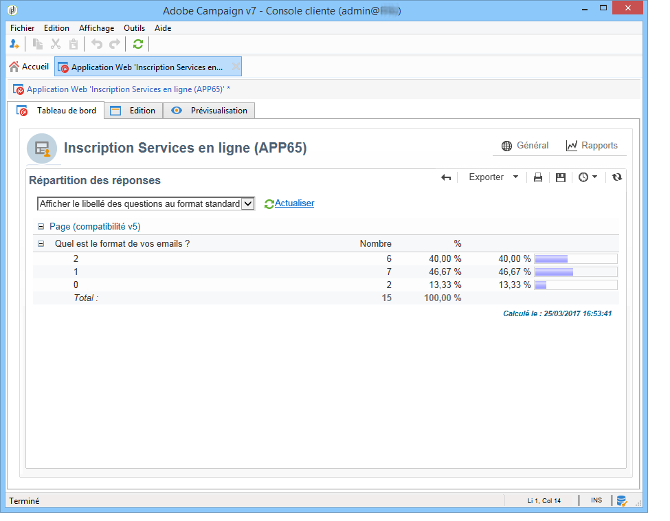

## Exporter les réponses {#exporting-answers}

Les réponses à un questionnaire peuvent être exportées dans un fichier externe afin d&#39;être réexploitées ultérieurement. Pour cela, deux opérations sont possibles :

1. Exporter les données d&#39;un rapport

   To export report data, click the **[!UICONTROL Export]** button and choose the export format.

   L&#39;export des données d&#39;un rapport est présenté dans [cette section](../../reporting/using/about-reports-creation-in-campaign.md).

1. Exporter les réponses

   To export answers, click the **[!UICONTROL Responses]** tab of the survey and right-click. Sélectionner **[!UICONTROL Export...]**.

   

   Indiquez ensuite les informations à exporter et fichier d&#39;enregistrement.

   Vous pouvez paramétrer le contenu et le format du fichier de sortie dans l&#39;assistant d&#39;export.

   Ainsi, vous pouvez :

   * ajouter des colonnes supplémentaires dans le fichier de sortie et ainsi récupérer les informations stockées en base relatives au destinataire,
   * appliquer un formatage sur les données exportées,
   * sélectionner le format d&#39;encodage des informations dans le fichier.
   Si l&#39;enquête que vous souhaitez exporter contient plusieurs **[!UICONTROL Multi-line text]** ou **[!UICONTROL HTML text]** champs, elle doit être exportée au **[!UICONTROL XML]** format. Pour ce faire, sélectionnez ce format dans la liste déroulante du **[!UICONTROL Output format]** champ, comme illustré ci-dessous :

   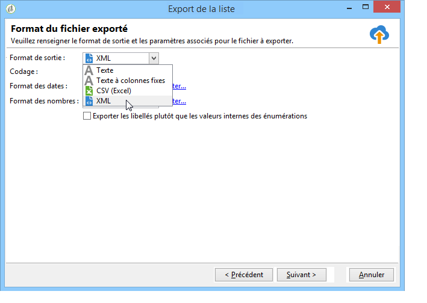

   Click **[!UICONTROL Start]** to run the export.

   >[!NOTE]
   >
   >Le déroulement d&#39;un export de données et les étapes de son paramétrage sont détaillés dans [cette section](../../platform/using/generic-imports-and-exports.md).

## Utiliser les données collectées {#using-the-collected-data}

Les informations collectées par le biais d&#39;enquêtes en ligne peuvent être récupérées dans le cadre d&#39;un processus de ciblage. Pour ce faire, utilisez la **[!UICONTROL Survey responses]** case.

Dans l&#39;exemple suivant, nous allons proposer une offre Web spécifique aux cinq destinataires parents d&#39;au moins deux enfants et ayant réalisé le meilleur score à un questionnaire en ligne. Les réponses à ce questionnaire sont les suivantes :


In the targeting workflow, the **[!UICONTROL Survey responses]** will be configured as follows:

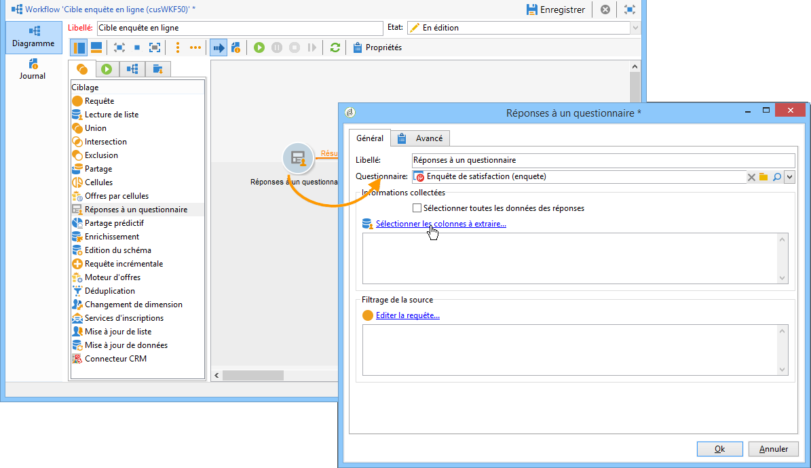

Sélectionnez le questionnaire concerné puis les données à extraire dans la section centrale de la fenêtre. Ici, il est nécessaire d&#39;extraire au moins la colonne du score car elle sera utilisée dans la boîte de partage afin de ne récupérer que les cinq meilleurs scores parmi les réponses fournies.

Indicate the filtering conditions for answers by clicking the **[!UICONTROL Edit query...]** link.

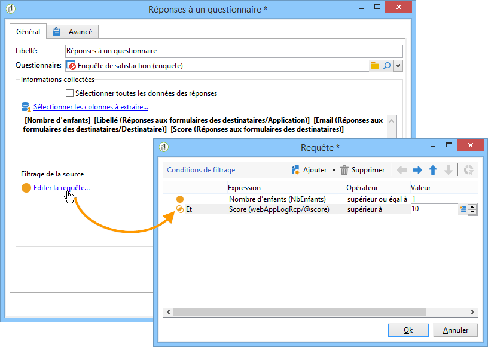

Démarrez le workflow de ciblage. La requête permet de récupérer 8 destinataires.

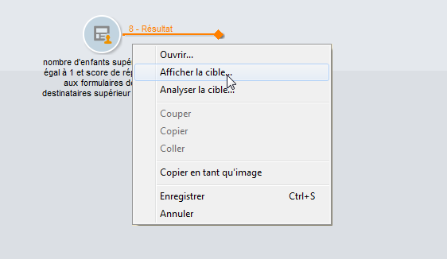

Cliquez avec le bouton droit de la souris sur la transition sortante de la boîte de collecte pour les visualiser.

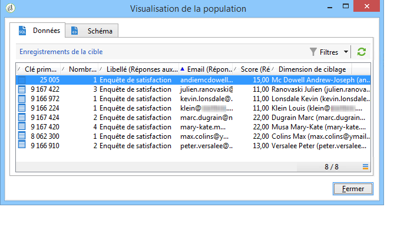

Positionnez ensuite dans le workflow une boîte de partage afin de ne récupérer que les 5 destinataires ayant obtenu le meilleur score.

Editez la boîte de partage pour la paramétrer :

* Start by selecting the adequate schema in the **[!UICONTROL General]** tab, then configure the sub-set:

   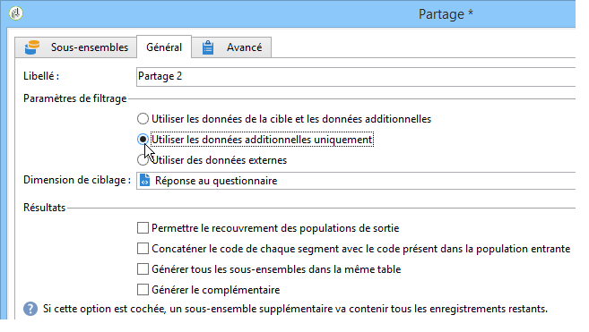

* Accédez à l’ **[!UICONTROL Sub-sets]** onglet et sélectionnez l’ **[!UICONTROL Limit the selected records]** option, puis cliquez sur le **[!UICONTROL Edit...]** lien.

   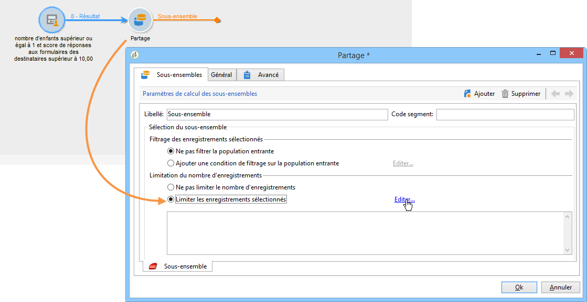

* Sélectionnez l’ **[!UICONTROL Keep only the first records after sorting]** option et sélectionnez la colonne de tri. Cochez l’ **[!UICONTROL Descending sort]** option.

   

* Click the **[!UICONTROL Next]** button and limit the number of records to 5.

   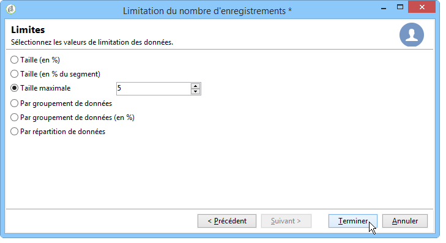

* Click **[!UICONTROL Finish]** then restart the workflow to approve targeting.

## Normaliser les données {#standardizing-data}

Vous pouvez mettre en place dans Adobe Campaign des processus de normalisation des données collectées en utilisant les alias. Il est alors possible de normaliser les données stockées en base : pour cela, vous devez définir des alias au niveau des énumérations dans lesquelles les informations sont stockées.

Voir à ce propos [cette page](../../platform/using/managing-enumerations.md#about-enumerations).
