# Publier un formulaire web{#publishing-a-web-form}


## Précharger les données du formulaire {#pre-loading-the-form-data}

Si vous souhaitez mettre à jour les profils stockés en base via un formulaire web, vous pouvez utiliser une boîte de préchargement. La boîte de préchargement permet d&#39;indiquer comment retrouver l&#39;enregistrement à mettre à jour dans la base de données.

Les méthodes d&#39;identification possibles sont les suivantes :

* **[!UICONTROL Chiffrement Adobe Campaign]**

  Cette méthode de chiffrement utilise l&#39;identifiant (ID) chiffré par Adobe Campaign. Cette méthode n&#39;est applicable que sur un objet Adobe Campaign et l&#39;identifiant chiffré ne peut être généré que par la plateforme Adobe Campaign.

  Lorsque vous utilisez cette méthode, vous devez adapter l&#39;URL du formulaire lorsque vous diffusez l&#39;adresse par email en y ajoutant le paramètre **`<%=escapeUrl(recipient.cryptedId) %>`**. Voir à ce sujet la section [Diffuser un formulaire par email](#delivering-a-form-via-email).

* **[!UICONTROL Chiffrement DES]**

  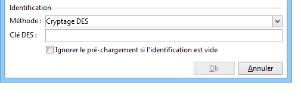

  Cette méthode de chiffrement utilise un identifiant (ID) fourni de l&#39;extérieur associé à une clé commune entre Adobe Campaign et le fournisseur externe. Le champ **[!UICONTROL Clé DES]** permet de saisir cette clé de chiffrement.

* **[!UICONTROL Liste de champs]**

  Cette option permet de sélectionner parmi les champs du contexte courant du formulaire, ceux qui seront utilisés pour retrouver le profil correspondant dans la base de données.

  

  Les champs peuvent être ajoutés aux propriétés du formulaire via l’onglet **[!UICONTROL Paramètres]** (voir [Ajouter des paramètres](defining-web-forms-properties.md#adding-parameters)). Ils sont placés dans l’URL du formulaire ou dans les zones d’entrée.

  >[!CAUTION]
  >
  >Les données des champs sélectionnées ne sont pas chiffrées. Elles ne doivent pas être fournies sous forme chiffrée car Adobe Campaign ne pourra pas les déchiffrer si l&#39;option **[!UICONTROL Liste de champs]** est sélectionnée.

  Dans l&#39;exemple ci-dessous, le pré-chargement du profil est basé sur l&#39;adresse email.

  L&#39;URL peut contenir l&#39;adresse e-mail non chiffrée, auquel cas l&#39;utilisateur accède directement à la page qui le concerne.

  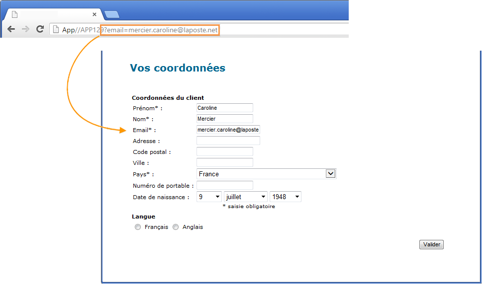

  Dans le cas contraire, il devra fournir son mot de passe.

  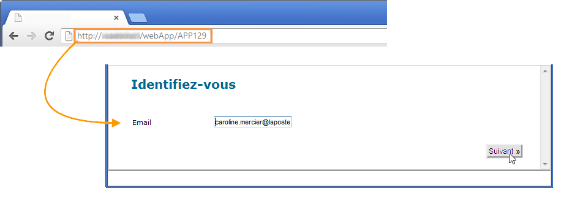

  >[!CAUTION]
  >
  >Si plusieurs champs sont indiqués dans la liste, les données de **TOUS LES CHAMPS** doivent correspondre avec les informations stockées en base pour que le profil soit mis à jour. Dans le cas contraire, un nouveau profil est créé.
  > 
  >Cette fonctionnalité est particulièrement utile dans les applications Web mais n&#39;est pas recommandée dans les formulaires publics. L&#39;option de contrôle d&#39;accès sélectionnée doit être &quot;Activer le contrôle d&#39;accès&quot;.

L’option **[!UICONTROL Ignorer le pré-chargement si l’identification est vide]** doit être sélectionnée si vous ne souhaitez pas mettre à jour les profils. Dans ce cas, chaque profil saisi sera ajouté à la base de données après validation du formulaire. Cette option est utilisée, par exemple, lorsque le formulaire est publié sur un site web.

L&#39;option **[!UICONTROL Chargement automatique des données référencées dans le formulaire]** permet de précharger automatiquement les données correspondant aux champs de saisie et aux champs de fusion du formulaire. En revanche, les données référencées dans les activités **[!UICONTROL Script]** et **[!UICONTROL Test]** ne sont pas concernées. Lorsque cette option n&#39;est pas sélectionnée, vous devez définir les champs à l&#39;aide de l&#39;option **[!UICONTROL Chargement de données additionnelles]**.

L&#39;option **[!UICONTROL Chargement de données additionnelles]** permet d&#39;ajouter des informations supplémentaires qui ne sont pas utilisées dans les pages du formulaire mais seront toutefois pré-remplies.

Vous pouvez par exemple précharger le genre du destinataire et l’orienter automatiquement vers la page correspondante via une boîte de test.

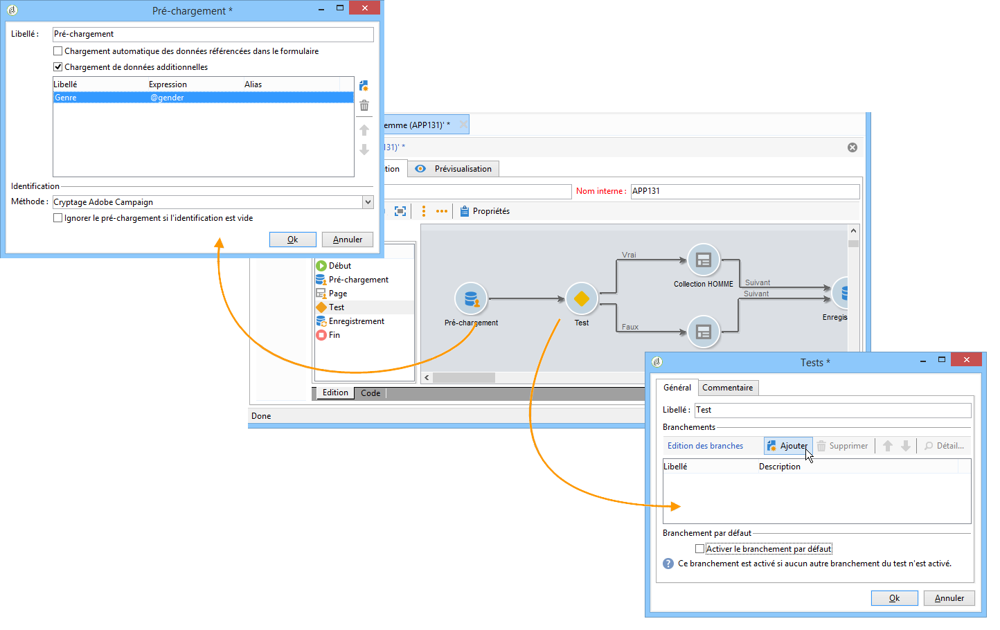

## Gérer la diffusion et le tracking des formulaires web {#managing-web-forms-delivery-and-tracking}

Une fois le formulaire créé, configuré et publié, vous pouvez le diffuser et effectuer un tracking des réponses des utilisateurs.

### Cycle de vie d&#39;un formulaire {#life-cycle-of-a-form}

Le cycle de vie d&#39;un formulaire se décompose en trois étapes :

1. **En édition**

   C&#39;est la phase de conception initiale. Lorsqu’un nouveau formulaire est créé, il est en phase d’édition. L&#39;accès au formulaire, à des fins de tests uniquement, requiert alors l&#39;utilisation du paramètre **[!UICONTROL __uuid]** dans son URL. Cette URL est accessible dans le sous-onglet **[!UICONTROL Aperçu]**. Voir [Paramètres d’URL de formulaire](defining-web-forms-properties.md#form-url-parameters).

   >[!CAUTION]
   >
   >Tant que le formulaire est en édition, son URL d&#39;accès est une URL spécifique.

1. **En attente de publication**

   Dans certains cas (par exemple, lors de l’[importation d’un formulaire par le biais d’un package](#import-web-packages)), un formulaire web peut avoir le statut **[!UICONTROL En attente de publication]** jusqu’à ce qu’il soit en ligne.

   >[!NOTE]
   >
   >Pour les applications web techniques (disponibles via le menu **[!UICONTROL Administration]** > **[!UICONTROL Configuration]** > **[!UICONTROL Applications web]**), un formulaire ayant le statut **[!UICONTROL En attente de publication]** est automatiquement [publié](#publishing-a-form) et se voit attribuer le statut **[!UICONTROL En ligne]**.

1. **En ligne**

   Une fois la phase de conception terminée, le formulaire peut être diffusé.

   Lorsqu’un formulaire a le statut **[!UICONTROL En édition]** ou **[!UICONTROL En attente de publication]**, il doit être [publié](#publishing-a-form) afin d’être en ligne et accessible via l’URL du formulaire web dans un navigateur.

   Une fois publié, le formulaire est en ligne jusqu&#39;à son expiration.

   Le formulaire est alors **[!UICONTROL En ligne]**, jusqu&#39;à ce que sa date de clôture soit atteinte.

   >[!CAUTION]
   >
   >Pour que la diffusion ait lieu, l&#39;URL du formulaire ne doit pas contenir le paramètre **[!UICONTROL __uuid]**.

1. **Fermé**

   Une fois la date de clôture du formulaire atteinte, la phase de diffusion est terminée et le formulaire est indisponible : il n&#39;est plus accessible aux utilisateurs.

   La date d’expiration peut être définie dans la fenêtre des propriétés du formulaire. Pour plus d’informations à ce sujet, consultez la section [Rendre un formulaire disponible en ligne](#making-a-form-available-online).

L&#39;état de publication d&#39;un formulaire est affiché dans la liste des formulaires.

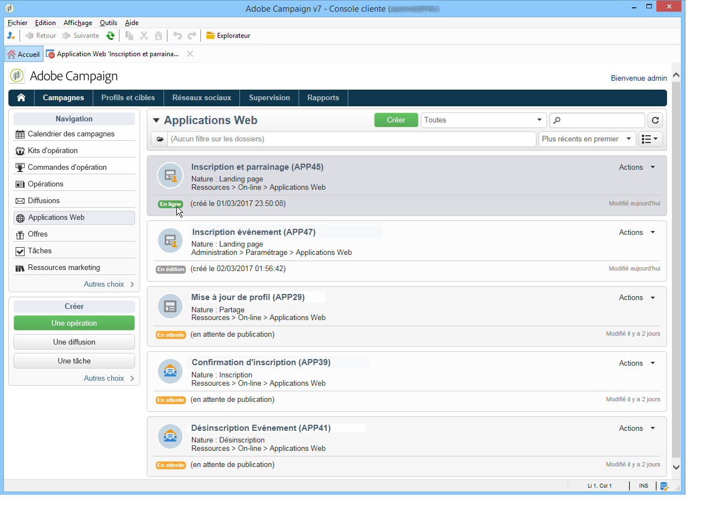

### Publier un formulaire {#publishing-a-form}

Pour modifier l&#39;état d&#39;un formulaire, vous devez le publier. Pour cela, cliquez sur le bouton **[!UICONTROL Publication]** situé au-dessus de la liste des formulaires Web et sélectionnez l&#39;état dans la liste déroulante.

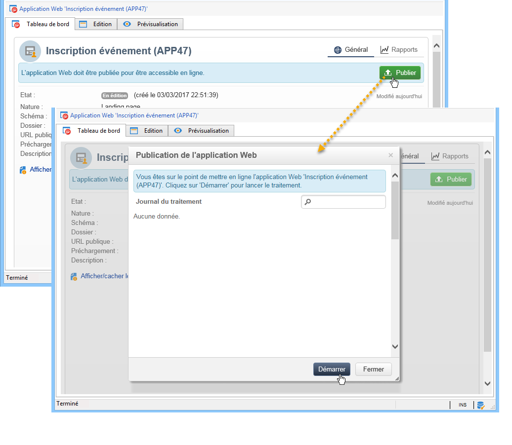

### Mettre un formulaire à disposition {#making-a-form-available-online}

Pour que l’accès au formulaire soit possible, il doit être en production et démarré, c&#39;est-à-dire dans sa période de validité. Les dates de validité sont renseignées depuis le lien **[!UICONTROL Propriétés]** du formulaire.

* Utilisez les champs de la section **[!UICONTROL Projet]** pour indiquer les dates de démarrage et de clôture du formulaire.

  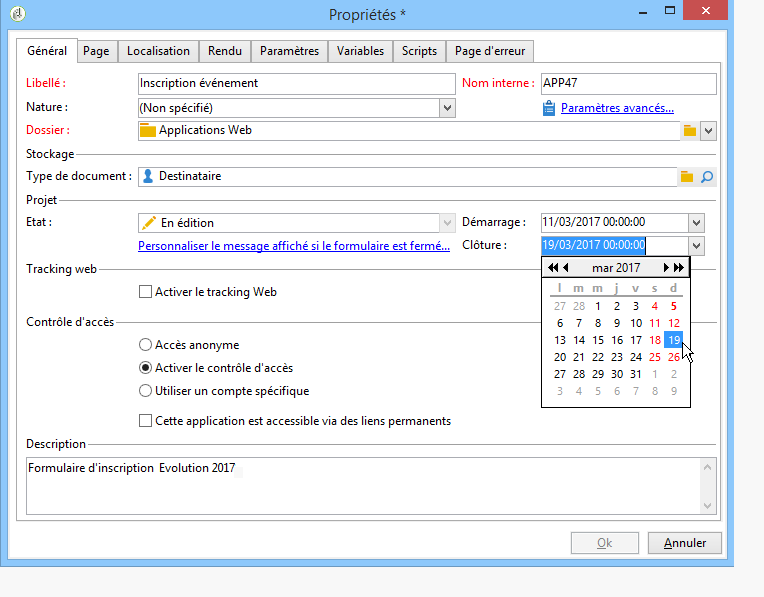

* Cliquez sur le lien **[!UICONTROL Personnaliser le message affiché si le formulaire est fermé]** pour définir le message d&#39;erreur à afficher si l&#39;utilisateur tente d&#39;accéder au formulaire en dehors de sa période de validité.

  Voir [Accessibilité du fomulaire](defining-web-forms-properties.md#accessibility-of-the-form).

### Diffuser un formulaire par email {#delivering-a-form-via-email}

Lorsque vous diffusez une invitation par email, vous pouvez utiliser l&#39;option **[!UICONTROL Chiffrement Adobe Campaign]** pour assurer la réconciliation des données. Pour cela, dans l&#39;assistant de diffusion, vous devez adapter le lien vers le formulaire en ajoutant le paramètre suivant :

```
<a href="https://server/webApp/APP264?&id=<%=escapeUrl(recipient.cryptedId) %>">
```

Dans ce cas, la clé de réconciliation pour le stockage des données doit être l’identifiant chiffré du destinataire. Voir à ce sujet la section [Précharger les données du formulaire](#pre-loading-the-form-data).

Dans ce cas, vous devez cocher l’option **[!UICONTROL Mettre à jour l’enregistrement préchargé]** dans la zone d’enregistrement. Voir à ce sujet la section [Enregistrer les réponses aux formulaires web](web-forms-answers.md#saving-web-forms-answers).

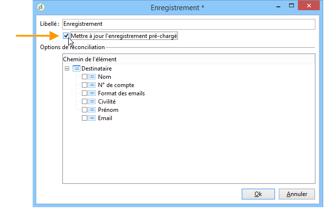

### Log responses {#log-responses}

Le tracking des réponses peut être activé dans un onglet dédié afin de suivre l&#39;impact de votre formulaire web. Pour ce faire, cliquez sur le bouton **[!UICONTROL Paramètres avancés]** dans la fenêtre des propriétés du formulaire et cochez ensuite la case **[!UICONTROL Enregistrer une trace des réponses]**.

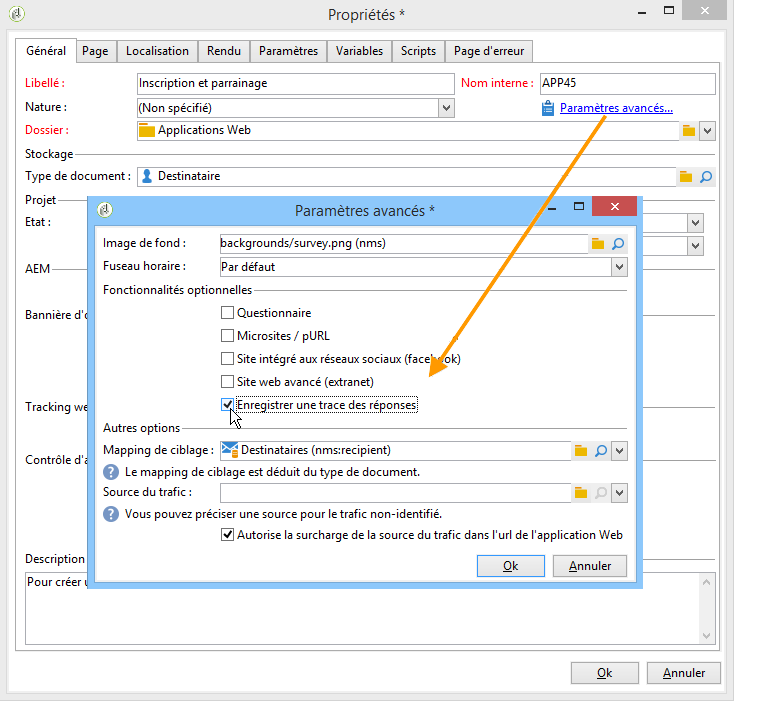

L&#39;onglet **[!UICONTROL Réponses]** permet alors de visualiser l&#39;identité des répondants.

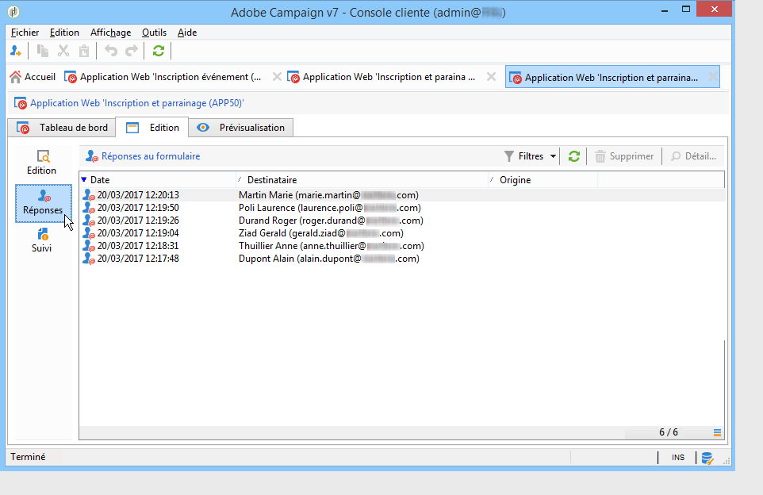

Sélectionnez un destinataire et cliquez sur le bouton **[!UICONTROL Détail...]** pour visualiser les réponses fournies.

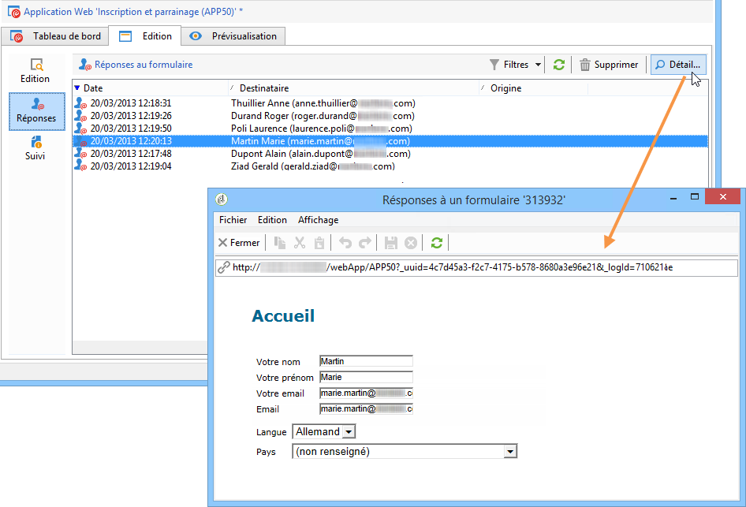

Vous pouvez exploiter les traces des réponses fournies dans des requêtes, par exemple pour cibler uniquement les non-répondants dans le cadre d&#39;une relance ou proposer des communications spécifiques aux seuls répondants.

### Import de packages de formulaires web {#import-web-packages}

Lors de l&#39;export et de l&#39;import d&#39;un package comprenant un formulaire web d&#39;une instance vers une autre instance (par exemple, de l&#39;évaluation à la production), le statut du formulaire web sur la nouvelle instance peut varier selon plusieurs conditions. Les différents cas sont énumérés ci-dessous.

Pour en savoir plus sur les différents statuts d&#39;un formulaire web, consultez [cette section](#life-cycle-of-a-form).

>[!NOTE]
>
>Lorsque vous exportez un formulaire web via un package, son statut est visible dans le contenu du package qui en résulte.

* Si le statut du formulaire web était **[!UICONTROL En attente de publication]** ou **[!UICONTROL En ligne]** lorsqu’il a été exporté à partir de la première instance :

   * Le formulaire web reçoit le statut **[!UICONTROL En attente de publication]** lorsqu’il est importé sur la nouvelle instance.

   * Si le formulaire web existe déjà sur la nouvelle instance, il est remplacé par la nouvelle version et prend le statut **[!UICONTROL En attente de publication]**, même si l’ancienne version était **[!UICONTROL En ligne]**.

   * Qu’il existait déjà ou non, le formulaire doit être [publié](#publishing-a-form) pour obtenir le statut **[!UICONTROL En ligne]** sur la nouvelle instance et être accessible via l’URL du formulaire web dans un navigateur.

* Si le statut du formulaire web était **[!UICONTROL En édition]** lorsqu’il a été exporté :

   * Si le formulaire web est nouveau sur l&#39;instance où le package a été importé, il reçoit le statut **[!UICONTROL En édition]**.

   * Si le formulaire web existe déjà sur la nouvelle instance, il s’agit d’une modification sur un formulaire existant. Si l’ancienne version du formulaire était **[!UICONTROL En ligne]**, elle reste en ligne jusqu’à ce que la nouvelle version du formulaire soit [publiée](#publishing-a-form) à nouveau sur la nouvelle instance.

  >[!NOTE]
  >
  >Vous pouvez vérifier la dernière version de votre formulaire web dans l’onglet **[!UICONTROL Aperçu]**.

<!--For RN:
* Now, when a web form has the **Pending publication** status, it must be published before it becomes **Online** and accessible through the web form URL in a web browser. [Read more](../../web/using/publishing-a-web-form.md#life-cycle-of-a-form)
-->
