# Eléments statiques dans un formulaire web{#static-elements-in-a-web-form}


Vous pouvez inclure des éléments avec lesquels l’utilisateur n’a aucune interaction dans les pages du formulaire ; il s’agit d’éléments statiques tels que des images, du contenu HTML, une barre horizontale ou un lien hypertexte. Ces éléments sont créés par le premier bouton de la barre d&#39;outils, en sélectionnant **[!UICONTROL Éléments statiques]**.

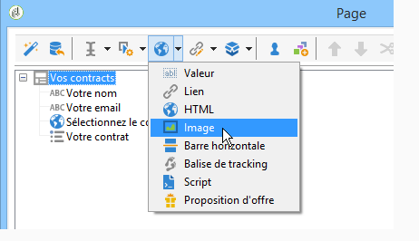

Les types de champs disponibles sont les suivants :

* Valeur issue des réponses fournies antérieurement (dans le contexte du formulaire) ou de la base de données.
* Lien hypertexte, HTML, barre horizontale. Voir [Insérer du contenu HTML](#inserting-html-content).
* Image enregistrée dans la bibliothèque de ressources ou sur un serveur accessible par les utilisateurs. Voir [Insérer des images](#inserting-images).
* Script exécuté côté client et/ou côté serveur. Il doit être rédigé en Javascript et compatible avec la plupart des navigateurs afin d&#39;assurer une bonne exécution côté client.

  >[!NOTE]
  >
  >Côté serveur, le script peut utiliser les fonctions définies dans la [documentation JSAPI Campaign](https://experienceleague.adobe.com/developer/campaign-api/api/index.html?lang=fr).

## Insérer du contenu HTML {#inserting-html-content}

Vous pouvez inclure des contenus HTML dans une page de formulaire : liens hypertextes, images, paragraphes formatés, vidéos, etc.

L&#39;éditeur HTML vous permet de saisir le contenu à insérer dans la page du formulaire. Pour ouvrir l&#39;éditeur, cliquez sur **[!UICONTROL Éléments statiques]** > **[!UICONTROL HTML]**.

Vous pouvez saisir et mettre en forme directement votre contenu ou afficher la fenêtre du code source pour y coller un contenu externe. Pour basculer en mode &quot;code source&quot;, cliquez sur la première icône de la barre d&#39;outils :

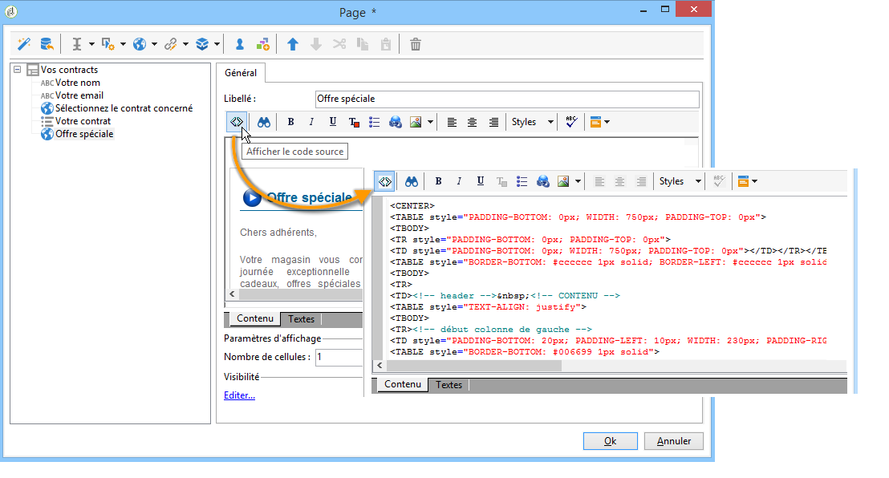

Pour insérer un champ de la base, utilisez le bouton de personnalisation.

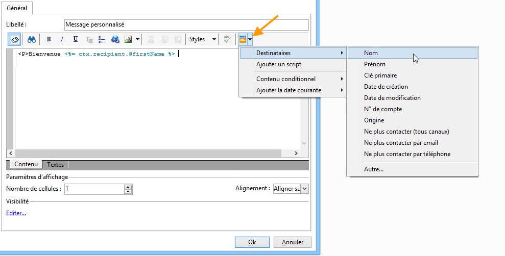

>[!NOTE]
>
>Les chaînes saisies dans l&#39;éditeur HTML ne font l&#39;objet d&#39;une traduction que si elles sont définies dans le sous-onglet **[!UICONTROL Textes]**. Dans le cas contraire, elles ne sont pas collectées. Voir à ce sujet la section [Traduire un formulaire web](translating-a-web-form.md).

### Insérer un lien {#inserting-a-link}

Renseignez les champs de la fenêtre d&#39;édition, comme dans l&#39;exemple ci-dessous :

Pour ajouter un lien hypertexte, accédez au menu **[!UICONTROL Éléments statiques]** > **[!UICONTROL Lien]**.

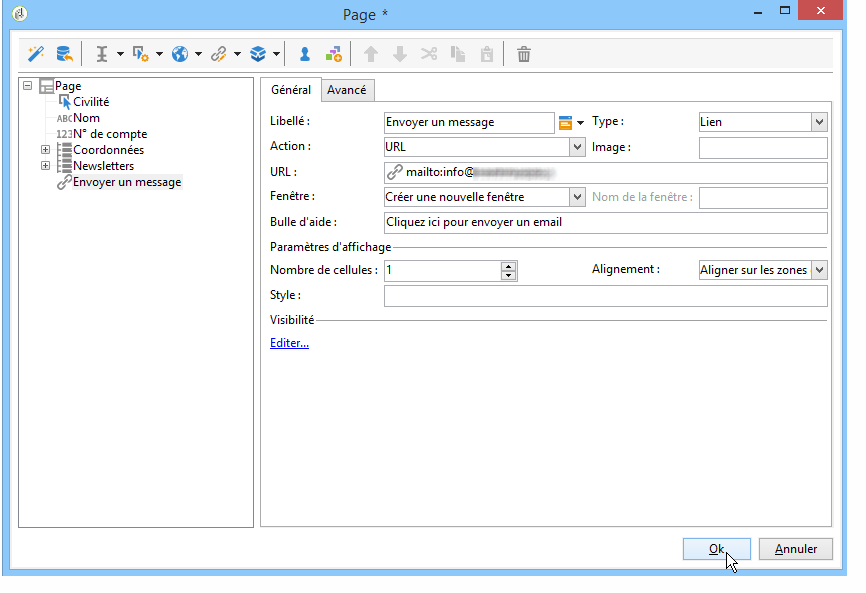

* Le **[!UICONTROL Libellé]** est le contenu du lien hypertexte, tel qu&#39;il sera affiché dans la page du formulaire.
* L&#39;**[!UICONTROL URL]** correspond à l&#39;adresse visée, par exemple : [https://www.adobe.com](https://www.adobe.com) pour un site web ou [info@adobe.com](mailto:info@adobe.com) pour envoyer un message.
* Le champ **[!UICONTROL Fenêtre]** permet de sélectionner le mode d&#39;affichage du lien, lorsqu&#39;il s&#39;agit d&#39;un site. Vous pouvez choisir d&#39;ouvrir le lien dans une nouvelle fenêtre, dans la fenêtre courante ou dans une autre fenêtre.
* Vous pouvez ajouter une bulle d&#39;aide, comme dans l&#39;exemple ci-dessous :

  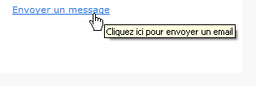

* Vous pouvez choisir d’afficher le lien sous forme de bouton ou d’image. Pour ce faire, sélectionnez le type d’affichage dans le **[!UICONTROL Type]** champ .

### Types de liens {#types-of-links}

Par défaut, les liens sont associés à une action de type URL, qui permettent de saisir une adresse de destination du lien dans le champ URL.

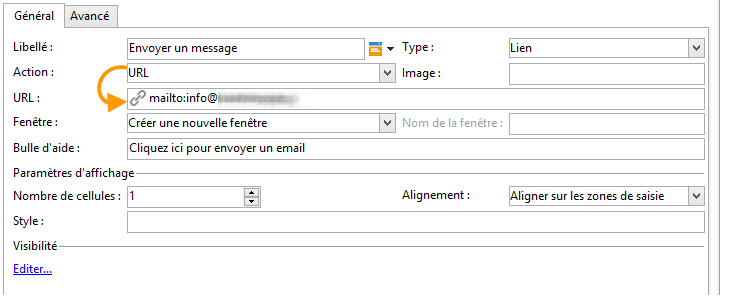

Vous pouvez définir d&#39;autres actions pour le lien. Ainsi, lorsque l&#39;utilisateur clique sur le lien, il peut :

* Actualiser la page

  Pour cela, sélectionnez l&#39;option **[!UICONTROL Actualiser la page]** dans la liste déroulante du champ **[!UICONTROL Action]**.

  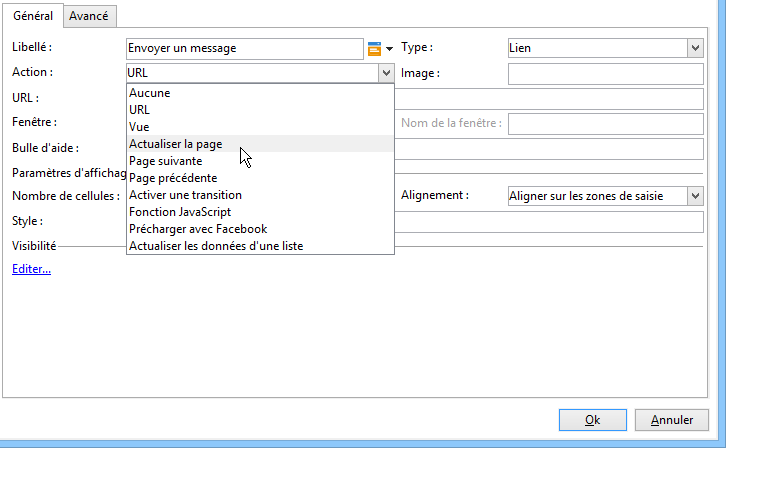

* Afficher la page suivante / précédente

  Pour cela, sélectionnez l&#39;option **[!UICONTROL Page suivante]** ou **[!UICONTROL Page précédente]** dans la liste déroulante du champ **[!UICONTROL Action]**.

  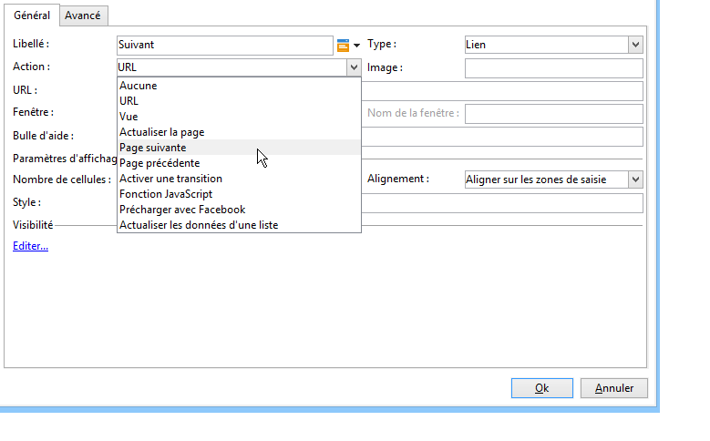

  Vous pouvez masquer la variable **[!UICONTROL Suivant]** et/ou **[!UICONTROL Précédent]** s’ils doivent être remplacés par un lien. Voir cette [page](defining-web-forms-page-sequencing.md).

  Ainsi, le lien paramétré remplacera le bouton **[!UICONTROL Suivant]** utilisé par défaut.

  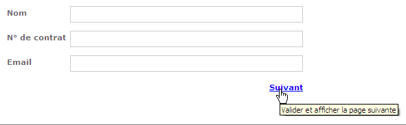

* Afficher une autre page

  L&#39;option **[!UICONTROL Activer une transition]** permet d&#39;afficher une page spécifique, associée à la transition sortante sélectionnée dans le champ **[!UICONTROL Transition]**.

  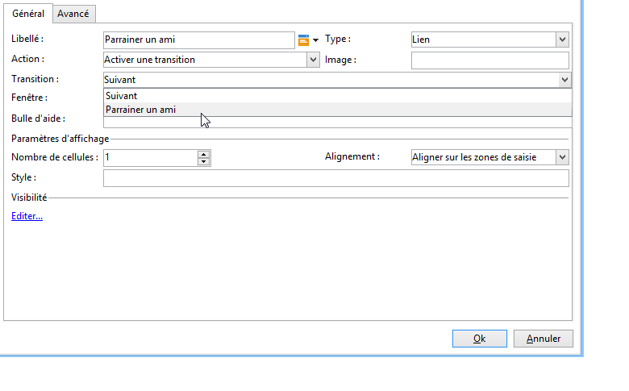

  Par défaut, une page n’a qu’une transition sortante. Pour créer de nouvelles transitions, sélectionnez la page, puis cliquez sur le bouton **[!UICONTROL Ajouter]** dans le **[!UICONTROL Transitions sortantes]** , comme illustré ci-dessous :

  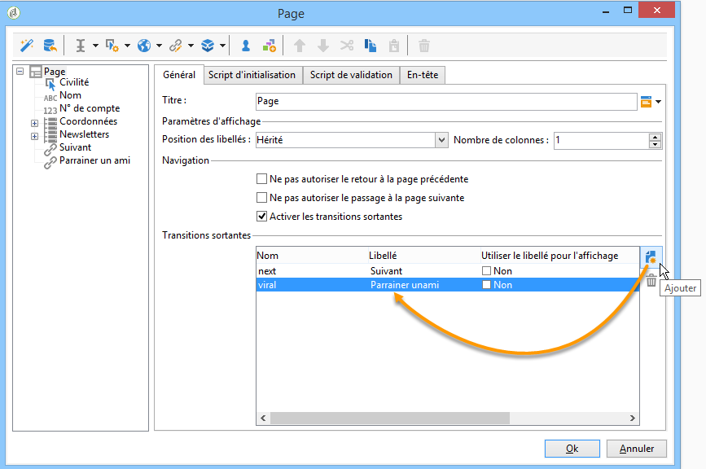

  Dans le diagramme, cet ajout sera représenté comme dans l&#39;exemple ci-dessous :

  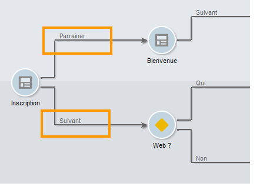

  >[!NOTE]
  >
  >Pour plus d&#39;informations sur l&#39;enchaînement des pages dans un formulaire web, voir [Définir l&#39;enchaînement des pages des formulaires web](defining-web-forms-page-sequencing.md).

### Personnaliser le contenu HTML {#personalizing-html-content}

Vous pouvez personnaliser le contenu HTML d&#39;une page de formulaire avec des données enregistrées dans une page précédente. Par exemple, vous pouvez créer un formulaire Web d&#39;assurance automobile dont la première page permet d&#39;indiquer les coordonnées et la marque du véhicule.

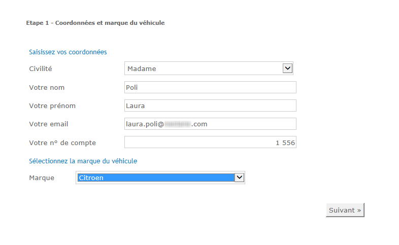

Vous pouvez réinjecter dans la page suivante le nom de l&#39;utilisateur et la marque sélectionnée en utilisant des champs de personnalisation. La syntaxe à utiliser dépend du mode de stockage des informations. Pour plus d&#39;informations, consultez la section [Utiliser les informations collectées](web-forms-answers.md#using-collected-information).

>[!NOTE]
>
>Pour des raisons de sécurité, la valeur saisie dans la formule **`<%=`** est remplacée par des caractères avec échappement.

Dans notre exemple, le nom et le prénom du destinataire sont stockés dans un champ de la base, tandis que la marque de son véhicule est stockée dans une variable. La syntaxe du message personnalisé en page 2 sera la suivante :

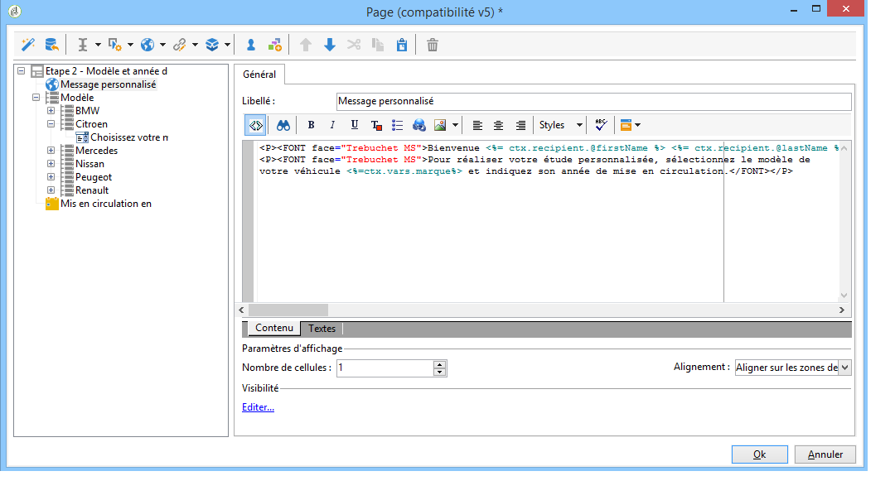

```
<P>Welcome <%= ctx.recipient.@firstName %> <%= ctx.recipient.@lastName %>,</P>
<P>To start your customized study, please select your car <%=ctx.vars.marque%> and its year of purchase.</P>
```

Le résultat sera le suivant :

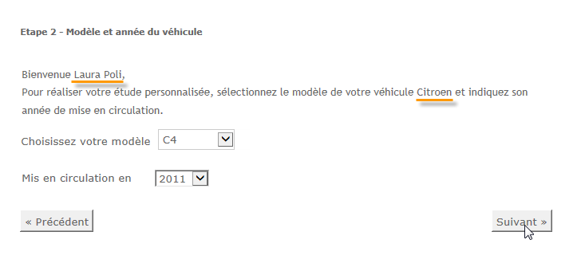

### Utiliser des variables de texte {#using-text-variables}

L&#39;onglet **[!UICONTROL Texte]** permet de créer des champs variables qui peuvent être utilisés dans le HTML entre les caractères &lt;%= et %>, avec la syntaxe suivante : **$(IDENTIFIER)**.

Utilisez cette méthode pour localiser facilement vos chaînes. Voir [Traduire un formulaire web](translating-a-web-form.md)

Par exemple, vous pouvez créer un champ **Contact** qui permettra d&#39;afficher la chaîne « Dernier contact le » dans le contenu HTML. Pour ce faire, procédez comme suit :

1. Cliquez sur l&#39;onglet **[!UICONTROL Textes]** du texte HTML.
1. Cliquez sur l&#39;icône **[!UICONTROL Ajouter]**.
1. Dans la colonne **[!UICONTROL Identifiant]**, indiquez le nom de la variable.
1. Dans la colonne **[!UICONTROL Texte]**, saisissez la valeur par défaut.

   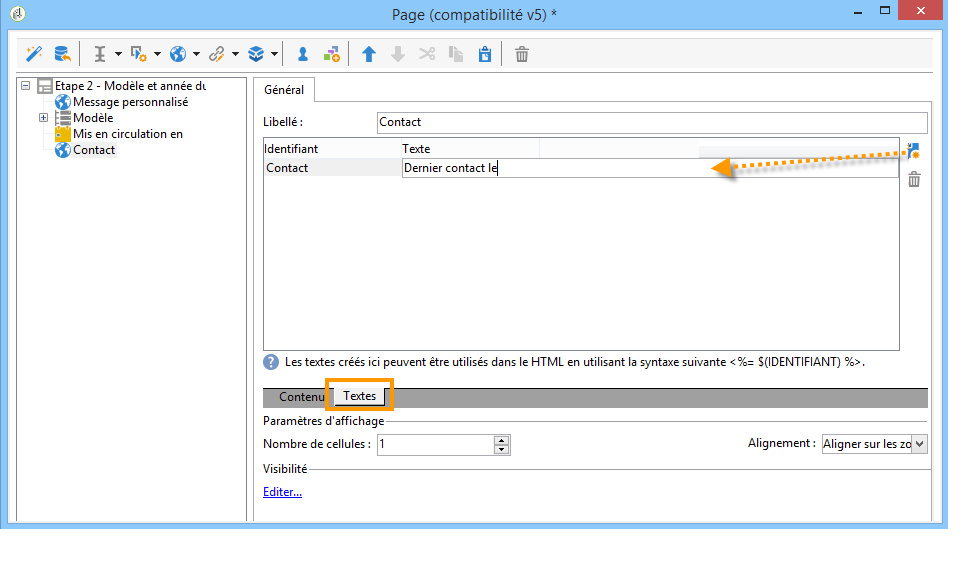

1. Dans le contenu HTML, insérez cette variable texte via la syntaxe **&lt;%= $(Contact) %>**.

   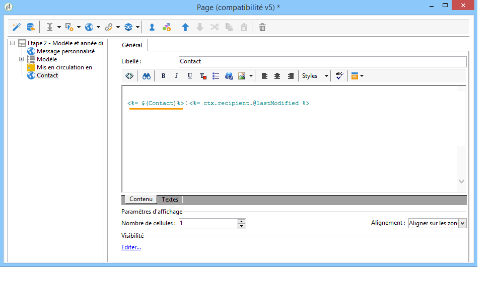

   >[!CAUTION]
   >
   >Si vous saisissez ces caractères dans l&#39;éditeur HTML, les champs **&lt;** et **>** seront remplacés par leurs caractères avec échappement. Dans ce cas, vous devez corriger le code source en cliquant sur l&#39;icône **[!UICONTROL Afficher le code source]** de l&#39;éditeur de texte HTML.

1. Ouvrez le libellé **[!UICONTROL Aperçu]** du formulaire pour afficher la valeur renseignée dans le HTML :

   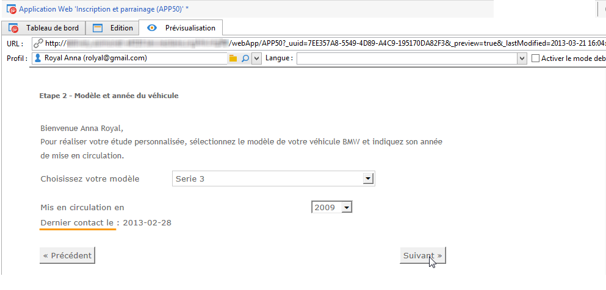

Ce mode de fonctionnement permet de définir les textes des formulaires web et d&#39;en gérer les traductions à l&#39;aide de l&#39;outil de traduction intégré. Voir à ce sujet la section [Traduire un formulaire web](translating-a-web-form.md).

## Insérer des images {#inserting-images}

Pour inclure des images dans les formulaires, elles doivent être enregistrées sur un serveur accessible depuis l&#39;extérieur.

Sélectionnez le menu **[!UICONTROL Éléments statiques]** > **[!UICONTROL Image]**.

Sélectionner la source de l&#39;image à insérer : elle peut être issue de la bibliothèque de ressources publiques ou stockée sur un serveur externe accessible de l&#39;extérieur.

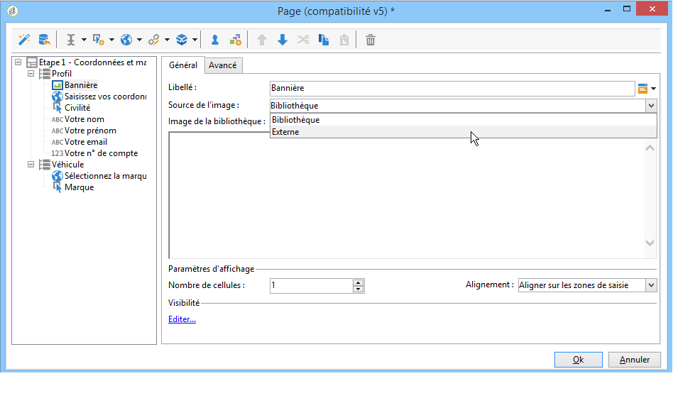

S&#39;il s&#39;agit d&#39;une image de la bibliothèque, sélectionnez-la dans la liste déroulante du champ; S&#39;il s&#39;agit d&#39;une image externe, saisissez le chemin d&#39;accès à l&#39;image à insérer. Le libellé sera affiché lorsque l&#39;utilisateur passe la souris sur l&#39;image (correspond à un champ ALT en HTML), ou lorsque l&#39;image n&#39;est pas affichée.

La section centrale de l&#39;éditeur permet de visualiser l&#39;image.
