<?xml version="1.0" encoding="UTF-8"?>
<xliff xmlns="urn:oasis:names:tc:xliff:document:1.2" xmlns:okp="okapi-framework:xliff-extensions" xmlns:its="http://www.w3.org/2005/11/its" xmlns:itsxlf="http://www.w3.org/ns/its-xliff/" version="1.2" its:version="2.0">
<file original="help/web/using/static-elements-in-a-web-form.md.mdsc" source-language="en-US" target-language="en-XX" datatype="x-text/markdown">
<body>
<trans-unit id="tu15" xml:space="preserve">
<source xml:lang="en-US">https://experienceleague.adobe.com/fr/tools/campaign-api</source>
<target xml:lang="en-XX">https://experienceleague.adobe.com/fr/tools/campaign-api</target>
</trans-unit>
<trans-unit id="tu31" xml:space="preserve">
<source xml:lang="en-US">https://www.adobe.com</source>
<target xml:lang="en-XX">https://www.adobe.com</target>
</trans-unit>
<trans-unit id="tu1" restype="x-YAML_METADATA_HEADER_VALUE" xml:space="preserve">
<source xml:lang="en-US">Static elements in a web form</source>
<target xml:lang="en-XX">Eléments statiques dans un formulaire web</target>
</trans-unit>
<trans-unit id="tu2" restype="x-YAML_METADATA_HEADER_VALUE" xml:space="preserve">
<source xml:lang="en-US">Static elements in a web form</source>
<target xml:lang="en-XX">Eléments statiques dans un formulaire web</target>
</trans-unit>
<trans-unit id="tu3" xml:space="preserve">
<source xml:lang="en-US">Also applies to v8</source>
<target xml:lang="en-XX">S’applique également à la v8.</target>
</trans-unit>
<trans-unit id="tu4" xml:space="preserve">
<source xml:lang="en-US">Also applies to Campaign v8</source>
<target xml:lang="en-XX">S’applique également à Campaign v8.</target>
</trans-unit>
<trans-unit id="tu5" xml:space="preserve">
<source xml:lang="en-US">Static elements in a web form</source>
<target xml:lang="en-XX">Eléments statiques dans un formulaire web</target>
</trans-unit>
<trans-unit id="tu6" xml:space="preserve">
<source xml:lang="en-US">You can include elements with which the user has no interaction in the pages of the form; these are static elements such as images, HTML content, a horizontal bar, or a hypertext link. These elements are created via the first button in the toolbar, by selecting <ph id="1" ctype="x-STRONG_EMPHASIS">**[!UICONTROL </ph>Static elements<ph id="3" ctype="x-LINK_REF">]**</ph>.</source>
<target xml:lang="en-XX">Vous pouvez inclure des éléments avec lesquels l’utilisateur n’a aucune interaction dans les pages du formulaire ; il s’agit d’éléments statiques tels que des images, du contenu HTML, une barre horizontale ou un lien hypertexte. Ces éléments sont créés par le premier bouton de la barre d'outils, en sélectionnant <ph id="1" ctype="x-STRONG_EMPHASIS">**[!UICONTROL </ph>Éléments statiques<ph id="3" ctype="x-LINK_REF">]**</ph>.</target>
</trans-unit>
<trans-unit id="tu7" xml:space="preserve">
<source xml:lang="en-US"><ph id="1" ctype="x-IMAGE">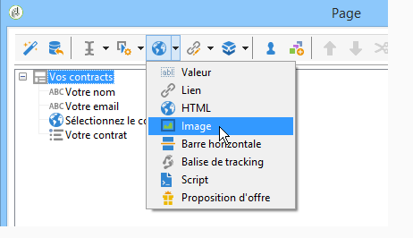</ph></source>
<target xml:lang="en-XX"><ph id="1" ctype="x-IMAGE"></ph></target>
</trans-unit>
<trans-unit id="tu8" xml:space="preserve">
<source xml:lang="en-US">The following types of field are available:</source>
<target xml:lang="en-XX">Les types de champs disponibles sont les suivants :</target>
</trans-unit>
<trans-unit id="tu9" xml:space="preserve">
<source xml:lang="en-US">Value based on previously provided answers (in the context of the form) or on the database.</source>
<target xml:lang="en-XX">Valeur issue des réponses fournies antérieurement (dans le contexte du formulaire) ou de la base de données.</target>
</trans-unit>
<trans-unit id="tu10" xml:space="preserve">
<source xml:lang="en-US">Hypertext link, HTML, horizontal bar. See <ph id="1" ctype="x-LINK">[</ph>Inserting HTML content<ph id="2" ctype="x-LINK">](#inserting-html-content)</ph>.</source>
<target xml:lang="en-XX">Lien hypertexte, HTML, barre horizontale. Voir <ph id="1" ctype="x-LINK">[</ph>Insérer du contenu HTML<ph id="2" ctype="x-LINK">](#inserting-html-content)</ph>.</target>
</trans-unit>
<trans-unit id="tu11" xml:space="preserve">
<source xml:lang="en-US">Image saved in the resource library or on a server accessible by users. See <ph id="1" ctype="x-LINK">[</ph>Inserting images<ph id="2" ctype="x-LINK">](#inserting-images)</ph>.</source>
<target xml:lang="en-XX">Image enregistrée dans la bibliothèque de ressources ou sur un serveur accessible par les utilisateurs. Voir <ph id="1" ctype="x-LINK">[</ph>Insérer des images<ph id="2" ctype="x-LINK">](#inserting-images)</ph>.</target>
</trans-unit>
<trans-unit id="tu12" xml:space="preserve">
<source xml:lang="en-US">Script executed on client side and/or server side. It must be written in JavaScript and be compatible with most browsers to ensure correct execution on the client side.</source>
<target xml:lang="en-XX">Script exécuté côté client et/ou côté serveur. Il doit être écrit en JavaScript et compatible avec la plupart des navigateurs afin d’assurer une bonne exécution côté client.</target>
</trans-unit>
<trans-unit id="tu13" xml:space="preserve">
<source xml:lang="en-US"><ph id="1" ctype="x-regxph" equiv-text="&lbrack;!NOTE">[!NOTE]</ph></source>
<target xml:lang="en-XX"><ph id="1" ctype="x-regxph" equiv-text="&lbrack;!NOTE">[!NOTE]</ph></target>
</trans-unit>
<trans-unit id="tu14" xml:space="preserve">
<source xml:lang="en-US">On the server side, the script can use the functions defined in <ph id="1" ctype="x-LINK">&lbrack;</ph>Campaign JSAPI documentation<ph id="2" ctype="x-LINK">[#$tu15]</ph>.</source>
<target xml:lang="en-XX">Côté serveur, le script peut utiliser les fonctions définies dans la <ph id="1" ctype="x-LINK">&lbrack;</ph>documentation JSAPI Campaign<ph id="2" ctype="x-LINK">[#$tu15]</ph>.</target>
</trans-unit>
<trans-unit id="tu16" xml:space="preserve">
<source xml:lang="en-US">Insert HTML content</source>
<target xml:lang="en-XX">Insérer du contenu HTML</target>
</trans-unit>
<trans-unit id="tu17" xml:space="preserve">
<source xml:lang="en-US">You can include HTML content in a form page: hypertext links, images, formatted paragraphs, videos, etc.</source>
<target xml:lang="en-XX">Vous pouvez inclure des contenus HTML dans une page de formulaire : liens hypertextes, images, paragraphes formatés, vidéos, etc.</target>
</trans-unit>
<trans-unit id="tu18" xml:space="preserve">
<source xml:lang="en-US">The HTML editor lets you enter the content to insert into the form page. To open the editor, click <ph id="1" ctype="x-STRONG_EMPHASIS">**[!UICONTROL </ph>Static elements<ph id="3" ctype="x-LINK_REF">]**</ph> > <ph id="5" ctype="x-STRONG_EMPHASIS">**[!UICONTROL </ph>HTML<ph id="7" ctype="x-LINK_REF">]**</ph> .</source>
<target xml:lang="en-XX">L'éditeur HTML vous permet de saisir le contenu à insérer dans la page du formulaire. Pour ouvrir l'éditeur, cliquez sur <ph id="1" ctype="x-STRONG_EMPHASIS">**[!UICONTROL </ph>Éléments statiques<ph id="3" ctype="x-LINK_REF">]**</ph> > <ph id="5" ctype="x-STRONG_EMPHASIS">**[!UICONTROL </ph>HTML<ph id="7" ctype="x-LINK_REF">]**</ph>.</target>
</trans-unit>
<trans-unit id="tu19" xml:space="preserve">
<source xml:lang="en-US">You can enter and format your content directly or display the source code window to paste in some external content. To switch to "source code" mode, click the first icon in the toolbar:</source>
<target xml:lang="en-XX">Vous pouvez saisir et mettre en forme directement votre contenu ou afficher la fenêtre du code source pour y coller un contenu externe. Pour basculer en mode « code source », cliquez sur la première icône de la barre d’outils :</target>
</trans-unit>
<trans-unit id="tu20" xml:space="preserve">
<source xml:lang="en-US"><ph id="1" ctype="x-IMAGE"></ph></source>
<target xml:lang="en-XX"><ph id="1" ctype="x-IMAGE"></ph></target>
</trans-unit>
<trans-unit id="tu21" xml:space="preserve">
<source xml:lang="en-US">To insert a database field, use the personalization button.</source>
<target xml:lang="en-XX">Pour insérer un champ de la base, utilisez le bouton de personnalisation.</target>
</trans-unit>
<trans-unit id="tu22" xml:space="preserve">
<source xml:lang="en-US"><ph id="1" ctype="x-IMAGE"></ph></source>
<target xml:lang="en-XX"><ph id="1" ctype="x-IMAGE"></ph></target>
</trans-unit>
<trans-unit id="tu23" xml:space="preserve">
<source xml:lang="en-US"><ph id="1" ctype="x-regxph" equiv-text="&lbrack;!NOTE">[!NOTE]</ph></source>
<target xml:lang="en-XX"><ph id="1" ctype="x-regxph" equiv-text="&lbrack;!NOTE">[!NOTE]</ph></target>
</trans-unit>
<trans-unit id="tu24" xml:space="preserve">
<source xml:lang="en-US">The strings entered in the HTML editor are only translated if they are defined in the <ph id="1" ctype="x-STRONG_EMPHASIS">**[!UICONTROL </ph>Texts<ph id="3" ctype="x-LINK_REF">]**</ph> sub-tab. Otherwise they will not be collected. For more on this, refer to <ph id="5" ctype="x-LINK">[</ph>Translating a web form<ph id="6" ctype="x-LINK">](translating-a-web-form.md)</ph>.</source>
<target xml:lang="en-XX">Les chaînes saisies dans l’éditeur HTML ne font l’objet d’une traduction que si elles sont définies dans le sous-onglet <ph id="1" ctype="x-STRONG_EMPHASIS">**[!UICONTROL </ph>Textes<ph id="3" ctype="x-LINK_REF">]**</ph>. Sinon, elles ne seront pas collectées. Voir à ce sujet la section <ph id="5" ctype="x-LINK">[</ph>Traduire un formulaire web<ph id="6" ctype="x-LINK">](translating-a-web-form.md)</ph>.</target>
</trans-unit>
<trans-unit id="tu25" xml:space="preserve">
<source xml:lang="en-US">Insert a link</source>
<target xml:lang="en-XX">Insérer un lien</target>
</trans-unit>
<trans-unit id="tu26" xml:space="preserve">
<source xml:lang="en-US">Fill in the fields in the editing window as shown in the following example:</source>
<target xml:lang="en-XX">Renseignez les champs de la fenêtre d'édition, comme dans l'exemple ci-dessous :</target>
</trans-unit>
<trans-unit id="tu27" xml:space="preserve">
<source xml:lang="en-US">To add a hypertext link, go to <ph id="1" ctype="x-STRONG_EMPHASIS">**[!UICONTROL </ph>Static elements<ph id="3" ctype="x-LINK_REF">]**</ph> > <ph id="5" ctype="x-STRONG_EMPHASIS">**[!UICONTROL </ph>Link<ph id="7" ctype="x-LINK_REF">]**</ph>.</source>
<target xml:lang="en-XX">Pour ajouter un lien hypertexte, accédez au menu <ph id="1" ctype="x-STRONG_EMPHASIS">**[!UICONTROL </ph>Éléments statiques <ph id="3" ctype="x-LINK_REF">]**</ph> > <ph id="5" ctype="x-STRONG_EMPHASIS">**[!UICONTROL </ph>Lien<ph id="7" ctype="x-LINK_REF">]**</ph>.</target>
</trans-unit>
<trans-unit id="tu28" xml:space="preserve">
<source xml:lang="en-US"><ph id="1" ctype="x-IMAGE">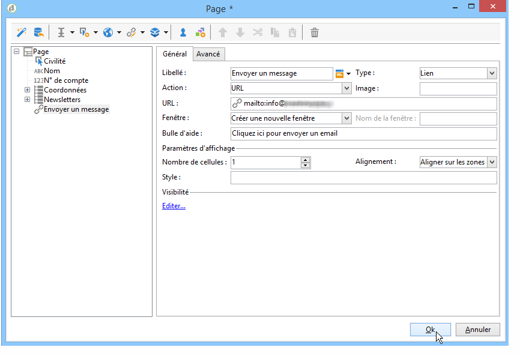</ph></source>
<target xml:lang="en-XX"><ph id="1" ctype="x-IMAGE"></ph></target>
</trans-unit>
<trans-unit id="tu29" xml:space="preserve">
<source xml:lang="en-US">The <ph id="1" ctype="x-STRONG_EMPHASIS">**[!UICONTROL </ph>Label<ph id="3" ctype="x-LINK_REF">]**</ph> is the content of the hypertext link as it will be displayed on the form page.</source>
<target xml:lang="en-XX">Le <ph id="1" ctype="x-STRONG_EMPHASIS">**[!UICONTROL </ph>Libellé<ph id="3" ctype="x-LINK_REF">]**</ph> est le contenu du lien hypertexte, tel qu'il sera affiché dans la page du formulaire.</target>
</trans-unit>
<trans-unit id="tu30" xml:space="preserve">
<source xml:lang="en-US">The <ph id="1" ctype="x-STRONG_EMPHASIS">**[!UICONTROL </ph>URL<ph id="3" ctype="x-LINK_REF">]**</ph> is the desired address, e.g.: <ph id="5" ctype="x-LINK">&lbrack;</ph>https://www.adobe.com<ph id="6" ctype="x-LINK">[#$tu31]</ph> for a website, or <ph id="7" ctype="x-LINK">[</ph>info@adobe.com<ph id="8" ctype="x-LINK">](mailto:info@adobe.com)</ph> to send a message.</source>
<target xml:lang="en-XX">L'<ph id="1" ctype="x-STRONG_EMPHASIS">**[!UICONTROL </ph>URL<ph id="3" ctype="x-LINK_REF">]**</ph> correspond à l'adresse visée, par exemple : <ph id="5" ctype="x-LINK">&lbrack;</ph>https://www.adobe.com<ph id="6" ctype="x-LINK">[#$tu31]</ph> pour un site web ou <ph id="7" ctype="x-LINK">[</ph>info@adobe.com<ph id="8" ctype="x-LINK">](mailto:info@adobe.com)</ph> pour envoyer un message.</target>
</trans-unit>
<trans-unit id="tu32" xml:space="preserve">
<source xml:lang="en-US">The <ph id="1" ctype="x-STRONG_EMPHASIS">**[!UICONTROL </ph>Window<ph id="3" ctype="x-LINK_REF">]**</ph> field lets you select the display mode for the link in the case of a site. You can decide to open the link in a new window, the current window, or another window.</source>
<target xml:lang="en-XX">Le champ <ph id="1" ctype="x-STRONG_EMPHASIS">**[!UICONTROL </ph>Fenêtre<ph id="3" ctype="x-LINK_REF">]**</ph> vous permet de sélectionner le mode d’affichage du lien, lorsqu’il s’agit d’un site. Vous pouvez choisir d’ouvrir le lien dans une nouvelle fenêtre, dans la fenêtre actuelle ou dans une autre fenêtre.</target>
</trans-unit>
<trans-unit id="tu33" xml:space="preserve">
<source xml:lang="en-US">You can add a ToolTip, as shown below:</source>
<target xml:lang="en-XX">Vous pouvez ajouter une bulle d'aide, comme dans l'exemple ci-dessous :</target>
</trans-unit>
<trans-unit id="tu34" xml:space="preserve">
<source xml:lang="en-US"><ph id="1" ctype="x-IMAGE">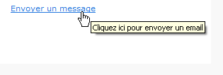</ph></source>
<target xml:lang="en-XX"><ph id="1" ctype="x-IMAGE"></ph></target>
</trans-unit>
<trans-unit id="tu35" xml:space="preserve">
<source xml:lang="en-US">You can choose to display the link as a button or an image. To do this, select the type of display in the <ph id="1" ctype="x-STRONG_EMPHASIS">**[!UICONTROL </ph>Type<ph id="3" ctype="x-LINK_REF">]**</ph> field.</source>
<target xml:lang="en-XX">Vous pouvez choisir d'afficher le lien sous forme de bouton ou d'image. Pour cela, sélectionnez l'affichage dans le champ <ph id="1" ctype="x-STRONG_EMPHASIS">**[!UICONTROL </ph>Type<ph id="3" ctype="x-LINK_REF">]**</ph>.</target>
</trans-unit>
<trans-unit id="tu36" xml:space="preserve">
<source xml:lang="en-US">Types of links</source>
<target xml:lang="en-XX">Types de liens</target>
</trans-unit>
<trans-unit id="tu37" xml:space="preserve">
<source xml:lang="en-US">By default, the links are associated with a URL-type action, so that a link destination address can be entered in the URL field.</source>
<target xml:lang="en-XX">Par défaut, les liens sont associés à une action de type URL, qui permettent de saisir une adresse de destination du lien dans le champ URL.</target>
</trans-unit>
<trans-unit id="tu38" xml:space="preserve">
<source xml:lang="en-US"><ph id="1" ctype="x-IMAGE">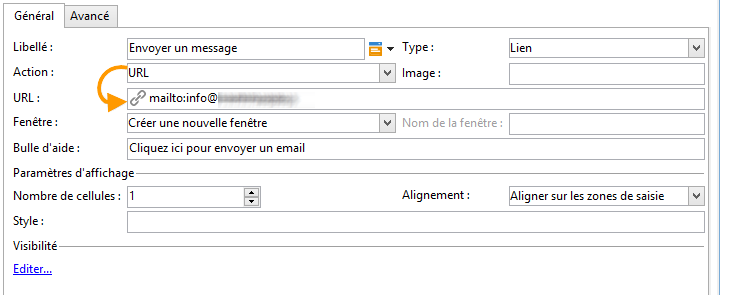</ph></source>
<target xml:lang="en-XX"><ph id="1" ctype="x-IMAGE"></ph></target>
</trans-unit>
<trans-unit id="tu39" xml:space="preserve">
<source xml:lang="en-US">You can define other actions for the link, so that the user can click the link to do the following:</source>
<target xml:lang="en-XX">Vous pouvez définir d'autres actions pour le lien. Ainsi, lorsque l'utilisateur clique sur le lien, il peut :</target>
</trans-unit>
<trans-unit id="tu40" xml:space="preserve">
<source xml:lang="en-US">Refresh the page</source>
<target xml:lang="en-XX">Actualiser la page</target>
</trans-unit>
<trans-unit id="tu41" xml:space="preserve">
<source xml:lang="en-US">To do this, select the <ph id="1" ctype="x-STRONG_EMPHASIS">**[!UICONTROL </ph>Refresh page<ph id="3" ctype="x-LINK_REF">]**</ph> option in the drop-down box of the <ph id="5" ctype="x-STRONG_EMPHASIS">**[!UICONTROL </ph>Action<ph id="7" ctype="x-LINK_REF">]**</ph> field.</source>
<target xml:lang="en-XX">Pour cela, sélectionnez l'option <ph id="1" ctype="x-STRONG_EMPHASIS">**[!UICONTROL </ph>Actualiser la page<ph id="3" ctype="x-LINK_REF">]**</ph> dans la liste déroulante du champ <ph id="5" ctype="x-STRONG_EMPHASIS">**[!UICONTROL </ph>Action<ph id="7" ctype="x-LINK_REF">]**</ph>.</target>
</trans-unit>
<trans-unit id="tu42" xml:space="preserve">
<source xml:lang="en-US"><ph id="1" ctype="x-IMAGE">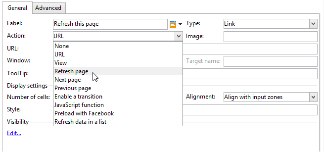</ph></source>
<target xml:lang="en-XX"><ph id="1" ctype="x-IMAGE"></ph></target>
</trans-unit>
<trans-unit id="tu43" xml:space="preserve">
<source xml:lang="en-US">Display the next/previous page</source>
<target xml:lang="en-XX">Afficher la page suivante / précédente</target>
</trans-unit>
<trans-unit id="tu44" xml:space="preserve">
<source xml:lang="en-US">To do this, select the <ph id="1" ctype="x-STRONG_EMPHASIS">**[!UICONTROL </ph>Next page<ph id="3" ctype="x-LINK_REF">]**</ph> or <ph id="5" ctype="x-STRONG_EMPHASIS">**[!UICONTROL </ph>Previous page<ph id="7" ctype="x-LINK_REF">]**</ph> option in the drop-down box of the <ph id="9" ctype="x-STRONG_EMPHASIS">**[!UICONTROL </ph>Action<ph id="11" ctype="x-LINK_REF">]**</ph> field.</source>
<target xml:lang="en-XX">Pour cela, sélectionnez l'option <ph id="1" ctype="x-STRONG_EMPHASIS">**[!UICONTROL </ph>Page suivante<ph id="3" ctype="x-LINK_REF">]**</ph> ou <ph id="5" ctype="x-STRONG_EMPHASIS">**[!UICONTROL </ph>Page précédente<ph id="7" ctype="x-LINK_REF">]**</ph> dans la liste déroulante du champ <ph id="9" ctype="x-STRONG_EMPHASIS">**[!UICONTROL </ph>Action<ph id="11" ctype="x-LINK_REF">]**</ph>.</target>
</trans-unit>
<trans-unit id="tu45" xml:space="preserve">
<source xml:lang="en-US"><ph id="1" ctype="x-IMAGE">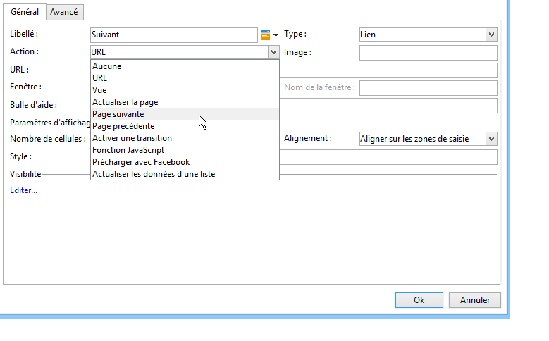</ph></source>
<target xml:lang="en-XX"><ph id="1" ctype="x-IMAGE"></ph></target>
</trans-unit>
<trans-unit id="tu46" xml:space="preserve">
<source xml:lang="en-US">You can hide the <ph id="1" ctype="x-STRONG_EMPHASIS">**[!UICONTROL </ph>Next<ph id="3" ctype="x-LINK_REF">]**</ph> and/or <ph id="5" ctype="x-STRONG_EMPHASIS">**[!UICONTROL </ph>Back<ph id="7" ctype="x-LINK_REF">]**</ph> buttons if they are to be replaced by a link. Refer to this <ph id="9" ctype="x-LINK">[</ph>page<ph id="10" ctype="x-LINK">](defining-web-forms-page-sequencing.md)</ph>.</source>
<target xml:lang="en-XX">Vous pouvez masquer les boutons <ph id="1" ctype="x-STRONG_EMPHASIS">**[!UICONTROL </ph>Suivant<ph id="3" ctype="x-LINK_REF">]**</ph> et/ou <ph id="5" ctype="x-STRONG_EMPHASIS">**[!UICONTROL </ph>Précédent<ph id="7" ctype="x-LINK_REF">]**</ph> si un lien est destiné à les remplacer. Voir cette <ph id="9" ctype="x-LINK">[</ph>page<ph id="10" ctype="x-LINK">](defining-web-forms-page-sequencing.md)</ph>.</target>
</trans-unit>
<trans-unit id="tu47" xml:space="preserve">
<source xml:lang="en-US">The link will replace the <ph id="1" ctype="x-STRONG_EMPHASIS">**[!UICONTROL </ph>Next<ph id="3" ctype="x-LINK_REF">]**</ph> button used by default.</source>
<target xml:lang="en-XX">Ainsi, le lien paramétré remplacera le bouton <ph id="1" ctype="x-STRONG_EMPHASIS">**[!UICONTROL </ph>Suivant<ph id="3" ctype="x-LINK_REF">]**</ph> utilisé par défaut.</target>
</trans-unit>
<trans-unit id="tu48" xml:space="preserve">
<source xml:lang="en-US"><ph id="1" ctype="x-IMAGE">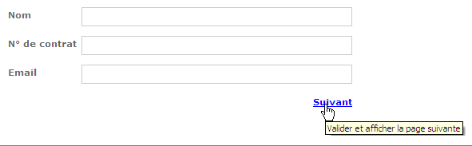</ph></source>
<target xml:lang="en-XX"><ph id="1" ctype="x-IMAGE"></ph></target>
</trans-unit>
<trans-unit id="tu49" xml:space="preserve">
<source xml:lang="en-US">Display another page</source>
<target xml:lang="en-XX">Afficher une autre page</target>
</trans-unit>
<trans-unit id="tu50" xml:space="preserve">
<source xml:lang="en-US">The <ph id="1" ctype="x-STRONG_EMPHASIS">**[!UICONTROL </ph>Enable a transition<ph id="3" ctype="x-LINK_REF">]**</ph> option lets you display a specific page associated with the outgoing transition selected in the <ph id="5" ctype="x-STRONG_EMPHASIS">**[!UICONTROL </ph>Transition<ph id="7" ctype="x-LINK_REF">]**</ph> field.</source>
<target xml:lang="en-XX">L'option <ph id="1" ctype="x-STRONG_EMPHASIS">**[!UICONTROL </ph>Activer une transition<ph id="3" ctype="x-LINK_REF">]**</ph> permet d'afficher une page spécifique, associée à la transition sortante sélectionnée dans le champ <ph id="5" ctype="x-STRONG_EMPHASIS">**[!UICONTROL </ph>Transition<ph id="7" ctype="x-LINK_REF">]**</ph>.</target>
</trans-unit>
<trans-unit id="tu51" xml:space="preserve">
<source xml:lang="en-US"><ph id="1" ctype="x-IMAGE">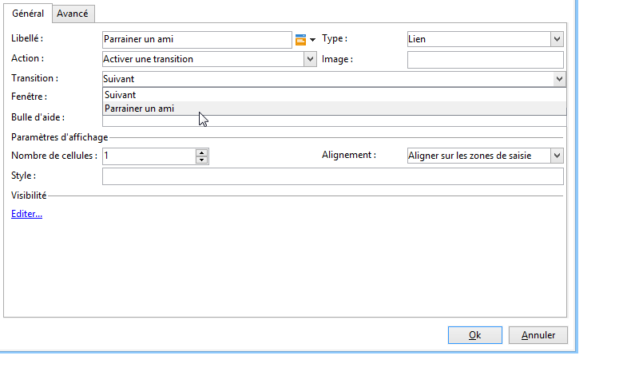</ph></source>
<target xml:lang="en-XX"><ph id="1" ctype="x-IMAGE"></ph></target>
</trans-unit>
<trans-unit id="tu52" xml:space="preserve">
<source xml:lang="en-US">By default, a page has only one output transition. To create new transitions, select the page and then click the <ph id="1" ctype="x-STRONG_EMPHASIS">**[!UICONTROL </ph>Add<ph id="3" ctype="x-LINK_REF">]**</ph> button in the <ph id="5" ctype="x-STRONG_EMPHASIS">**[!UICONTROL </ph>Output transitions<ph id="7" ctype="x-LINK_REF">]**</ph> section, as shown below:</source>
<target xml:lang="en-XX">Par défaut, une page ne comporte qu’une seule transition sortante. Pour créer de nouvelles transitions, sélectionnez la page, puis cliquez sur le bouton <ph id="1" ctype="x-STRONG_EMPHASIS">**[!UICONTROL </ph>Ajouter<ph id="3" ctype="x-LINK_REF">]**</ph> dans la section <ph id="5" ctype="x-STRONG_EMPHASIS">**[!UICONTROL </ph>Transitions sortantes<ph id="7" ctype="x-LINK_REF">]**</ph>, comme illustré ci-dessous :</target>
</trans-unit>
<trans-unit id="tu53" xml:space="preserve">
<source xml:lang="en-US"><ph id="1" ctype="x-IMAGE">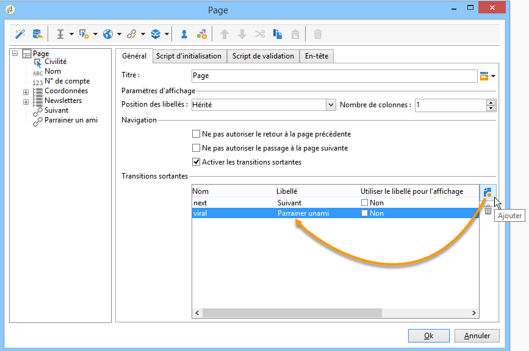</ph></source>
<target xml:lang="en-XX"><ph id="1" ctype="x-IMAGE"></ph></target>
</trans-unit>
<trans-unit id="tu54" xml:space="preserve">
<source xml:lang="en-US">In the diagram, this addition will look like this:</source>
<target xml:lang="en-XX">Dans le diagramme, cet ajout sera représenté comme dans l'exemple ci-dessous :</target>
</trans-unit>
<trans-unit id="tu55" xml:space="preserve">
<source xml:lang="en-US"><ph id="1" ctype="x-IMAGE">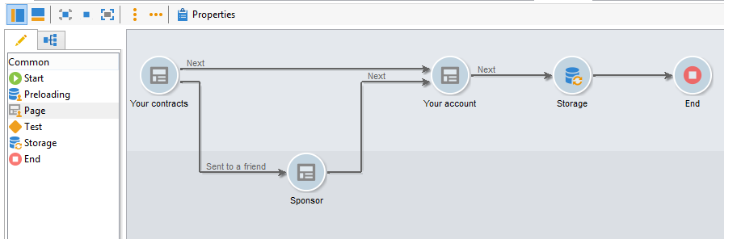</ph></source>
<target xml:lang="en-XX"><ph id="1" ctype="x-IMAGE"></ph></target>
</trans-unit>
<trans-unit id="tu56" xml:space="preserve">
<source xml:lang="en-US"><ph id="1" ctype="x-regxph" equiv-text="&lbrack;!NOTE">[!NOTE]</ph></source>
<target xml:lang="en-XX"><ph id="1" ctype="x-regxph" equiv-text="&lbrack;!NOTE">[!NOTE]</ph></target>
</trans-unit>
<trans-unit id="tu57" xml:space="preserve">
<source xml:lang="en-US">For more on page sequencing in a Web form, refer to <ph id="1" ctype="x-LINK">[</ph>Defining web forms page sequencing<ph id="2" ctype="x-LINK">](defining-web-forms-page-sequencing.md)</ph>.</source>
<target xml:lang="en-XX">Pour plus d'informations sur l'enchaînement des pages dans un formulaire web, voir <ph id="1" ctype="x-LINK">[</ph>Définir l'enchaînement des pages des formulaires web<ph id="2" ctype="x-LINK">](defining-web-forms-page-sequencing.md)</ph>.</target>
</trans-unit>
<trans-unit id="tu58" xml:space="preserve">
<source xml:lang="en-US">Personalize HTML content</source>
<target xml:lang="en-XX">Personnaliser le contenu HTML</target>
</trans-unit>
<trans-unit id="tu59" xml:space="preserve">
<source xml:lang="en-US">You can personalize the HTML content of a form page with data recorded in a previous page. For example, you can create a car insurance Web form whose first page lets you provide contact information and the brand of the car.</source>
<target xml:lang="en-XX">Vous pouvez personnaliser le contenu HTML d’une page de formulaire avec des données enregistrées dans une page précédente. Par exemple, vous pouvez créer un formulaire web d’assurance automobile dont la première page permet d’indiquer les coordonnées et la marque du véhicule.</target>
</trans-unit>
<trans-unit id="tu60" xml:space="preserve">
<source xml:lang="en-US"><ph id="1" ctype="x-IMAGE">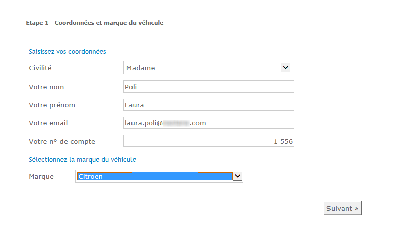</ph></source>
<target xml:lang="en-XX"><ph id="1" ctype="x-IMAGE"></ph></target>
</trans-unit>
<trans-unit id="tu61" xml:space="preserve">
<source xml:lang="en-US">Use personalization fields to re-inject the user name and selected brand into the next page. The syntax to use depends on the information storage mode. For more on this, refer to <ph id="1" ctype="x-LINK">[</ph>Using collected information<ph id="2" ctype="x-LINK">](web-forms-answers.md#using-collected-information)</ph>.</source>
<target xml:lang="en-XX">Utilisez des champs de personnalisation pour réinjecter dans la page suivante le nom de l’utilisateur ou de l’utilisatrice et la marque sélectionnée. La syntaxe à utiliser dépend du mode de stockage des informations. Pour plus d'informations, consultez la section <ph id="1" ctype="x-LINK">[</ph>Utiliser les informations collectées<ph id="2" ctype="x-LINK">](web-forms-answers.md#using-collected-information)</ph>.</target>
</trans-unit>
<trans-unit id="tu62" xml:space="preserve">
<source xml:lang="en-US"><ph id="1" ctype="x-regxph" equiv-text="&lbrack;!NOTE">[!NOTE]</ph></source>
<target xml:lang="en-XX"><ph id="1" ctype="x-regxph" equiv-text="&lbrack;!NOTE">[!NOTE]</ph></target>
</trans-unit>
<trans-unit id="tu63" xml:space="preserve">
<source xml:lang="en-US">For security reasons, the value entered in the <ph id="1" ctype="x-STRONG_EMPHASIS">**`&lt;%=`**</ph> formula is replaced with escaped characters.</source>
<target xml:lang="en-XX">Pour des raisons de sécurité, la valeur saisie dans la formule <ph id="1" ctype="x-STRONG_EMPHASIS">**`&lt;%=`**</ph> est remplacée par des caractères avec échappement.</target>
</trans-unit>
<trans-unit id="tu64" xml:space="preserve">
<source xml:lang="en-US">In our example, the first and last name of the recipient are stored in a field of the database, while the brand of their car is stored in a variable. The syntax of the message personalized on page 2 will be as follows:</source>
<target xml:lang="en-XX">Dans notre exemple, le nom et le prénom de la personne destinataire sont stockés dans un champ de la base de données, tandis que la marque de son véhicule est stockée dans une variable. La syntaxe du message personnalisé en page 2 sera la suivante :</target>
</trans-unit>
<trans-unit id="tu65" xml:space="preserve">
<source xml:lang="en-US"><ph id="1" ctype="x-IMAGE">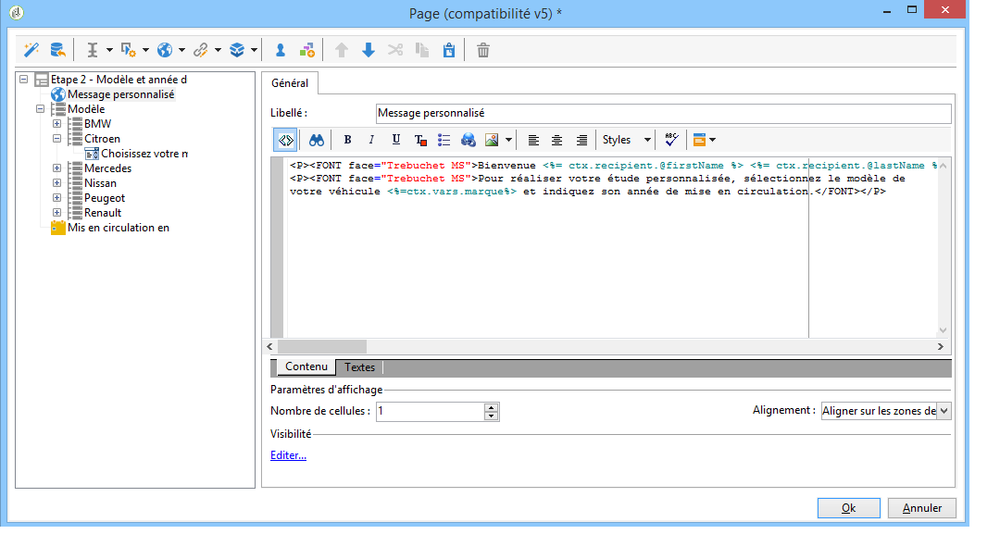</ph></source>
<target xml:lang="en-XX"><ph id="1" ctype="x-IMAGE"></ph></target>
</trans-unit>
<trans-unit id="tu66" xml:space="preserve">
<source xml:lang="en-US">This produces the following result:</source>
<target xml:lang="en-XX">Le résultat sera le suivant :</target>
</trans-unit>
<trans-unit id="tu67" xml:space="preserve">
<source xml:lang="en-US"><ph id="1" ctype="x-IMAGE">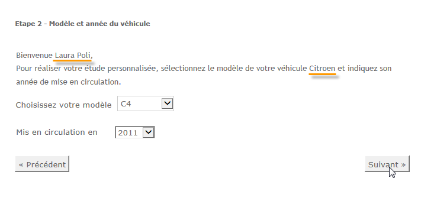</ph></source>
<target xml:lang="en-XX"><ph id="1" ctype="x-IMAGE"></ph></target>
</trans-unit>
<trans-unit id="tu68" xml:space="preserve">
<source xml:lang="en-US">Use text variables</source>
<target xml:lang="en-XX">Utiliser des variables de texte</target>
</trans-unit>
<trans-unit id="tu69" xml:space="preserve">
<source xml:lang="en-US">The <ph id="1" ctype="x-STRONG_EMPHASIS">**[!UICONTROL </ph>Text<ph id="3" ctype="x-LINK_REF">]**</ph> tab lets you create variable fields which can be used in the HTML between the &lt;%= and %> characters with the following syntax: <ph id="5" ctype="x-STRONG_EMPHASIS">**</ph>$(IDENTIFIER)<ph id="6" ctype="x-STRONG_EMPHASIS">**</ph>.</source>
<target xml:lang="en-XX">L'onglet <ph id="1" ctype="x-STRONG_EMPHASIS">**[!UICONTROL </ph>Texte<ph id="3" ctype="x-LINK_REF">]**</ph> permet de créer des champs variables qui peuvent être utilisés dans le HTML entre les caractères &lt;%= et %>, avec la syntaxe suivante : <ph id="5" ctype="x-STRONG_EMPHASIS">**</ph>$(IDENTIFIER)<ph id="6" ctype="x-STRONG_EMPHASIS">**</ph>.</target>
</trans-unit>
<trans-unit id="tu70" xml:space="preserve">
<source xml:lang="en-US">Use this method to easily have your strings localized. See <ph id="1" ctype="x-LINK">[</ph>Translating a web form<ph id="2" ctype="x-LINK">](translating-a-web-form.md)</ph></source>
<target xml:lang="en-XX">Utilisez cette méthode pour localiser facilement vos chaînes. Voir <ph id="1" ctype="x-LINK">[</ph>Traduire un formulaire web<ph id="2" ctype="x-LINK">](translating-a-web-form.md)</ph></target>
</trans-unit>
<trans-unit id="tu71" xml:space="preserve">
<source xml:lang="en-US">For example, you can create a <ph id="1" ctype="x-STRONG_EMPHASIS">**</ph>Contact<ph id="2" ctype="x-STRONG_EMPHASIS">**</ph> field that will enable you to display the "Date of last contact:" string to the HTML content. To do this, follow the steps below:</source>
<target xml:lang="en-XX">Par exemple, vous pouvez créer un champ <ph id="1" ctype="x-STRONG_EMPHASIS">**</ph>Contact<ph id="2" ctype="x-STRONG_EMPHASIS">**</ph> qui permettra d'afficher la chaîne « Dernier contact le » dans le contenu HTML. Pour ce faire, procédez comme suit :</target>
</trans-unit>
<trans-unit id="tu72" xml:space="preserve">
<source xml:lang="en-US">Click on the <ph id="1" ctype="x-STRONG_EMPHASIS">**[!UICONTROL </ph>Text<ph id="3" ctype="x-LINK_REF">]**</ph> tab of the HTML text.</source>
<target xml:lang="en-XX">Cliquez sur l'onglet <ph id="1" ctype="x-STRONG_EMPHASIS">**[!UICONTROL </ph>Textes<ph id="3" ctype="x-LINK_REF">]**</ph> du texte HTML.</target>
</trans-unit>
<trans-unit id="tu73" xml:space="preserve">
<source xml:lang="en-US">Click the <ph id="1" ctype="x-STRONG_EMPHASIS">**[!UICONTROL </ph>Add<ph id="3" ctype="x-LINK_REF">]**</ph> icon.</source>
<target xml:lang="en-XX">Cliquez sur l'icône <ph id="1" ctype="x-STRONG_EMPHASIS">**[!UICONTROL </ph>Ajouter<ph id="3" ctype="x-LINK_REF">]**</ph>.</target>
</trans-unit>
<trans-unit id="tu74" xml:space="preserve">
<source xml:lang="en-US">In the <ph id="1" ctype="x-STRONG_EMPHASIS">**[!UICONTROL </ph>Identifier<ph id="3" ctype="x-LINK_REF">]**</ph> column, enter the name of the variable</source>
<target xml:lang="en-XX">Dans la colonne <ph id="1" ctype="x-STRONG_EMPHASIS">**[!UICONTROL </ph>Identifiant<ph id="3" ctype="x-LINK_REF">]**</ph>, indiquez le nom de la variable.</target>
</trans-unit>
<trans-unit id="tu75" xml:space="preserve">
<source xml:lang="en-US">In the <ph id="1" ctype="x-STRONG_EMPHASIS">**[!UICONTROL </ph>Text<ph id="3" ctype="x-LINK_REF">]**</ph> column, enter the default value.</source>
<target xml:lang="en-XX">Dans la colonne <ph id="1" ctype="x-STRONG_EMPHASIS">**[!UICONTROL </ph>Texte<ph id="3" ctype="x-LINK_REF">]**</ph>, saisissez la valeur par défaut.</target>
</trans-unit>
<trans-unit id="tu76" xml:space="preserve">
<source xml:lang="en-US"><ph id="1" ctype="x-IMAGE">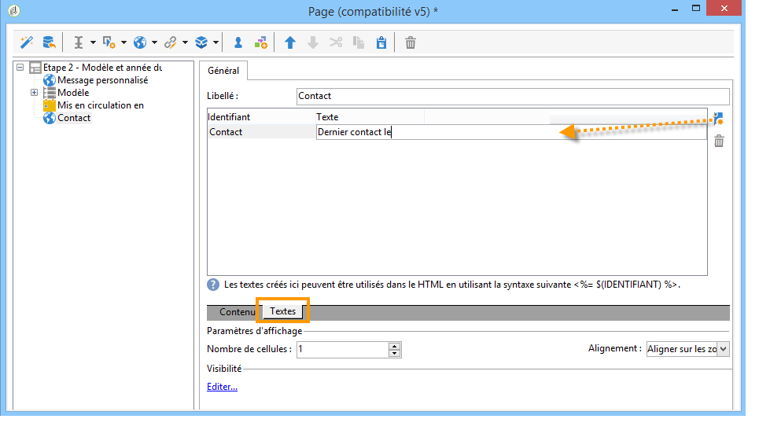</ph></source>
<target xml:lang="en-XX"><ph id="1" ctype="x-IMAGE"></ph></target>
</trans-unit>
<trans-unit id="tu77" xml:space="preserve">
<source xml:lang="en-US">In the HTML content, insert this text variable via the <ph id="1" ctype="x-STRONG_EMPHASIS">**</ph>&lt;%= $(Contact) %><ph id="2" ctype="x-STRONG_EMPHASIS">**</ph> syntax.</source>
<target xml:lang="en-XX">Dans le contenu HTML, insérez cette variable texte via la syntaxe <ph id="1" ctype="x-STRONG_EMPHASIS">**</ph>&lt;%= $(Contact) %><ph id="2" ctype="x-STRONG_EMPHASIS">**</ph>.</target>
</trans-unit>
<trans-unit id="tu78" xml:space="preserve">
<source xml:lang="en-US"><ph id="1" ctype="x-IMAGE"></ph></source>
<target xml:lang="en-XX"><ph id="1" ctype="x-IMAGE"></ph></target>
</trans-unit>
<trans-unit id="tu79" xml:space="preserve">
<source xml:lang="en-US"><ph id="1" ctype="x-regxph" equiv-text="&lbrack;!CAUTION">[!CAUTION]</ph></source>
<target xml:lang="en-XX"><ph id="1" ctype="x-regxph" equiv-text="&lbrack;!CAUTION">[!CAUTION]</ph></target>
</trans-unit>
<trans-unit id="tu80" xml:space="preserve">
<source xml:lang="en-US">If you enter these characters in the HTML editor, the <ph id="1" ctype="x-STRONG_EMPHASIS">**</ph>&lt;<ph id="2" ctype="x-STRONG_EMPHASIS">**</ph> and <ph id="3" ctype="x-STRONG_EMPHASIS">**</ph>><ph id="4" ctype="x-STRONG_EMPHASIS">**</ph> fields will be replaced with their escaped characters. In this case, you need to correct the source code by clicking the <ph id="5" ctype="x-STRONG_EMPHASIS">**[!UICONTROL </ph>Display source code<ph id="7" ctype="x-LINK_REF">]**</ph> icon of the HTML text editor.</source>
<target xml:lang="en-XX">Si vous saisissez ces caractères dans l'éditeur HTML, les champs <ph id="1" ctype="x-STRONG_EMPHASIS">**</ph>&lt;<ph id="2" ctype="x-STRONG_EMPHASIS">**</ph> et <ph id="3" ctype="x-STRONG_EMPHASIS">**</ph>><ph id="4" ctype="x-STRONG_EMPHASIS">**</ph> seront remplacés par leurs caractères avec échappement. Dans ce cas, vous devez corriger le code source en cliquant sur l'icône <ph id="5" ctype="x-STRONG_EMPHASIS">**[!UICONTROL </ph>Afficher le code source<ph id="7" ctype="x-LINK_REF">]**</ph> de l'éditeur de texte HTML.</target>
</trans-unit>
<trans-unit id="tu81" xml:space="preserve">
<source xml:lang="en-US">Open the <ph id="1" ctype="x-STRONG_EMPHASIS">**[!UICONTROL </ph>Preview<ph id="3" ctype="x-LINK_REF">]**</ph> label of the form to view the value entered in the HTML:</source>
<target xml:lang="en-XX">Ouvrez le libellé <ph id="1" ctype="x-STRONG_EMPHASIS">**[!UICONTROL </ph>Aperçu<ph id="3" ctype="x-LINK_REF">]**</ph> du formulaire pour afficher la valeur renseignée dans le HTML :</target>
</trans-unit>
<trans-unit id="tu82" xml:space="preserve">
<source xml:lang="en-US"><ph id="1" ctype="x-IMAGE">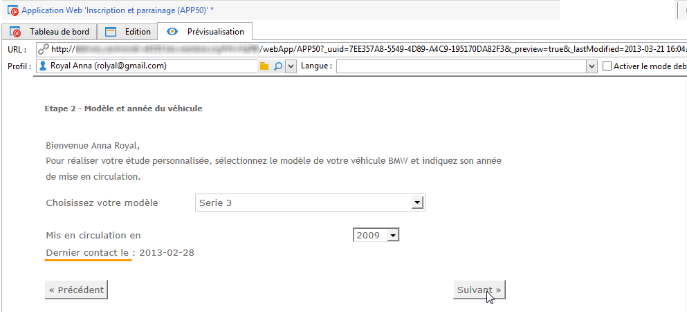</ph></source>
<target xml:lang="en-XX"><ph id="1" ctype="x-IMAGE"></ph></target>
</trans-unit>
<trans-unit id="tu83" xml:space="preserve">
<source xml:lang="en-US">This operating mode lets you define the text of Web forms only once, and manage translations using the integrated translation tool. For more on this, refer to <ph id="1" ctype="x-LINK">[</ph>Translating a web form<ph id="2" ctype="x-LINK">](translating-a-web-form.md)</ph>.</source>
<target xml:lang="en-XX">Ce mode de fonctionnement permet de définir les textes des formulaires web et d'en gérer les traductions à l'aide de l'outil de traduction intégré. Voir à ce sujet la section <ph id="1" ctype="x-LINK">[</ph>Traduire un formulaire web<ph id="2" ctype="x-LINK">](translating-a-web-form.md)</ph>.</target>
</trans-unit>
<trans-unit id="tu84" xml:space="preserve">
<source xml:lang="en-US">Insert images</source>
<target xml:lang="en-XX">Insérer des images</target>
</trans-unit>
<trans-unit id="tu85" xml:space="preserve">
<source xml:lang="en-US">For images to be included in forms, they must be saved on a server that is accessible from outside.</source>
<target xml:lang="en-XX">Pour inclure des images dans les formulaires, elles doivent être enregistrées sur un serveur accessible depuis l'extérieur.</target>
</trans-unit>
<trans-unit id="tu86" xml:space="preserve">
<source xml:lang="en-US">Select the <ph id="1" ctype="x-STRONG_EMPHASIS">**[!UICONTROL </ph>Static elements<ph id="3" ctype="x-LINK_REF">]**</ph> > <ph id="5" ctype="x-STRONG_EMPHASIS">**[!UICONTROL </ph>Image<ph id="7" ctype="x-LINK_REF">]**</ph> menu.</source>
<target xml:lang="en-XX">Sélectionnez le menu <ph id="1" ctype="x-STRONG_EMPHASIS">**[!UICONTROL </ph>Éléments statiques<ph id="3" ctype="x-LINK_REF">]**</ph> > <ph id="5" ctype="x-STRONG_EMPHASIS">**[!UICONTROL </ph>Image<ph id="7" ctype="x-LINK_REF">]**</ph>.</target>
</trans-unit>
<trans-unit id="tu87" xml:space="preserve">
<source xml:lang="en-US">Select the source of the image to be inserted: it can come from the public resource library or be stored on an external server accessible from outside.</source>
<target xml:lang="en-XX">Sélectionner la source de l'image à insérer : elle peut être issue de la bibliothèque de ressources publiques ou stockée sur un serveur externe accessible de l'extérieur.</target>
</trans-unit>
<trans-unit id="tu88" xml:space="preserve">
<source xml:lang="en-US"><ph id="1" ctype="x-IMAGE"></ph></source>
<target xml:lang="en-XX"><ph id="1" ctype="x-IMAGE"></ph></target>
</trans-unit>
<trans-unit id="tu89" xml:space="preserve">
<source xml:lang="en-US">If this is an image from the library, select it in the combo-box of the field; if it is located in an external file, enter the access path. The label will be displayed by passing the cursor over the image (coincides with an ALT field in HTML), or when the image isn't displayed.</source>
<target xml:lang="en-XX">S’il s’agit d’une image de la bibliothèque, sélectionnez-la dans la liste déroulante du champ. S’il s’agit d’une image externe, saisissez le chemin d’accès à l’image à insérer. Le libellé sera affiché lorsque l’utilisateur ou l’utilisatrice passe le curseur sur l’image (correspond à un champ ALT en HTML), ou lorsque l’image n’est pas affichée.</target>
</trans-unit>
<trans-unit id="tu90" xml:space="preserve">
<source xml:lang="en-US">The image can be viewed in the central section of the editor.</source>
<target xml:lang="en-XX">La section centrale de l'éditeur permet de visualiser l'image.</target>
</trans-unit>
</body>
</file>
</xliff>