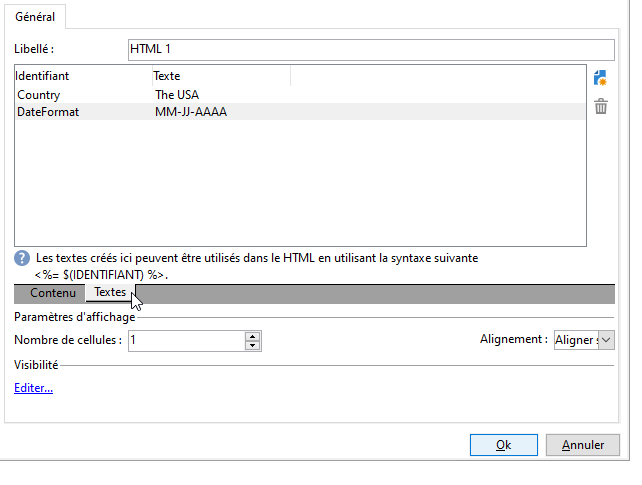

# Eléments statiques dans un formulaire web{#static-elements-in-a-web-form}

Vous pouvez inclure des éléments avec lesquels l’utilisateur n’a aucune interaction dans les pages du formulaire ; il s’agit d’éléments statiques tels que des images, du contenu HTML, d’une barre horizontale ou d’un lien hypertexte. Ces éléments sont créés par le premier bouton de la barre d’outils, en cliquant sur le **[!UICONTROL Add static element]** menu.


Les types de champs disponibles sont les suivants :

* Valeur issue des réponses fournies antérieurement (dans le contexte du formulaire) ou de la base de données.
* Lien hypertexte, HTML, barre horizontale. Voir [Insertion de contenu](#inserting-html-content)HTML.
* Image enregistrée dans la bibliothèque de ressources ou sur un serveur accessible par les utilisateurs. Voir [Insérer des images](#inserting-images).
* Script exécuté côté client et/ou côté serveur. Il doit être rédigé en Javascript et compatible avec la plupart des navigateurs afin d&#39;assurer une bonne exécution côté client.

   >[!NOTE]
   >
   >Côté serveur, le script peut utiliser les fonctions définies dans la [documentation JSAPI Campaign](https://docs.adobe.com/content/help/en/campaign-classic/technicalresources/api/index.html).

## Insérer du contenu HTML {#inserting-html-content}

Vous pouvez inclure des contenus HTML dans une page de formulaire : liens hypertextes, images, paragraphes formatés, objets vidéo, Flash, etc.

The HTML editor lets you enter the content to insert into the form page. To open the editor, go to **[!UICONTROL Static elements>HTML]** .

Vous pouvez saisir et mettre en forme directement votre contenu ou afficher la fenêtre du code source pour y coller un contenu externe. Pour basculer en mode &quot;code source&quot;, cliquez sur la première icône de la barre d&#39;outils :


Pour insérer un champ de la base, utilisez le bouton de personnalisation.


>[!NOTE]
>
>Les chaînes saisies dans l’éditeur HTML ne sont traduites que si elles sont définies dans le **[!UICONTROL Texts]** sous-onglet. Sinon, elles ne seront pas collectées. Pour plus d’informations, reportez-vous à la section [Traduction d’un formulaire](../../web/using/translating-a-web-form.md)Web.

### Insérer un lien {#inserting-a-link}

Renseignez les champs de la fenêtre d&#39;édition, comme dans l&#39;exemple ci-dessous :

Pour ajouter un lien hypertexte, accédez à **[!UICONTROL Static elements>Link]**.


* The **[!UICONTROL Label]** is the content of the hypertext link as it will be displayed on the form page.
* The **[!UICONTROL URL]** is the desired address, e.g.: [https://www.adobe.com](https://www.adobe.com) for a website, or [info@adobe.com](mailto:info@adobe.com) to send a message.
* Le **[!UICONTROL Window]** champ vous permet de sélectionner le mode d’affichage du lien dans le cas d’un site. Vous pouvez décider d’ouvrir le lien dans une nouvelle fenêtre, dans la fenêtre active ou dans une autre fenêtre.
* Vous pouvez ajouter une bulle d&#39;aide, comme dans l&#39;exemple ci-dessous :

   

* Vous pouvez choisir d’afficher le lien sous forme de bouton ou d’image. Pour ce faire, sélectionnez le type d’affichage dans le **[!UICONTROL Type]** champ.

### Types de liens {#types-of-links}

Par défaut, les liens sont associés à une action de type URL, qui permettent de saisir une adresse de destination du lien dans le champ URL.


Vous pouvez définir d&#39;autres actions pour le lien. Ainsi, lorsque l&#39;utilisateur clique sur le lien, il peut :

* Actualiser la page

   To do this, select the **[!UICONTROL Refresh page]** option in the drop-down box of the **[!UICONTROL Action]** field.

   

* Afficher la page suivante / précédente

   To do this, select the **[!UICONTROL Next page]** or **[!UICONTROL Previous page]** option in the drop-down box of the **[!UICONTROL Action]** field.

   

   You can hide the **[!UICONTROL Next]** and/or **[!UICONTROL Back]** buttons if they are to be replaced by a link. Consultez à ce sujet cette [page](../../web/using/defining-web-forms-page-sequencing.md).

   The link will replace the **[!UICONTROL Next]** button used by default.

   

* Afficher une autre page

   The **[!UICONTROL Enable a transition]** option lets you display a specific page associated with the outgoing transition selected in the **[!UICONTROL Transition]** field.

   

   Par défaut, une page ne comporte qu’une seule transition de sortie. Pour créer de nouvelles transitions, sélectionnez la page, puis cliquez sur le **[!UICONTROL Add]** bouton de la **[!UICONTROL Output transitions]** section, comme illustré ci-dessous :

   

   Dans le diagramme, cet ajout sera représenté comme dans l&#39;exemple ci-dessous :

   

   >[!NOTE]
   >
   >Pour plus d’informations sur le séquencement des pages dans un formulaire Web, voir [Définition du séquencement](../../web/using/defining-web-forms-page-sequencing.md)des pages de formulaires Web.

* Pré-remplir les champs du formulaire avec les données de profil Facebook

   >[!CAUTION]
   >
   >Cette fonction n’est disponible que si vous avez installé l’ **[!UICONTROL Social Marketing]** application. Pour utiliser cette option, vous devez créer une application Facebook avec un compte externe de **[!UICONTROL Facebook Connect]** type. Voir à ce propos [cette page](../../social/using/creating-a-facebook-application.md#configuring-external-accounts).

   The **[!UICONTROL Preload with Facebook]** option lets you insert a button into a form to preload fields using Facebook profile information.

   

   When a user clicks the **[!UICONTROL Fill in automatically]** button, the Facebook request for permission window opens.

   

   >[!NOTE]
   >
   >Il est possible de modifier la liste des droits étendus lors de la configuration du compte externe. Si vous ne renseignez aucun droit étendu, Facebook transmet par défaut les informations de base du profil.\
   >Pour connaître la liste des droits étendus et leur syntaxe, cliquez sur le lien : [https://developers.facebook.com/docs/reference/api/permissions/](https://developers.facebook.com/docs/reference/api/permissions/)

   Si l&#39;utilisateur autorise le partage de ses informations, les champs du formulaire sont alors pré-remplis.

   

Pour réaliser ce cas d&#39;utilisation, nous avons créé une application web composée des éléments suivants :

* une page contenant le formulaire
* une **[!UICONTROL Record]** activité
* une **[!UICONTROL End]** activité


Les étapes d&#39;ajout du bouton de pré-remplissage sont les suivantes :

1. Créez votre formulaire.

   

1. Positionnez-vous au même niveau que les champs du formulaire et ajoutez un lien.

   

1. Enter the label and select the **[!UICONTROL Button]** type.

   

1. Accédez au **[!UICONTROL Action]** champ et sélectionnez **[!UICONTROL Preload with Facebook]**.

   

1. Accédez au **[!UICONTROL Application]** champ et sélectionnez le **[!UICONTROL Facebook Connect]** type de compte externe créé précédemment. Voir à ce propos [cette page](../../social/using/creating-a-facebook-application.md#configuring-external-accounts).

   

### Personnaliser le contenu HTML {#personalizing-html-content}

Vous pouvez personnaliser le contenu HTML d&#39;une page de formulaire avec des données enregistrées dans une page précédente. Par exemple, vous pouvez créer un formulaire Web d&#39;assurance automobile dont la première page permet d&#39;indiquer les coordonnées et la marque du véhicule.


Utilisez les champs de personnalisation pour réinjecter le nom d’utilisateur et la marque sélectionnée dans la page suivante. La syntaxe à utiliser dépend du mode de stockage des informations. Pour plus d’informations, reportez-vous à la section [Utilisation des informations](../../web/using/web-forms-answers.md#using-collected-information)collectées.

>[!NOTE]
>
>For security reasons, the value entered in the **`<%=`** formula is replaced with escape characters. To avoid this, and only when necessary, use the following syntax: **`<%=`**.

Dans notre exemple, le nom et le prénom du destinataire sont stockés dans un champ de la base, tandis que la marque de son véhicule est stockée dans une variable. La syntaxe du message personnalisé en page 2 sera la suivante :


```
<P>Welcome <%= ctx.recipient.@firstName %> <%= ctx.recipient.@lastName %>,</P>
<P>To start your customized study, please select your car <%=ctx.vars.marque%> and its year of purchase.</P>
```

Le résultat sera le suivant :


### Utilisation de variables texte {#using-text-variables}

The **[!UICONTROL Text]** tab lets you create variable fields which can be used in the HTML between the &lt;%= and %> characters with the following syntax: **$(IDENTIFIER)**.

Utilisez cette méthode pour localiser facilement vos chaînes. See [Translating a web form](../../web/using/translating-a-web-form.md)

For example, you can create a **Contact** field that will enable you to display the &quot;Date of last contact:&quot; string to the HTML content. Pour ce faire, procédez comme suit :

1. Click on the **[!UICONTROL Text]** tab of the HTML text.
1. Cliquez sur l’ **[!UICONTROL Add]** icône .
1. In the **[!UICONTROL Identifier]** column, enter the name of the variable
1. In the **[!UICONTROL Text]** column, enter the default value.

   

1. Dans le contenu HTML, insérez cette variable texte via la syntaxe **&lt;%= $(Contact) %>**.

   

   >[!CAUTION]
   >
   >Si vous saisissez ces caractères dans l’éditeur HTML, les champs **&lt;** et **>** sont remplacés par leurs caractères d’échappement. Dans ce cas, vous devez corriger le code source en cliquant sur l’ **[!UICONTROL Display source code]** icône de l’éditeur de texte HTML.

1. Open the **[!UICONTROL Preview]** label of the form to view the value entered in the HTML:

   

Ce mode de fonctionnement vous permet de factoriser le texte des formulaires Web et de gérer les traductions à l&#39;aide de l&#39;outil de traduction intégré. Pour plus d’informations, reportez-vous à la section [Traduction d’un formulaire](../../web/using/translating-a-web-form.md)Web.

## Insérer des images {#inserting-images}

Pour inclure des images dans les formulaires, elles doivent être enregistrées sur un serveur accessible depuis l&#39;extérieur.

Sélectionnez le **[!UICONTROL Static elements>Image]** menu.

Sélectionner la source de l&#39;image à insérer : elle peut être issue de la bibliothèque de ressources publiques ou stockée sur un serveur externe accessible de l&#39;extérieur.


S&#39;il s&#39;agit d&#39;une image de la bibliothèque, sélectionnez-la dans la liste déroulante du champ; S&#39;il s&#39;agit d&#39;une image externe, saisissez le chemin d&#39;accès à l&#39;image à insérer. Le libellé sera affiché lorsque l&#39;utilisateur passe la souris sur l&#39;image (correspond à un champ ALT en HTML), ou lorsque l&#39;image n&#39;est pas affichée.

La section centrale de l&#39;éditeur permet de visualiser l&#39;image.
