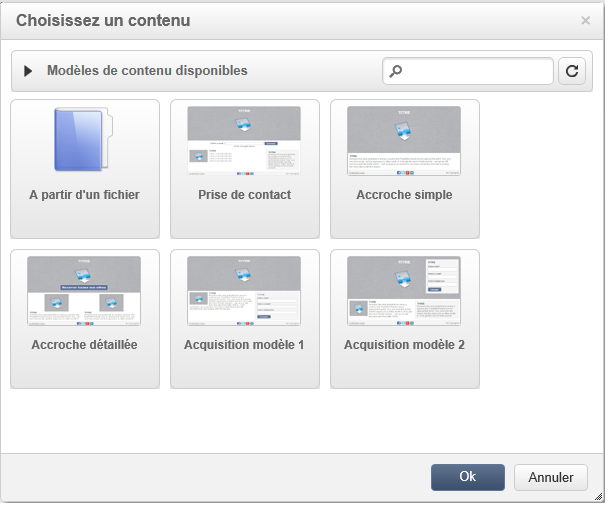
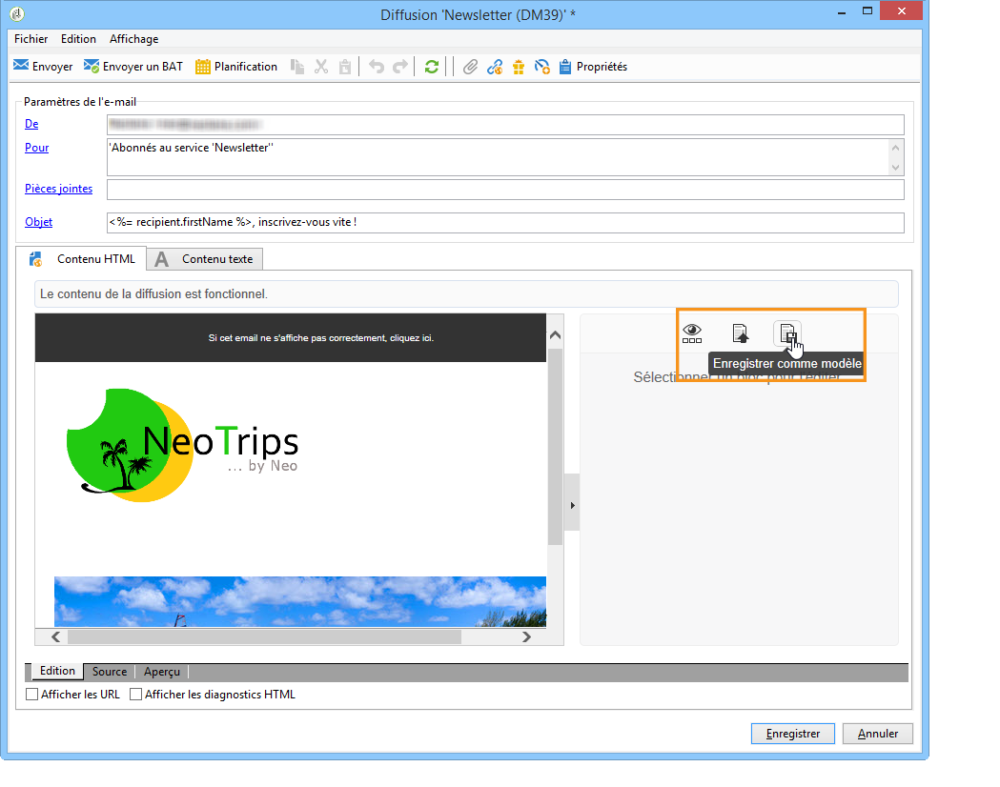

# Gestion des modèles{#template-management}

Le Digital Content Editor propose **des modèles standards** pour les applications Web et les diffusions.

Lors de la création d’une application web de type Page de destination, l’utilisateur ou l’utilisatrice peut choisir un de ces modèles.Vous pouvez également importer un modèle HTML créé en dehors d’Adobe Campaign.

Pour ajouter un modèle, consultez la section [Options globales](content-editor-interface.md#global-options).

## Enregistrer une diffusion comme modèle {#saving-a-delivery-as-a-template}

À la fin du paramétrage d&#39;une diffusion, il vous est possible de l&#39;enregistrer comme modèle afin de la réutiliser lors de prochaines diffusions.

Dans l’onglet **Campagnes**, ouvrez la diffusion sélectionnée. Cliquez sur le bouton **Enregistrer en tant que modèle**, nommez le modèle, puis enregistrez-le.

Le nouveau modèle est enregistré dans l’arborescence de l’explorateur au niveau du nœud **Ressources > Modèles > Modèles de contenu**.
