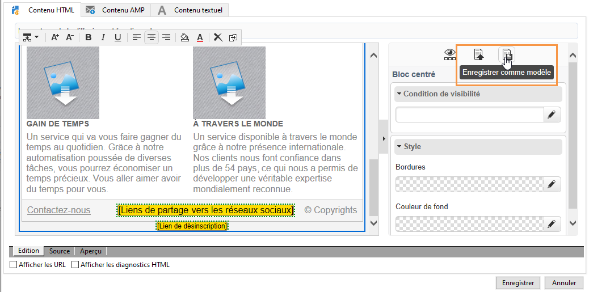

# Gestion des modèles{#template-management}

Le Digital Content Editor propose **des modèles standards** pour les applications Web et les diffusions.

Lors de la création d&#39;une application Web de type Landing Page, l&#39;utilisateur peut choisir un de ces modèles. Il peut également importer un modèle HTML créé en dehors d&#39;Adobe Campaign.

Pour ajouter un modèle, consultez la section [Options globales](content-editor-interface.md#global-options).

## Enregistrer une diffusion comme modèle {#saving-a-delivery-as-a-template}

A la fin du paramétrage d&#39;une diffusion, il vous est possible de l&#39;enregistrer comme modèle afin de la réutiliser lors de prochaines diffusions.

Dans l’onglet **Campagnes**, ouvrez la diffusion sélectionnée. Cliquez sur le bouton **Enregistrer en tant que modèle**, nommez le modèle, puis enregistrez-le.

Le nouveau modèle est enregistré dans l’arborescence de l’explorateur au niveau du nœud **Ressources > Modèles > Modèles de contenu**.
