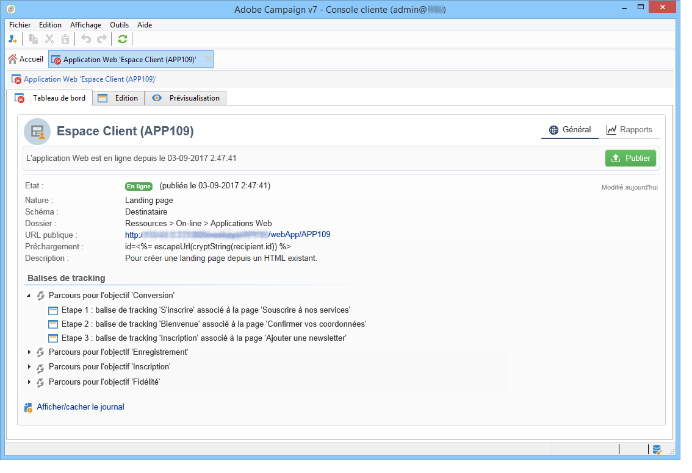
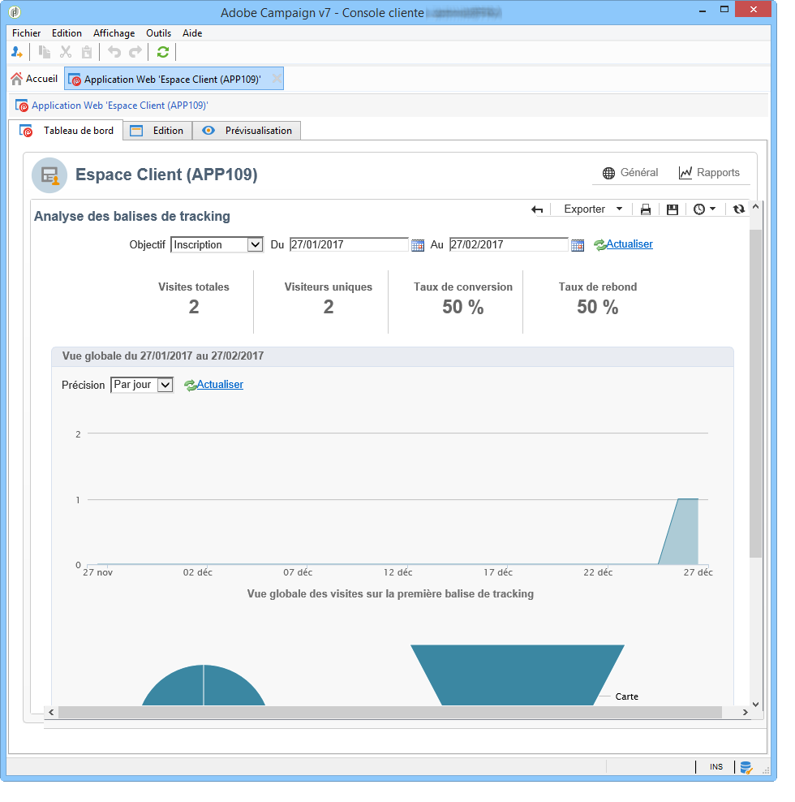
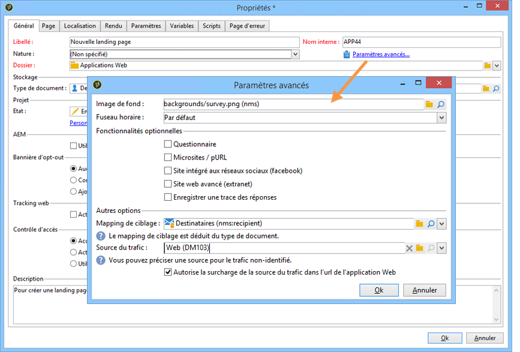
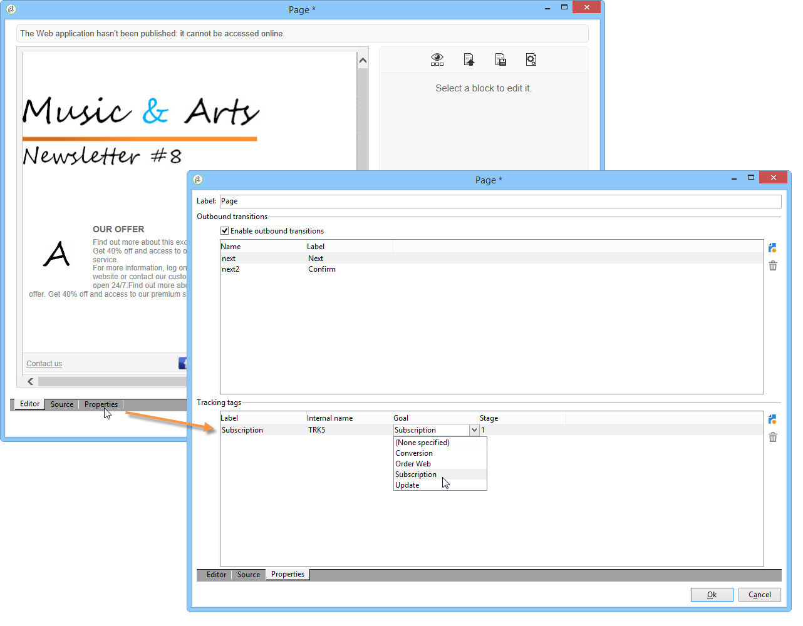
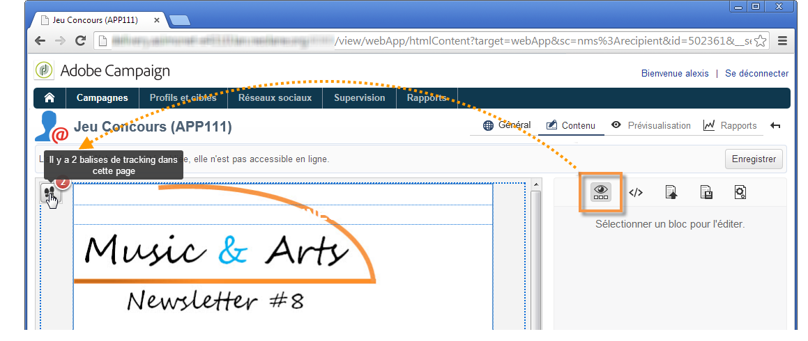

# Tracking des visites sur une application web{#tracking-a-web-application}

Adobe Campaign permet de suivre et de mesurer les visites sur les pages des applications Web en insérant des balises de tracking. Cette fonctionnalité peut être utilisée pour tous les types d&#39;applications web (formulaires, pages web, etc.).

Vous pouvez ainsi définir plusieurs chemins de navigation et évaluer leur succès.Les données récupérées sont alors disponibles dans les rapports de chaque application.

Les principales fonctionnalités proposées dans cette version sont les suivantes :

* Possibilité d&#39;insérer plusieurs balises de tracking sur une même page, afin de faciliter la définition de chemins de navigation (ex : achat, inscription, retour, etc.).
* Visualisation des chemins de navigation et des balises de tracking des différentes pages depuis le tableau de bord de l&#39;application Web.

  

* Génération d&#39;un rapport de tracking complet.

  

  Les principaux indicateurs sont les suivants :

   * **Taux de conversion** : nombre de personnes qui ont parcouru toutes les étapes d’un chemin de navigation.
   * **Taux de rebond** : nombre de personnes qui n&#39;ont affiché que la première étape.
   * **Entonnoir de conversion** : taux de perte entre chacune des étapes.

  En complément, un graphique de type **Secteur** représente la population en fonction de son origine.

## Identification de la source du trafic {#identifying-the-traffic-source}

Deux modes différents permettent d&#39;identifier l&#39;origine du visiteur lors de l&#39;accès à une application Web :

1. Envoyer une diffusion spécifique pour donner accès aux pages de l&#39;application Web : dans ce cas, la source de trafic est cette diffusion,
1. Associer l&#39;application Web à une source de trafic dédiée : dans ce cas, il doit s&#39;agir d&#39;une diffusion externe de type &#39;traffic source&#39;. Le choix est effectué dans les propriétés de l&#39;application Web ou du mapping de ciblage.

   

Afin d&#39;identifier la source de trafic sur une application Web, Adobe Campaign recherche successivement les informations suivantes :

1. l&#39;identifiant de la diffusion source, si elle existe (cookie nlId),
1. l&#39;identifiant de la diffusion externe définie dans les propriétés de l&#39;application Web, si elle existe,
1. l&#39;identifiant de la diffusion externe définie au niveau du mapping de ciblage, si elle existe.

>[!NOTE]
>
>Le tracking anonyme n&#39;est disponible que si l&#39;option a été activée dans l&#39;assistant de déploiement lors de l&#39;installation de Campaign.

## Applications web conçues avec Digital Content Editor (DCE) {#web-applications-designed-with-digital-content-editor--dce-}

Lorsqu&#39;une application web est créée en utilisant l&#39;éditeur de contenus HTML - **Digital Content Editor (DCE)** -, les balises de tracking sont insérées depuis le sous-onglet **[!UICONTROL Propriétés]** de l&#39;éditeur. Pour plus d&#39;informations sur le Digital Content Editor (DCE), consultez [cette section](about-campaign-html-editor.md).

Lorsque l&#39;opérateur utilise l&#39;interface Web, les balises de tracking doivent être insérées depuis les propriétés de la page.

L&#39;icône **[!UICONTROL Afficher les blocs]** permet de visualiser le nombre de balises de tracking configurées pour la page.

