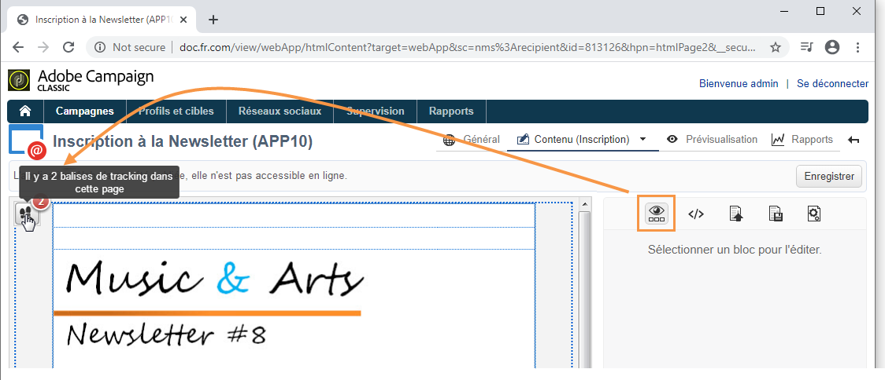

# Tracking d’une application web{#tracking-a-web-application}

Adobe Campaign vous permet de suivre et de mesurer les visites sur les pages des applications Web en insérant des balises de suivi. Cette fonctionnalité peut être utilisée pour tous les types d&#39;applications Web (formulaires, enquêtes en ligne, pages Web créées à l&#39;aide de DCE, etc.).

Vous pouvez ainsi définir plusieurs chemins de navigation et en évaluer le succès. Les mesures ainsi effectuées sont répertoriées dans les rapports disponibles au niveau de chaque application.

Les principales fonctionnalités proposées dans cette version sont les suivantes :

* Possibilité d&#39;insérer plusieurs balises de tracking sur une même page, afin de faciliter la définition de chemins de navigation (ex : achat, inscription, retour, etc.).
* Visualisation des chemins de navigation et des balises de tracking des différentes pages depuis le tableau de bord de l&#39;application Web.

   

* Génération d&#39;un rapport de tracking complet.

   

   Les principaux indicateurs sont les suivants :

   * **Taux** de conversion : nombre de personnes qui ont affiché toutes les étapes d’un chemin de navigation.
   * **Taux** de rebonds : nombre de personnes qui ont affiché la première étape uniquement
   * **tunnel** de conversion : taux de perte entre chaque étape.
   In addition, a **Sector** type chart shows the population according to its source.

## Identification de la source du trafic {#identifying-the-traffic-source}

Deux modes différents permettent d&#39;identifier d&#39;où vient le visiteur lors de l&#39;accès à une application Web :

1. Envoi d’une remise spécifique pour accorder l’accès aux pages de l’application Web : dans ce cas, la source de trafic est cette remise,
1. Association de l&#39;application Web à une source de trafic dédiée : dans ce cas, il doit s’agir d’une livraison externe de type &quot;source de trafic&quot;. Il peut être sélectionné à partir des propriétés de l&#39;application Web ou du mappage cible.

   

Afin d&#39;identifier la source de trafic sur une application Web, Adobe Campaign recherche successivement les informations suivantes :

1. l&#39;identifiant de la diffusion source, si elle existe (cookie nlId),
1. l&#39;identifiant de la diffusion externe définie dans les propriétés de l&#39;application Web, si elle existe,
1. l&#39;identifiant de la diffusion externe définie au niveau du mapping de ciblage, si elle existe.

>[!NOTE]
>
>Pour rappel, le tracking anonyme n&#39;est possible que si cette option a été activée dans l&#39;assistant de déploiement.
>
>Voir à ce propos le [Guide d&#39;installation](../../installation/using/deploying-an-instance.md).

## Applications web conçues avec Digital Content Editor (DCE) {#web-applications-designed-with-digital-content-editor--dce-}

Lorsqu&#39;une application web est créée en utilisant l&#39;éditeur de contenus HTML - **Digital Content Editor (DCE)** -, les balises de tracking sont insérées depuis le sous-onglet **[!UICONTROL Propriétés]** de l&#39;éditeur. Pour plus d&#39;informations sur le Digital Content Editor (DCE), consultez [cette section](../../web/using/about-campaign-html-editor.md).

Lorsque l&#39;opérateur utilise l&#39;interface Web, les balises de tracking doivent être insérées depuis les propriétés de la page.

L&#39;icône **[!UICONTROL Afficher les blocs]** permet de visualiser le nombre de balises de tracking configurées pour la page.

