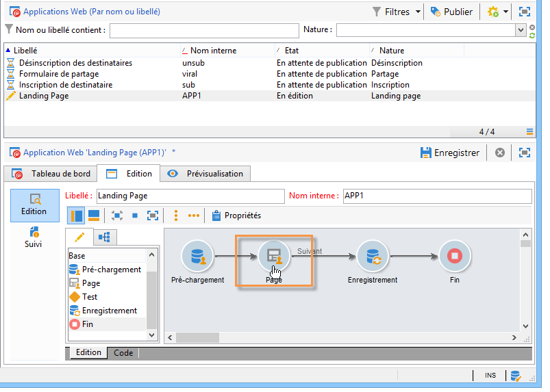
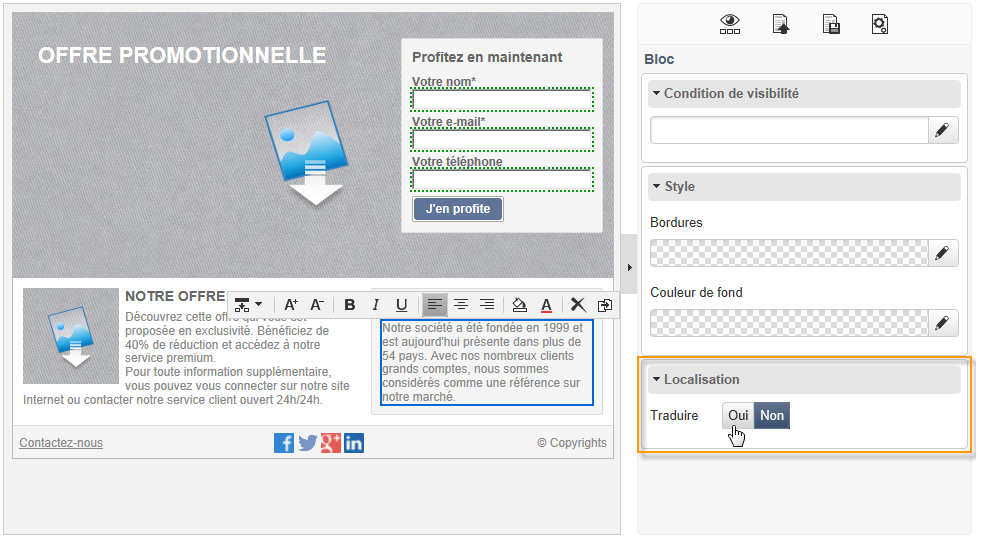
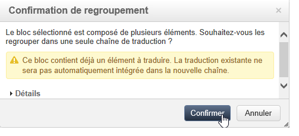
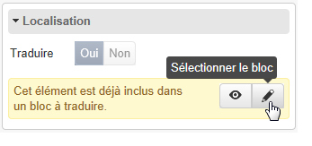

# Traduire une application web{#translating-a-web-application}

Vous pouvez traduire les pages d’applications Web créées avec l’éditeur Digital Content Editor (DCE) d’Adobe Campaign.

Lorsque vous sélectionnez une ou plusieurs langues supplémentaires via l&#39;onglet **[!UICONTROL Localisation]** des **[!UICONTROL Propriétés]** d&#39;une application Web, une option supplémentaire apparaît lorsque vous vous placez au niveau d&#39;un bloc de contenu HTML d&#39;une page éditée avec le DCE.

Cette option vous permet d&#39;indiquer si le contenu du bloc doit être traduit ou non.

Les chaînes marquées sont collectées pour être traduites, de la même manière que les autres chaînes de l&#39;application web, via l&#39;onglet **[!UICONTROL Traductions]** de l&#39;application. Voir à ce sujet [cette page](translating-a-web-form.md).

Pour marquer les chaînes à traduire :

1. Ouvrez une page de contenu éditée via le DCE dans une application Web.

   

1. Sélectionnez un bloc HTML.
1. Dans le bloc de paramètres de droite, l&#39;option **[!UICONTROL Localisation]** vous permet de choisir de traduire le contenu du bloc sélectionné. Par défaut, seul le titre de la page est à traduire.

   

   >[!NOTE]
   >
   >Les chaînes doivent contenir au maximum 1023 caractères.

   Trois cas spécifiques sont à noter :

   * Lorsqu&#39;un bloc sélectionné contient plusieurs chaînes/blocs, ce dernier est ajouté sous forme d&#39;une seule chaîne à traduire. La chaîne contient alors le code HTML des éléments que le bloc contient.
   * Lorsque vous souhaitez traduire un bloc contenant plusieurs chaînes dont au moins l&#39;une d&#39;entre-elles est déjà marquée comme à traduire, un message vous en avertit. Vous pouvez alors choisir de retirer la chaîne isolée et d&#39;ajouter le bloc entier.

     

   * Lorsque vous souhaitez ne pas traduire une chaîne contenue dans un bloc déjà marqué comme à traduire, vous ne pouvez pas modifier l&#39;option de traduction de la chaîne. Vous pouvez toutefois sélectionner le bloc à traduire dont la chaîne fait partie afin de modifier votre choix concernant le bloc entier.

     

1. Une fois les chaînes marquées, revenez à l&#39;application Web et sélectionnez l&#39;onglet **[!UICONTROL Traductions]**.
1. Sélectionnez **[!UICONTROL Collecter les chaînes à traduire]**. Les chaînes marquées dans le DCE viennent s&#39;ajouter à celles de l&#39;application Web.

   >[!NOTE]
   >
   >Une fois les chaînes collectées, elles ne sont pas retirées si vous les marquez à nouveau comme n&#39;étant pas à traduire dans le DCE. Cela permet qu&#39;elles soient conservées dans la mémoire de traduction.

1. Traduisez et validez les chaînes.

   Vous pouvez ensuite prévisualiser les traductions en sélectionnant la langue de votre choix via l&#39;onglet **[!UICONTROL Prévisualisation]** de l&#39;application Web.
