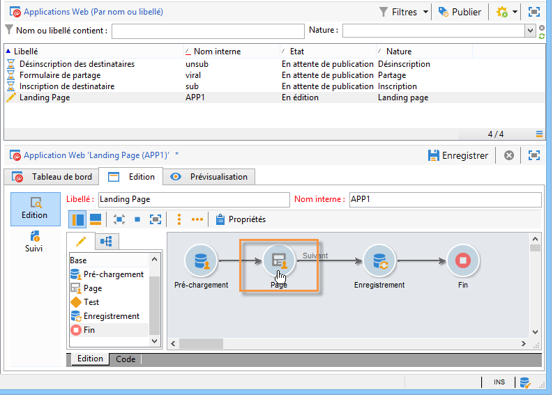
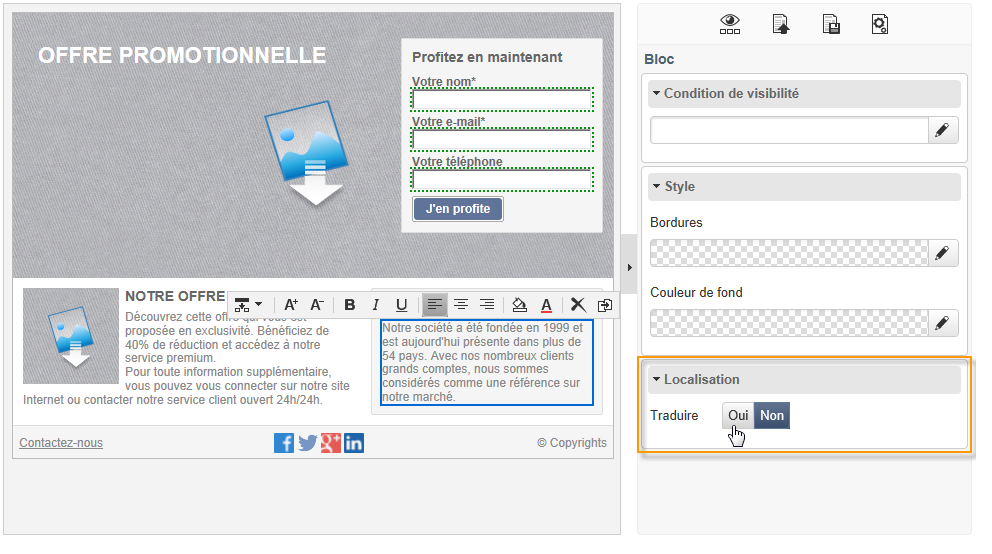
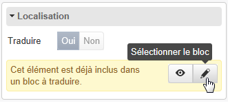

# Traduire une application web{#translating-a-web-application}

Vous pouvez traduire les pages d’applications Web créées avec l’éditeur Digital Content Editor (DCE) d’Adobe Campaign.

Lorsque vous sélectionnez une ou plusieurs langues supplémentaires via l&#39;onglet **[!UICONTROL Localisation]** des **[!UICONTROL Propriétés]** d&#39;une application Web, une option supplémentaire apparaît lorsque vous vous placez au niveau d&#39;un bloc de contenu HTML d&#39;une page éditée avec le DCE.

Cette option vous permet d&#39;indiquer si le contenu du bloc doit être traduit ou non.

Les chaînes marquées sont collectées pour être traduites, de la même manière que les autres chaînes de l&#39;application web, via l&#39;onglet **[!UICONTROL Traductions]** de l&#39;application. Pour plus d’informations, consultez [cette page](translating-a-web-form.md).

Pour marquer les chaînes à traduire :

1. Ouvrez une page de contenu éditée via le DCE dans une application Web.

   

1. Sélectionnez un bloc HTML.
1. Dans le bloc de paramètres situé à droite, l&#39;option **[!UICONTROL Localisation]** permet de marquer le contenu du bloc sélectionné. Par défaut, seul le titre de la page doit être traduit.

   

   >[!NOTE]
   >
   >Les chaînes doivent contenir au maximum 1023 caractères.

   Trois cas spécifiques sont à noter :

   * Lorsque le bloc sélectionné contient plusieurs chaînes/blocs, il est marqué comme une seule chaîne à traduire. La chaîne contient alors le code HTML des éléments contenus dans ce bloc.
   * Lorsque vous souhaitez marquer un bloc qui contient plusieurs chaînes et si au moins l’une de ces chaînes est déjà marquée, un avertissement s’affiche. Vous pouvez ensuite supprimer l’indicateur de la chaîne isolée et ajouter l’ensemble du bloc.

     

   * Lorsque vous souhaitez supprimer l’indicateur d’une chaîne contenue dans un bloc déjà marqué, vous ne pouvez pas modifier directement l’option de traduction de chaîne. Vous pouvez toutefois accéder au bloc contenant la chaîne afin de la modifier.

     

1. Une fois les chaînes marquées, revenez à l&#39;application Web et sélectionnez l&#39;onglet **[!UICONTROL Traductions]**.
1. Sélectionnez **[!UICONTROL Collecter les chaînes à traduire]**. Les chaînes marquées dans le DCE sont ajoutées aux chaînes de l’application web.

   >[!NOTE]
   >
   >Une fois les chaînes collectées, elles ne sont pas supprimées de la liste si vous supprimez l’indicateur de traduction dans le DCE. Cela permet de les conserver dans la mémoire de traduction.

1. Traduisez et validez les chaînes.

   Vous pouvez ensuite prévisualiser les traductions en sélectionnant la langue de votre choix via l&#39;onglet **[!UICONTROL Prévisualisation]** de l&#39;application Web.
