# Traduire un formulaire web{#translating-a-web-form}


Il est possible de localiser une seule application Web dans plusieurs langues.

Vous pouvez effectuer des traductions directement dans la console Adobe Campaign (voir [Gérer les traductions dans l&#39;éditeur](#managing-translations-in-the-editor)) ou exporter et importer des chaînes pour externaliser la traduction (voir [Externaliser les traductions](#externalizing-translation)).

La liste des langues de traduction disponibles par défaut est présentée dans la section [Changer la langue d&#39;affichage des formulaires](#changing-forms-display-language).

L&#39;application web est construite dans une langue d&#39;édition : c&#39;est la langue de référence dans laquelle sont saisis les libellés et autres contenus de la page qui feront ensuite l&#39;objet d&#39;une traduction.

La langue par défaut est la langue dans laquelle sera affichée l&#39;application web si aucun paramètre de langue n&#39;est ajouté dans son URL d&#39;accès.

>[!NOTE]
>
>Par défaut, la langue d&#39;édition et la langue par défaut correspondent toutes les deux à celle de la console.

## Choisir les langues de traduction {#choosing-languages}

Pour définir une ou plusieurs langues de traduction, cliquez sur le bouton **[!UICONTROL Propriétés]** de l&#39;application web, puis sur l&#39;onglet **[!UICONTROL Localisation]**. Cliquez sur le bouton **[!UICONTROL Ajouter]** pour définir une nouvelle langue de traduction de l&#39;application web.

>[!NOTE]
>
>Cet écran vous permet également de modifier la langue par défaut et la langue d&#39;édition.

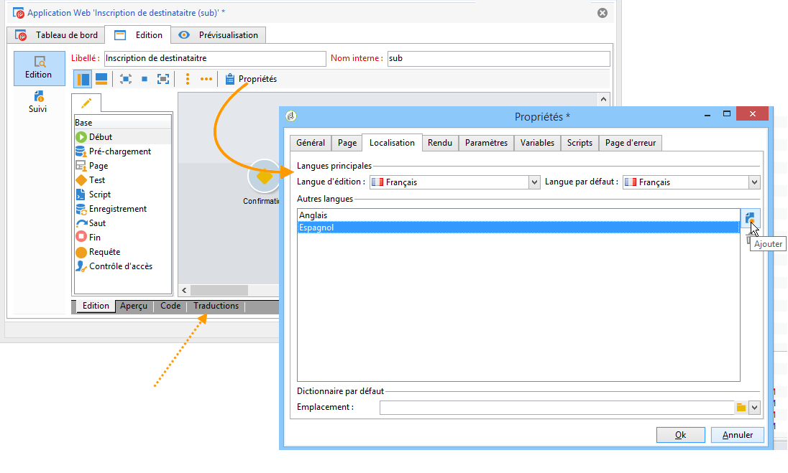

Lorsque vous ajoutez des langues de traduction pour une application web (ou lorsque la langue par défaut et la langue d&#39;édition sont différentes), un sous-onglet **[!UICONTROL Traductions]** est ajouté dans l&#39;onglet **[!UICONTROL Edition]** afin de gérer les traductions.

Adobe Campaign intègre un outil de traduction et de suivi des traductions multilingues. Cet éditeur permet de visualiser les termes à traduire ou à valider, de saisir les traductions directement dans l&#39;interface, ou d&#39;importer/exporter les chaînes de caractères afin d&#39;externaliser la traduction.

## Gérer les traductions dans l&#39;éditeur {#managing-translations-in-the-editor}

### Collecter les chaînes {#collecting-strings}

L&#39;onglet **[!UICONTROL Traductions]** permet de saisir les traductions des chaînes de caractères de l&#39;application web.

A la première ouverture de cet onglet, il ne contient aucun élément. Cliquez sur le lien **[!UICONTROL Collecter les chaînes à traduire]** pour mettre à jour les chaînes de l&#39;application web.

Adobe Campaign collecte les libellés des champs ou les chaînes des onglets **[!UICONTROL Textes]** de tous les éléments statiques : blocs HTML, Javascript, etc. Les éléments statiques sont présentés dans la section [Elements statiques dans un formulaire web](static-elements-in-a-web-form.md).

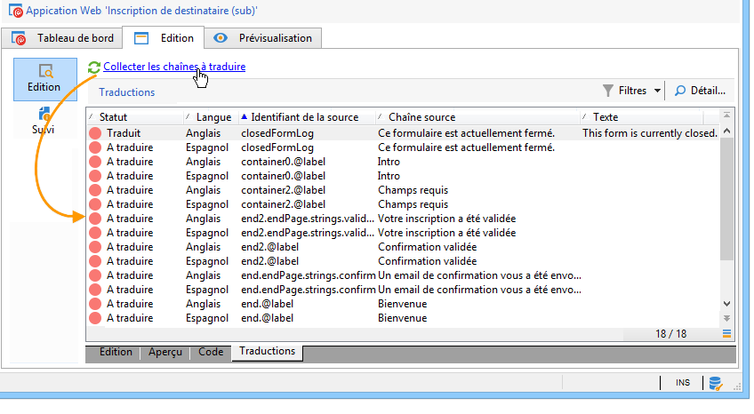

>[!CAUTION]
>
>Cette opération peut durer plusieurs minutes, selon le volume de données à traiter.
> 
>Si un message d&#39;avertissement apparaît vous informant que certaines traductions sont manquantes dans le dictionnaire système, reportez-vous à la section [Traduire les chaînes système](#translating-the-system-strings).

Chaque fois qu&#39;une chaîne est traduite, sa traduction est ajoutée dans le dictionnaire de traduction.

Lorsque l&#39;opération de collecte détecte qu&#39;une traduction existe déjà, celle-ci apparaît dans la colonne **[!UICONTROL Texte]** de la chaîne. Le statut de la chaîne est alors **[!UICONTROL Traduit]**.

Lorsqu&#39;une chaîne de caractères n&#39;a jamais été traduite, le champ **[!UICONTROL Texte]** est vide et le statut est : **[!UICONTROL A traduire]**.

### Filtrer les chaînes {#filtering-strings}

Par défaut, chaque langue de traduction de l&#39;application web est affichée. Il existe deux filtres par défaut : langue et statut. Cliquez sur le bouton **[!UICONTROL Filtres]**, puis sur **[!UICONTROL Par langue ou statut]** pour afficher les menus déroulants correspondants. Vous pouvez également créer un filtre avancé. Pour plus d’informations sur les filtres, consultez la documentation [Campaign v8 (console)](https://experienceleague.adobe.com/en/docs/campaign/campaign-v8/audience/create-filters){target=_blank}.

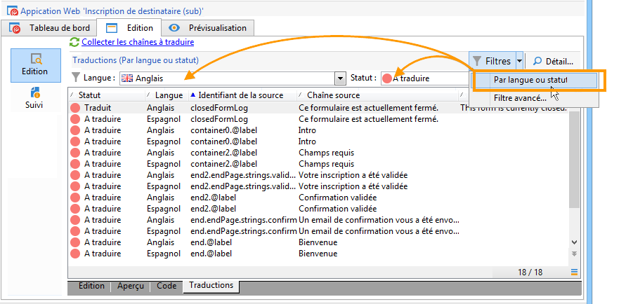

Sélectionnez la langue de traduction souhaitée dans le menu déroulant **[!UICONTROL Langue]**.

Pour n&#39;afficher que les termes non traduits, sélectionnez **[!UICONTROL A traduire]** dans le menu déroulant **[!UICONTROL Statut]**. Vous pouvez également n&#39;afficher que les termes traduits ou validés.

### Traduire les chaînes {#translating-strings}

1. Pour traduire un terme, double-cliquez sur la ligne correspondante dans la liste des chaînes.

   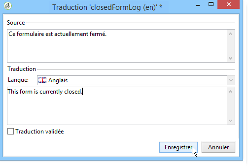

   La chaîne source apparaît dans la partie supérieure de la fenêtre.

1. Saisissez sa traduction dans la partie inférieure. Vous pouvez valider la traduction en cochant l&#39;option **[!UICONTROL Traduction validée]**.

   >[!NOTE]
   >
   >La validation d&#39;une traduction est optionnelle et donc non bloquante.

   Une traduction non validée apparaît avec le statut : **[!UICONTROL Traduit]**. Une fois validée, la traduction apparaît avec le statut : **[!UICONTROL Validé]**.

## Externaliser les traductions {#externalizing-translation}

Vous pouvez exporter et importer les chaînes de caractères afin de les traduire en utilisant un outil externe à Adobe Campaign.

>[!CAUTION]
>
>Lorsque vous exportez les chaînes, n&#39;effectuez plus aucune traduction via l&#39;éditeur intégré. Celles-ci seraient perdues au moment de l&#39;import en cas de conflit.

### Exporter les fichiers {#exporting-files}

1. Sélectionnez la ou les applications web dont vous souhaitez exporter les chaînes, cliquez avec le bouton droit, puis sélectionnez **[!UICONTROL Actions > Exporter les chaînes pour traduction...]**

   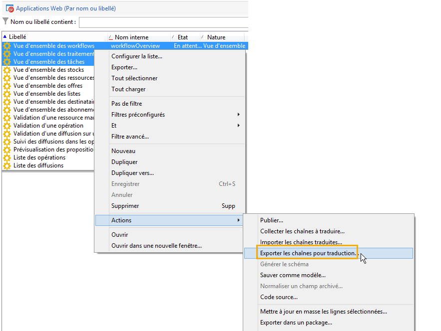

1. Choisissez la **[!UICONTROL Stratégie d&#39;export]** :

   * **[!UICONTROL Un fichier par langue]** : l&#39;export génèrera un fichier par langue de traduction. Chaque fichier sera commun à toutes les applications web sélectionnées.
   * **[!UICONTROL Un fichier par application web]** : l&#39;export génèrera un fichier par application web sélectionnée. Chaque fichier contiendra toutes les langues de traduction.

     >[!NOTE]
     >
     >Ce type d&#39;export n&#39;est pas disponible pour l&#39;export en XLIFF.

   * **[!UICONTROL Un fichier par langue et par application web]** : l&#39;export génèrera plusieurs fichiers. Chaque fichier contiendra une langue de traduction pour une même application web.
   * **[!UICONTROL Un fichier pour l&#39;ensemble]** : l&#39;export génèrera un seul fichier multilingue commun à toutes les applications web. Il contiendra toutes les langues de traduction pour toutes les applications web sélectionnées.

     >[!NOTE]
     >
     >Ce type d&#39;export n&#39;est pas disponible pour l&#39;export en XLIFF.

1. Choisissez ensuite le **[!UICONTROL Dossier cible]** dans lequel les fichiers seront enregistrés.
1. Sélectionnez le format de fichier (**[!UICONTROL CSV]** ou **[!UICONTROL XLIFF]**) et cliquez enfin sur **[!UICONTROL Démarrer]**.

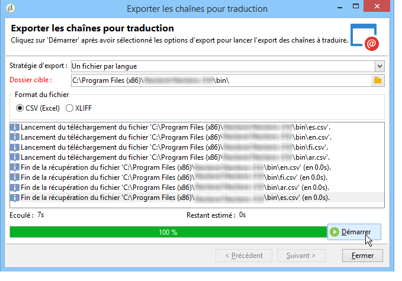

>[!NOTE]
>
>Les noms des fichiers d’export sont générés automatiquement. Si vous effectuez plusieurs fois un même export, les fichiers existants seront remplacés par les nouveaux. Si vous devez conserver les fichiers précédents, modifiez le **[!UICONTROL Dossier cible]**, puis cliquez sur **[!UICONTROL Démarrer]** pour relancer l&#39;export.

Lorsque vous exportez des fichiers au **format CSV**, chaque langue est associée à un statut et à un statut de validation. La colonne **Valider ?** vous permet de valider une traduction. Cette colonne peut contenir les valeurs **Oui** ou **Non**. Comme dans l&#39;éditeur intégré (voir [Gérer les traductions dans l&#39;éditeur](#managing-translations-in-the-editor)), la validation d&#39;une traduction est optionnelle donc non bloquante.

### Importer les fichiers {#importing-files}

Un fois la traduction externe terminée, vous pouvez importer les fichiers traduits.

1. Positionnez-vous dans la liste des applications web, cliquez avec le bouton droit, puis sélectionnez **[!UICONTROL Actions > Importer les chaînes traduites...]**

   >[!NOTE]
   >
   >Il n&#39;est pas nécessaire de sélectionner les applications web concernées par la traduction. Vous pouvez vous positionner sur n&#39;importe quelle ligne dans la liste des applications web.

   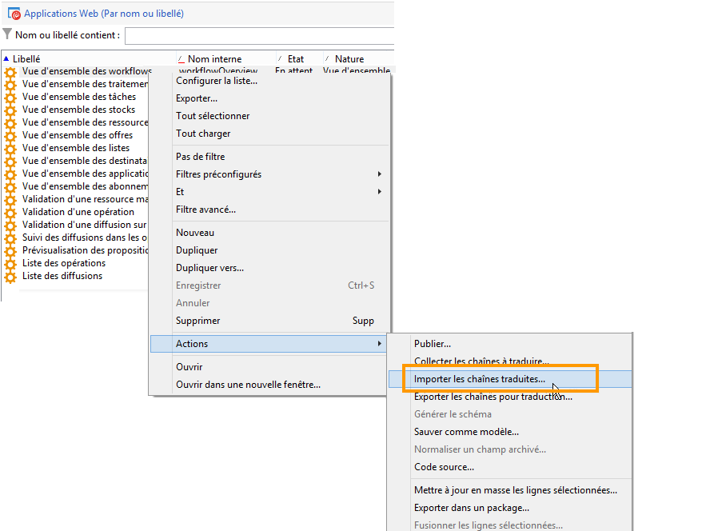

1. Sélectionnez le fichier à importer, puis cliquez sur **[!UICONTROL Télécharger]**.

   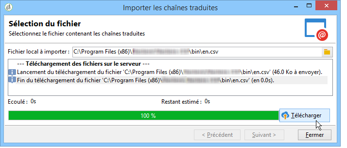

>[!NOTE]
>
>Une traduction externe a toujours la priorité sur une traduction interne. En cas de conflit, la traduction interne sera donc remplacée par la traduction externe.

## Changer la langue d&#39;affichage des formulaires {#changing-forms-display-language}

Les formulaires web sont affichés dans la langue par défaut indiquée dans l’onglet **[!UICONTROL Localisation]** des propriétés de l&#39;application web. Pour changer de langue, vous devez ajouter les caractères suivants à la fin de l’URL (où **xx** est le symbole de la langue) :

```
?lang=xx
```

si la langue est le premier ou le seul paramètre de l&#39;URL. Par exemple : **https://myserver/webApp/APP34**

```
&lang=xx
```

lorsque d&#39;autres paramètres précèdent celui de la langue dans l&#39;URL. Par exemple : **https://myserver/webApp/APP34?status=1&lang=en**

Les langues de traduction et les dictionnaires disponibles par défaut sont répertoriés ci-dessous.

**Dictionnaire système par défaut** : certaines langues incluent par défaut un dictionnaire contenant la traduction des chaînes système. Voir à ce sujet la section [Traduire les chaînes système](#translating-the-system-strings).

**Gestion des calendriers** : les pages d&#39;une application web peuvent intégrer un calendrier permettant de saisir une date. Par défaut, ce calendrier est adapté dans plusieurs langues (traduction des noms de jours, format de la date).

<table> 
 <tbody> 
  <tr> 
   <td> <strong>Langue (symboles)</strong><br /> </td> 
   <td> <strong>Dictionnaire système par défaut</strong><br /> </td> 
   <td> <strong>Gestion des calendriers</strong><br /> </td> 
  </tr> 
  <tr> 
   <td> Allemand (de)<br /> </td> 
   <td> oui<br /> </td> 
   <td> oui<br /> </td> 
  </tr> 
  <tr> 
   <td> Anglais (en)<br /> </td> 
   <td> oui<br /> </td> 
   <td> oui<br /> </td> 
  </tr> 
  <tr> 
   <td> Anglais (Etats-Unis) (en_US)<br /> </td> 
   <td> </td> 
   <td> </td> 
  </tr> 
  <tr> 
   <td> Anglais (Royaume-Uni) (en_GB)<br /> </td> 
   <td> </td> 
   <td> </td> 
  </tr> 
  <tr> 
   <td> Arabe (ar)<br /> </td> 
   <td> </td> 
   <td> </td> 
  </tr> 
  <tr> 
   <td> Chinois (zh)<br /> </td> 
   <td> </td> 
   <td> </td> 
  </tr> 
  <tr> 
   <td> Coréen (ko)<br /> </td> 
   <td> </td> 
   <td> </td> 
  </tr> 
  <tr> 
   <td> Danois (da)<br /> </td> 
   <td> oui<br /> </td> 
   <td> oui<br /> </td> 
  </tr> 
  <tr> 
   <td> Espagnol (es)<br /> </td> 
   <td> oui<br /> </td> 
   <td> oui<br /> </td> 
  </tr> 
  <tr> 
   <td> Estonien (et)<br /> </td> 
   <td> </td> 
   <td> </td> 
  </tr> 
  <tr> 
   <td> Finnois (fi)<br /> </td> 
   <td> </td> 
   <td> oui<br /> </td> 
  </tr> 
  <tr> 
   <td> Français (fr)<br /> </td> 
   <td> oui<br /> </td> 
   <td> oui<br /> </td> 
  </tr> 
  <tr> 
   <td> Français (Belgique) (fr_BE)<br /> </td> 
   <td> </td> 
   <td> </td> 
  </tr> 
  <tr> 
   <td> Français (France) (fr_FR)<br /> </td> 
   <td> </td> 
   <td> </td> 
  </tr> 
  <tr> 
   <td> Grec (el)<br /> </td> 
   <td> </td> 
   <td> oui<br /> </td> 
  </tr> 
  <tr> 
   <td> Hébreu (he)<br /> </td> 
   <td> </td> 
   <td> </td> 
  </tr> 
  <tr> 
   <td> Hongrois (hu)<br /> </td> 
   <td> </td> 
   <td> oui<br /> </td> 
  </tr> 
  <tr> 
   <td> Indonésien (id)<br /> </td> 
   <td> </td> 
   <td> </td> 
  </tr> 
  <tr> 
   <td> Irlandais (ga)<br /> </td> 
   <td> </td> 
   <td> </td> 
  </tr> 
  <tr> 
   <td> Italien (it)<br /> </td> 
   <td> oui<br /> </td> 
   <td> oui<br /> </td> 
  </tr> 
  <tr> 
   <td> Italien (Italie) (it_IT)<br /> </td> 
   <td> </td> 
   <td> </td> 
  </tr> 
  <tr> 
   <td> Italien (Suisse) (it_CH)<br /> </td> 
   <td> </td> 
   <td> </td> 
  </tr> 
  <tr> 
   <td> Japonais (ja)<br /> </td> 
   <td> </td> 
   <td> </td> 
  </tr> 
  <tr> 
   <td> Letton (lv)<br /> </td> 
   <td> </td> 
   <td> oui<br /> </td> 
  </tr> 
  <tr> 
   <td> Lituanien (lt)<br /> </td> 
   <td> </td> 
   <td> </td> 
  </tr> 
  <tr> 
   <td> Maltais (mt)<br /> </td> 
   <td> </td> 
   <td> </td> 
  </tr> 
  <tr> 
   <td> Néerlandais (nl)<br /> </td> 
   <td> </td> 
   <td> oui<br /> </td> 
  </tr> 
  <tr> 
   <td> Néerlandais (Belgique) (nl_BE)<br /> </td> 
   <td> </td> 
   <td> </td> 
  </tr> 
  <tr> 
   <td> Néerlandais (Pays-Bas) (nl_NL)<br /> </td> 
   <td> </td> 
   <td> </td> 
  </tr> 
  <tr> 
   <td> Norvégien (Norvège) (no_NO)<br /> </td> 
   <td> </td> 
   <td> oui<br /> </td> 
  </tr> 
  <tr> 
   <td> Polonais (pl)<br /> </td> 
   <td> </td> 
   <td> oui<br /> </td> 
  </tr> 
  <tr> 
   <td> Portugais (pt)<br /> </td> 
   <td> </td> 
   <td> oui<br /> </td> 
  </tr> 
  <tr> 
   <td> Portugais (Brésil) (pt_BR)<br /> </td> 
   <td> </td> 
   <td> </td> 
  </tr> 
  <tr> 
   <td> Portugais (Portugal) (pt_PT)<br /> </td> 
   <td> </td> 
   <td> </td> 
  </tr> 
  <tr> 
   <td> Russe (ru)<br /> </td> 
   <td> </td> 
   <td> oui<br /> </td> 
  </tr> 
  <tr> 
   <td> Slovène (sl)<br /> </td> 
   <td> </td> 
   <td> </td> 
  </tr> 
  <tr> 
   <td> Slovaque (sk)<br /> </td> 
   <td> </td> 
   <td> </td> 
  </tr> 
  <tr> 
   <td> Suédois (sv)<br /> </td> 
   <td> oui<br /> </td> 
   <td> oui<br /> </td> 
  </tr> 
  <tr> 
   <td> Suédois (Finlande) (sv_FI)<br /> </td> 
   <td> </td> 
   <td> </td> 
  </tr> 
  <tr> 
   <td> Suédois (Suède) (sv_SE)<br /> </td> 
   <td> </td> 
   <td> </td> 
  </tr> 
  <tr> 
   <td> Tchèque (cs)<br /> </td> 
   <td> </td> 
   <td> </td> 
  </tr> 
  <tr> 
   <td> Thaï (th)<br /> </td> 
   <td> </td> 
   <td> </td> 
  </tr> 
  <tr> 
   <td> Vietnamien (vi)<br /> </td> 
   <td> </td> 
   <td> </td> 
  </tr> 
  <tr> 
   <td> Wallon (wa)<br /> </td> 
   <td> </td> 
   <td> </td> 
  </tr> 
 </tbody> 
</table>

>[!NOTE]
>
>Pour ajouter d&#39;autres langues que celles proposées par défaut, reportez-vous à la section [Ajouter une langue de traduction](#adding-a-translation-language)

## Exemple : afficher une application web dans plusieurs langues {#example--displaying-a-web-application-in-several-languages}

Le formulaire web suivant est disponible en quatre langues : allemand, anglais, espagnol et français. Les chaînes de caractères ont toutes été traduites à partir de l&#39;onglet **[!UICONTROL Traduction]** du formulaire web. La langue par défaut étant le français, une fois le questionnaire publié, utilisez l&#39;URL standard pour l&#39;afficher en français.

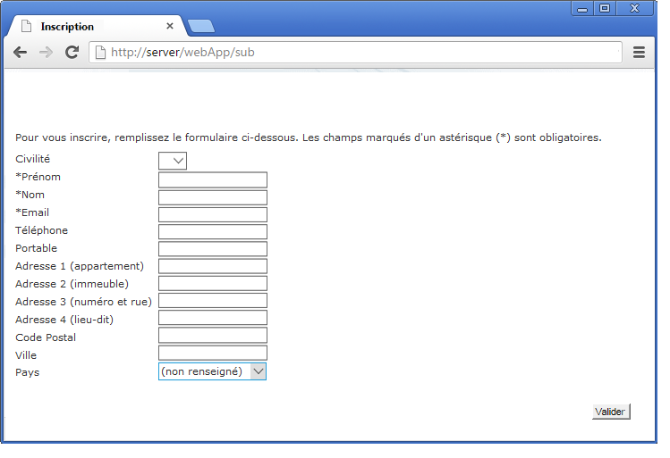

Ajoutez les caractères **?lang=en** à la fin de l&#39;URL pour l&#39;afficher en anglais.

>[!NOTE]
>
>La liste des symboles de chaque langue est présentée dans la section [Changer la langue d&#39;affichage des formulaires](#changing-forms-display-language).

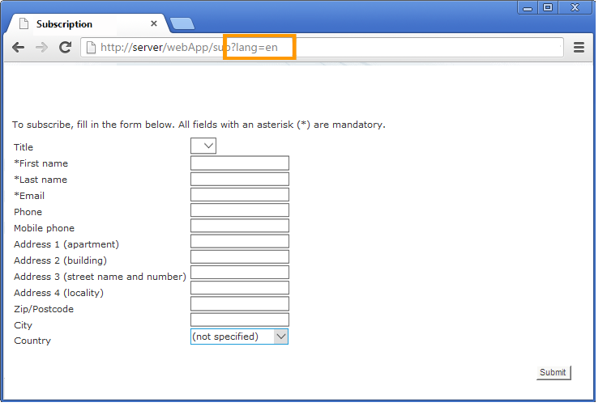

Vous pouvez ajouter les caractères **?lang=es** ou **?lang=de** pour l&#39;afficher en espagnol ou en allemand.

>[!NOTE]
>
>Si d&#39;autres paramètres sont déjà utilisés pour cette application web, ajoutez les caractères **&amp;lang=**.\
>Par exemple : **https://myserver/webApp/APP34?status=1&lang=en**

## Configuration avancée de traduction {#advanced-translation-configuration}

>[!CAUTION]
>
>Cette section est réservée à des utilisateurs experts uniquement.

### Traduire les chaînes système {#translating-the-system-strings}

Les chaînes système sont des chaînes de caractères par défaut utilisées par toutes les applications web. Par exemple : les boutons **[!UICONTROL Suivant]**, **[!UICONTROL Précédent]**, **[!UICONTROL Valider]**, le message **[!UICONTROL Chargement]**, etc. Certaines langues incluent, par défaut, un dictionnaire contenant la traduction de ces chaînes. La liste de ces langues est présentée dans la section [Changer la langue d&#39;affichage des formulaires](#changing-forms-display-language).

Si vous traduisez votre application web vers une langue dans laquelle le dictionnaire système n&#39;est pas traduit, un message d&#39;avertissement vous informera que certaines traductions sont manquantes.

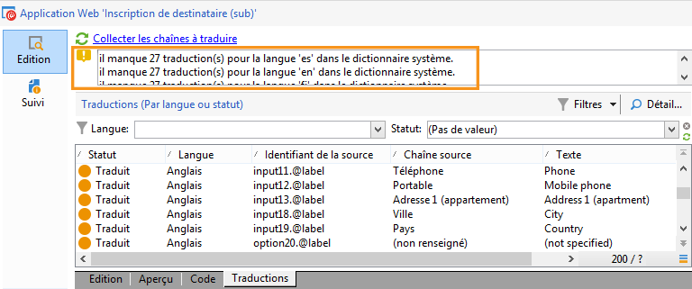

Pour ajouter une langue, procédez comme suit :

1. Accédez à l&#39;arborescence Adobe Campaign et cliquez sur **[!UICONTROL Administration > Paramétrage > Dictionnaire global > Dictionnaire système]** .
1. Dans la partie supérieure de la fenêtre, sélectionnez la chaîne système à traduire, puis cliquez sur le bouton **[!UICONTROL Ajouter]**, dans la partie inférieure.

   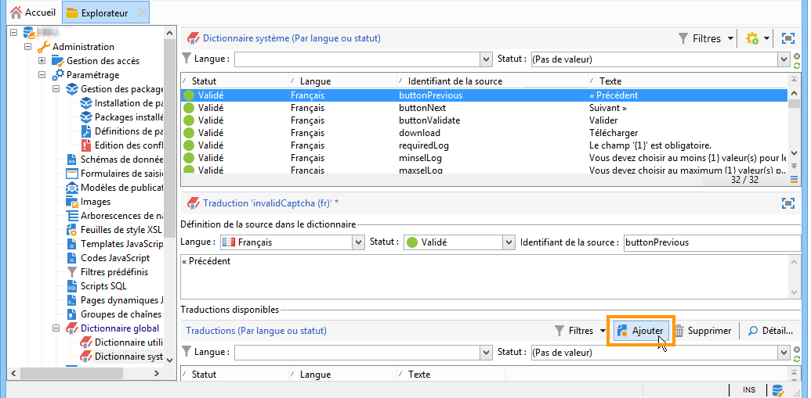

1. Sélectionnez la langue de traduction et saisissez une traduction pour la chaîne. Vous pouvez approuver la traduction en cochant l&#39;option **[!UICONTROL Traduction validée]**.

   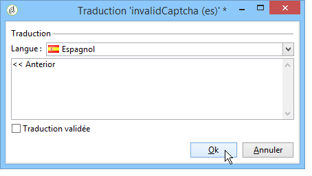

   >[!NOTE]
   >
   >La validation d&#39;une traduction est optionnelle et donc non bloquante.

>[!CAUTION]
>
>Ne supprimez pas les chaînes système d&#39;usine.

### Ajouter une langue de traduction {#adding-a-translation-language}

Pour traduire vos applications web dans d&#39;autres langues que celles proposées par défaut (voir [Changer la langue d&#39;affichage des formulaires](#changing-forms-display-language)), vous devez ajouter une nouvelle langue de traduction.

1. Cliquez sur le nœud **[!UICONTROL Administration > Plateforme > Énumérations]** de l’arborescence d’Adobe Campaign et sélectionnez **[!UICONTROL Langues disponibles pour la traduction]** dans la liste. La liste des traductions disponibles s&#39;affiche dans la partie inférieure de la fenêtre.

   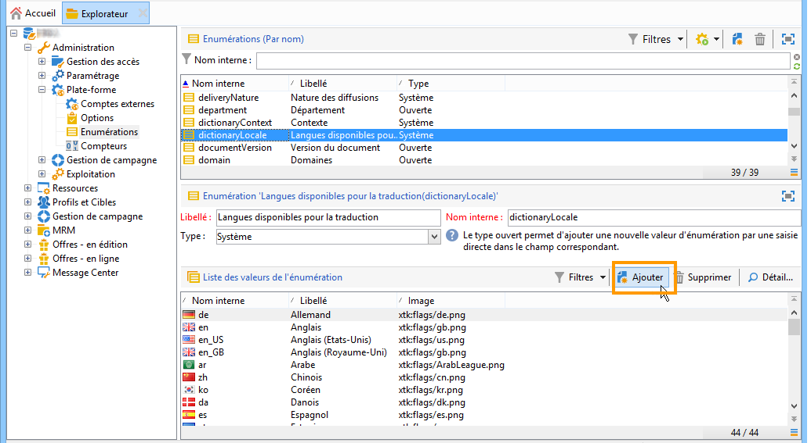

1. Cliquez sur le bouton **[!UICONTROL Ajouter]**, puis renseignez le **[!UICONTROL Nom interne]**, le **[!UICONTROL Libellé]** et l&#39;identifiant de l&#39;image correspondant au drapeau de la langue. Pour ajouter une nouvelle image, contactez votre administrateur.

   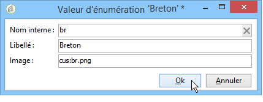
