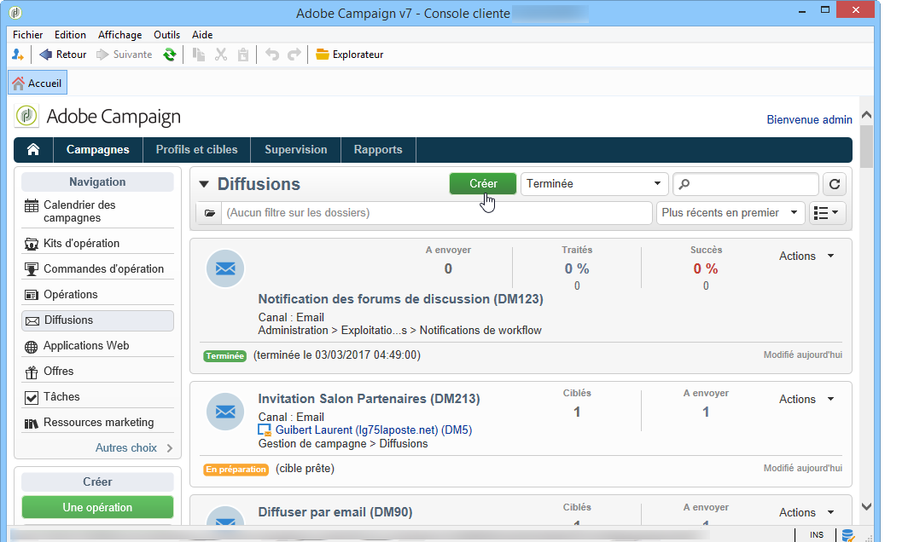
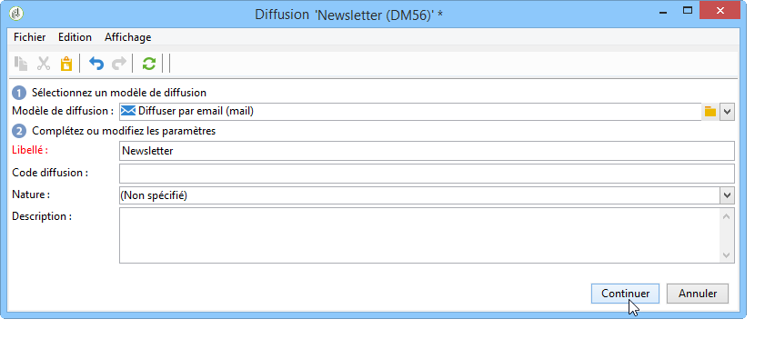
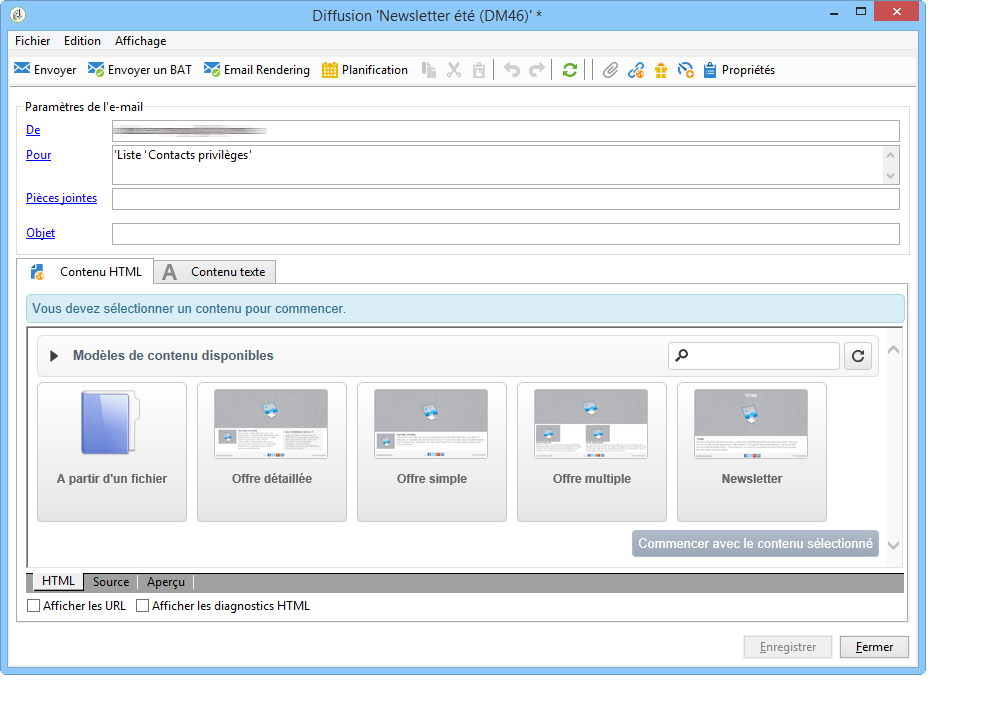
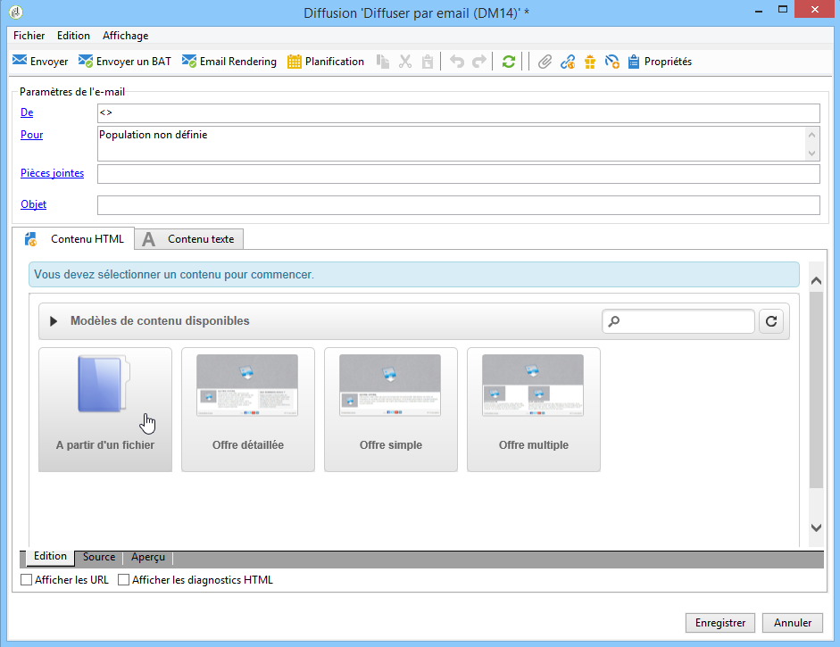
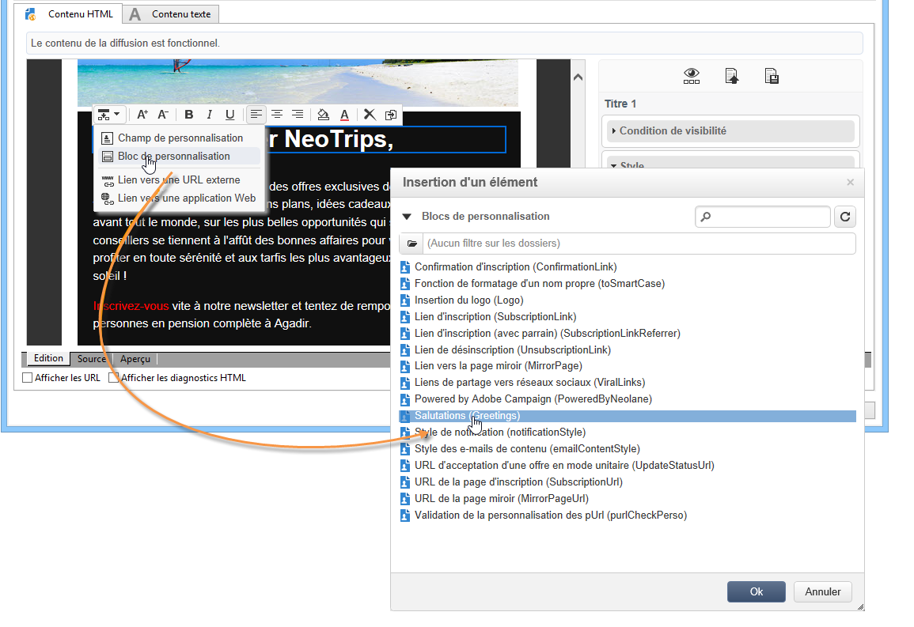
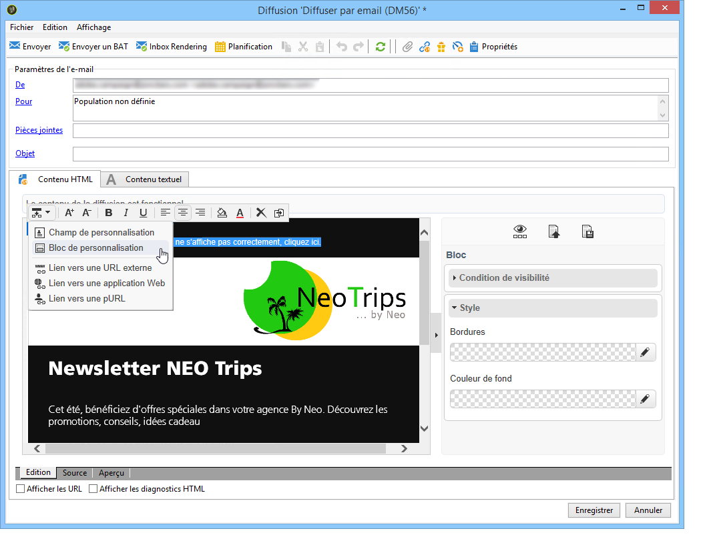
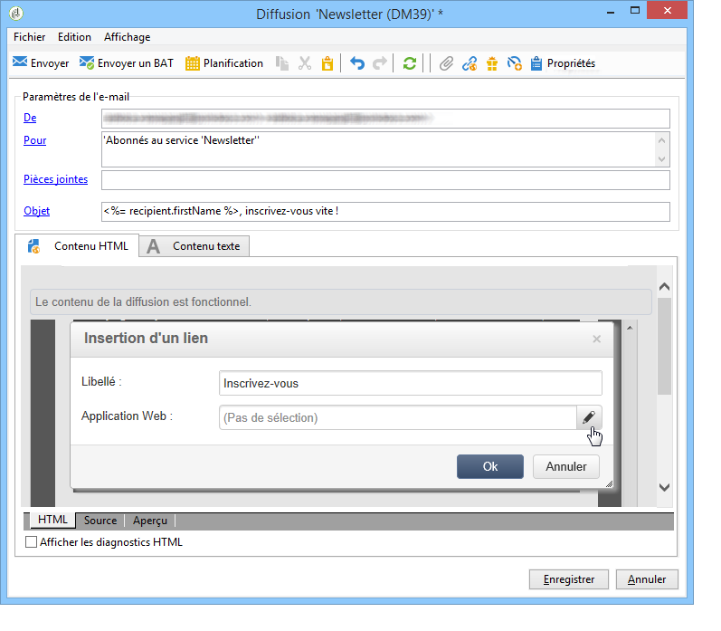

# Cas d’utilisation : créer une diffusion e-mail{#use-case-creating-an-email-delivery}

Dans ce cas d’utilisation, vous apprendrez à concevoir une diffusion par email à l’aide du Digital Content Editor (DCE) d’Adobe Campaign.

Notre objectif final est d&#39;obtenir une diffusion partant d&#39;un modèle personnalisé contenant :

* une adresse directe au destinataire (utilisant ses nom et prénom),
* deux types de liens vers une URL externe,
* une page miroir,
* un lien vers une application web.

>[!NOTE]
>
>Avant de commencer, vous devez avoir en votre possession au moins un **modèle HTML** prêt à accueillir le contenu de vos futures diffusions.
>
>Dans les **[!UICONTROL Propriétés]** de diffusion, vérifiez que le **[!UICONTROL Mode d’édition du contenu]** (dans l’onglet **[!UICONTROL Avancé]**) est défini sur **[!UICONTROL DCE]**. Pour garantir le fonctionnement optimal de l’éditeur, consultez les [Bonnes pratiques relatives à l’édition de contenu](content-editing-best-practices.md).

## Etape 1 - Créer une diffusion {#step-1---creating-a-delivery}

Pour créer une diffusion, placez le curseur dans l’onglet **Campagnes** et cliquez sur **Diffusions**. Cliquez ensuite sur le bouton **Créer** au-dessus de la liste des diffusions existantes. Pour plus d’informations sur la création de diffusions, consultez [cette page](../../delivery/using/about-email-channel.md).

## Etape 2 - Sélectionner un modèle {#step-2---selecting-a-template}

Sélectionnez un modèle de diffusion, puis nommez votre diffusion. Ce nom sera visible uniquement par les utilisateurs de la console Adobe Campaign et non par vos destinataires mais cet intitulé s&#39;affichera dans la liste de vos diffusions. Cliquez sur **[!UICONTROL Continuer]**.

## Etape 3 - Sélectionner un contenu {#step-3---selecting-a-content}

Le Digital Content Editor est livré avec plusieurs modèles d&#39;usine aux structures variables (colonnes, zones de textes, etc.).

Sélectionnez le modèle de contenu qui vous convient, puis cliquez sur le bouton **[!UICONTROL Commencer avec le contenu sélectionné]** afin d’afficher le modèle dans la diffusion créée.

Vous pouvez également importer du contenu HTML créé en dehors d&#39;Adobe Campaign en sélectionnant l&#39;option **[!UICONTROL A partir d&#39;un fichier]**.

Il est possible d&#39;enregistrer ce contenu en tant que modèle pour le réutiliser ultérieurement. Lorsqu&#39;un modèle de contenu personnalisé est créé, son aperçu figure dans la liste des modèles. Voir à ce sujet la section [Gestion des modèles](template-management.md).

>[!CAUTION]
>
>Si vous utilisez l&#39;**interface web d&#39;Adobe Campaign**, vous devez importer un fichier .zip comportant le contenu HTML et les images associées.

## Etape 4 - Concevoir le message {#step-4---designing-the-message}

* Afficher les nom et prénom de vos destinataires

  Pour qu’un champ texte de votre diffusion contienne les noms et prénoms de vos destinataires, cliquez sur le champ texte de votre choix, puis positionnez le curseur à l’endroit exact où vous souhaitez les afficher. Cliquez sur la première icône de la barre d’outils pop-up, puis sur **[!UICONTROL Bloc de personnalisation]**. Sélectionnez **[!UICONTROL Salutations]**, puis cliquez sur **[!UICONTROL OK]**.

  

* Insérer un lien sur une image

  Afin de permettre aux destinataires de vos diffusions de se rendre sur une adresse externe depuis une image, cliquez sur l’image concernée afin d’afficher la barre d’outils pop-up, positionnez le curseur sur la première icône, puis cliquez sur **[!UICONTROL Lien vers une URL externe]**. Voir à ce sujet la section [Ajouter un lien](editing-content.md#adding-a-link).

  

  Saisissez l&#39;URL pour le lien dans le champ **URL** à l&#39;aide du format suivant **https://www.monURL.com**, puis confirmez.

  L&#39;adresse du lien est modifiable à tout moment dans la partie droite de la fenêtre.

* Insérer un lien sur du texte

  Afin d’intégrer au texte de votre diffusion un lien vers une URL externe, sélectionnez du texte ou un bloc de texte, puis cliquez sur la première icône de la barre d’outils pop-up. Cliquez sur **[!UICONTROL Lien vers une URL externe]**, saisissez l’adresse de destination du lien dans le champs **[!UICONTROL URL]**. Pour plus d’informations, voir [Ajout d’un lien](editing-content.md#adding-a-link).

  L&#39;adresse du lien est modifiable à tout moment dans la partie droite de la fenêtre.

  >[!CAUTION]
  >
  >Le texte saisi dans le champ **[!UICONTROL Libellé]** remplace le texte initial.

* Ajouter une page miroir

  Pour permettre à vos destinataires d&#39;accéder au contenu de votre diffusion sur un navigateur Web, il vous est possible d&#39;intégrer à votre diffusion un lien vers une page Web miroir.

  Cliquez sur le champ texte dans lequel vous souhaitez voir figurer le lien vers la page miroir. Cliquez sur la première icône de la barre d’outils pop-up, sélectionnez **[!UICONTROL Bloc de personnalisation]**, puis **[!UICONTROL Lien vers la page miroir (MirrorPage)]**. Validez en cliquant sur **[!UICONTROL Enregistrer]**.

  

  >[!CAUTION]
  >
  >Le libellé du bloc de personnalisation remplace automatiquement le texte intial inscrit dans votre diffusion.

* Intégrer un lien vers une application Web

  Le Digital Content Editor vous permet d&#39;intégrer des liens vers les applications Web de votre console Adobe Campaign, telles qu&#39;une landing page ou une page de formulaire. Voir à ce sujet la section [Lien vers une application web](editing-content.md#link-to-a-web-application).

  Sélectionnez un champ texte dans lequel figurera votre lien vers l&#39;application Web, puis cliquez sur la première icône. Choisissez **[!UICONTROL Lien vers une application Web]**, puis sélectionnez l&#39;application souhaitée en cliquant sur l&#39;icône située à la fin du champ **Application Web**.

  

  Cliquez sur **Enregistrer** pour valider.

  >[!NOTE]
  >
  >Cette étape nécessite l&#39;enregistrement préalable d&#39;au moins une application web. Vous trouverez ces informations dans l’onglet **[!UICONTROL Campagnes > Applications web]** de votre console.

## Etape 5 - Enregistrer la diffusion {#step-5---saving-the-delivery}

Une fois le contenu intégré, enregistrez la diffusion en cliquant sur **Enregistrer**. Elle s’affichera désormais dans votre liste de diffusions, sous l’onglet **[!UICONTROL Campagnes > Diffusions]**.
