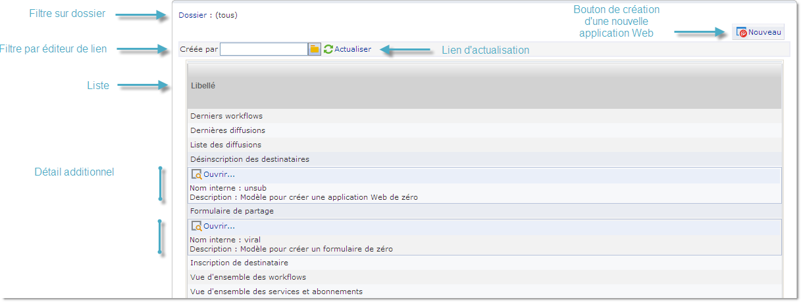
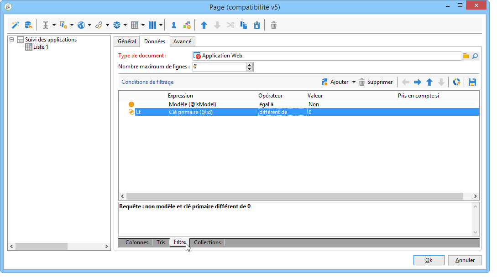
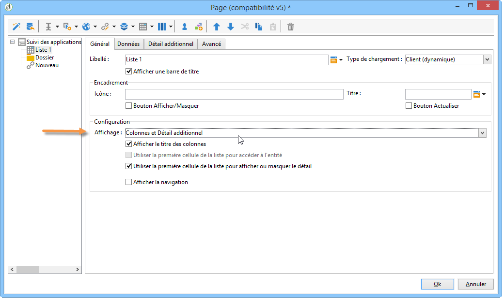
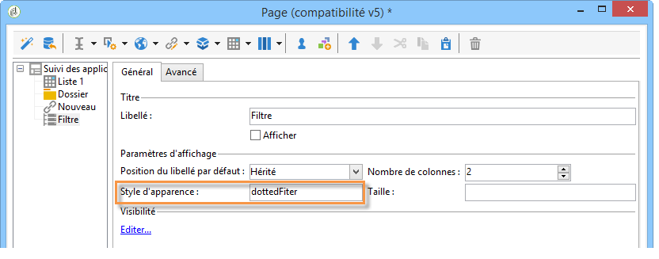
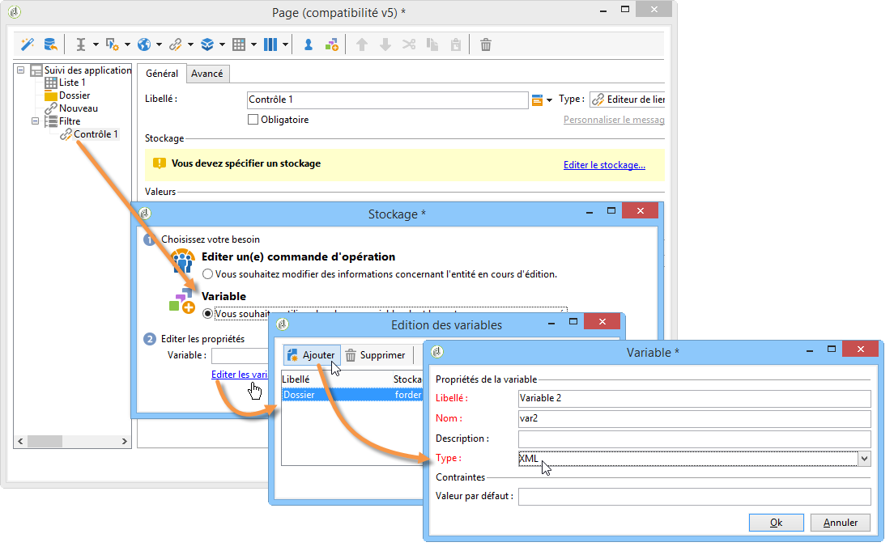
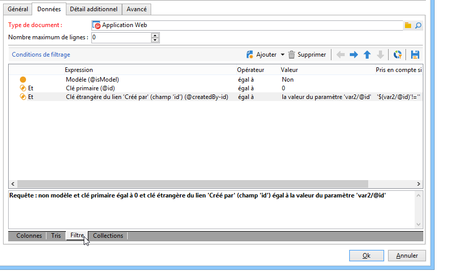
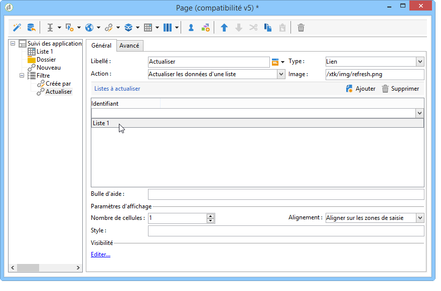
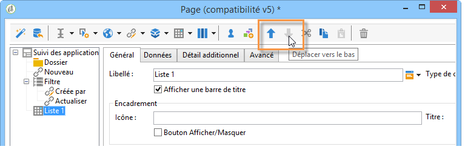
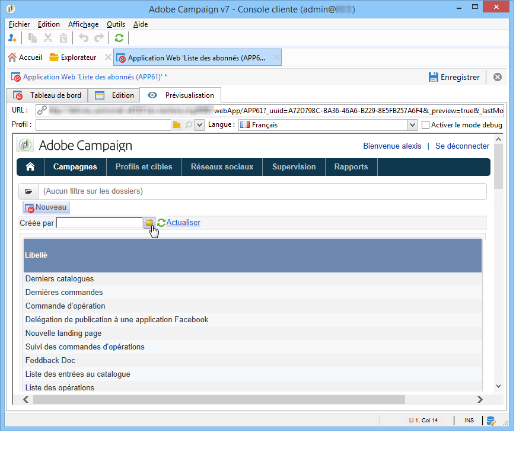

# Cas pratiques : création de vues d&#39;ensemble{#use-cases-creating-overviews}

Dans l&#39;exemple qui suit, vous allez créer des applications web de type vue d&#39;ensemble permettant d&#39;afficher l&#39;ensemble des applications web contenues dans votre base. Vous allez paramétrer les éléments suivants :

* un filtre sur le dossier (voir [Ajout d&#39;un filtre sur un dossier](#adding-a-filter-on-a-folder)),
* un bouton permettant de créer une application Web (voir [Ajout d&#39;un bouton pour configurer une nouvelle application](#adding-a-button-to-configure-a-new-web-application)Web),
* affichage détaillé de chaque entrée de la liste (voir [Ajout de détails à une liste](#adding-detail-to-a-list)),
* un filtre par outil de modification des liens (voir [Création d’un filtre à l’aide d’un éditeur](#creating-a-filter-using-a-link-editor)de liens),
* un lien d’actualisation (voir [Création d’un lien](#creating-a-refresh-link)d’actualisation).



## Créer une application Web mono-page {#creating-a-single-page-web-application}

1. Créez une application Web constituée d&#39;une seule activité **[!UICONTROL Page]** et désactivez les transitions sortantes et le passage à la page suivante.

   

1. Modifiez le titre de votre page.

   C&#39;est ce titre qui apparaîtra en tête de la vue d&#39;ensemble, ainsi que dans l&#39;aperçu de l&#39;application web.

1. In the Web application properties, modify the rendering of your application by selecting the **[!UICONTROL Single-page Web application]** template.

   

1. Open the **[!UICONTROL Page]** activity of your Web application and open a list (**[!UICONTROL Static element > List]**).
1. Dans l’ **[!UICONTROL Data]** onglet de votre liste, sélectionnez le type de **[!UICONTROL Web applications]** document et les colonnes **[!UICONTROL Label]** , **[!UICONTROL Creation date]** et **[!UICONTROL Type of application]** de sortie.
1. In the **[!UICONTROL Filter]** sub-tab, create the following filter as shown below in order to display Web applications only and exclude templates from your view.

   

1. Close the configuration window of your page and click **[!UICONTROL Preview]**.

   La liste des applications Web disponibles dans votre base de données s&#39;affiche.

   

## Ajouter un filtre sur dossier {#adding-a-filter-on-a-folder}

Dans une vue d&#39;ensemble, vous pouvez choisir d&#39;accéder à certaines données en fonction de leur emplacement dans l&#39;arborescence Adobe Campaign. Il s&#39;agit d&#39;un filtre sur dossier. Procédez comme suit pour l&#39;ajouter dans votre vue d&#39;ensemble.

1. Placez votre curseur sur le **[!UICONTROL Page]** noeud de votre application Web et ajoutez un **[!UICONTROL Select folder]** élément (**[!UICONTROL Advanced controls > Select folder]**).
1. Dans la **[!UICONTROL Storage]** fenêtre qui s&#39;affiche, cliquez sur le **[!UICONTROL Edit variables]** lien.
1. Modifiez le libellé de la variable à votre convenance.
1. Modifiez le nom de la variable avec la valeur **folder**.

   >[!NOTE]
   >
   >Le nom de la variable doit correspondre au nom de l’élément lié au dossier (défini dans le schéma), c’est-à-dire **dossier** dans ce cas. Vous devez réutiliser ce nom lorsque vous référencez le tableau.

1. Appliquez le type **[!UICONTROL XML]** à la variable.

   

1. Sélectionnez l’ **[!UICONTROL Refresh page]** interaction.

   

1. Placez votre curseur sur votre liste, puis dans l’ **[!UICONTROL Advanced]** onglet, référencez la variable précédemment créée dans l’ **[!UICONTROL Folder filter XPath]** onglet de la liste. Vous devez utiliser le nom de l’élément concerné par le lien du dossier, c’est-à-dire le **dossier**.

   

   >[!NOTE]
   >
   >A ce stade, l&#39;application Web n&#39;est pas dans son contexte d&#39;application, il n&#39;est donc pas possible de tester le filtre sur dossier.

## Ajouter un bouton pour paramétrer une nouvelle application web {#adding-a-button-to-configure-a-new-web-application}

1. Placez votre curseur sur l’ **[!UICONTROL Page]** élément et ajoutez un lien (**[!UICONTROL Static elements > Link]**).
1. Modifiez le libellé du lien car il apparaîtra sur le bouton dans la vue d&#39;ensemble.

   Dans notre exemple, le libellé est **Nouveau**.

1. Insert the following URL in the URL field: **xtk://open/?schema=nms:webApp&amp;form=nms:newWebApp**.

   >[!NOTE]
   >
   >**nms:webApp** coïncide avec le schéma d&#39;application Web.
   >
   >**nms:newWebApp** coïncide avec le nouvel assistant de création d&#39;applications Web.

1. Choisissez d&#39;afficher l&#39;URL dans la même fenêtre.
1. Add the Web application icon in the image field: **/nms/img/webApp.png**.

   This icon will appear on the **[!UICONTROL New]** button.

1. Entrez **button** dans le champ **[!UICONTROL Style]**.

   This style is referred to in the **[!UICONTROL Single-page Web application]** template selected previously.

   

## Ajouter un détail à une liste {#adding-detail-to-a-list}

Lorsque vous paramétrez une liste dans votre vue d&#39;ensemble, vous pouvez choisir d&#39;afficher des détails supplémentaires pour chaque entrée de votre liste.

1. Positionnez-vous sur votre élément liste créé précédemment.
1. Dans l’ **[!UICONTROL General]** onglet, sélectionnez le mode **[!UICONTROL Columns and additional detail]** d’affichage dans la liste déroulante.

   

1. Dans l’ **[!UICONTROL Data]** onglet, ajoutez les colonnes **[!UICONTROL Primary key]** , **[!UICONTROL Internal name]** et **[!UICONTROL Description]** et sélectionnez l’ **[!UICONTROL Hidden field]** option correspondante.

   

   De cette façon, ces informations ne seront visibles qu&#39;au niveau du détail de chaque entrée.

1. In the **[!UICONTROL Additional detail]** tab, add the following code:

   ```
   <div class="detailBox">
     <div class="actionBox">
       <span class="action"><a title="Open" class="linkAction" href="xtk://open/?schema=nms:webApp&form=nms:webApp&pk=
       <%=webApp.id%>">Open...</a></span>
       <% 
       if( webApp.@appType == 1 ) { //survey
       %>
       <span class="action"><a target="_blank" title="Reports" class="linkAction" href="/xtk/report.jssp?_context=selection&
         _schema=nms:webApp&_selection=<%=webApp.@id%>
         &__sessiontoken=<%=document.controller.getSessionToken()%>">Reports</a></span>
       <% 
       } 
       %>
     </div>
     <div>
       Internal name: <%= webApp.@internalName %>
     </div>
     <%
     if( webApp.desc != "" )
     {
     %>
     <div>
       Description: <%= webApp.desc %>
     </div>
     <% 
     } 
     %>
   </div>
   ```

>[!NOTE]
>
>Les librairies Javascript mettent cinq minutes à se rafraîchir sur le serveur. Vous pouvez redémarrer le serveur pour ne pas attendre ce délai.

## Filtrer et actualiser la liste {#filtering-and-updating-the-list}

Dans cette section, vous allez créer un filtre afin d&#39;afficher dans la vue d&#39;ensemble les applications Web créées par un opérateur spécifique. Ce filtre se fait à l&#39;aide d&#39;un éditeur de liens. D&#39;autre part, une fois l&#39;opérateur choisi, il vous faudra actualiser la liste pour appliquer votre filtre, d&#39;où la nécessité de créer un lien d&#39;actualisation.

Ces deux éléments seront rassemblés dans un même conteneur afin de les regrouper graphiquement dans la vue d&#39;ensemble.

1. Place your cursor on the **[!UICONTROL Page]** element and select **[!UICONTROL Container > Standard]**.
1. Paramétrez le nombre de colonnes à **2**, afin que l&#39;éditeur de lien et le lien soient côte à côte.

   

   Pour la mise en page des éléments, reportez-vous à [cette section](../../web/using/about-web-forms.md).

1. Appliquez **dottedFilter**.

   This style is referred to in the **[!UICONTROL Single-page Web applicatio]** n template selected previously.

   

### Créer un filtre à l&#39;aide d&#39;un éditeur de lien {#creating-a-filter-using-a-link-editor}

1. Place your cursor on the container created during the previous stage and insert a link editor via the **[!UICONTROL Advanced controls]** menu.
1. In the storage window which opens automatically, select the **[!UICONTROL Variables]** option, then click the **[!UICONTROL Edit variables]** link and create an XML variable for filtering data.

   

1. Modifiez le libellé.

   It will appear next to the **[!UICONTROL Filter]** field in the overview.

1. Choisissez la table des Opérateurs comme schéma d&#39;application.

   

1. Place your cursor on the list element and create a filter via the **[!UICONTROL Data > Filter]** tab:

   * **Expression :** clé étrangère du lien &#39;Créé par&#39;
   * **Opérateur :** égal à
   * **Valeur :** variables (variables)
   * **Pris en compte si :** &#39;$(var2/@id)&#39;!=&#39;&#39;
   

>[!CAUTION]
>
>L&#39;utilisateur de l&#39;application Web doit être un opérateur identifié et avec les droits adéquats dans Adobe Campaign pour avoir accès aux informations. Ce type de paramétrage ne fonctionnera pas dans le cas d&#39;une application Web anonyme.

### Créer un lien d&#39;actualisation {#creating-a-refresh-link}

1. Place the cursor on the container and insert a **[!UICONTROL Link]** via the **[!UICONTROL Static elements]** menu.
1. Modifiez le libellé.
1. Sélectionner **[!UICONTROL Refresh data in a list]**.
1. Ajoutez la liste créée précédemment.

   

1. Add the refresh icon on the **[!UICONTROL Image]** field: **/xtk/img/refresh.png **.
1. Positionnez les différents éléments de votre application web dans l&#39;ordre comme illustré ci-dessous à l&#39;aide des flèches de déplacement.

   

L&#39;application Web est maintenant configurée. Vous pouvez cliquer sur l’ **[!UICONTROL Preview]** onglet pour le prévisualiser.



