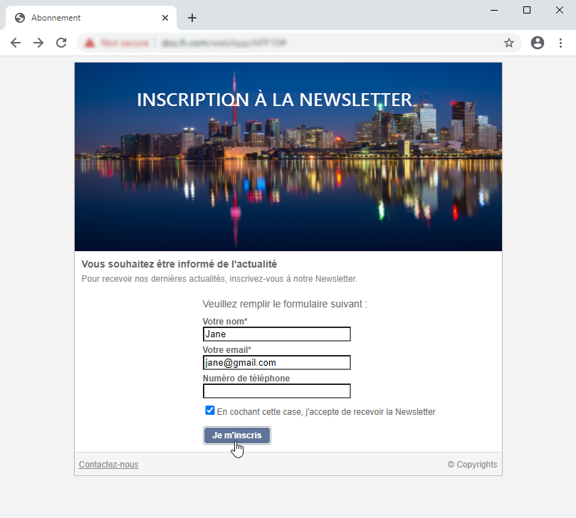

# Cas pratiques : formulaires web{#use-cases-web-forms}

## Créer un formulaire d&#39;abonnement avec double opt-in {#create-a-subscription--form-with-double-opt-in}

Lorsque vous proposez des services d&#39;information, les destinataires doivent être abonnés pour recevoir les communications associées. Afin de vous prémunir contre toute communication abusive, et vous assurer que le destinataire est bien à l&#39;origine de l&#39;abonnement, il est vivement recommandé d&#39;envoyer un message de confirmation d&#39;inscription, et ainsi mettre en place un abonnement en double opt-in. L&#39;inscription ne sera effective qu&#39;une fois que l&#39;utilisateur a cliqué sur le lien proposé dans le message de confirmation.

Le scénario mis en oeuvre dans cet exemple est le suivant :

1. Création d&#39;un formulaire d&#39;inscription à la newsletter sur un site web contenant une case d&#39;abonnement à un service temporaire. Ce service permettra de diffuser les messages de confirmation d&#39;abonnement.
1. Création de la diffusion de confirmation d&#39;abonnement avec un modèle de diffusion associé au formulaire web. Elle contient le lien de confirmation rappelant le formulaire qui abonne à la newsletter et affiche un message de validation de l&#39;inscription.

### Etape 1 - Créer les services d&#39;information {#step-1---creating-information-services}

1. Créez le service d&#39;abonnement à la newsletter que vous souhaitez proposer à vos destinataires. Pour plus d&#39;informations sur la création d&#39;une newsletter, consultez [cette section](../../delivery/using/about-services-and-subscriptions.md).

   

1. Créez un second service d&#39;information, un service temporaire associé à un modèle de diffusion pour adresser les messages de confirmation d&#39;abonnement.

   

### Etape 2 - Créer les messages de confirmation {#step-2---creating-confirmation-messages}

Les messages de confirmation sont adressés via un modèle de diffusion dédié, référencé au niveau du service temporaire.

1. Dans l&#39;**[!UICONTROL Explorateur]**, sélectionnez **[!UICONTROL Ressources > Modèles > Modèles de diffusion]**.
1. Créez un modèle de diffusion pour adresser les messages de confirmation d&#39;abonnement.
1. Cliquez sur le bouton **[!UICONTROL Pour]** dans les **[!UICONTROL Paramètres de l&#39;e-mail]** pour associer le modèle de diffusion au mapping de ciblage Abonnements au lieu de Destinataires.

   

1. Les destinataires de cette diffusion n&#39;ayant pas encore confirmé leur approbation, ils sont encore blacklistés dans la base. Pour qu&#39;ils puissent toutefois recevoir cette communication, vous devez autoriser les diffusions basées sur ce modèle à cibler les destinataires blacklistés.

   Pour cela, cliquez sur l&#39;onglet **[!UICONTROL Exclusions]**.

1. Cliquez sur le lien **[!UICONTROL Editer...]** et désélectionnez l&#39;option **[!UICONTROL Exclure les destinataires ne souhaitant plus être contactés (blackliste)]**.

   

   >[!CAUTION]
   >
   >Cette option ne doit être désactivée que dans des contextes spécifiques, comme ici.

1. Personnalisez votre diffusion et insérez le lien de confirmation dans le contenu du message. Ce lien permet d&#39;accéder au formulaire web afin qu&#39;il enregistre la confirmation d&#39;abonnement.

   

1. A l&#39;aide du DCE, associez l&#39;URL au formulaire web. Comme le formulaire web n&#39;est pas encore créé, remplacez la valeur dès sa création.

   

1. Associez enfin ce modèle au service temporaire créé précédemment.

   

### Etape 3 - Créer le formulaire d&#39;inscription {#step-3---creating-the-subscription-form}

Le formulaire web permet à la fois l&#39;inscription et la confirmation de l&#39;inscription des destinataires.

Le workflow du formulaire web contiendra les activités suivantes :


Pour ce faire, procédez comme suit :

1. Créez un formulaire Web et sélectionnez le modèle **[!UICONTROL Inscription à la Newsletter (subNewsletter)]**.

   

1. Dans l&#39;onglet **[!UICONTROL Edition]**, nous devons configurer le workflow existant, dans la mesure où nous souhaitons ajouter un message de confirmation pour les destinataires qui souhaitent s&#39;inscrire.

   Pour cela, double-cliquez sur l&#39;activité **[!UICONTROL Pré-chargement]** et configurez-la comme suit.

   

   Ainsi, si l&#39;utilisateur accède à ce formulaire au travers du lien proposé dans le message de confirmation, alors les informations de son profil seront chargées. Dans le cas contraire, s&#39;il accède au formulaire Web via une page du site, alors aucune information ne sera chargée.

1. Ajoutez une activité **[!UICONTROL Test]** à votre workflow.

   

   L&#39;activité **[!UICONTROL Test]** peut s&#39;appliquer à l&#39;email des destinataires. Dans ce cas, configurez-la comme suit :

   

1. Ajoutez deux activités **[!UICONTROL Script]** à votre workflow.

   

   La première activité **[!UICONTROL Script]** blackliste les destinataires jusqu&#39;à ce qu&#39;ils valident leur inscription à la newsletter. Son contenu doit être le suivant :

   ```
   ctx.recipient.@blackList=1
   ```

   

   La seconde activité **[!UICONTROL Script]** autorise l&#39;envoi des diffusions aux utilisateurs et les inscrit à la newsletter. Les deux dernières lignes du script permet de transférer les destinataires du dossier Temp vers un autre dossier et de les réconcilier avec les profils existants dès validation de l&#39;inscription.

   ```
   ctx.recipient.@blackList=0
   nms.subscription.Subscribe("INTERNAL_NAME_OF_THE_NEWSLETTER", ctx.recipient, false)
   ctx.recipient.folder = <folder name="nmsRootRecipient"/>
   nms.subscription.Unsubscribe("TEMP", ctx.recipient)
   ```

   >[!NOTE]
   >
   >La partition **[!UICONTROL Temp]** peut être régulièrement purgée de son contenu à l&#39;aide d&#39;un workflow.

   

1. Double-cliquez sur l&#39;activité **[!UICONTROL Inscription]** pour personnaliser le formulaire d&#39;inscription et associer une case à cocher au service temporaire créé précédemment.

   

1. Configurez l&#39;activité **[!UICONTROL Enregistrement]** afin de sauvegarder les informations renseignées dans la page du formulaire.

   Cette activité permet de créer les profils de destinataires dans un dossier temporaire dédié afin de les différencier des profils en base, auxquels des communications peuvent être adressées.

   

   >[!NOTE]
   >
   >Vous ne devez pas définir d&#39;options de réconciliation.

1. Ajoutez deux activités **[!UICONTROL Fin]** pour afficher un message à l&#39;intention de l&#39;utilisateur.

   La seconde activité **[!UICONTROL Fin]** affichera le message de confirmation une fois l&#39;inscription terminée.

   

1. Une fois le formulaire web créé et paramétré, vous pouvez le référencer dans le modèle de diffusion pour l&#39;envoi des messages de confirmation.

   

### Etape 4 - Publier et tester le formulaire {#step-4---publishing-and-testing-the-form}

Vous pouvez maintenant publier le formulaire afin de le rendre accessible aux utilisateurs.


Ainsi, l&#39;inscription à la newsletter est réalisée selon les étapes suivantes :

1. L&#39;utilisateur du site Web se connecte à la page d&#39;abonnement et valide le formulaire.

   

   Il est informé de la prise en compte de sa demande via un message affiché dans son navigateur.

   

   A cette étape, l&#39;utilisateur est ajouté dans la base Adobe Campaign, dans le dossier **[!UICONTROL Temp]**, et son profil est blacklisté jusqu&#39;à ce qu&#39;il valide son inscription à l&#39;aide de l&#39;email.

   

1. Un message de confirmation lui est adressé avec un lien pour valider définitivement son inscription.

   

1. Lorsqu&#39;il clique sur ce lien, la page de validation est affichée dans son navigateur.

   

   Dans Adobe Campaign, le profil de l&#39;utilisateur est mis à jour :

   * il n&#39;est plus blacklisté,
   * il est abonné au service d&#39;information.

      

## Afficher différentes options en fonction de la valeur sélectionnée {#displaying-different-options-depending-on-the-selected-values}

Dans l&#39;exemple suivant, l&#39;utilisateur est invité à choisir un type de véhicule. Vous pouvez afficher les catégories de véhicules disponibles en fonction du type sélectionné. Ainsi, les éléments affichés dans la colonne de droite dépendent de la sélection de l&#39;utilisateur :


* Lorsqu&#39;il sélectionne un véhicule particulier, il pourra choisir entre un véhicule &quot;Voiture individuelle&quot; ou &quot;Monospace&quot; :

   

* Lorsqu&#39;il sélectionne un véhicule professionnel, il pourra choisir parmi les utilitaires de la liste déroulante :

   

Dans cet exemple, le type de véhicule n&#39;est pas stocké dans la base de données : la liste déroulante correspondante est paramétrée comme suit :


Cette information est stockée dans une variable locale.

Le conditionnement de l&#39;affichage de la colonne de droite est paramétré au niveau des conteneurs :


* Conditionnement de la visibilité des champs pour un véhicule personnel :

   

* Conditionnement de la visibilité des champs pour un véhicule professionnel :

   

