# Cas d’utilisation : création de pages de vue d’ensemble{#use-cases-creating-overviews}


Dans l&#39;exemple qui suit, vous allez créer des applications web de type vue d&#39;ensemble permettant d&#39;afficher l&#39;ensemble des applications web contenues dans votre base. Vous allez paramétrer les éléments suivants :

* un filtre sur le dossier (voir la section [Ajouter un filtre sur dossier](#adding-a-filter-on-a-folder)),
* un bouton permettant de créer une application web (voir la section [Ajouter un bouton pour paramétrer une nouvelle application web](#adding-a-button-to-configure-a-new-web-application)),
* l’affichage détaillé de chaque entrée de la liste (voir la section [Ajouter un détail à une liste](#adding-detail-to-a-list)),
* un filtre par outil d’édition de lien (voir la section [Créer un filtre à l’aide d’un éditeur de lien](#creating-a-filter-using-a-link-editor)),
* un lien d’actualisation (voir la section [Créer un lien d’actualisation](#creating-a-refresh-link)).

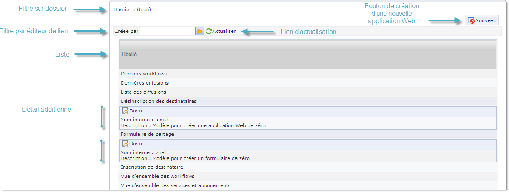

## Créer une application Web mono-page {#creating-a-single-page-web-application}

1. Créez une application Web constituée d&#39;une seule activité **[!UICONTROL Page]** et désactivez les transitions sortantes et le passage à la page suivante.

   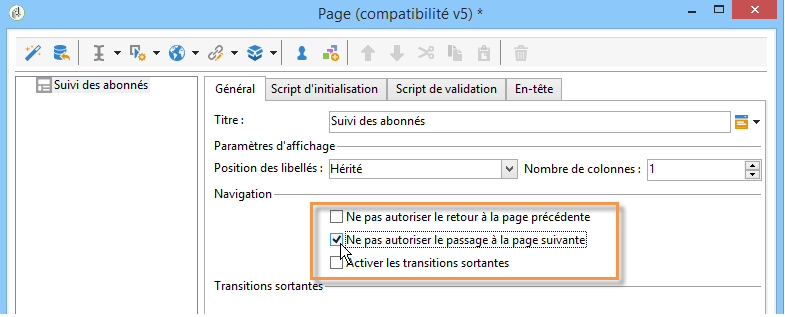

1. Modifiez le titre de votre page.

   C&#39;est ce titre qui apparaîtra dans l&#39;en-tête d&#39;aperçu, ainsi que dans l&#39;aperçu de l&#39;application web.

1. Dans les propriétés de l&#39;application web, modifiez le rendu de votre application web en sélectionnant le modèle **[!UICONTROL Application web Mono-page]**.

   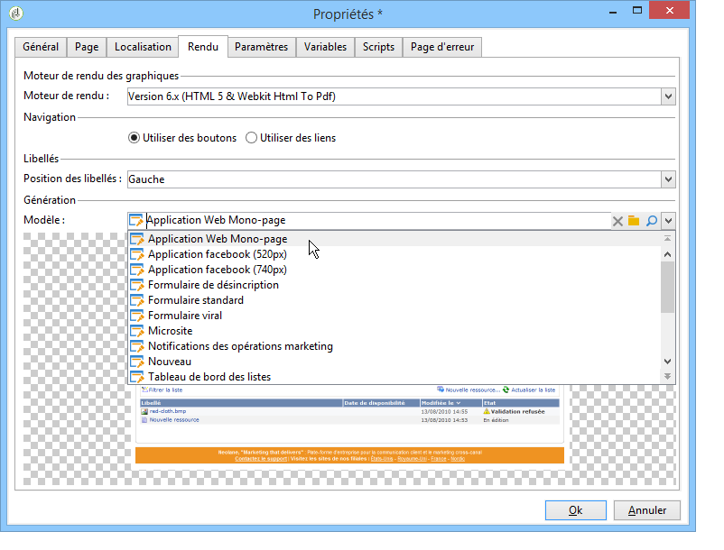

1. Ouvrez l&#39;activité **[!UICONTROL Page]** de votre application web et créez une liste (**[!UICONTROL Elément statique > Liste]**).
1. Dans l&#39;onglet **[!UICONTROL Données]** de votre liste, sélectionnez le type de document **[!UICONTROL Applications Web]** et les colonnes de sortie **[!UICONTROL Libellé]**, **[!UICONTROL Créé le]** et **[!UICONTROL Type d&#39;application]**.
1. Dans le sous-onglet **[!UICONTROL Filtre]**, créez le filtre suivant comme illustré ci-dessous pour n&#39;afficher que les applications web et exclure les modèles de votre vue.

   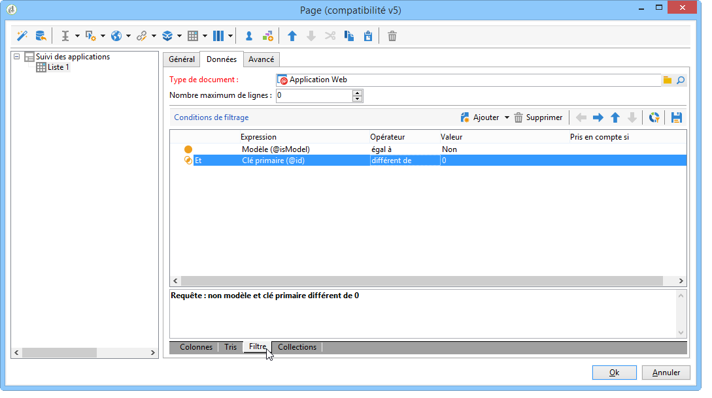

1. Fermez la fenêtre de paramétrage de votre page et cliquez sur **[!UICONTROL Prévisualisation]**.

   La liste des applications Web disponibles dans votre base de données s&#39;affiche.

   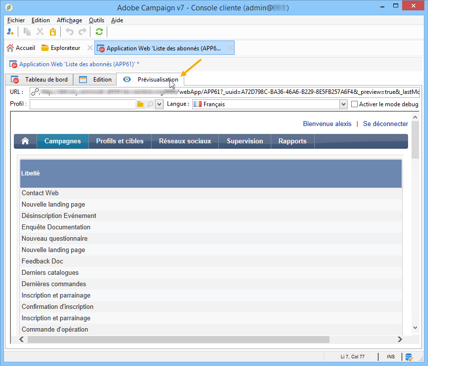

## Ajouter un filtre sur dossier {#adding-a-filter-on-a-folder}

Dans une vue d&#39;ensemble, vous pouvez choisir d&#39;accéder à certaines données en fonction de leur emplacement dans l&#39;arborescence Adobe Campaign. Il s&#39;agit d&#39;un filtre sur dossier. Procédez comme suit pour l&#39;ajouter dans votre vue d&#39;ensemble.

1. Positionnez-vous sur le noeud **[!UICONTROL Page]** de votre application Web et ajoutez un élément **[!UICONTROL Choix de dossier]** (**[!UICONTROL Contrôle avancés > Choix de dossier]**).
1. Dans la fenêtre **[!UICONTROL Stockage]** qui s&#39;affiche, cliquez sur le lien **[!UICONTROL Editer les variables]**.
1. Modifiez le libellé de la variable à votre convenance.
1. Modifiez le nom de la variable avec la valeur **folder**.

   >[!NOTE]
   >
   >Le nom de la variable doit correspondre au nom de l’élément lié au dossier (défini dans le schéma), c’est-à-dire le **dossier** dans ce cas. Vous devez réutiliser ce nom pour faire référence à la table.

1. Appliquez le type **[!UICONTROL XML]** à la variable.

   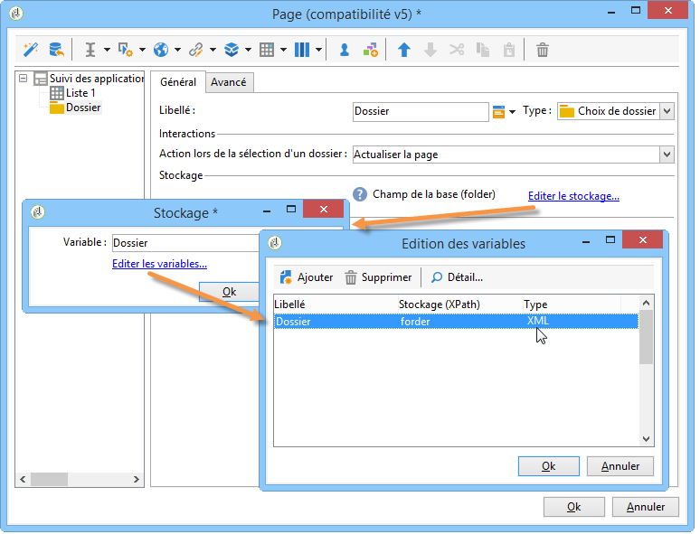

1. Sélectionnez l&#39;interaction **[!UICONTROL Actualiser la page]**.

   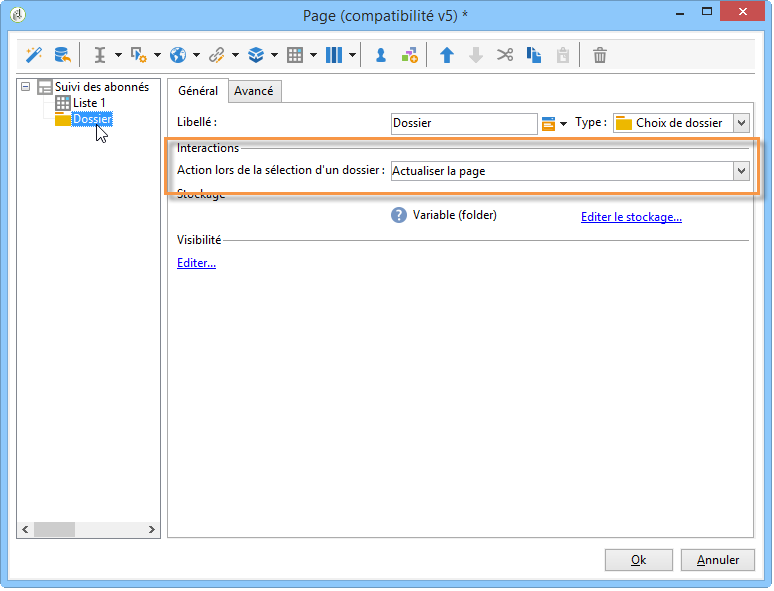

1. Placez le curseur sur votre liste et, dans l’onglet **[!UICONTROL Avancé]**, faites référence à la variable précédemment créée dans l’onglet **[!UICONTROL XPath de filtrage par dossier]** de la liste. Vous devez utiliser le nom de l’élément concerné par le lien du dossier, c’est-à-dire le **dossier**.

   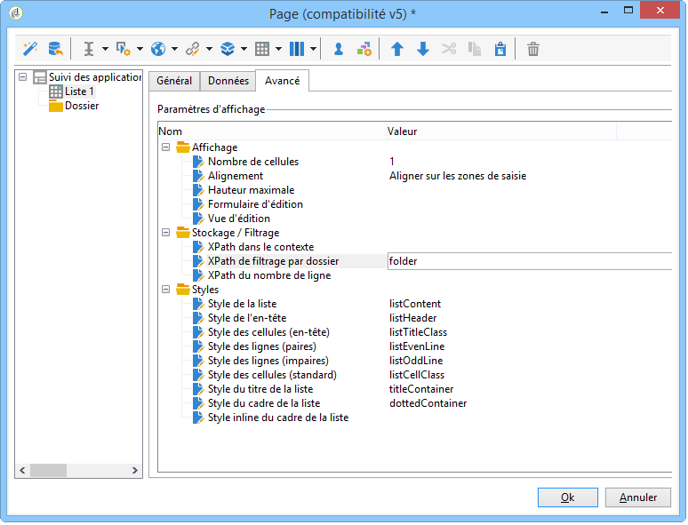

   >[!NOTE]
   >
   >A ce stade, l&#39;application Web n&#39;est pas dans son contexte d&#39;application, il n&#39;est donc pas possible de tester le filtre sur dossier.

## Ajouter un bouton pour paramétrer une nouvelle application web {#adding-a-button-to-configure-a-new-web-application}

1. Positionnez-vous sur l&#39;élément **[!UICONTROL Page]** et ajoutez un lien (**[!UICONTROL Eléments statiques > Lien]**).
1. Modifiez le libellé du lien car il apparaîtra sur le bouton dans la vue d&#39;ensemble.

   Dans notre exemple, le libellé est **Nouveau**.

1. Dans le champ URL, insérez l’URL suivante : **xtk://open/?schema=nms:webApp&amp;form=nms:newWebApp**.

   >[!NOTE]
   >
   >**nms:webApp** correspond au schéma des applications web.
   >
   >**nms:newWebApp** correspond à l’assistant de création de la nouvelle application Web.

1. Choisissez d&#39;afficher l&#39;URL dans la même fenêtre.
1. Ajoutez l’icône des applications web dans le champ image : **/nms/img/webApp.png**.

   Cette icône apparaîtra sur le bouton **[!UICONTROL Nouveau]**.

1. Entrez **button** dans le champ **[!UICONTROL Style]**.

   Ce style est référencé dans le modèle **[!UICONTROL Application Web Mono-page]** sélectionné précédemment.

   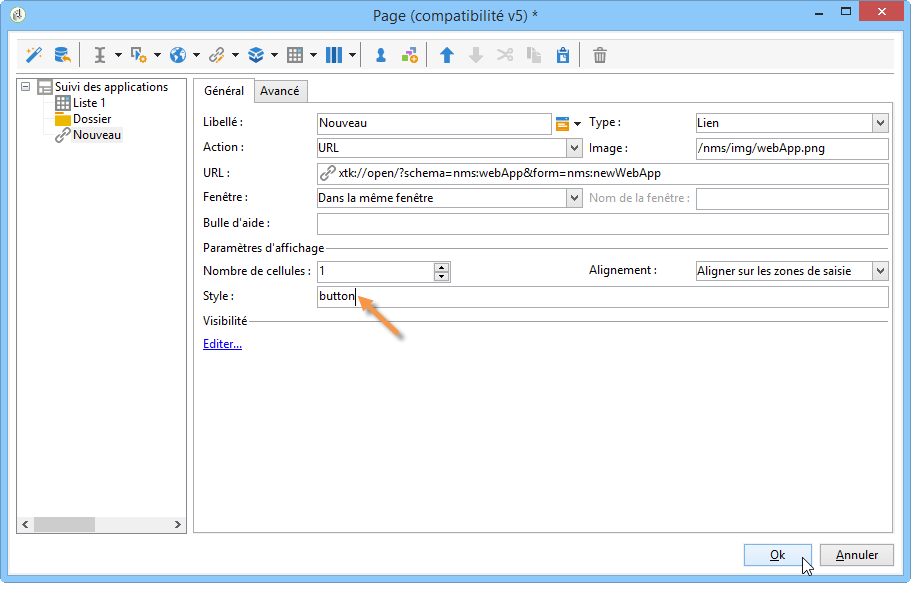

## Ajouter un détail à une liste {#adding-detail-to-a-list}

Lorsque vous paramétrez une liste dans votre vue d&#39;ensemble, vous pouvez choisir d&#39;afficher des détails supplémentaires pour chaque entrée de votre liste.

1. Positionnez-vous sur votre élément liste créé précédemment.
1. Dans l&#39;onglet **[!UICONTROL Général]**, sélectionnez le mode d&#39;affichage **[!UICONTROL Colonnes et détail additionnel]** dans la liste déroulante.

   

1. Dans l&#39;onglet **[!UICONTROL Données]**, ajoutez les colonnes **[!UICONTROL Clé primaire]**, **[!UICONTROL Nom interne]** et **[!UICONTROL Description]** et cochez l&#39;option **[!UICONTROL Champ non visible]** pour chacune d&#39;elles.

   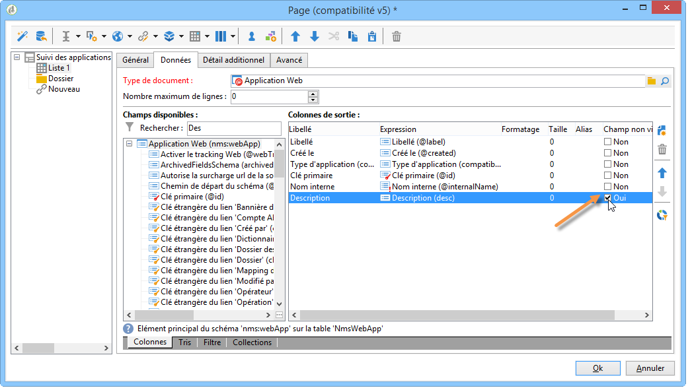

   De cette façon, ces informations ne seront visibles qu&#39;au niveau du détail de chaque entrée.

1. Dans l&#39;onglet **[!UICONTROL Détail additionnel]**, ajoutez le code suivant :

   ```
   <div class="detailBox">
     <div class="actionBox">
       <span class="action"><a title="Open" class="linkAction" href="xtk://open/?schema=nms:webApp&form=nms:webApp&pk=
       <%=webApp.id%>">Open...</a></span>
       <% 
       if( webApp.@appType == 1 ) { //survey
       %>
       <span class="action"><a target="_blank" title="Reports" class="linkAction" href="/xtk/report.jssp?_context=selection&
         _schema=nms:webApp&_selection=<%=webApp.@id%>
         &__sessiontoken=<%=document.controller.getSessionToken()%>">Reports</a></span>
       <% 
       } 
       %>
     </div>
     <div>
       Internal name: <%= webApp.@internalName %>
     </div>
     <%
     if( webApp.desc != "" )
     {
     %>
     <div>
       Description: <%= webApp.desc %>
     </div>
     <% 
     } 
     %>
   </div>
   ```

>[!NOTE]
>
>Les librairies Javascript mettent cinq minutes à se rafraîchir sur le serveur. Vous pouvez redémarrer le serveur pour ne pas attendre ce délai.

## Filtrer et actualiser la liste {#filtering-and-updating-the-list}

Dans cette section, vous allez créer un filtre afin d&#39;afficher dans la vue d&#39;ensemble les applications Web créées par un opérateur spécifique. Ce filtre se fait à l&#39;aide d&#39;un éditeur de liens. D&#39;autre part, une fois l&#39;opérateur choisi, il vous faudra actualiser la liste pour appliquer votre filtre, d&#39;où la nécessité de créer un lien d&#39;actualisation.

Ces deux éléments seront rassemblés dans un même conteneur afin de les regrouper graphiquement dans la vue d&#39;ensemble.

1. Positionnez-vous au niveau de l&#39;élément **[!UICONTROL Page]** et sélectionnez les menus **[!UICONTROL Conteneur > Standard]**.
1. Paramétrez le nombre de colonnes à **2**, afin que l&#39;éditeur de lien et le lien soient côte à côte.

   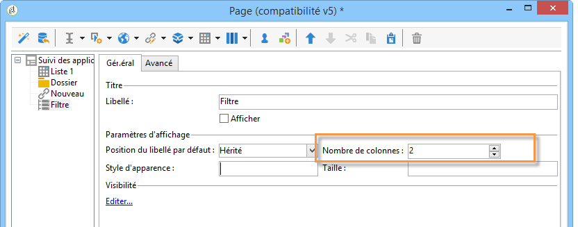

   Pour la disposition des éléments, reportez-vous à [cette section](about-web-forms.md).

1. Appliquez **dottedFilter**.

   Ce style est référencé dans le modèle **[!UICONTROL Application web mono-page]** sélectionné précédemment.

   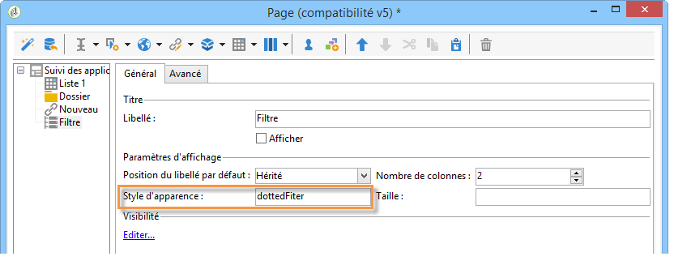

### Créer un filtre à l&#39;aide d&#39;un éditeur de lien {#creating-a-filter-using-a-link-editor}

1. Positionnez-vous sur le conteneur créé à l&#39;étape précédente et insérez un éditeur de lien depuis le menu **[!UICONTROL Contrôles avancés]**.
1. Dans la fenêtre de stockage qui s&#39;ouvre automatiquement, sélectionnez l&#39;option **[!UICONTROL Variable]** puis cliquez sur le lien **[!UICONTROL Editer les variables]** et créez une variable de type XML qui servira à filtrer les données.

   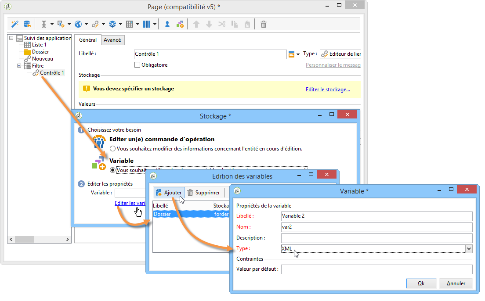

1. Modifiez le libellé.

   Il apparaîtra à côté du champ **[!UICONTROL Filtre]** dans la vue d&#39;ensemble.

1. Choisissez la table des Opérateurs comme schéma d&#39;application.

   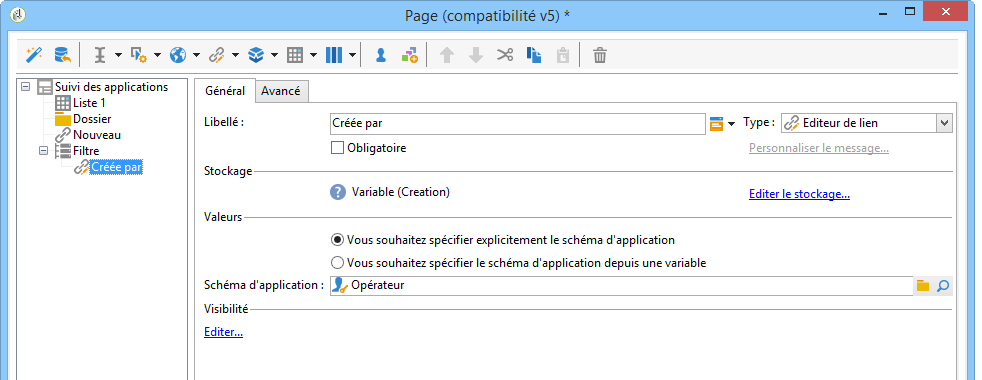

1. Positionnez-vous sur l&#39;élément liste et créez un filtre depuis l&#39;onglet **[!UICONTROL Données > Filtre]** :

   * **Expression :** clé étrangère du lien &#39;Créé par&#39;
   * **Opérateur :** égal à
   * **Valeur :** variables (variables)
   * **Pris en compte si :** &#39;$(var2/@id)&#39;!=&#39;&#39;

   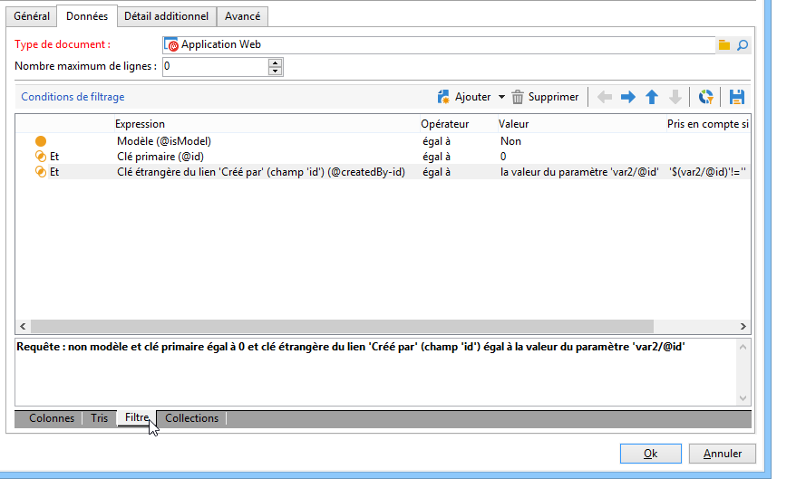

>[!CAUTION]
>
>L&#39;utilisateur de l&#39;application Web doit être un opérateur identifié et avec les droits adéquats dans Adobe Campaign pour avoir accès aux informations. Ce type de paramétrage ne fonctionnera pas dans le cas d&#39;une application Web anonyme.

### Créer un lien d&#39;actualisation {#creating-a-refresh-link}

1. Positionnez-vous au niveau du conteneur et insérez un **[!UICONTROL Lien]** depuis le menu **[!UICONTROL Elément statique]**.
1. Modifiez le libellé.
1. Choisissez l&#39;action **[!UICONTROL Actualiser les données d&#39;une liste]**.
1. Ajoutez la liste créée précédemment.

   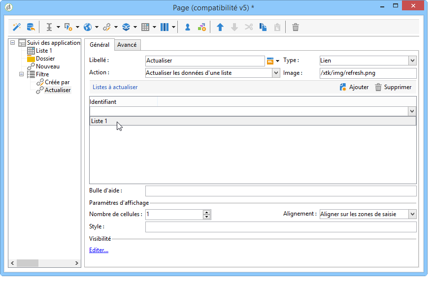

1. Ajoutez l&#39;icône d&#39;actualisation dans le champ **[!UICONTROL Image]** : **/xtk/img/refresh.png**.
1. Positionnez les différents éléments de votre application web dans l&#39;ordre comme illustré ci-dessous à l&#39;aide des flèches de déplacement.

   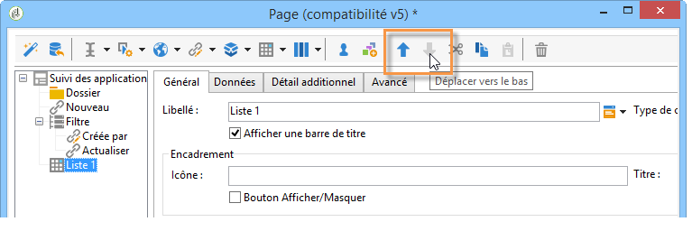

L&#39;application Web est maintenant paramétrée. Vous pouvez cliquer sur l&#39;onglet **[!UICONTROL Prévisualisation]** pour en avoir un aperçu.

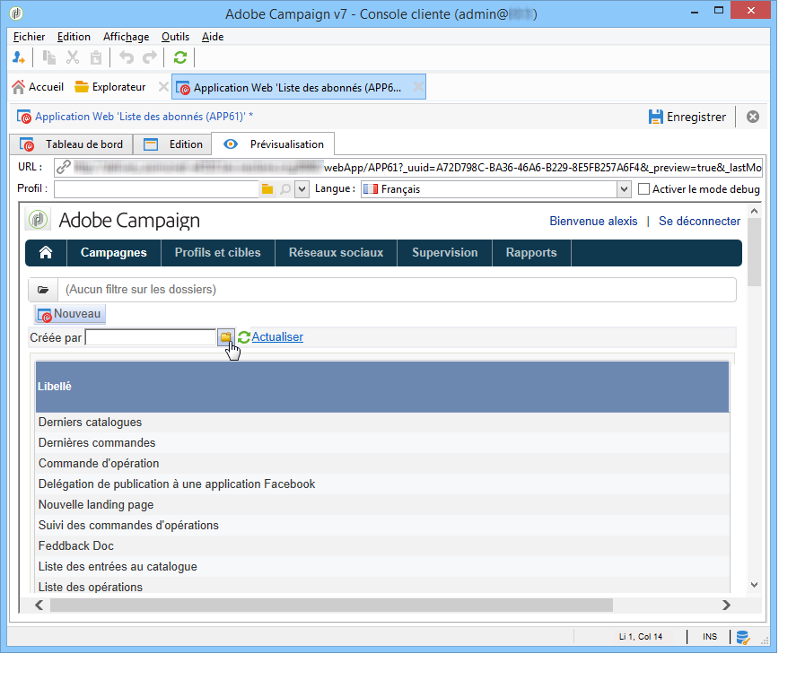
