# Cas pratiques : formulaires web{#use-cases-web-forms}


## Créer un formulaire d’abonnement avec double opt-in {#create-a-subscription--form-with-double-opt-in}

Lorsque vous proposez des services d’information, les destinataires doivent s’abonner pour recevoir toutes les communications liées. Pour éviter les communications incorrectes et nous assurer que le destinataire s&#39;est abonné intentionnellement, nous vous recommandons d&#39;envoyer une demande de confirmation d&#39;abonnement pour créer un double opt-in. L&#39;abonnement ne sera effectif qu&#39;une fois que l&#39;utilisateur aura cliqué sur le lien inclus dans le message de confirmation.

Le scénario mis en oeuvre dans cet exemple est le suivant :

1. Création d&#39;un formulaire d&#39;inscription à une newsletter sur un site web contenant une case à cocher pour s&#39;abonner à un service temporaire. Ce service vous permettra de diffuser des messages de confirmation d’abonnement.
1. Créer la diffusion de confirmation d&#39;inscription avec un modèle de diffusion associé au formulaire Web. Il contient le lien de confirmation qui appelle le formulaire pour l’abonnement à la newsletter et affiche un message de validation d’abonnement.

### Etape 1 - Créer les services d’information {#step-1---creating-information-services}

1. Créez le service d&#39;inscription à la newsletter qui sera proposé à vos destinataires. Pour plus d’informations sur la création d’une newsletter, reportez-vous à [cette section](../../delivery/using/about-services-and-subscriptions.md).

   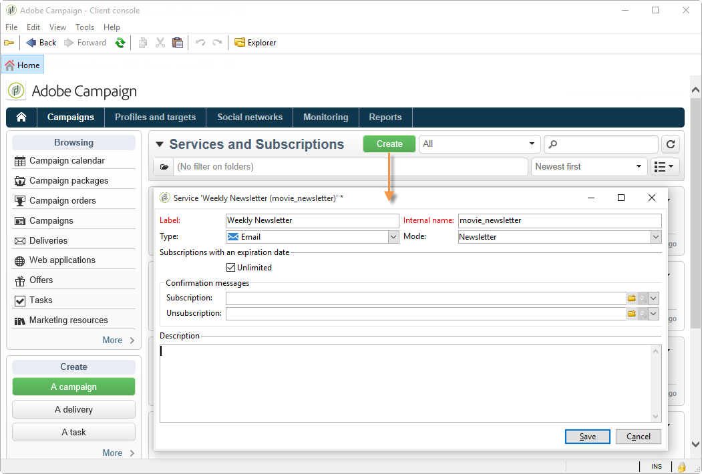

1. Créez un second service d’information, un service temporaire associé à un modèle de diffusion pour adresser les messages de confirmation d’abonnement.

   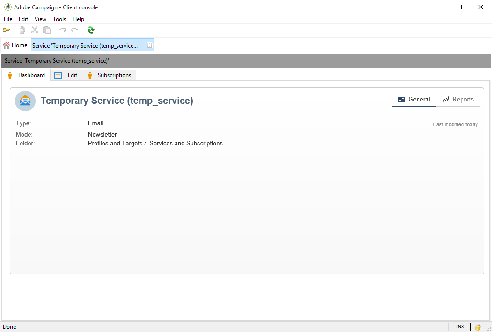

### Etape 2 - Créer les messages de confirmation {#step-2---creating-confirmation-messages}

Les messages de confirmation sont adressés via un modèle de diffusion dédié, référencé au niveau du service temporaire.

1. Dans l’**[!UICONTROL Explorateur]**, sélectionnez **[!UICONTROL Ressources > Modèles > Modèles de diffusion]**.
1. Créez un modèle de diffusion pour adresser les messages de confirmation d’abonnement.
1. Cliquez sur le bouton **[!UICONTROL Pour]** dans les **[!UICONTROL Paramètres de l’email]** pour associer le modèle de diffusion au mapping de ciblage Abonnements au lieu de Destinataires.

   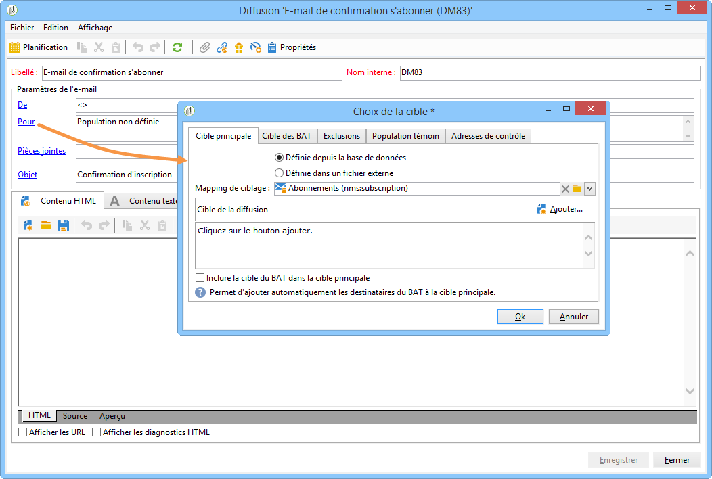

1. Comme les destinataires de cette diffusion n&#39;ont pas confirmé leur approbation, ils sont toujours sur la liste bloquée de la base de données. Pour qu&#39;ils puissent recevoir cette communication, vous devez autoriser les diffusions basées sur ce modèle pour les destinataires cibles qui se trouvent sur la liste bloquée.

   Pour cela, cliquez sur l&#39;onglet **[!UICONTROL Exclusions]**.

1. Cliquez sur le lien **[!UICONTROL Editer...]** et désélectionnez l&#39;option **[!UICONTROL Exclut les destinataires qui ne souhaitent plus être contactés]**.

   <!-- 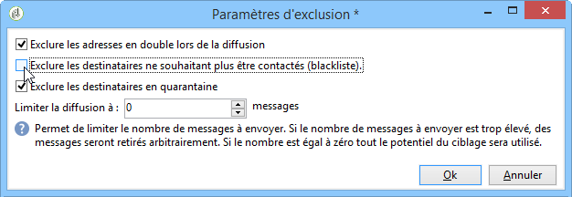-->

   >[!IMPORTANT]
   >
   >Cette option ne doit être désactivée que dans des contextes spécifiques, comme ici.

1. Personnalisez votre diffusion et insérez le lien de confirmation dans le contenu du message. Ce lien permet d&#39;accéder au formulaire Web pour enregistrer la confirmation d&#39;inscription.

   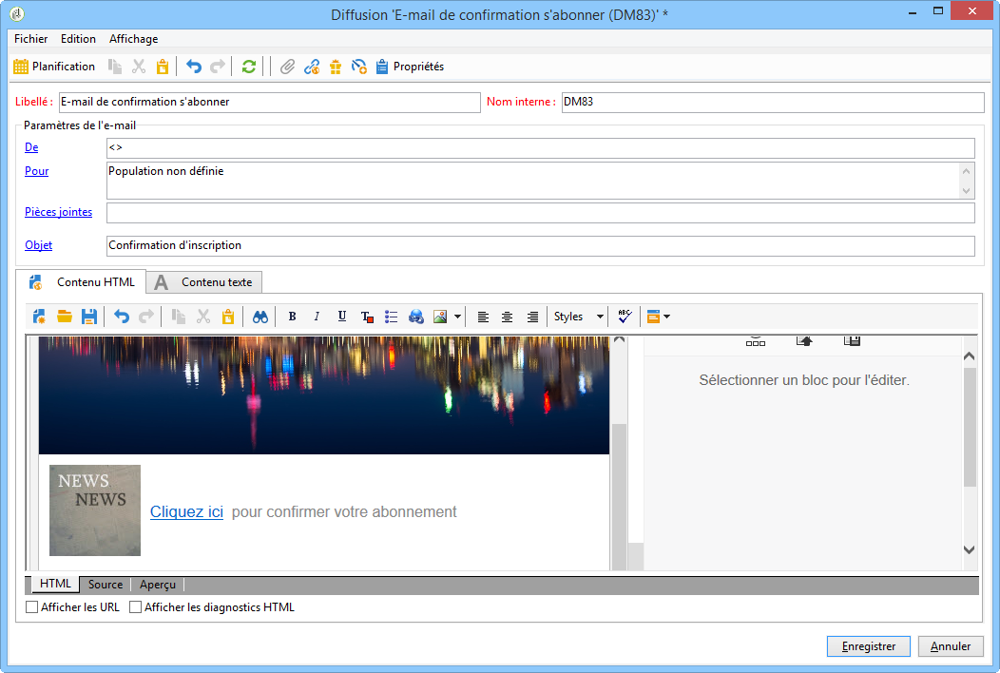

1. Avec le DCE, liez votre URL au formulaire web. Le formulaire Web n&#39;étant pas encore créé, remplacez la valeur dès que vous le créez.

   

1. Associez enfin ce modèle au service temporaire créé précédemment.

   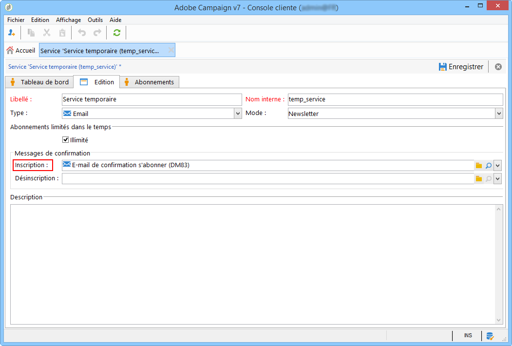

### Etape 3 - Créer le formulaire d’inscription {#step-3---creating-the-subscription-form}

Le formulaire web permet à la fois l’inscription et la confirmation de l’inscription des destinataires.

Le workflow du formulaire web contiendra les activités suivantes :

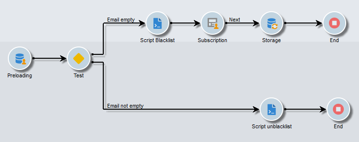

Pour ce faire, procédez comme suit :

1. Créez un formulaire Web et sélectionnez le modèle **[!UICONTROL Inscription à la Newsletter (subNewsletter)]**.

   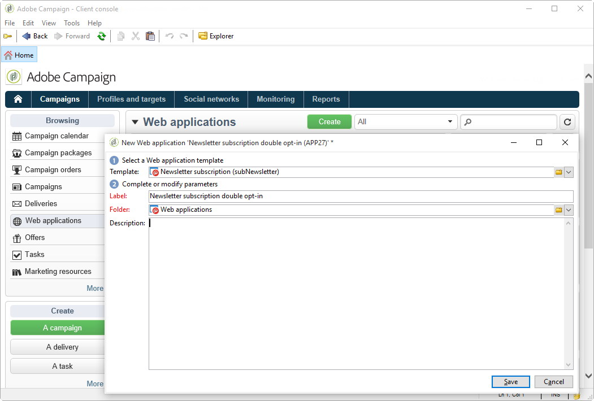

1. Dans l’onglet **[!UICONTROL Edition]**, nous devons configurer le workflow existant, dans la mesure où nous souhaitons ajouter un message de confirmation pour les destinataires qui souhaitent s’inscrire.

   Pour cela, double-cliquez sur l’activité **[!UICONTROL Pré-chargement]** et configurez-la comme suit.

   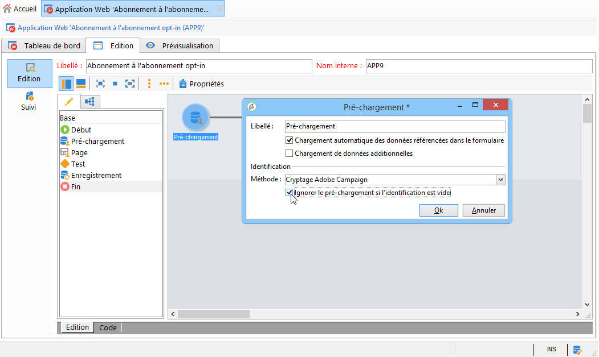

   Cela signifie que si l&#39;utilisateur accède à ce formulaire via le lien dans le message de confirmation, ses informations de profil sont chargées. S&#39;ils accèdent au formulaire Web par l&#39;intermédiaire d&#39;une page du site Web, aucune information ne sera chargée.

1. Ajoutez une activité **[!UICONTROL Test]** à votre workflow.

   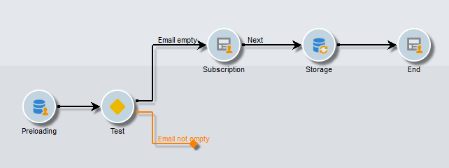

   L&#39;activité **[!UICONTROL Test]** peut concerner l&#39;email du destinataire. Dans ce cas, configurez-le comme suit :

   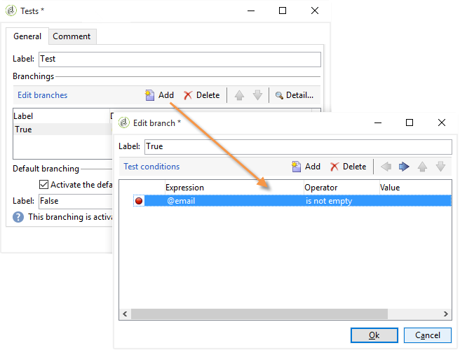

1. Ajoutez deux activités **[!UICONTROL Script]** à votre workflow.

   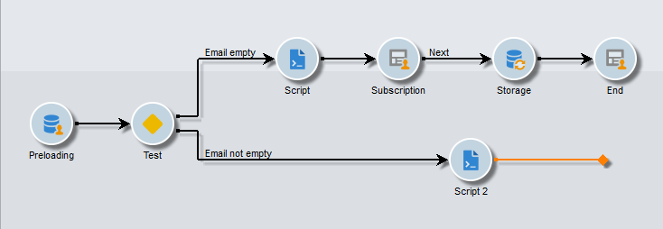

   La première activité **[!UICONTROL Script]** ajoutera des destinataires à la liste bloquée jusqu&#39;à ce qu&#39;ils confirment leur abonnement à la newsletter. Son contenu doit être le suivant :

   ```
   ctx.recipient.@blackList=1
   ```

   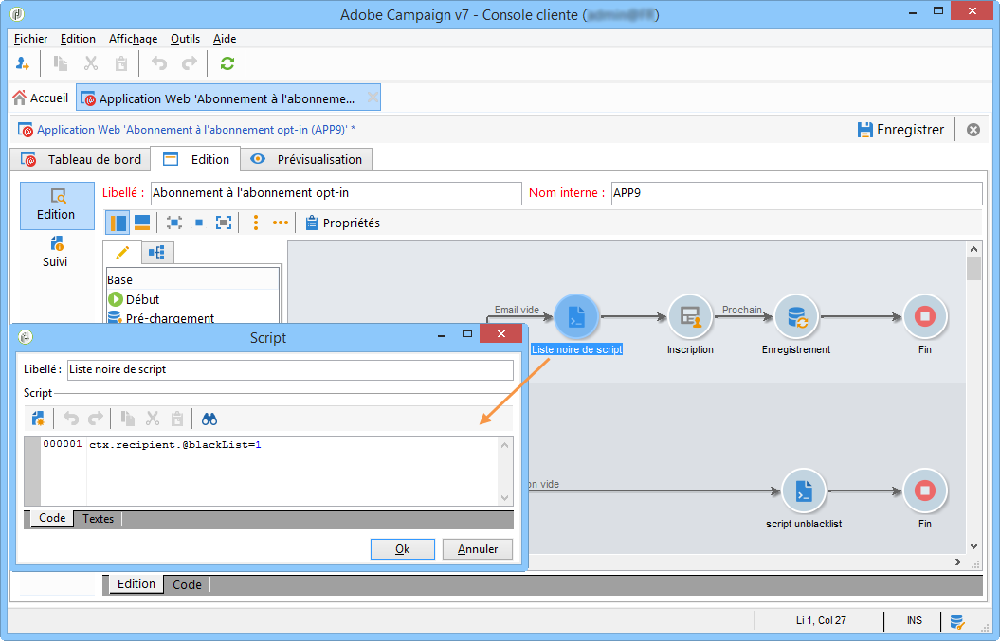

   La deuxième activité **[!UICONTROL Script]** permet d&#39;envoyer des diffusions aux utilisateurs et les abonne à la newsletter. Les deux dernières lignes du script vont vous permettre de transférer vos destinataires du dossier temporaire vers un autre dossier et d&#39;être réconciliés avec les profils existants dès qu&#39;ils auront confirmé l&#39;abonnement.

   ```
   ctx.recipient.@blackList=0
   nms.subscription.Subscribe("INTERNAL_NAME_OF_THE_NEWSLETTER", ctx.recipient, false)
   ctx.recipient.folder = <folder name="nmsRootRecipient"/>
   nms.subscription.Unsubscribe("TEMP", ctx.recipient)
   ```

   >[!NOTE]
   >
   >La partition **[!UICONTROL Temp]** peut être régulièrement purgée de son contenu à l’aide d’un workflow.

   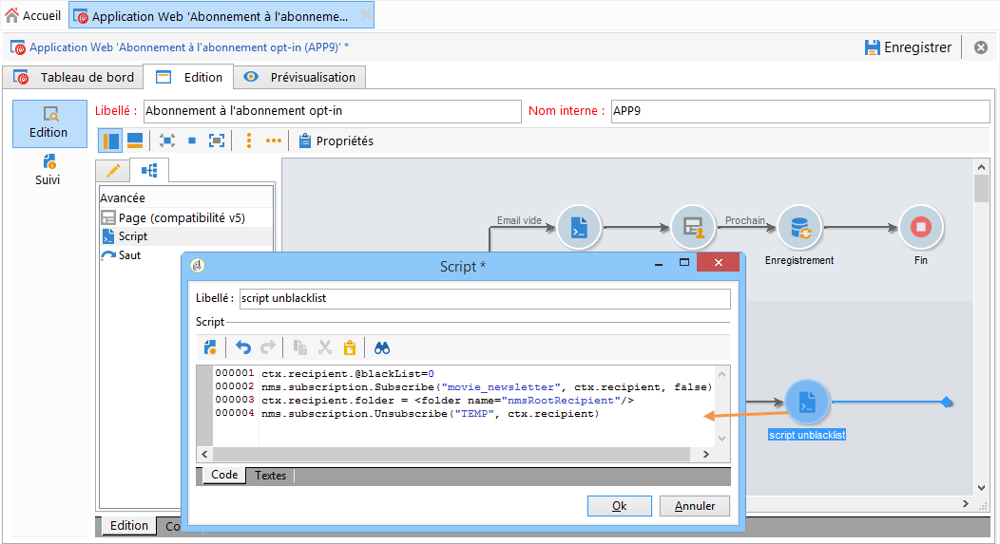

1. Double-cliquez sur l’activité **[!UICONTROL Inscription]** pour personnaliser le formulaire d’inscription et associer une case à cocher au service temporaire créé précédemment.

   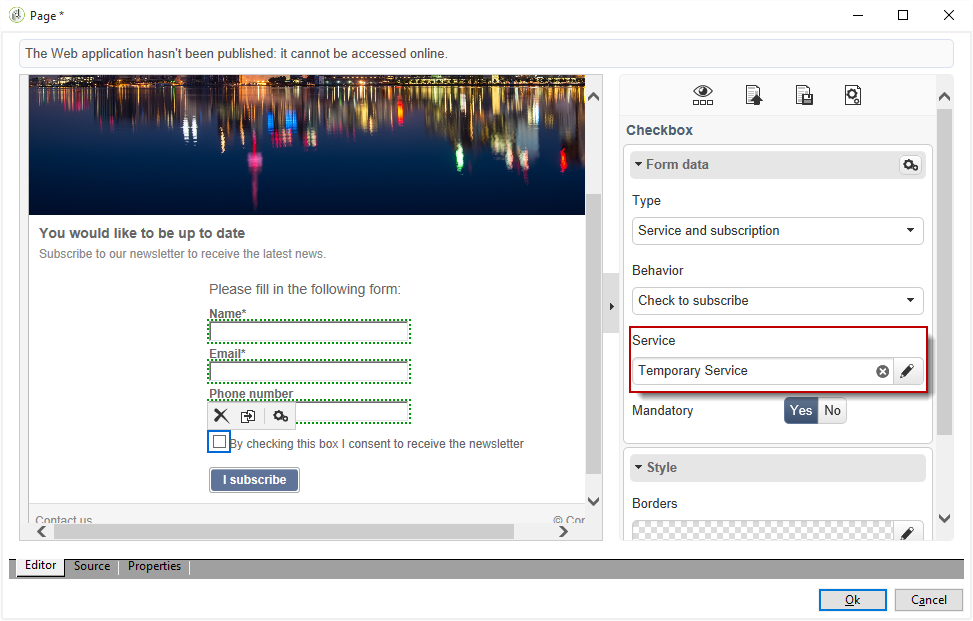

1. Configurez l’activité **[!UICONTROL Enregistrement]** afin de sauvegarder les informations renseignées dans la page du formulaire.

   Cette activité permet de créer les profils de destinataires dans un dossier temporaire dédié afin de les différencier des profils en base, auxquels des communications peuvent être adressées.

   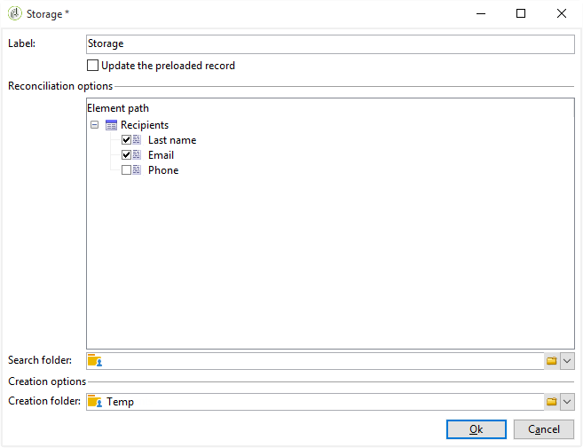

   >[!NOTE]
   >
   >Vous ne devez pas définir d’options de réconciliation.

1. Ajoutez deux activités **[!UICONTROL Fin]** pour afficher un message à l’intention de l’utilisateur.

   La seconde activité **[!UICONTROL Fin]** affichera le message de confirmation une fois l’inscription terminée.

   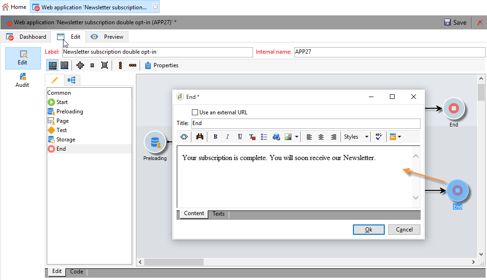

1. Une fois le formulaire web créé et paramétré, vous pouvez le référencer dans le modèle de diffusion pour l’envoi des messages de confirmation.

   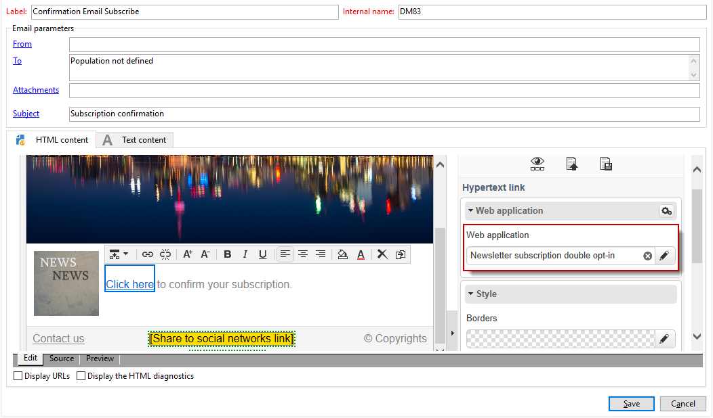

### Etape 4 - Publier et tester le formulaire {#step-4---publishing-and-testing-the-form}

Vous pouvez maintenant publier le formulaire afin de le rendre accessible aux utilisateurs.

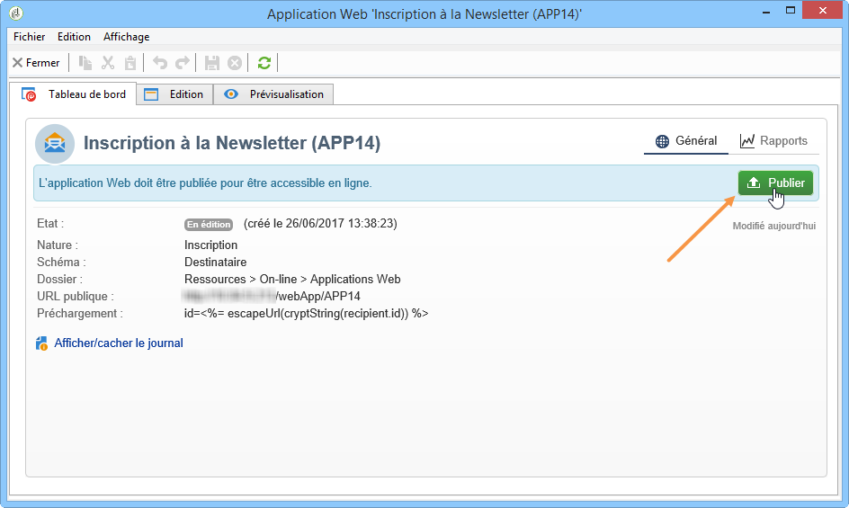

Ainsi, l&#39;inscription à la newsletter est réalisée selon les étapes suivantes :

1. L’utilisateur du site Web se connecte à la page d’abonnement et valide le formulaire.

   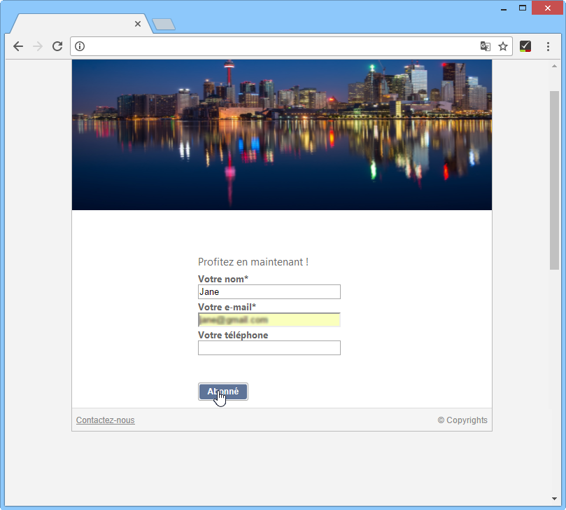

   Il est informé de la prise en compte de sa demande via un message affiché dans son navigateur.

   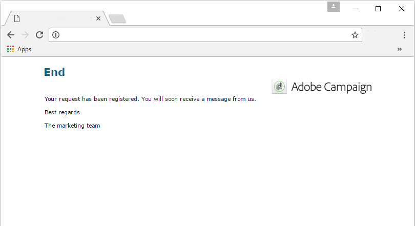

   À cette étape, l&#39;utilisateur est ajouté dans la base de données Adobe Campaign, dans le dossier **[!UICONTROL Temp]**, et son profil est placé sur la liste bloquée jusqu&#39;à ce qu&#39;il valide son inscription à l&#39;aide de l&#39;email.

   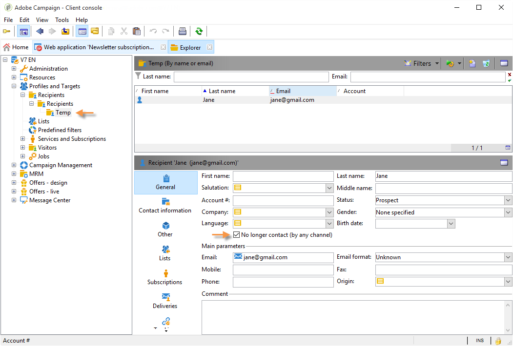

1. Un message de confirmation lui est adressé avec un lien pour valider définitivement son inscription.

   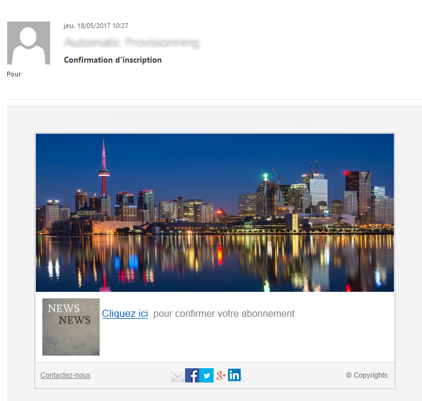

1. Lorsqu’il clique sur ce lien, la page de validation est affichée dans son navigateur.

   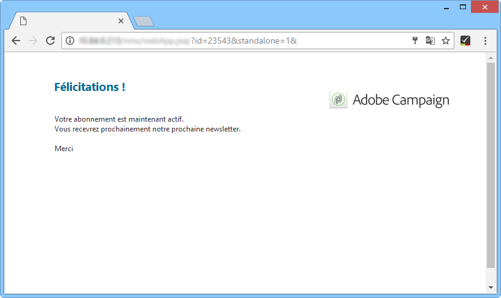

   Dans Adobe Campaign, le profil de l&#39;utilisateur est mis à jour :

   * il n&#39;est plus sur la liste bloquée,
   * il est abonné au service d’information.

     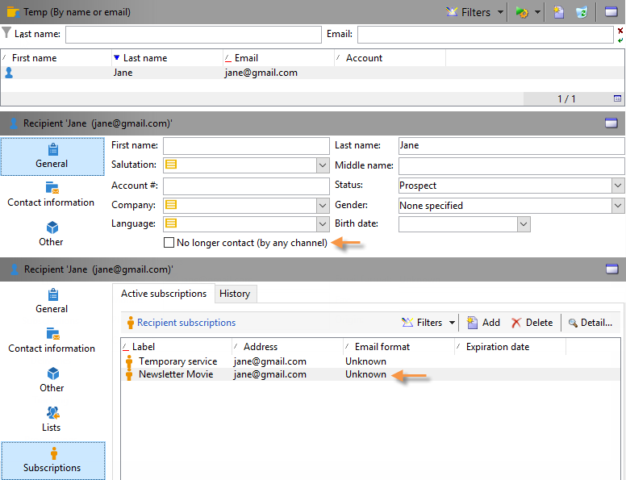

## Afficher différentes options en fonction de la valeur sélectionnée {#displaying-different-options-depending-on-the-selected-values}

Dans l’exemple suivant, l’utilisateur est invité à sélectionner un type de véhicule. Vous pouvez afficher les catégories de véhicules disponibles en fonction du type sélectionné. Cela signifie que les éléments affichés dans la colonne de droite dépendent de la sélection de l’utilisateur :

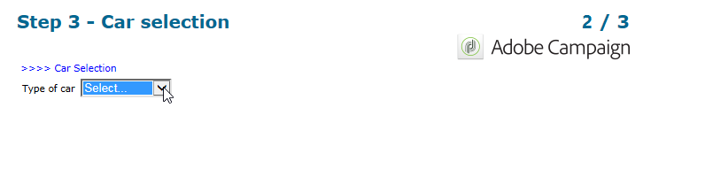

* Lorsqu&#39;il sélectionne un véhicule particulier, il pourra choisir entre un véhicule &quot;Voiture individuelle&quot; ou &quot;Monospace&quot; :

  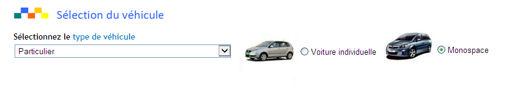

* Lorsqu’il sélectionne un véhicule professionnel, il pourra choisir parmi les utilitaires de la liste déroulante :

  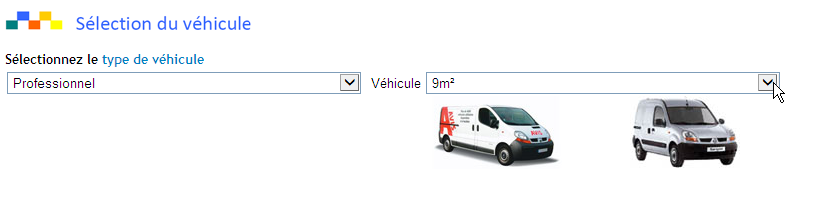

Dans cet exemple, le type de véhicule n&#39;est pas stocké dans la base de données. La liste déroulante est paramétrée comme suit :

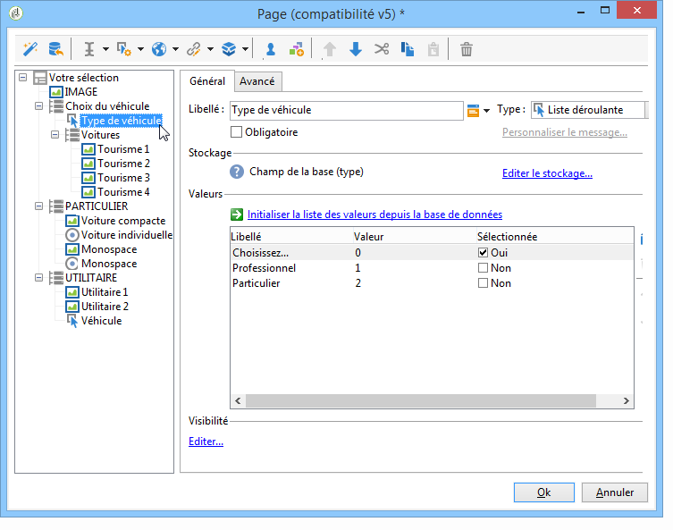

Cette information est stockée dans une variable locale.

Le conditionnement de l&#39;affichage de la colonne de droite est paramétré au niveau des conteneurs :

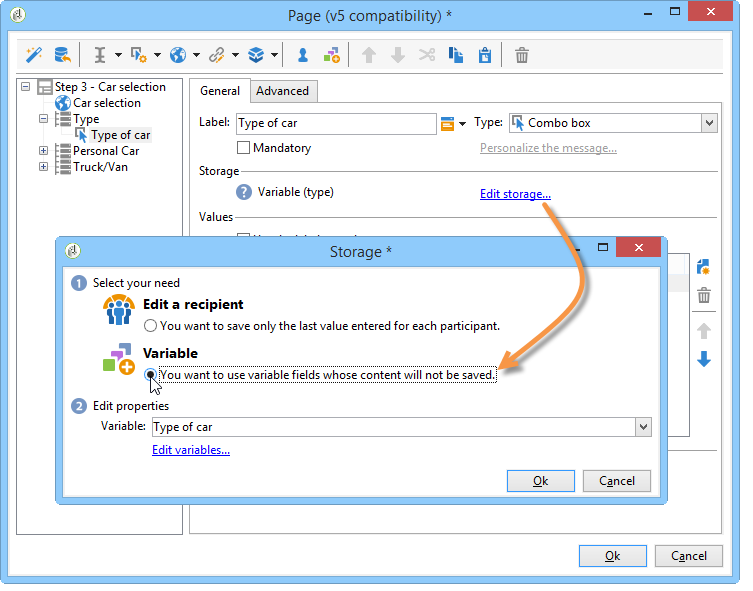

* Conditionnement de la visibilité des champs pour un véhicule personnel :

  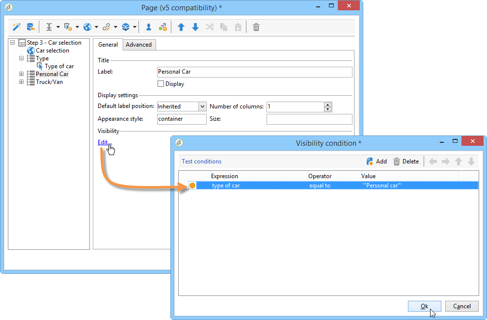

* Conditionnement de la visibilité des champs pour un véhicule professionnel :

  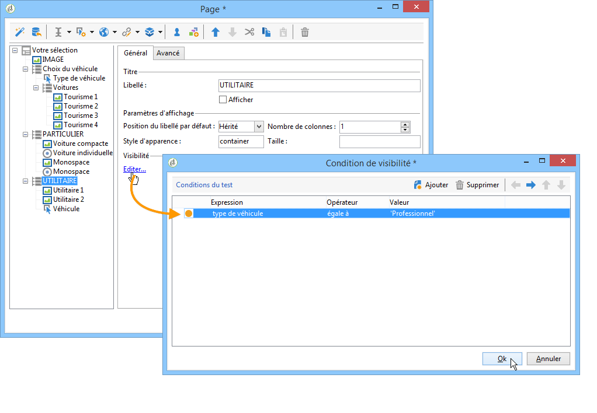
