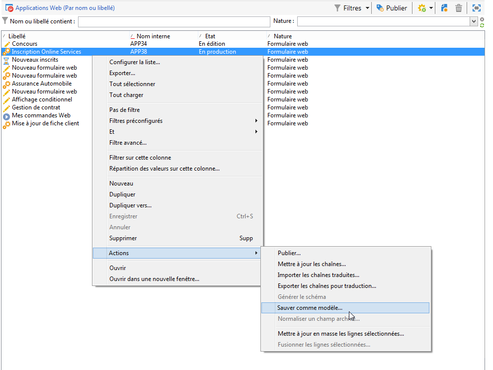
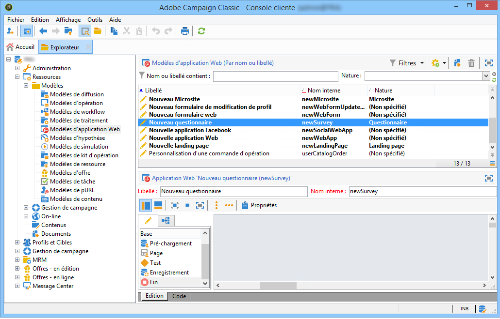
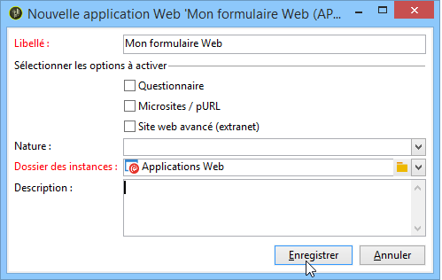

# Utilisation d’un modèle de formulaire web{#using-a-web-form-template}

Un modèle de formulaire est un paramétrage réutilisable pour créer de nouveaux formulaires. Les modèles de formulaires sont stockés par défaut avec les modèles d&#39;applications Web, sous le noeud **[!UICONTROL Ressources > Modèles > Modèles d&#39;applications Web]**.

Vous pouvez créer des modèles depuis ce nœud ou transformer directement un formulaire existant en modèle.

## Transformer un formulaire existant en modèle {#convert-an-existing-form-into-a-template}

Un formulaire peut être transformé en modèle afin que le paramétrage défini soit réutilisable. Pour cela, sélectionnez le formulaire, cliquez sur le bouton droit de la souris et choisissez **[!UICONTROL Actions > Sauver comme modèle...]**.

Cette action ouvre la fenêtre de création des applications Web. Vous pouvez saisir le nom et la description du modèle et sélectionner son dossier d&#39;enregistrement.

## Créer un modèle de formulaire {#create-a-new-form-template}

Pour créer un modèle de formulaire Web, cliquez sur le bouton droit de la souris depuis la liste des modèles d&#39;applications Web, et choisissez **[!UICONTROL Nouveau]**. Vous pouvez également utiliser le bouton **[!UICONTROL Nouveau]** situé au-dessus de la liste des modèles.

Saisissez le nom du modèle. Sélectionnez le dossier d&#39;enregistrement des formulaires web créés à partir de ce modèle dans le champ **[!UICONTROL Dossier des instances]**. Le champ **[!UICONTROL Nature]** vous permet d&#39;ajouter une information descriptive afin de classer et/ou filtrer vos différents modèles d&#39;applications web.

Cliquez sur **[!UICONTROL Enregistrer]** pour créer le modèle puis construisez le contenu de ce modèle et définissez ses paramètres.

Vous pouvez ensuite sélectionner ce modèle lors de la création d&#39;un nouveau formulaire.
