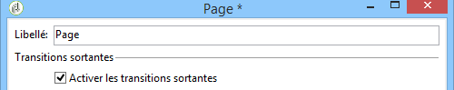
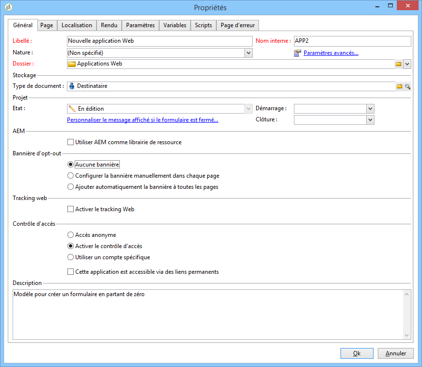

# Désinscription (opt-out) du tracking des applications web{#web-application-tracking-opt-out}


Adobe Campaign vous permet d&#39;interrompre le tracking des comportements web des utilisateurs finaux qui se sont désinscrits (opt-out) du tracking comportemental via des cookies ou des balises web. Elle offre la possibilité d&#39;afficher une bannière afin de proposer cette option à l&#39;utilisateur final. Ces bannières peuvent être ajoutées à des applications web ou des landing pages.

Si un utilisateur final se désinscrit (opt-out) du tracking comportemental via des cookies ou des balises web, cette information est transmise au serveur de tracking Adobe Campaign à l&#39;aide d&#39;API JavaScript. Certaines juridictions peuvent demander aux clients de proposer aux utilisateurs finaux une option d&#39;opt-in avant l&#39;option d&#39;opt-out (ou ont d&#39;autres exigences légales). Il est de la responsabilité des clients de respecter les lois applicables.

>[!NOTE]
>
>Lorsque vous créez des scripts, suivez toujours les consignes décrites dans la [Liste de contrôle relative à la sécurité et à la confidentialité](https://helpx.adobe.com/fr/campaign/kb/acc-security.html#dev).

## Paramétrer la bannière {#configuring-the-banner-}

Pour s&#39;afficher dans des applications Web ou des landing pages, la bannière doit être configurée.

Adobe Campaign contient un exemple de bannière que vous devez adapter à vos besoins. Cette version de bannière apparaît en tant que bloc de personnalisation dans le dossier des modèles de contenu. Pour plus d&#39;informations, reportez-vous à [cette page](../../delivery/using/personalization-blocks.md).

>[!IMPORTANT]
>
>Pour créer votre propre bannière, vous devez personnaliser la bannière d&#39;usine.

Pour activer la bannière, vous devez configurer les propriétés de l&#39;application web. Pour plus d&#39;informations, consultez la section [Concevoir une application web](designing-a-web-application.md).

Si le tracking web est activé, vous pouvez sélectionner l&#39;une des options suivantes :

* Aucune bannière.
* Configurer la bannière manuellement dans chaque page : cochez cette option et sélectionnez la bannière dans chaque page dans les propriétés de page.

   

* Ajouter automatiquement la bannière à toutes les pages : sélectionnez la bannière directement dans les propriétés de l&#39;application Web.

   

>[!NOTE]
>
>Un mode de compatibilité est disponible pour la version 5 de l&#39;application web avec le même comportement.

La bannière par défaut possède la structure suivante :

```
<div onClick="NL.ClientWebTracking.closeOptOutBanner(this);" id="defaultOptOutBanner">
  <p>Please insert your message here
   <a onClick="NL.ClientWebTracking.allow();" class="optout-accept">Accept</a>
   <a onClick="NL.ClientWebTracking.forbid();" class="optout-decline">Refuse</a>
  </p>
</div>
      
```

Vous devez remplacer le texte **Veuillez insérer votre message ici** par le bloc qui contient les informations sur le tracking. Ce remplacement doit être effectué dans le nouveau bloc de personnalisation associé à la bannière d’opt-out.

La bannière est fournie avec une feuille CSS spécifique. Vous pouvez toutefois remplacer les styles lors de la création et de la configuration d&#39;une page web. Voir à ce propos [cette page](content-editor-interface.md).

## Définir le cookie de désinscription (opt-out) à l&#39;aide des API {#setting-the-opt-out-cookie-using-api}

Adobe Campaign est fourni avec des API qui permettent de gérer la valeur du cookie et de récupérer les préférences de l&#39;utilisateur.

Le nom du cookie est **acoptout** et les valeurs courantes de celui-ci sont les suivantes :

* 0 : l&#39;utilisateur a autorisé le tracking web (valeur par défaut).
* 1 : l&#39;utilisateur a interdit le tracking web.
* null : l&#39;utilisateur n&#39;a pas effectué de choix, mais le tracking web est autorisé car il s&#39;agit de la valeur par défaut.

Les API côté client disponibles pour personnaliser la bannière sont les suivantes :

* **NL.ClientWebTracking.allow()** : définit la valeur du cookie d&#39;opt-out de sorte à autoriser le tracking web. Le tracking web est autorisé par défaut.
* **NL.ClientWebTracking.forbid()** : définit la valeur du cookie d&#39;opt-out de sorte à interdire le tracking web. Pour être interdit, le tracking web nécessite une saisie de l&#39;utilisateur.
* **NL.ClientWebTracking.closeOptOutBanner(bannerDomElt)** : ferme la bannière du cookie d&#39;opt-out une fois que l&#39;utilisateur a cliqué sur le bouton d&#39;acceptation ou de refus (pendant la phase de propagation de l&#39;événement clic).

   bannerDomElt {DOMElement} : élément DOM racine de la bannière du cookie qui doit être supprimé.

* **NL.ClientWebTracking.hasUserPrefs()** : renvoie la valeur true si l’utilisateur a choisi les préférences du tracking web.
* **NL.ClientWebTracking.getUserPrefs()**: renvoie la valeur du cookie d&#39;opt-out qui définit les préférences de l&#39;utilisateur.

Si vous devez écrire du code JSSP, les API côté serveur suivantes sont disponibles :

* **NL.ServerWebTracking.generateOptOutBanner(escapeJs)** : génère les balises pour que bannière d&#39;opt-out soit insérée dans la page JSSP.

   **escapeJs {Boolean}** : a la valeur true lorsque les balises générées doivent être placées dans une séquence d&#39;échappement afin d&#39;être utilisées dans le script JavaScript.

   Cette chaîne renvoie le code HTML des balises de la bannière d&#39;opt-out qui doivent être imprimées sur la page.

* **NL.ServerWebTracking._displayOptOutBanner() :**

   Renvoie la valeur &quot;true&quot; si la bannière d‘opt-out doit s‘afficher après que l‘administrateur l‘ait sélectionnée.

   Ce code est appelé lorsque l&#39;administrateur a déjà choisi d&#39;utiliser la bannière d&#39;opt-out pour le tracking web.

   La bannière doit s&#39;afficher si l&#39;utilisateur n&#39;a pas encore décidé s&#39;il souhaitait être tracké ou non.

* **NL.ServerWebTracking.renderOptOutBanner(escapeJs) :**

   effectue le rendu des balises pour la bannière d&#39;opt-out en les insérant dans la page JSSP. Elle est appelée telle quelle dans JSSP entre &lt;% %>.

   **escapeJs {Boolean}** : a la valeur true lorsque les balises générées doivent être placées dans une séquence d&#39;échappement afin d&#39;être utilisées dans le script JavaScript.

Exemple JSSP :

```
<%@ page import="/nl/core/shared/nl.js" %>
<!doctype html>
<%
NL.require('/nl/core/shared/webTracking.js');
NL.client.require('/nl/core/shared/webTracking.js');
%>
<html>
<head>
<%==NL.client.deps()%>
</head>

<body>

<!-- TEST USING SERVER API IN JSSP -->
<% 
var webTracking = new NL.ServerWebTracking(request, 'optOutBanner');
webTracking.renderOptOutBanner();
%>

<!-- TEST USING SERVER API IN A SCRIPT -->
<!--
<% 
var webTracking = new NL.ServerWebTracking(request, 'optOutBanner');
%>
<script>var el = document.createElement('div'); el.innerHTML =  "<% webTracking.renderOptOutBanner(true); %>";document.body.appendChild(el);</script>
-->

<!-- TEST OF THE CLIENT API -->
<!--
<div onClick="NL.ClientWebTracking.closeOptOutBanner(this);" id="defaultOptOutBanner">
  <p>Please insert your message here
   <a onClick="NL.ClientWebTracking.allow();" class="optout-accept">Accept</a>
   <a onClick="NL.ClientWebTracking.forbid();" class="optout-decline">Refuse</a>
  </p>
</div>
-->
</body>
</html>
```
