# Réponses aux formulaires web{#web-forms-answers}


## Champs de stockage des réponses {#response-storage-fields}

Les réponses aux formulaires peuvent être enregistrées dans un champ de la base ou temporairement dans une variable locale. Le mode de stockage des réponses est sélectionné lors de la création d&#39;un champ. Il peut être modifié à partir du lien **[!UICONTROL Editer le stockage...]**.

Pour chaque champ de saisie d&#39;un formulaire, les options de stockage suivantes sont disponibles :

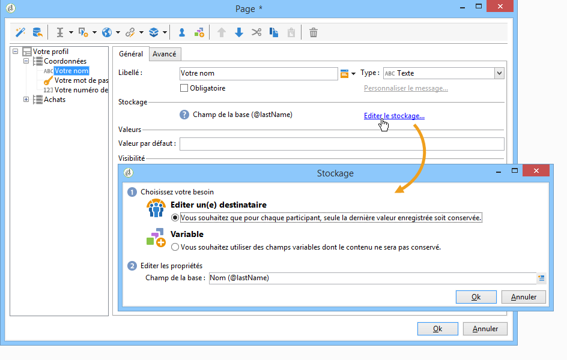

* **[!UICONTROL Editer un destinataire]**

  Vous pouvez sélectionner un champ de la base de données : les réponses des utilisateurs seront stockées dans ce champ. Pour chaque utilisateur, seule la dernière valeur saisie est enregistrée et ajoutée à leur profil : voir à ce sujet la section [Stockage des données dans la base de données](#storing-data-in-the-database).

* **[!UICONTROL Variable]**

  Vous pouvez utiliser une variable si vous ne souhaitez pas stocker les informations dans la base de données. Les variables locales peuvent être déclarées en amont. Voir à ce sujet la section [Stocker les données dans une variable locale](#storing-data-in-a-local-variable).

### Stockage des données dans la base de données {#storing-data-in-the-database}

Pour enregistrer les données dans un champ existant de la base de données, cliquez sur l&#39;icône **[!UICONTROL Editer l&#39;expression]** et sélectionnez-le dans la liste des champs disponibles.


>[!NOTE]
>
>Le document de référence par défaut est le schéma des destinataires **nms:recipient**. Pour le visualiser ou en choisir un nouveau, sélectionnez le formulaire dans la liste et cliquez sur le bouton **[!UICONTROL Propriétés]**.

### Stocker les données dans une variable locale {#storing-data-in-a-local-variable}

Vous pouvez utiliser des variables locales : en effet, quoique non stockées dans la base, les données peuvent ainsi être réutilisées dans la page ou dans les autres pages, par exemple pour conditionner l&#39;affichage d&#39;une zone ou personnaliser un message.

Ainsi, vous pouvez utiliser la valeur d&#39;un champ non enregistré pour autoriser l&#39;affichage d&#39;un groupe d&#39;options dans la page. Dans la page ci-dessous, le type de véhicule n&#39;est pas stocké dans la base :

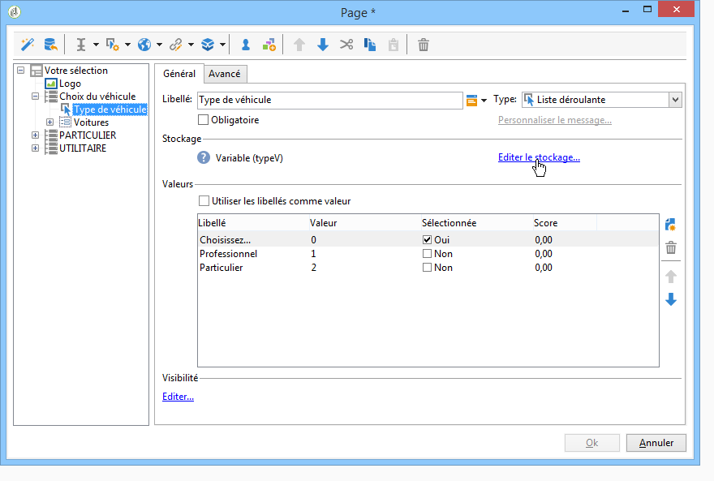

Il est enregistré dans une variable qui doit être sélectionnée lors de la création de la liste déroulante ou via le lien **[!UICONTROL Editer le stockage...]**.

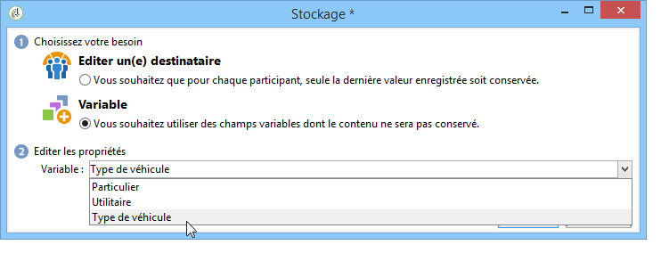

Vous pouvez afficher les variables existantes et créer de nouvelles variables à partir du lien **[!UICONTROL Editer les variables...]**. Cliquez sur le bouton **[!UICONTROL Ajouter]** pour créer une nouvelle variable.

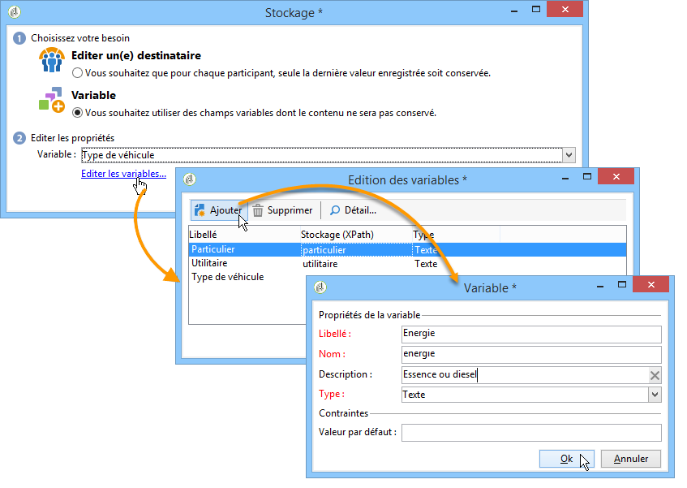

La variable ajoutée sera disponible dans la liste des variables locales lors de la création des champs de saisie de la page.

>[!NOTE]
>
>Pour chaque formulaire, les variables peuvent être créées en amont. Pour cela, sélectionnez le formulaire et cliquez sur le bouton **[!UICONTROL Propriétés]**. L&#39;onglet **[!UICONTROL Variables]** regroupe les variables locales pour le formulaire.

**Exemple de stockage local avec conditionnement**

Dans l&#39;exemple ci-dessus, le conteneur PARTICULIER (qui regroupe les données relatives aux véhicules particuliers) n&#39;est affiché que si l&#39;option **[!UICONTROL Particulier]** est sélectionnée dans la liste déroulante, comme indiqué dans la condition de visibilité :

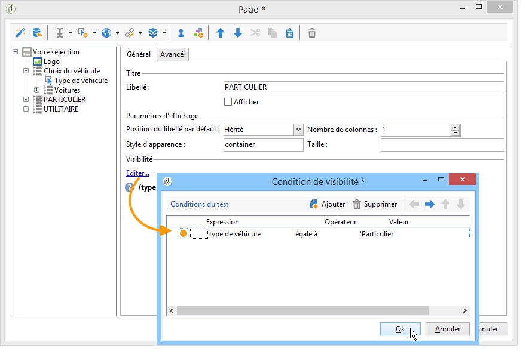

Ainsi, si l&#39;utilisateur sélectionne un véhicule particulier, le formulaire Web proposera les options suivantes :

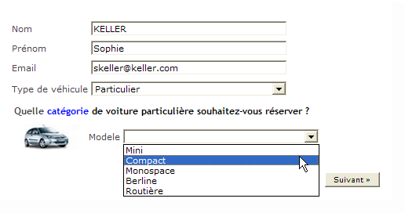

Le conteneur qui regroupe les données relatives aux utilitaires sera affiché si l&#39;option PROFESSIONNEL est sélectionnée, comme exprimé dans la condition de visibilité :

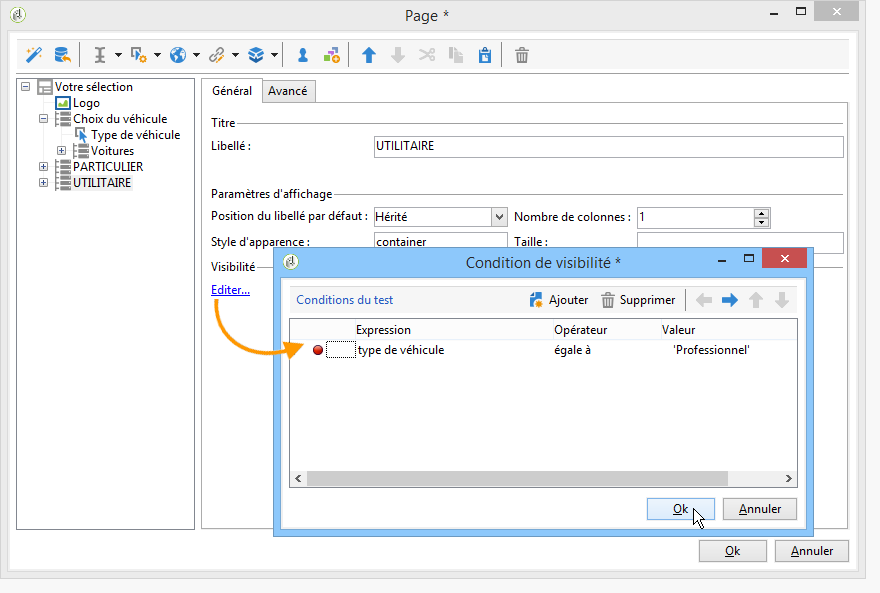

Ainsi, si l&#39;utilisateur sélectionne un véhicule utilitaire, le formulaire proposera les options suivantes :

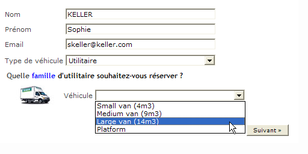

## Utiliser les informations collectées {#using-collected-information}

Pour chaque formulaire, les réponses fournies peuvent être réutilisées dans les champs ou les libellés. Les syntaxes à utiliser sont les suivantes :

* Pour un contenu stocké dans un champ de la base :

  ```
  <%=ctx.recipient.@field name%
  ```

* Pour un contenu stocké dans une variable locale :

  ```
  <%= ctx.vars.variable name %
  ```

* Pour un contenu stocké dans un champ texte HTML :

  ```
  <%== HTML field name %
  ```

  >[!NOTE]
  >
  >Contrairement aux autres champs pour lesquels les caractères `<%=` sont remplacés par des caractères d’échappement, le contenu HTML est conservé tel quel grâce à l’utilisation de la syntaxe`<%==`.

## Enregistrer les réponses aux formulaires web {#saving-web-forms-answers}

Pour enregistrer les informations collectées dans les pages d&#39;un formulaire, vous devez positionner une boîte d&#39;enregistrement dans le diagramme.

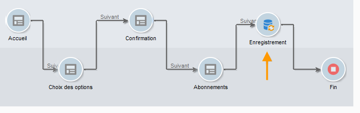

Deux modes d&#39;utilisation de cette boîte sont possibles :

* Si l’accès au formulaire web se fait via un lien envoyé dans un email, et donc si l’utilisateur qui a accès à l’application web est déjà en base, vous pouvez cocher l’option **[!UICONTROL Mettre à jour l’enregistrement pré-chargé]**. Voir à ce sujet la section [Diffuser un formulaire par email](publishing-a-web-form.md#delivering-a-form-via-email).

  Adobe Campaign utilise alors par défaut la clé primaire chiffrée du profil de l’utilisateur, qui est un identifiant unique attribué à chaque profil par Adobe Campaign. Vous devez paramétrer les informations à précharger à partir de la boîte de préchargement. Pour plus d’informations, consultez la section [Précharger les données du formulaire](publishing-a-web-form.md#pre-loading-the-form-data).

  >[!CAUTION]
  >
  >Cette option surcharge les données de l’utilisateur, y compris son adresse e-mail si un champ permet de la saisir. Elle ne permet pas de créer des profils et requiert l’utilisation d’une boîte de préchargement dans le formulaire.

* Pour enrichir les données des destinataires en base, modifiez la boîte d’enregistrement pour sélectionner la clé de réconciliation. Pour une utilisation en interne (typiquement, sur un intranet) ou pour un formulaire de création de profils, par exemple, vous pouvez sélectionner le ou les champs de réconciliation. La boîte propose tous les champs de la base de données utilisés dans les différentes pages de l’application web :

  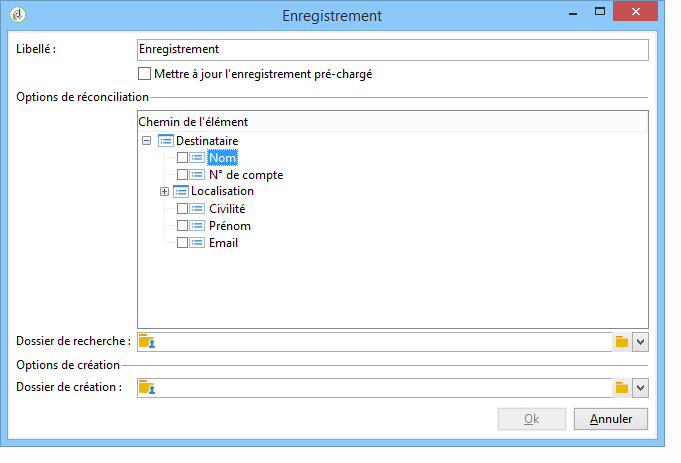

Par défaut, les données sont importées dans la base par une opération de **[!UICONTROL Mise à jour ou insertion]** : s’il existe dans la base, l’élément est mis à jour (par exemple la newsletter choisie ou l’e-mail renseigné). S’il n’existe pas, l’information est ajoutée.

Vous pouvez toutefois modifier ce comportement. Pour cela, sélectionnez la racine de l&#39;élément et choisissez, dans la liste déroulante, l&#39;opération à effectuer :

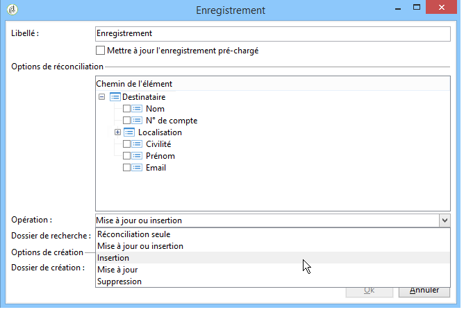

Vous pouvez sélectionner un dossier de recherche pour la réconciliation et le dossier de création pour les nouveaux profils. Si ces champs sont vides, les profils sont recherchés et créés dans le dossier par défaut de l&#39;opérateur.

>[!NOTE]
>
>Les opérations possibles sont : **[!UICONTROL Réconciliation seule]**,**[!UICONTROL Mise à jour ou insertion]**, **[!UICONTROL Insertion]**, **[!UICONTROL Mise à jour]**, **[!UICONTROL Suppression]**.\
>Le dossier par défaut de l&#39;opérateur correspond au premier dossier dans lequel l&#39;opérateur a le droit d&#39;écrire.\
>Consultez [cette section](../../platform/using/access-management.md).
