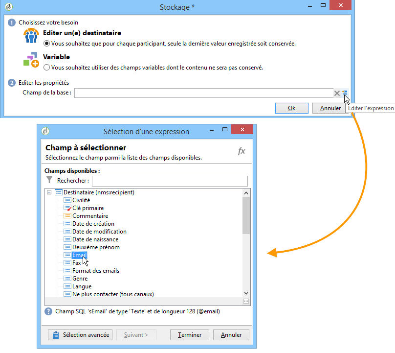

# Réponses aux formulaires web{#web-forms-answers}

## Champs de stockage des réponses {#response-storage-fields}

Les réponses aux formulaires peuvent être enregistrées dans un champ de la base de données ou temporairement dans une variable locale. Le mode de stockage des réponses est choisi lors de la création de champs. Il peut être modifié via le **[!UICONTROL Edit storage...]** lien.

Pour chaque champ de saisie d&#39;un formulaire, les options de stockage suivantes sont disponibles :


* **[!UICONTROL Edit a recipient]**

   Vous pouvez sélectionner un champ de la base de données : les réponses des utilisateurs seront stockées dans ce champ. Pour chaque utilisateur, seule la dernière valeur saisie est enregistrée : il est ajouté à leur profil : Reportez-vous à [Stockage des données dans la base de données](#storing-data-in-the-database).

* **[!UICONTROL Variable]**

   Si vous ne souhaitez pas stocker d’informations dans la base de données, vous pouvez utiliser une variable. Les variables locales peuvent être déclarées en amont. Reportez-vous à [Stockage de données dans une variable](#storing-data-in-a-local-variable)locale.

### Storing data in the database {#storing-data-in-the-database}

To save the data in an existing field of the database, click the **[!UICONTROL Edit expression]** icon and select it from the list of available fields.



>[!NOTE]
>
>Le document de référence par défaut est le schéma **nms:Recipient** . Pour l’afficher ou en choisir un nouveau, sélectionnez le formulaire dans la liste, puis cliquez sur le **[!UICONTROL Properties]** bouton .

### Stocker les données dans une variable locale {#storing-data-in-a-local-variable}

Vous pouvez utiliser des variables locales : en effet, quoique non stockées dans la base, les données peuvent ainsi être réutilisées dans la page ou dans les autres pages, par exemple pour conditionner l&#39;affichage d&#39;une zone ou personnaliser un message.

Ainsi, vous pouvez utiliser la valeur d&#39;un champ non enregistré pour autoriser l&#39;affichage d&#39;un groupe d&#39;options dans la page. Dans la page ci-dessous, le type de véhicule n&#39;est pas stocké dans la base :


It is stored in a variable which must be selected when the drop-down box is created, or via the **[!UICONTROL Edit storage...]** link.


Vous pouvez afficher les variables existantes et en créer de nouvelles par le **[!UICONTROL Edit variables...]** lien. Click the **[!UICONTROL Add]** button to create a new variable.


La variable ajoutée sera disponible dans la liste des variables locales lors de la création des champs de saisie de la page.

>[!NOTE]
>
>Pour chaque formulaire, vous pouvez créer des variables en amont. Pour ce faire, sélectionnez le formulaire et cliquez sur le **[!UICONTROL Properties]** bouton. L’ **[!UICONTROL Variables]** onglet contient les variables locales du formulaire.

**Exemple de stockage local avec conditionnement**

In the above example, the container that includes data concerning private vehicles is displayed only if the **[!UICONTROL Private]** option is selected from the drop-down list, as indicated in the visibility condition:


Ainsi, si l&#39;utilisateur sélectionne un véhicule particulier, le formulaire Web proposera les options suivantes :


Le conteneur qui regroupe les données relatives aux utilitaires sera affiché si l&#39;option PROFESSIONNEL est sélectionnée, comme exprimé dans la condition de visibilité :


Ainsi, si l&#39;utilisateur sélectionne un véhicule utilitaire, le formulaire proposera les options suivantes :


## Utiliser les informations collectées {#using-collected-information}

Pour chaque formulaire, les réponses fournies peuvent être réutilisées dans les champs ou les libellés. Les syntaxes à utiliser sont les suivantes :

* Pour un contenu stocké dans un champ de la base :

   ```
   <%=ctx.recipient.@field name%
   ```

* Pour un contenu stocké dans une variable locale :

   ```
   <%= ctx.vars.variable name %
   ```

* Pour un contenu stocké dans un champ texte HTML :

   ```
   <%== HTML field name %
   ```

   >[!NOTE]
   >
   >Unlike the other fields for which `<%=` characters are replaced with escape characters, the HTML content is saved as is by using the `<%==` syntax.

## Enregistrer les réponses aux formulaires web {#saving-web-forms-answers}

Pour enregistrer les informations collectées dans les pages d&#39;un formulaire, vous devez positionner une boîte d&#39;enregistrement dans le diagramme.


Deux modes d&#39;utilisation de cette boîte sont possibles :

* Si vous accédez au formulaire Web par le biais d’un lien envoyé par courrier électronique et si l’utilisateur qui accède à l’application se trouve déjà dans la base de données, vous pouvez sélectionner l’ **[!UICONTROL Update the preloaded record]** option. Pour plus d’informations, reportez-vous à la section [Diffusion d’un formulaire par courrier électronique](../../web/using/publishing-a-web-form.md#delivering-a-form-via-email).

   Dans ce cas, Adobe Campaign utilise la clé primaire chiffrée du profil utilisateur, identifiant unique attribué à chaque profil par Adobe Campaign. Vous devez configurer les informations à précharger via la zone de préchargement. Pour plus d’informations, reportez-vous à la section [Préchargement des données](../../web/using/publishing-a-web-form.md#pre-loading-the-form-data)de formulaire.

   >[!CAUTION]
   >
   >Cette option surcharge les données de l&#39;utilisateur, y compris son adresse email si un champ permet de la saisir. Elle ne permet pas de créer de nouveaux profils et requiert l&#39;utilisation d&#39;une boîte de préchargement dans le formulaire.

* Pour enrichir les données des destinataires en base, éditez la boîte d&#39;enregistrement pour sélectionner la clé de réconciliation. Pour une utilisation en interne (typiquement, sur un intranet) ou pour un formulaire de création de nouveaux profils, par exemple, vous pouvez sélectionner le ou les champs de réconciliation. La boîte propose tous les champs de la base de données utilisés dans les différentes pages de l&#39;application Web :

   

Par défaut, les données sont importées dans la base de données par une **[!UICONTROL Update or insertion]** opération : s’il existe dans la base de données, l’élément est mis à jour (par exemple, le bulletin d’information sélectionné ou l’adresse électronique saisie). S’il n’existe pas, les informations sont ajoutées.

Vous pouvez toutefois modifier ce comportement. Pour cela, sélectionnez la racine de l&#39;élément et choisissez, dans la liste déroulante, l&#39;opération à effectuer :


Vous pouvez sélectionner un dossier de recherche pour la réconciliation et le dossier de création pour les nouveaux profils. Si ces champs sont vides, les profils sont recherchés et créés dans le dossier par défaut de l&#39;opérateur.

>[!NOTE]
>
>Les opérations possibles sont les suivantes : **[!UICONTROL Simple reconciliation]**, **[!UICONTROL Update or insertion]**, **[!UICONTROL Insertion]**, **[!UICONTROL Update]**, **[!UICONTROL Deletion]**.\
>Le dossier par défaut de l&#39;opérateur correspond au premier dossier dans lequel l&#39;opérateur a le droit d&#39;écrire.\
>Consultez [cette section](../../platform/using/access-management.md).

