# A/B testing{#a-b-testing}

Vous disposez de plusieurs contenus pour une diffusion par email et vous souhaitez vérifier quelle version aura le plus d&#39;impact sur la population visée. Vous allez donc envoyer les différentes versions à une partie de vos destinataires, choisir celle qui aura eu le plus de succès et l&#39;envoyer au reste de vos destinataires.

Dans ce cas pratique, vous allez comparer deux contenus de diffusion par email via un workflow de ciblage. Le message et le texte sont identiques dans les deux diffusions. Seules les présentations diffèrent.

La population ciblée est divisée en trois : deux groupes test et la population restante. Une version différente de la diffusion est envoyée à chaque groupe test. Après l&#39;envoi, un délai d&#39;attente de cinq jours est observé afin de récolter les résultats des meilleurs taux d&#39;ouverture. Puis le contenu de la diffusion qui a obtenu le meilleur taux est récupéré par un script et envoyé à la population qui n&#39;a pas servi de groupe test.

Il est à noter que le critère qui doit déterminer la diffusion à retenir peut varier selon vos besoins. Il peut s&#39;agir du taux d&#39;ouverture, du taux de clics, du taux d&#39;inscription, de la réactivité etc.

D&#39;autre part, le test décrit dans ce cas pratique se limite à deux diffusions, mais vous pouvez tester autant de versions que nécessaire. Il suffit d&#39;ajouter des activités supplémentaires dans votre workflow.

Pour créer votre test A/B, vous allez suivre les étapes suivantes :

* [Etape 1 : créer un workflow de ciblage](#step-1--creating-a-targeting-workflow)
* [Etape 2 : paramétrer les échantillons de population](#step-2--configuring-population-samples)
* [Etape 3 : créer deux modèles de diffusions](#step-3--creating-two-delivery-templates)
* [Etape 4 : paramétrer les diffusions dans le workflow](#step-4--configuring-the-deliveries-in-the-workflow)
* [Etape 5 : créer le script](#step-5--creating-the-script)
* [Etape 7 : lancer le workflow](#step-7--starting-the-workflow)
* [Etape 8 : analyser le résultat](#step-8--analyzing-the-result).

## Etape 1 : créer un workflow de ciblage {#step-1--creating-a-targeting-workflow}

Vous devez créer votre workflow dans l&#39;onglet **[!UICONTROL Ciblages et Workflows]** d&#39;une opération. Il est composé d&#39;une activité **[!UICONTROL Requête]**, d&#39;une activité **[!UICONTROL Partage]** à laquelle sont reliées deux activités **[!UICONTROL Diffusions e-mail]**, une activité **[!UICONTROL Attente]**, d&#39;une activité **[!UICONTROL Code JavaScript]** et une activité **[!UICONTROL Diffusion]**.

1. Créez une opération si elle n&#39;existe pas déjà, (voir à ce sujet cette [section](../../campaign/using/setting-up-marketing-campaigns.md#creating-a-campaign)).

   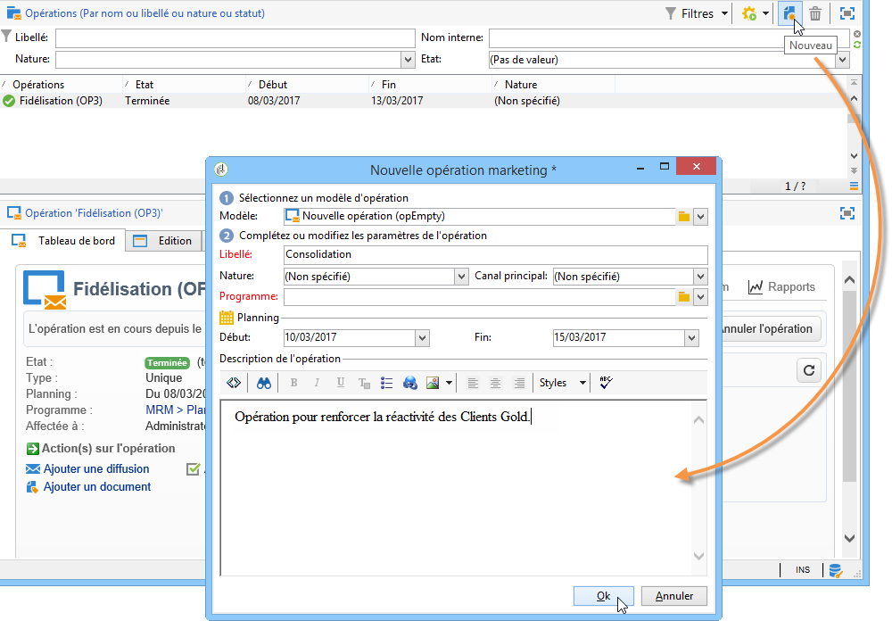

1. Positionnez-vous dans l&#39;onglet **[!UICONTROL Ciblages et Workflows]**.

   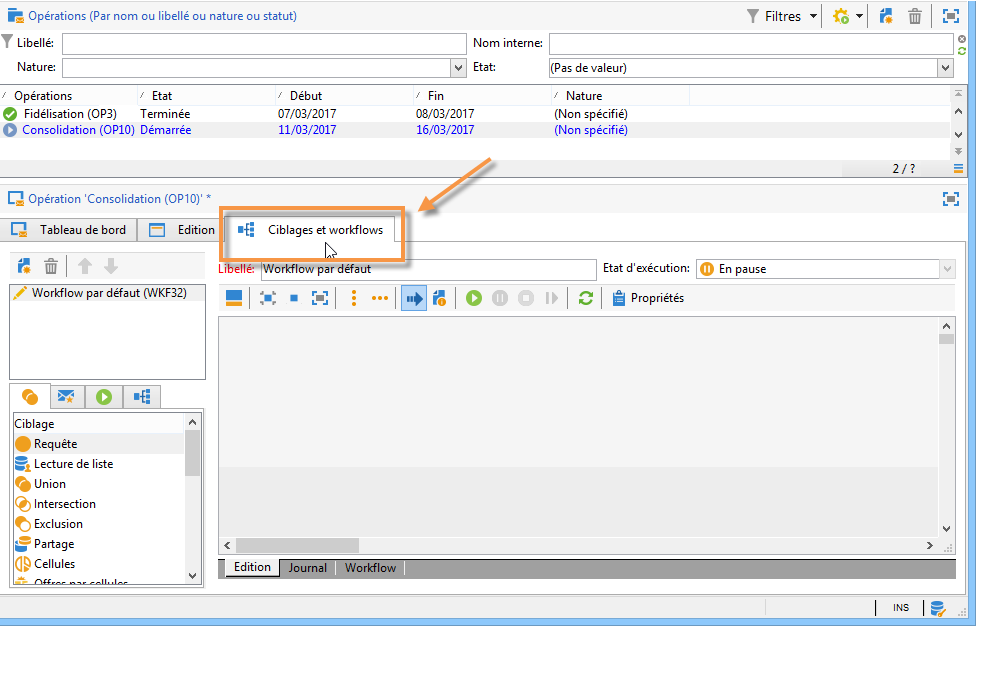

1. Modifiez le libellé du workflow déjà existant ou cliquez sur **[!UICONTROL Ajouter]** pour en créer un (voir à ce sujet cette [section](../../campaign/using/marketing-campaign-deliveries.md#selecting-the-target-population)).

   

1. A l&#39;aide de la souris, faites glisser les différentes activités dans la fenêtre du workflow, soit une activité **[!UICONTROL Requête]** (onglet **[!UICONTROL Ciblage]**), une activité **[!UICONTROL Partage]** (onglet **[!UICONTROL Ciblage]**), deux activités **[!UICONTROL Diffusion e-mail]** (onglet **[!UICONTROL Diffusions]**), une activité **[!UICONTROL Attente]** (onglet **[!UICONTROL Ordonnancement]**), une activité **[!UICONTROL Code JavaScript]** (onglet **[!UICONTROL Action]**) et une activité **[!UICONTROL Diffusion]** (onglet **[!UICONTROL Actions]**).

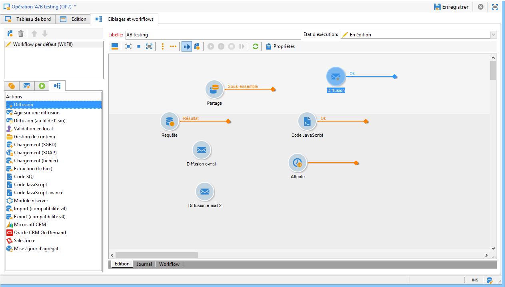

## Etape 2 : paramétrer les échantillons de population {#step-2--configuring-population-samples}

### Paramétrage de l&#39;activité Requête {#configuring-the-query-activity}

* Double-cliquez sur l&#39;activité **[!UICONTROL Requête]**.

   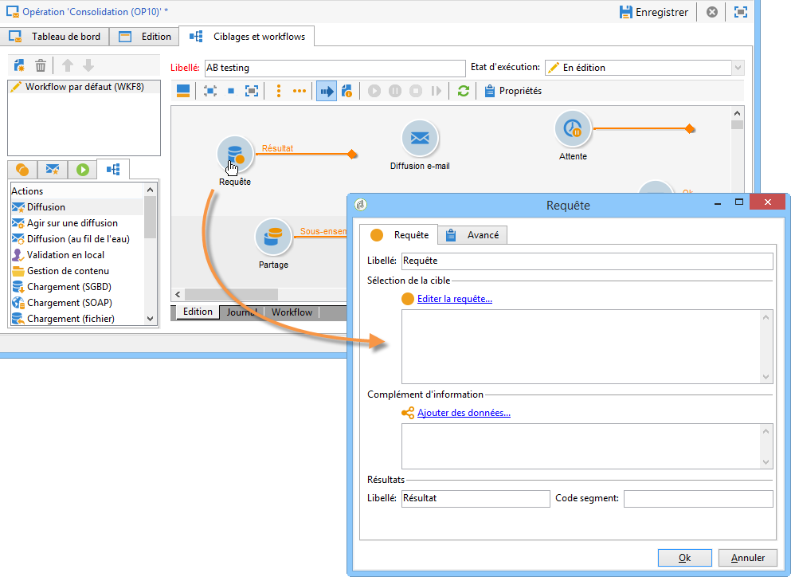

* Cliquez sur le lien **[!UICONTROL Editer la requête]** et sélectionnez les destinataires que vous souhaitez cibler.

   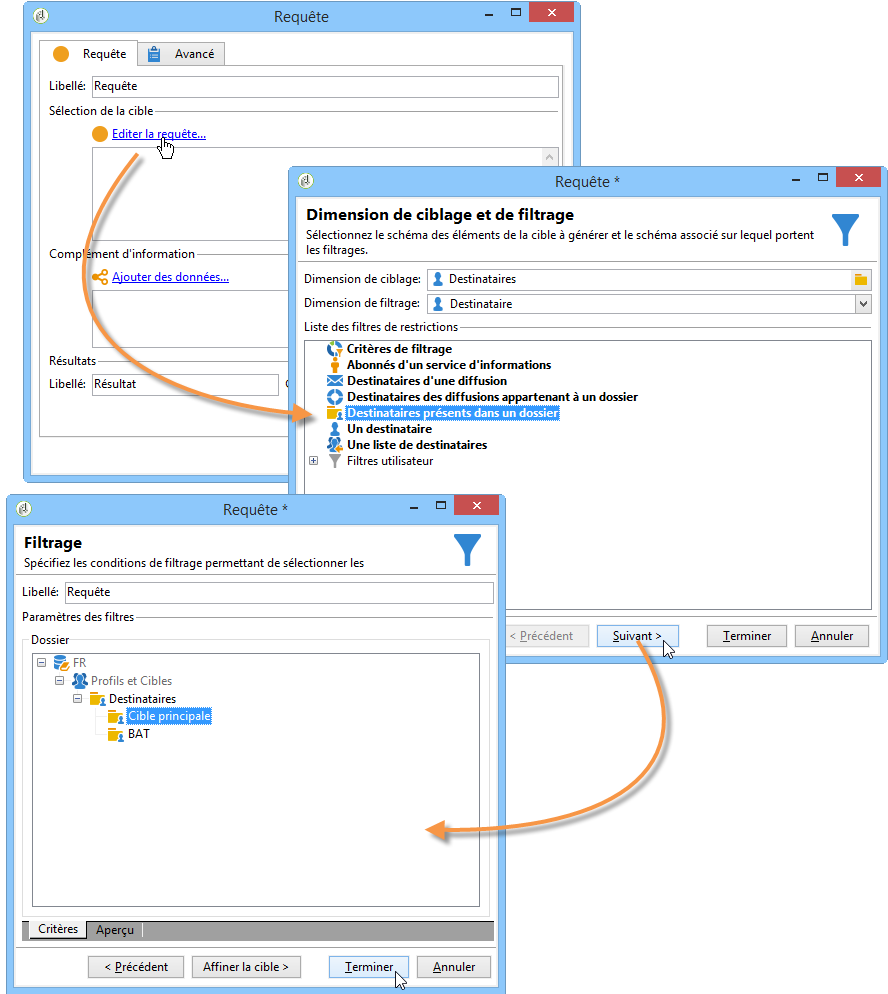

* Reliez l&#39;activité **[!UICONTROL Requête]** à l&#39;activité **[!UICONTROL Partage]**.

   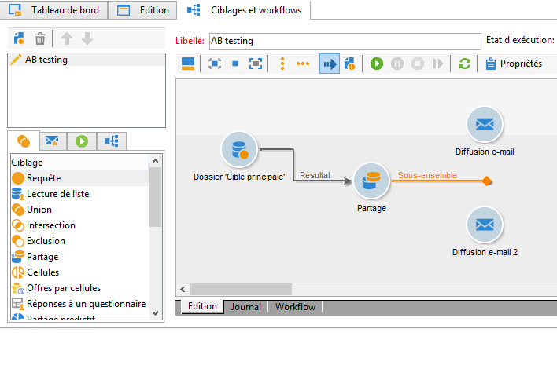

### Paramétrage de l&#39;activité Partage {#configuring-the-split-activity}

Cette activité permet de créer plusieurs populations : celle qui reçoit la diffusion A, celle qui reçoit la diffusion B et la population restante. D&#39;autre part, l&#39;utilisation du tirage aléatoire permet de ne cibler qu&#39;une partie de la population de chacune des diffusions.

1. Création de la population A :

   * Double-cliquez sur l&#39;activité **[!UICONTROL Partage]**.

      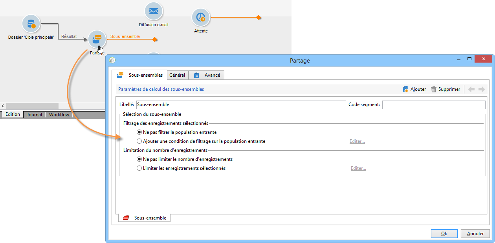

   * Dans l&#39;onglet existant, modifiez le libellé pour désigner la population A.

      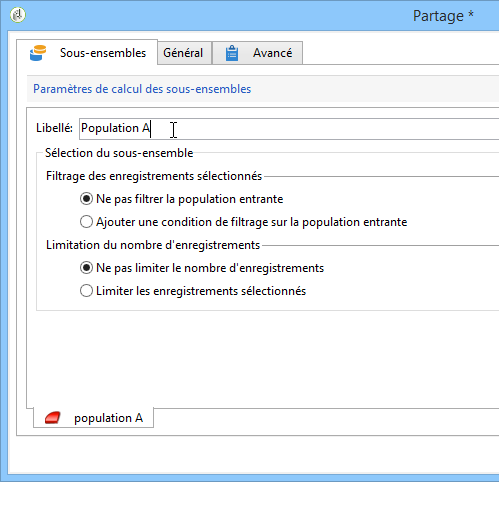

   * Sélectionnez l&#39;option **[!UICONTROL Limiter les enregistrements sélectionnés]**.

      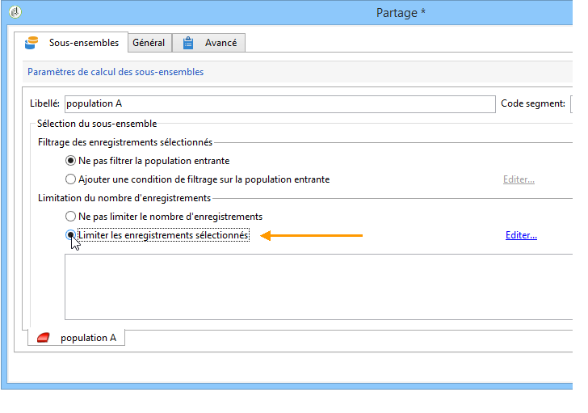

   * Cliquez sur le lien **[!UICONTROL Editer]**, sélectionnez **[!UICONTROL Activer le tirage aléatoire]**, puis cliquez sur **[!UICONTROL Suivant]**.

      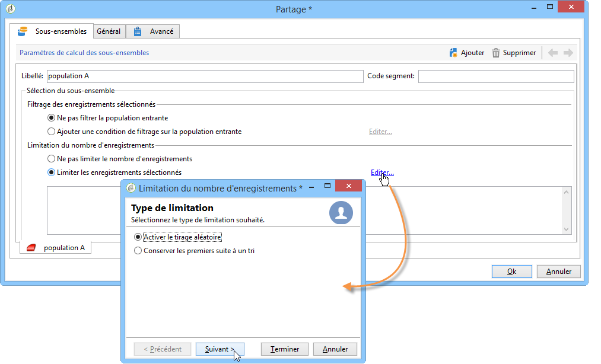

   * Configurez la limite à 10%, puis cliquez sur **[!UICONTROL Terminer]**.

      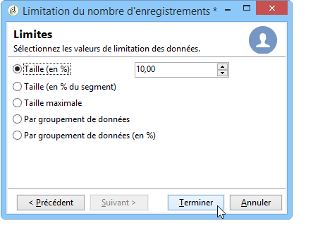

1. Création de la population B :

   * Cliquez sur **[!UICONTROL Ajouter]** pour créer un nouvel onglet destiné à la population B.

      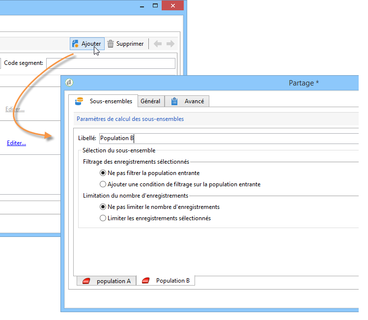

   * Limitez la population à 10% comme fait précédemment.

      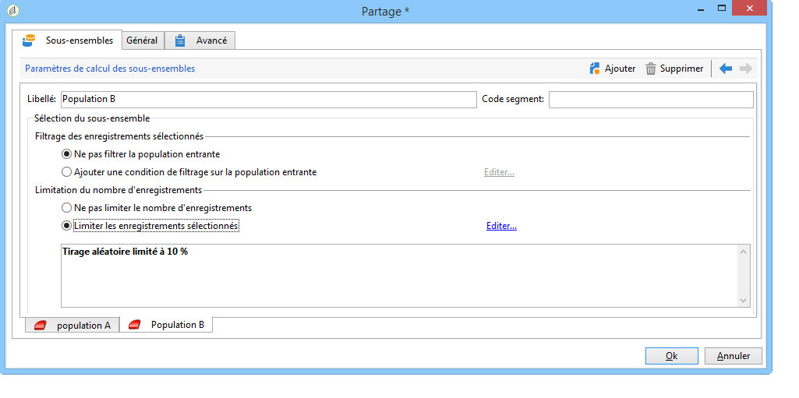

1. Création de la population restante :

   * Positionnez-vous dans l&#39;onglet **[!UICONTROL Général]**.

      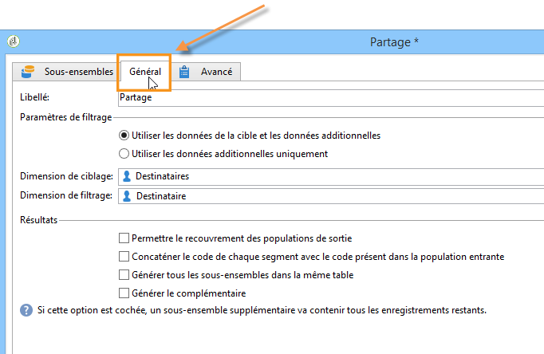

   * Sélectionnez **[!UICONTROL Générer le complémentaire]**.

      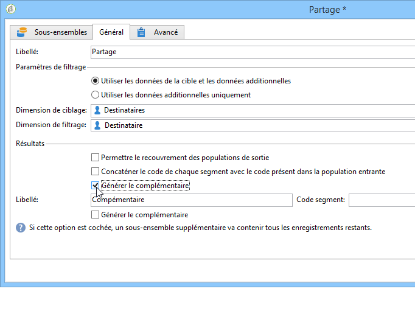

   * Modifiez le libellé pour désigner la population qui ne comprend ni la population A, ni la B et cliquez sur **[!UICONTROL OK]** pour fermer l&#39;activité.

      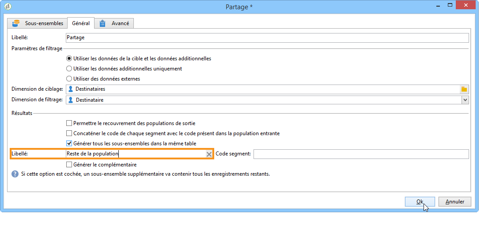

## Etape 3 : créer deux modèles de diffusions {#step-3--creating-two-delivery-templates}

Vous allez à présent créer deux modèles de diffusions. Chaque modèle sera référencé dans une activité **[!UICONTROL Diffusion-email]** rattachée à l&#39;activité **[!UICONTROL Partage]**. Reportez-vous à cette [section](../../delivery/using/about-templates.md) pour plus d&#39;informations.

1. Positionnez-vous dans le dossier **[!UICONTROL Ressources > Modèle de diffusion]**.
1. Dupliquez le modèle de diffusion **[!UICONTROL Email]**.

   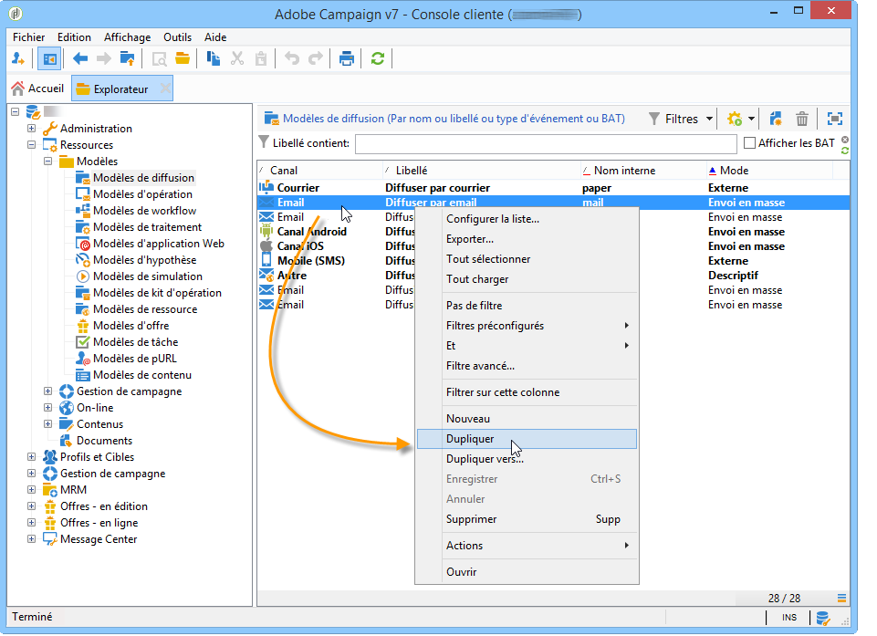

1. Créez le contenu destiné à votre diffusion A.

   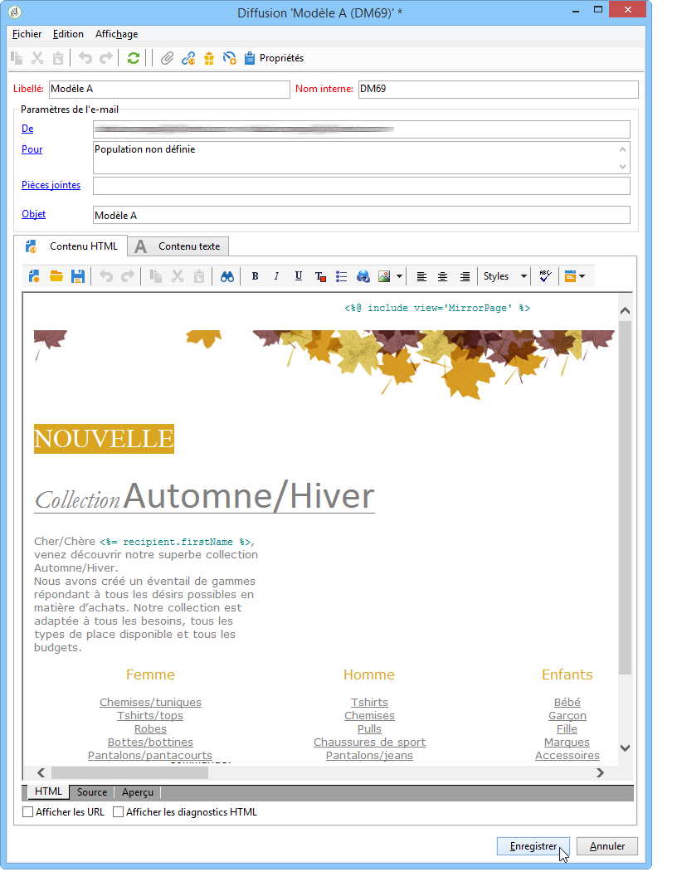

1. Répétez les mêmes étapes pour créer un modèle destiné à la diffusion B.

   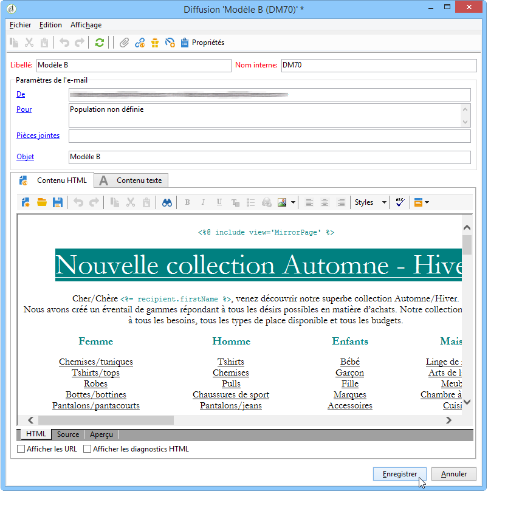

## Etape 4 : paramétrer les diffusions dans le workflow {#step-4--configuring-the-deliveries-in-the-workflow}

L’étape suivante consiste à configurer les remises. Ils sont destinés aux trois populations créées au cours de l&#39;étape précédente : [Étape 2 : Configuration des échantillons](#step-2--configuring-population-samples)de population. Les deux premières livraisons vous permettent d&#39;envoyer des contenus différents à la population A et B. La troisième livraison est destinée à la population qui n&#39;a reçu ni A ni B. Son contenu sera calculé par un script et sera identique à A ou B, selon lequel l’un des résultats a obtenu le taux d’ouverture le plus élevé. Nous devons configurer une période d&#39;attente pour la troisième livraison, pour connaître le résultat des livraisons A et B. C’est pourquoi la troisième diffusion comprend une activité **[!UICONTROL d’attente]** .

1. Depuis l&#39;activité **[!UICONTROL Partage]**, rattachez la transition destinée à la population A à l&#39;une des diffusions e-mail déjà présentes dans le workflow.

   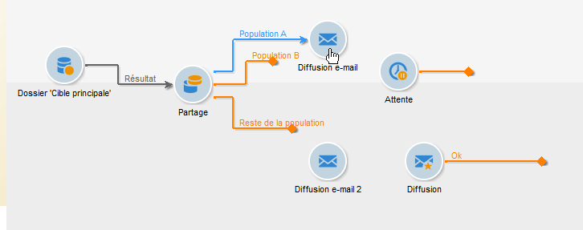

1. Double-cliquez sur la diffusion pour l&#39;ouvrir.
1. A l&#39;aide de la liste déroulante, sélectionnez le modèle de la diffusion A.

   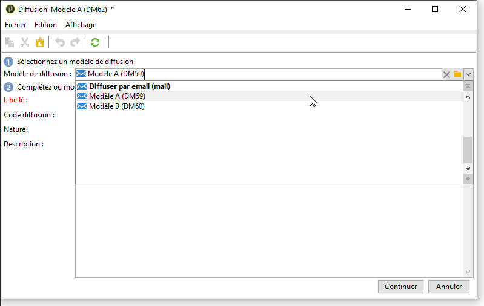

1. Cliquez sur **[!UICONTROL Continuer]** pour visualiser la diffusion puis enregistrez-la.

   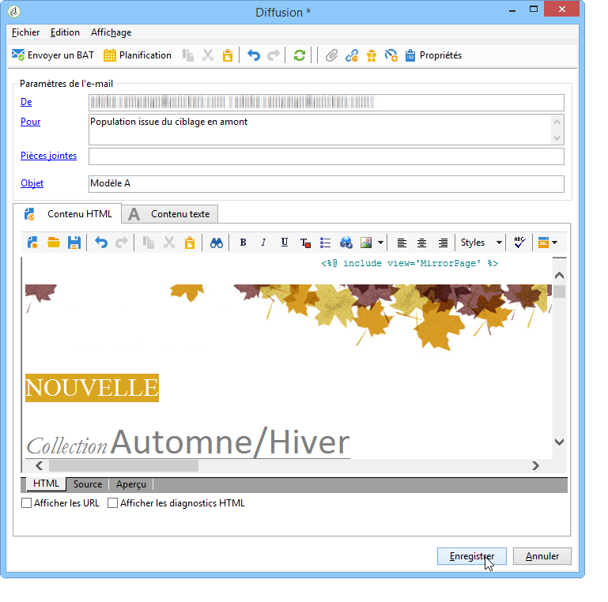

1. Rattachez la transition de l&#39;activité **[!UICONTROL Partage]** destiné à la population B à la seconde diffusion e-mail.

   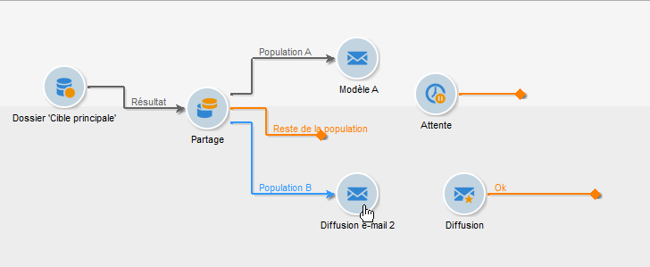

1. Ouvrez la diffusion et sélectionnez le modèle de la diffusion B et enregistrez la diffusion.

   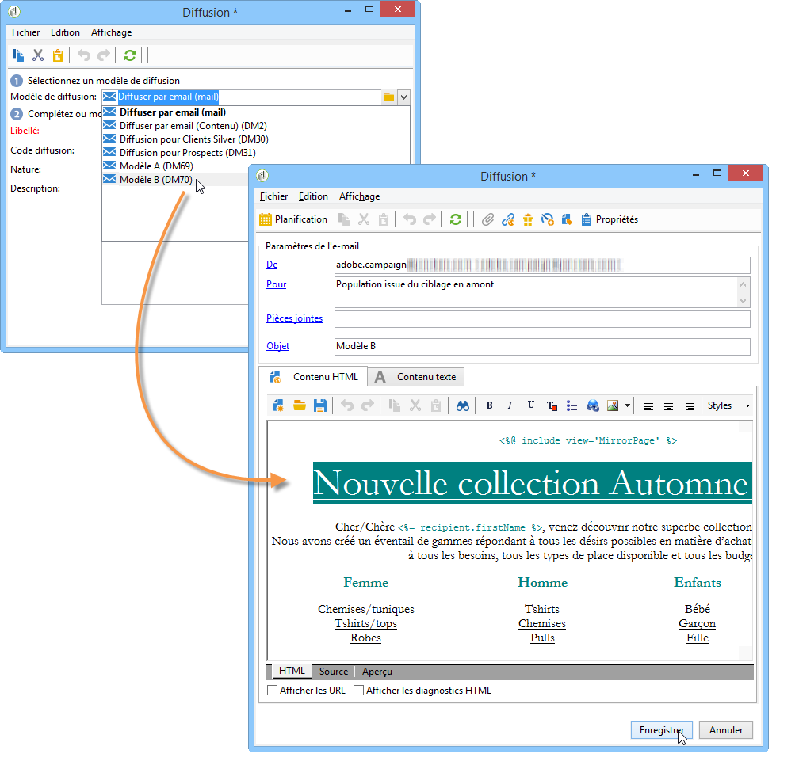

1. Reliez la transition destinée à la population restante à l&#39;activité **[!UICONTROL Attente]**.

   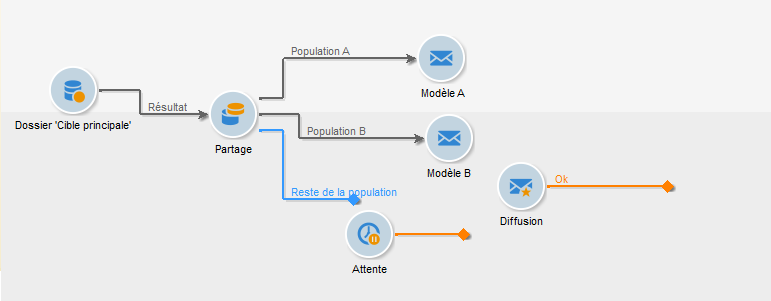

1. Ouvrez l&#39;activité **[!UICONTROL Attente]** et configurez le délai à 5 jours.

   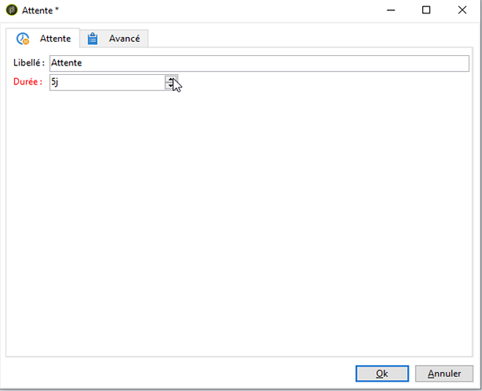

1. Reliez l&#39;activité **[!UICONTROL Attente]** à l&#39;activité **[!UICONTROL Code JavaScript]**.

   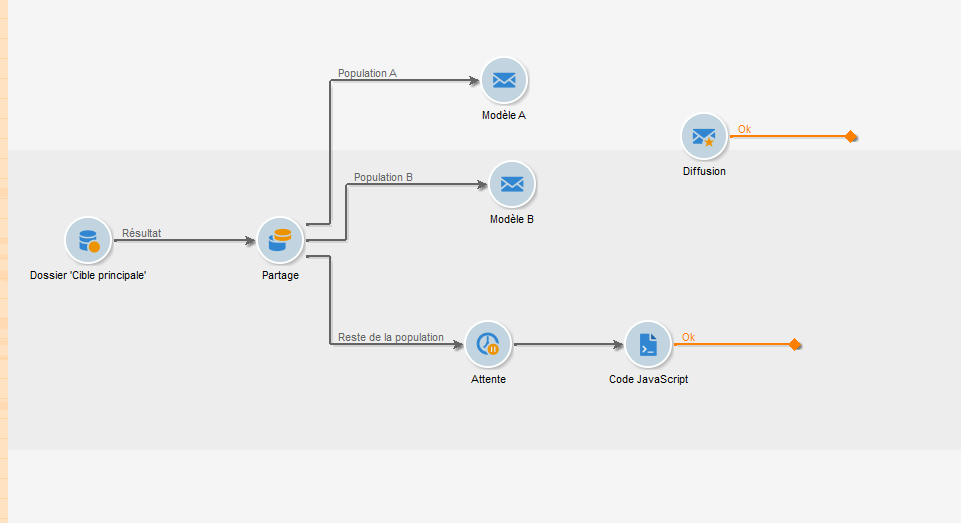

## Etape 5 : créer le script {#step-5--creating-the-script}

Le choix du contenu de la diffusion destinée à la population restante est calculé par un script. Ce script récupère l&#39;information quant à la diffusion qui a obtenu le plus fort taux d&#39;ouverture et copie le contenu dans la diffusion finale.

### Exemple de script {#example-of-a-script}

Le script suivant peut être utilisé tel quel dans le flux de travaux de ciblage. For more on this, refer to [Implementation](#implementation).

```
 // query the database to find the winner (best open rate)
   var winner = xtk.queryDef.create(
     <queryDef schema="nms:delivery" operation="get">
       <select>
         <node expr="@id"/>
         <node expr="@label"/>
         <node expr="[@operation-id]"/>
         <node expr="[@workflow-id]"/>
       </select>
       <where>
         <condition expr={"@FCP=0 and [@workflow-id]= " + instance.id}/>
       </where>
       <orderBy>
         <node expr="[indicators/@estimatedRecipientOpenRatio]" sortDesc="true"/>
       </orderBy>
     </queryDef>).ExecuteQuery()
   
   // create a new delivery object and initialize it by doing a copy of
   // the winner delivery
   var delivery = nms.delivery.create()
   delivery.Duplicate("nms:delivery|" + winner.@id)

   // append 'final' to the delivery label
   delivery.label = winner.@label + " final"

   // link the delivery to the operation to make sure it will be displayed in
   // the campaign dashboard. This attribute needs to be set manually here since 
   // the Duplicate() method has reset it to its default value => 0
   delivery.operation_id = winner.@["operation-id"]
   delivery.workflow_id = winner.@["workflow-id"]

   // adjust some delivery parameters to make it compatible with the 
   // "Prepare and start" option selected in the Delivery tab of this activity
   delivery.scheduling.validationMode = "manual"
   delivery.scheduling.delayed = 0
 
   // save the delivery in database
   delivery.save()
 
   // store the new delivery Id in event variables
   vars.deliveryId = delivery.id
```

Pour une explication détaillée du script, reportez-vous aux [détails du script](#details-of-the-script).

### Mise en oeuvre {#implementation}

1. Ouvrez votre activité **[!UICONTROL Code JavaScript]**,
1. Copiez le script proposé dans [Exemple de script](#example-of-a-script) dans la fenêtre de code **** JavaScript.

   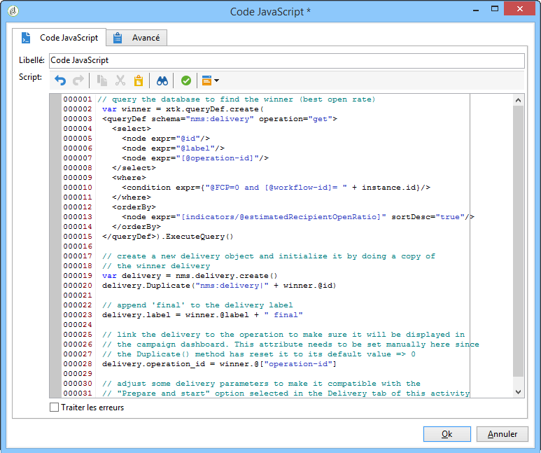

1. Dans le champ **[!UICONTROL Libellé]**, entrez le nom du script, soit

   ```
   <%= vars.deliveryId %>
   ```

   

1. Fermez l&#39;activité **[!UICONTROL Code JavaScript]**.
1. Sauvegardez votre workflow.

### Détails du script {#details-of-the-script}

Cette section détaille les différentes parties du script et leur fonctionnement.

* La première partie du script est une requête. The **queryDef** command lets you recover from the **NmsDelivery** table the deliveries created by executing the targeting workflow and to sort them based on their estimated rate of opens, then the information from the delivery with the highest rate of opens is recovered.

   ```
   // query the database to find the winner (best open rate)
      var winner = xtk.queryDef.create(
        <queryDef schema="nms:delivery" operation="get">
          <select>
            <node expr="@id"/>
            <node expr="@label"/>
            <node expr="[@operation-id]"/>
          </select>
          <where>
            <condition expr={"@FCP=0 and [@workflow-id]= " + instance.id}/>
          </where>
          <orderBy>
            <node expr="[indicators/@estimatedRecipientOpenRatio]" sortDesc="true"/>
          </orderBy>
        </queryDef>).ExecuteQuery()
   ```

* La diffusion qui a eu le meilleur taux d&#39;ouverture est dupliquée.

   ```
    // create a new delivery object and initialize it by doing a copy of
    // the winner delivery
   var delivery = nms.delivery.create()
   delivery.Duplicate("nms:delivery|" + winner.@id)
   ```

* Le libellé de la diffusion dupliquée est modifié en y ajoutant le terme **final**.

   ```
   // append 'final' to the delivery label
   delivery.label = winner.@label + " final"
   ```

* La diffusion est copiée dans le tableau de bord de l&#39;opération.

   ```
   // link the delivery to the operation to make sure it will be displayed in
   // the campaign dashboard. This attribute needs to be set manually here since 
   // the Duplicate() method has reset it to its default value => 0
   delivery.operation_id = winner.@["operation-id"]
   delivery.workflow_id = winner.@["workflow-id"]
   ```

   ```
   // adjust some delivery parameters to make it compatible with the 
   // "Prepare and start" option selected in the Delivery tab of this activity
   delivery.scheduling.validationMode = "manual"
   delivery.scheduling.delayed = 0
   ```

* La diffusion est enregistrée dans la base.

   ```
   // save the delivery in database
   delivery.save()
   ```

* L&#39;identifiant unique de la diffusion dupliquée est stockée dans la variable du workflow.

   ```
   // store the new delivery Id in event variables
   vars.deliveryId = delivery.id
   ```

### Autres critères de sélection {#other-selection-criteria}

L&#39;exemple présenté ci-dessus permet de sélectionner le contenu d&#39;une diffusion en fonction du taux d&#39;ouverture des emails. Vous pouvez l&#39;adapter pour vous baser sur d&#39;autres indicateurs propres aux diffusions :

* Best click throughput: `[indicators/@recipientClickRatio]`,
* Highest reactivity rate (email open and clicks in the message): `[indicators/@reactivity]`,
* Lowest complaint rate: `[indicators/@refusedRatio]` (use the false value for the sortDesc attribute),
* Highest conversion rate: `[indicators/@transactionRatio]`,
* Number of pages visited following the reception of a message: `[indicators/@totalWebPage]`,
* Lowest unsubscription rate: `[indicators/@optOutRatio]`,
* Transaction amount: `[indicators/@amount]`.

## Etape 6 : définir la diffusion finale {#step-6--defining-the-final-delivery}

Une fois que le script pour sélectionner le gagnant du test A/B a été créé, vous pouvez définir les paramètres de la diffusion finale.

1. Reliez l&#39;activité **[!UICONTROL Code JavaScript]** à l&#39;activité **[!UICONTROL Diffusion]** restante.
1. Ouvrez l&#39;activité **[!UICONTROL Diffusion]**.
1. Décochez l&#39;option **[!UICONTROL Générer une transition sortante]** pour terminer le workflow avec cette activité.
1. Conservez les valeurs par défaut des autres options.

   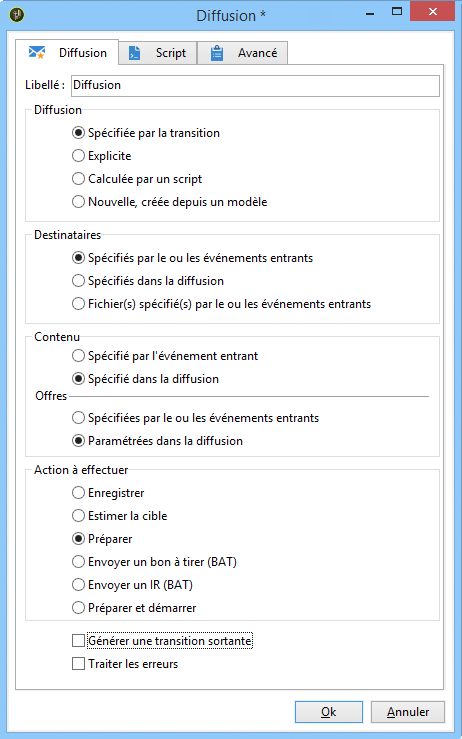

En préparant la diffusion spécifiée dans la transition (définie via l&#39;activité **[!UICONTROL Code Javascript]**), vous pourrez alors la valider et démarrer l&#39;envoi, comme décrit à l&#39;étape suivante.

## Etape 7 : lancer le workflow {#step-7--starting-the-workflow}

1. Cliquez sur **[!UICONTROL Démarrer]** le workflow.

   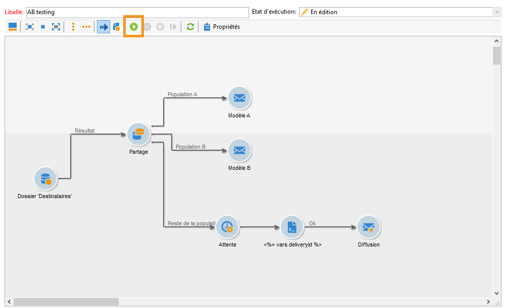

1. Effectuez la validation de la cible et du contenu des diffusions A et B depuis le tableau de bord de l&#39;opération.
1. Confirmez l&#39;envoi des diffusions.
1. Laissez passer le délai d&#39;attente de 5 jours pour savoir quel contenu a été calculé d&#39;après les résultats d&#39;ouverture des diffusions.

   

   Dans notre exemple, c&#39;est le modèle A qui a été retenu.

1. Lorsque le contenu de la troisième diffusion est déterminé, procédez à la validation de la cible et du contenu.

## Etape 8 : analyser le résultat {#step-8--analyzing-the-result}

Lorsque les diffusions test ont été envoyées, vous avez la possibilité de vérifier à quel(s) destinataire(s) elles ont été envoyées et si elles ont été ouvertes.

* Pour savoir quel destinataire a été ciblé, ouvrez une des diffusions depuis le tableau de bord de l&#39;opération et cliquez sur l&#39;onglet **[!UICONTROL Diffusion]**.

   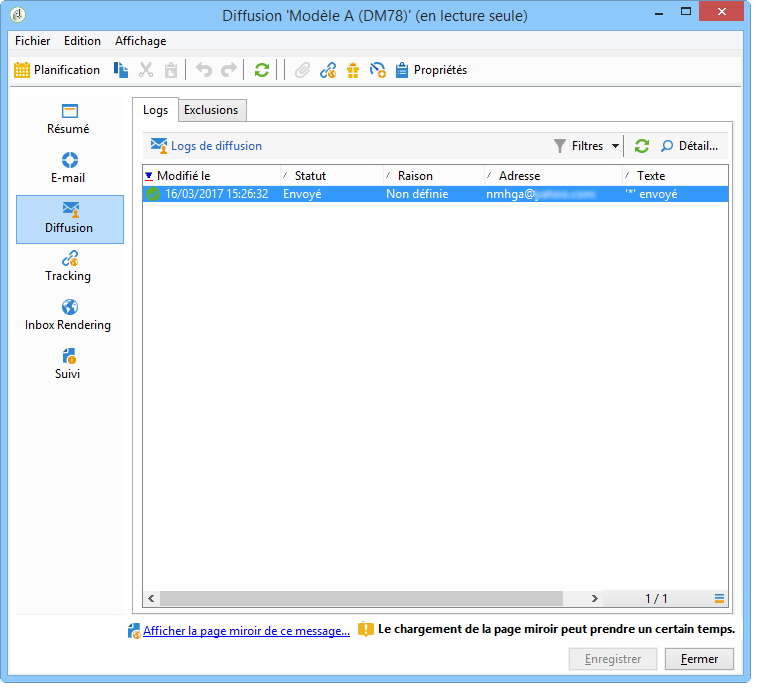

* Pour savoir si la diffusion a été ouverte, positionnez-vous dans l&#39;onglet **[!UICONTROL Tracking]**.

   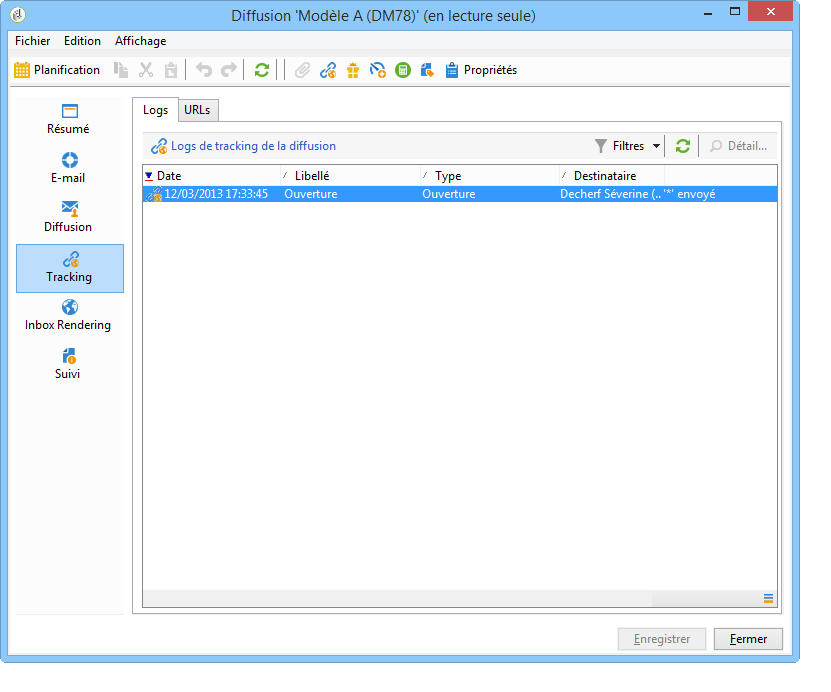

* Comparez avec l&#39;autre diffusion.

   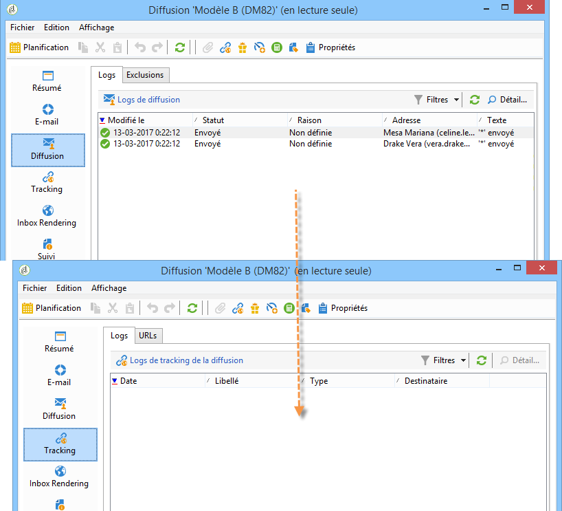

Dans notre exemple, c&#39;est la diffusion A qui obtient le meilleur taux d&#39;ouverture par rapport à la diffusion B. C&#39;est donc le contenu A qui sera utilisé pour la diffusion finale.

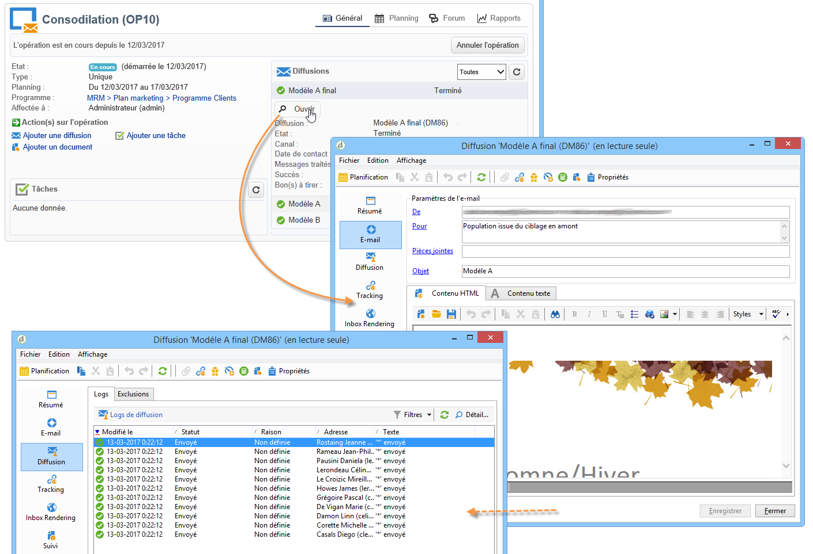

