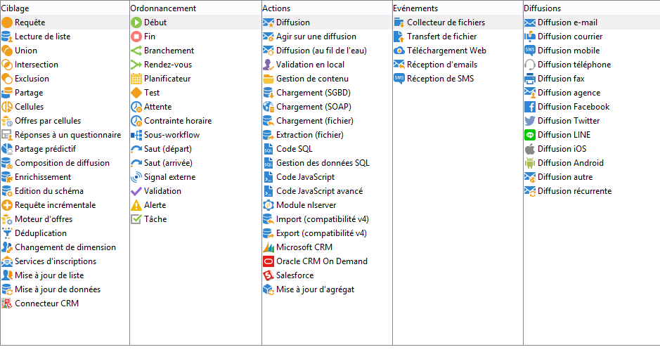

# Activités de workflows{#wf-activities}

Cette section décrit l&#39;ensemble des activités disponibles. En fonction du noeud ou du contexte dans lequel le workflow est créé/édité, les activités disponibles peuvent différer. Par exemple, les workflows créés dans une campagne disposent d&#39;activités de diffusion spécifiques par canal.

Les activités d&#39;un workflow sont regroupées par catégories. Quatre onglets sont proposés simultanément :

Dans les workflows des opérations, l’onglet **[!UICONTROL Evénements]** est remplacé par l’onglet **[!UICONTROL Diffusions]** . Les activités de cet onglet sont détaillées dans la section [Activités d’action](about-action-activities.md).

En savoir plus:

* [À propos des activités de ciblage](about-targeting-activities.md)
* [Exécuter un workflow](starting-a-workflow.md)
* [Bonnes pratiques relatives aux workflows](workflow-best-practices.md)
