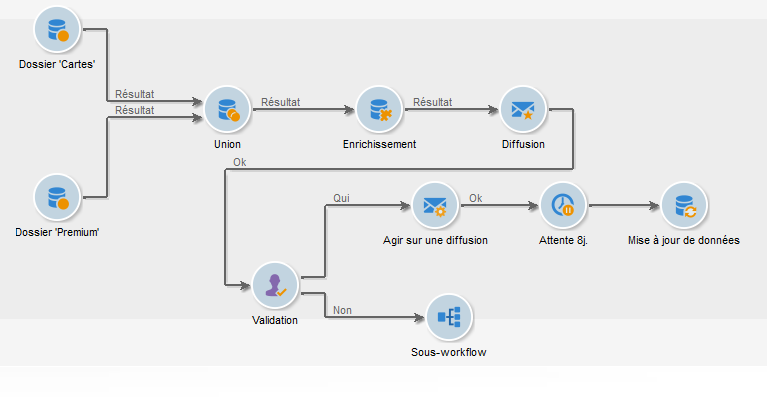

# Automatisation à l’aide de workflows {#gs-workflows}

Adobe Campaign comprend un module de workflow qui vous permet d’orchestrer l’ensemble des processus et tâches dans les différents modules du serveur d’applications. Cet environnement graphique complet permet de concevoir des processus englobant segmentation, exécution de campagnes, traitement de fichiers, participation humaine, etc. Le moteur de workflow exécute et suit ces processus.

Un workflow permet par exemple de télécharger un fichier depuis un serveur, de le décompresser et d&#39;importer ses enregistrements dans la base de données Adobe Campaign.

Un workflow peut également faire intervenir des opérateurs afin de notifier ou valider une opération ou faire un choix. Ainsi, il est possible de créer une action de diffusion, d&#39;assigner une tâche à un ou plusieurs opérateurs qui seront chargés de saisir son contenu ou spécifier sa cible, puis de faire valider le BAT avant de démarrer la diffusion.

Les workflows interviennent dans différents contextes et à différentes étapes du processus de gestion des campagnes.

Pour en savoir plus sur la gestion des workflows, reportez-vous à la [documentation de Campaign v8](https://experienceleague.adobe.com/docs/campaign/automation/workflows/introduction/about-workflows.html?lang=fr){target=_blank}.

{width="40%"}

Découvrez les étapes clés liées à la gestion des workflows :

* [Activités de workflows](https://experienceleague.adobe.com/docs/campaign/automation/workflows/wf-activities/activities.html?lang=fr){target=_blank} : une activité décrit un modèle de tâche. Les workflows comprennent les activités de ciblage, de contrôle de flux, d’action et d’événement.

* [Créer un workflow](https://experienceleague.adobe.com/docs/campaign/automation/workflows/introduction/build-a-workflow.html?lang=fr){target=_blank} : découvrez comment créer et exécuter des workflows de ciblage, de campagne et techniques.

* [Bonnes pratiques](https://experienceleague.adobe.com/docs/campaign/automation/workflows/introduction/workflow-best-practices.html?lang=fr){target=_blank} : découvrez les instructions pour optimiser les performances des workflows de Campaign, améliorer la conception de vos workflows et sélectionner les paramètres appropriés.

* [Surveiller les workflows](https://experienceleague.adobe.com/docs/campaign/automation/workflows/monitoring-workflows/monitor-workflow-execution.html?lang=fr){target=_blank} : découvrez comment surveiller l’exécution des workflows pour vous assurer que tout fonctionne correctement.

* [Cas d’utilisation des workflows](https://experienceleague.adobe.com/docs/campaign/automation/workflows/use-cases/workflow-use-cases.html?lang=fr){target=_blank} : découvrez les différents contextes dans lesquels les workflows peuvent être utilisés et comment les implémenter par le biais de cas d’utilisation de bout en bout.

<!--

Adobe Campaign uses workflows to:

* Carry out targeting campaigns. [Learn more](building-a-workflow.md#implementation-steps-)
* Build campaigns: for each campaign, the **[!UICONTROL Workflow]** tab lets you build the target and create the deliveries. [Learn more](building-a-workflow.md#campaign-workflows)
* Perform technical processes: cleanup, collecting tracking information or provisional calculations. [Learn more](building-a-workflow.md#technical-workflows)

A workflow can mean both a process definition (the workflow model, which is a representation of what is supposed to happen) and an instance of this process (a workflow instance, which is a representation of what is actually happening).

The workflow template describes the various tasks to be performed and how they are linked together. The task templates are called activities and are represented by icons. They are linked together by transitions.

Each workflow contains:

* **[!UICONTROL Activities]**

  An activity describes a task template. The various activities available are represented on the diagram by icons. Each type has common properties and specific properties. For example, while all activities have a name and label, only the **[!UICONTROL Approval]** activity has an assignment.

  In a workflow diagram, a given activity can produce multiple tasks, in particular when there is a loop or recurrent (periodic) actions.

  All workflow activities are listed in [this section](about-activities.md), including use cases and samples.

* **[!UICONTROL Transitions]**

  Transitions enable you to link activities and to define their sequence. A transition links a source activity to a destination activity. There are several sorts of transitions, which depend on the source activity. Some transitions have additional parameters such as a duration, a condition or a filter.

  A transition which is not linked to a destination activity is colored orange and the arrow head is shown as a diamond.

  >[!NOTE]
  >
  >A workflow containing unterminated transitions can still be executed: a warning message will be generated and the workflow will pause once it reaches the transition but it will not generate an error. It is thus possible to start a workflow without it being finished and to add to it as you go along.

  For more information about how to build a workflow, refer to [this section](building-a-workflow.md).

* **[!UICONTROL Worktables]**

  The worktable contains all the information carried by the transition. Each workflow uses several worktables. The data conveyed in these tables can be accelerated and used throughout the workflow's life cycle, as long as it is not purged. Indeed, unneeded tables are purged each time the workflow is passivated, and possibly during the execution of the largest workflows to avoid overloading the server.

  Learn more on workflow data and tables in [this section](how-to-use-workflow-data.md).

## Key principles and best practices{#principles-workflows}

Refer to these sections to find guidance and best practices to automate processes with workflows:

* Learn more about workflow activities in [this page](how-to-use-workflow-data.md).
* Learn how to build a workflow in [this section](building-a-workflow.md).
* Discover how to use workflows to import data in Campaign in [this section](../../platform/using/import-export-workflows.md).
* Workflow best practices are detailed in [this page](workflow-best-practices.md).
* Find guidance about workflow execution in [this section](starting-a-workflow.md).
* Learn how to monitor workflows in [this page](monitoring-workflow-execution.md).
* Learn how to grant access to users to use workflows in [this page](managing-rights.md).

-->