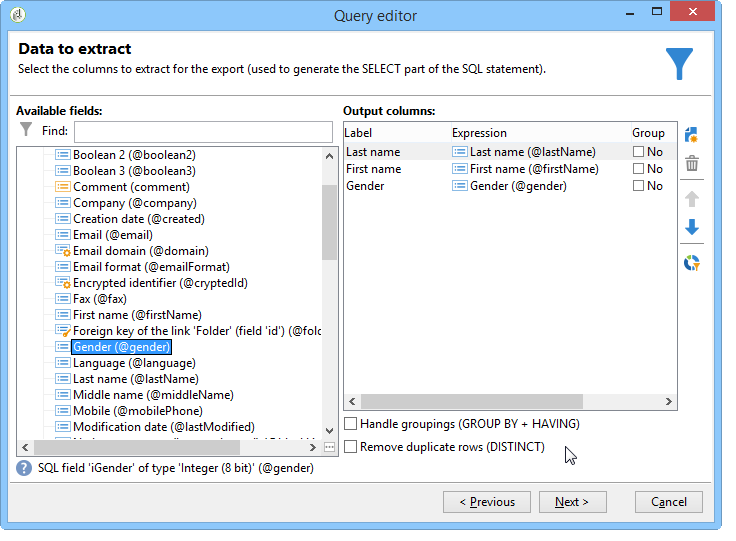
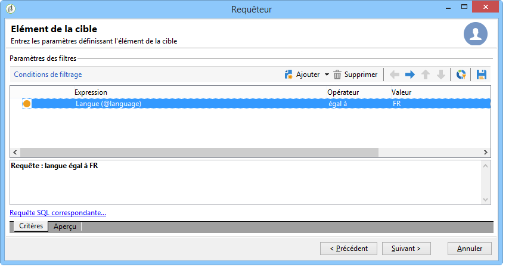
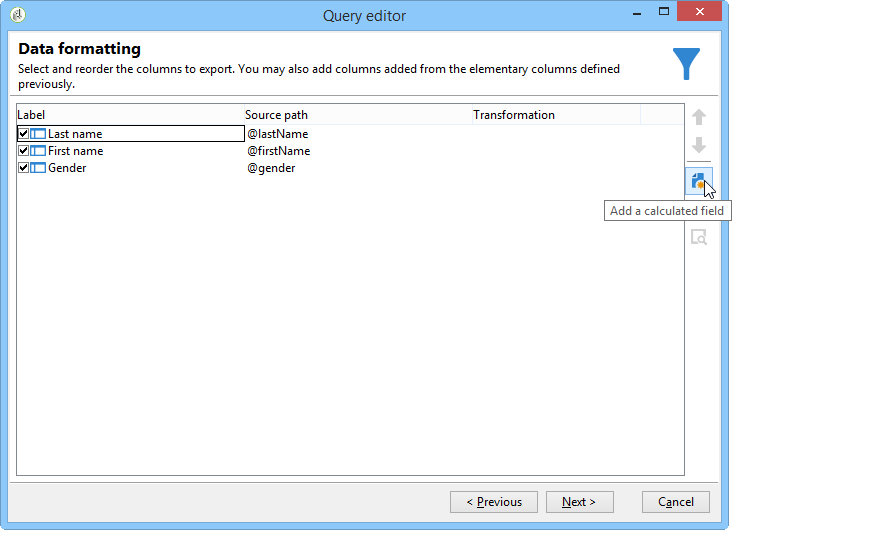
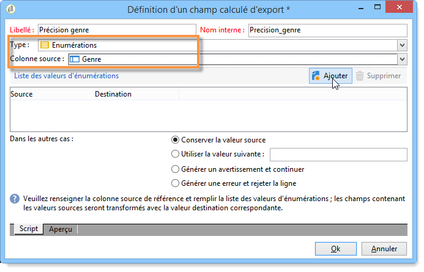
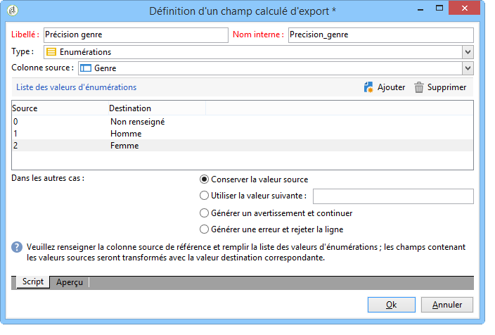
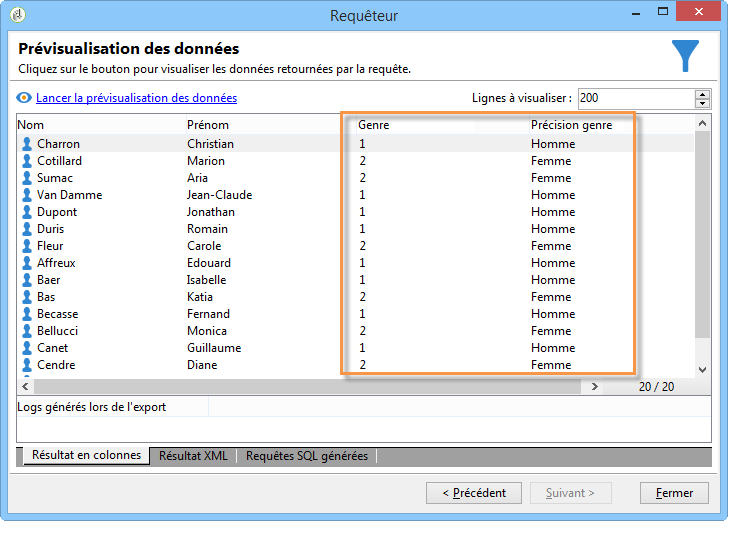
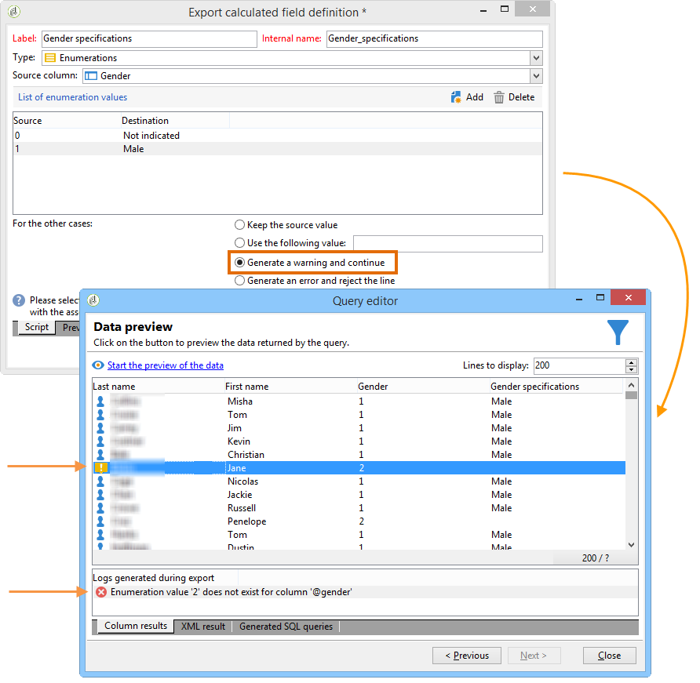
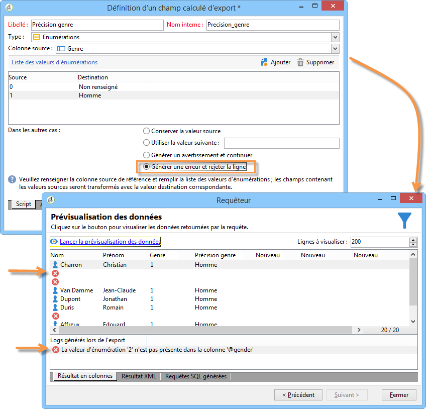

# Ajouter un champ calculé de type Énumération {#adding-an-enumeration-type-calculated-field}

Nous allons créer ici une requête avec un champ calculé de type **[!UICONTROL Énumérations]**.Ce champ génère une colonne supplémentaire dans la fenêtre de prévisualisation des données.Cette colonne spécifie les valeurs numériques renvoyées pour chaque destinataire (0, 1 et 2).Un genre sera attribué à chaque valeur de la nouvelle colonne : « Homme » pour « 1 », « Femme » pour « 2 » ou « Non indiqué » si la valeur est égale à « 0 ».

* Quelle table doit-on sélectionner ?

  Table des personnes destinataires (nms:recipient).

* Quels sont les champs à sélectionner en colonne de sortie ?

  Nom, Prénom et Genre.

* En fonction de quels critères seront filtrées les informations ?

  En fonction de la langue des destinataires.

Les étapes sont les suivantes :

1. Ouvrez le requêteur générique et choisissez la table Personnes destinataires **[!UICONTROL (nms):recipient]**.
1. Dans la fenêtre **[!UICONTROL Données à extraire]**, sélectionnez les champs **[!UICONTROL Nom]**, **[!UICONTROL Prénom]** et **[!UICONTROL Genre]**.

   

1. Dans la fenêtre **[!UICONTROL Tri]**, cliquez sur **[!UICONTROL Suivant]** : aucun tri n&#39;est nécessaire pour cet exemple.
1. Dans **[!UICONTROL Filtrage des données]**, sélectionnez **[!UICONTROL Critères de filtrage]**.
1. Paramétrez une condition dans la fenêtre **[!UICONTROL Elément de la cible]** pour que les destinataires retournés en résultat soient de langue française.

   

1. Dans la fenêtre **[!UICONTROL Formatage des données]**, cliquez sur **[!UICONTROL Ajouter un champ calculé]**.

   

1. Dans le champ **[!UICONTROL Type]** de la fenêtre **[!UICONTROL Définition d’un champ calculé d’export]**, sélectionnez **[!UICONTROL Énumérations]**.

   Définissez à quelle colonne doit se référer le nouveau champ calculé. Pour cela, sélectionnez la colonne **[!UICONTROL Genre]** dans le menu déroulant du champ **[!UICONTROL Colonne source]** : c&#39;est à la colonne **[!UICONTROL Genre]** que vont correspondre les valeurs de destination.

   

   Définissez la valeur **Source** et la valeur **Destination** : la valeur de destination va faciliter la lisibilité du résultat de la requête.Cette requête doit renvoyer le genre de la personne destinataire et le résultat sera 0, 1 ou 2.

   Pour chaque équivalence &quot;source-destination&quot; à renseigner, cliquez sur **[!UICONTROL Ajouter]** dans le champ **[!UICONTROL Liste des valeurs d&#39;énumérations]** :

   * Dans la colonne **[!UICONTROL Source]**, entrez chaque valeur source correspondant au genre (0, 1 et 2) dans de nouvelles lignes.
   * Dans la colonne **[!UICONTROL Destination]**, entrez les valeurs de destination : &quot;Non renseigné&quot; dans la ligne de &quot;0&quot;, &quot;Homme&quot; dans la ligne &quot;1&quot; et &quot;Femme&quot; dans la ligne &quot;2&quot;.

   Sélectionnez la fonction **[!UICONTROL Conserver la valeur source]**.

   Cliquez sur **[!UICONTROL Ok]** pour valider le champ calculé.

   

1. Dans la fenêtre **[!UICONTROL Formatage des données]**, cliquez sur **[!UICONTROL Suivant]**.
1. Dans l&#39;étape de prévisualisation, cliquez sur **[!UICONTROL Lancer la prévisualisation des données]**.

   La colonne supplémentaire spécifie à quel genre correspond chacune des trois valeurs 0, 1 et 2 :

   * 0 pour &quot;Non renseigné&quot;
   * 1 pour &quot;Homme&quot;
   * 2 pour &quot;Femme&quot;

   

   Par exemple, si vous ne renseignez pas le genre « 2 » dans la **[!UICONTROL Liste de valeurs d’énumération]** et que la fonction **[!UICONTROL Générer un avertissement et continuer]** du champ **[!UICONTROL Dans les autres cas]** est sélectionnée, un log d’avertissement est généré.Ce log indique que le genre « 2 » (féminin) n’a pas été saisi.Il est affiché dans le champ **[!UICONTROL Logs générés lors de l&#39;export]**, dans la fenêtre de prévisualisation des données.

   

   Prenons un autre exemple et supposons que la valeur d’énumération « 2 » n’ait pas été saisie. Sélectionnez la fonction **[!UICONTROL Générer une erreur et rejeter la ligne]** : toutes les personnes destinataires du genre « 2 » génèrent des anomalies et les autres informations de la ligne (prénom et nom, etc.)ne sont pas exportées.Un log des erreurs s’affiche dans le champ **[!UICONTROL Logs générés lors de l&#39;export]** de la fenêtre de prévisualisation des données. Ce log indique que la valeur d’énumération « 2 » n’a pas été saisie.

   
