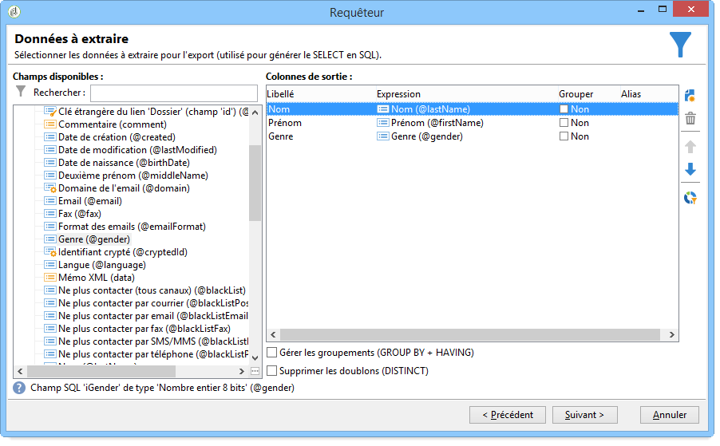

# Ajout d&#39;un champ calculé de type Enumérations {#adding-an-enumeration-type-calculated-field}

Ici, nous voulons créer une requête avec un champ calculé de **[!UICONTROL Enumerations]** type. Ce champ génère une colonne supplémentaire dans la fenêtre d’aperçu des données. Cette colonne spécifie les valeurs numériques renvoyées par le résultat pour chaque destinataire (0, 1 et 2). Un sexe sera affecté à chaque valeur de la nouvelle colonne : &quot;Homme&quot; pour &quot;1&quot;, &quot;Femme&quot; pour &quot;2&quot; ou &quot;Non indiqué&quot; si la valeur est égale à &quot;0&quot;.

* Quelle table doit-on sélectionner ?

   La table des destinataires (nms:recipient).

* Quels sont les champs à sélectionner en colonne de sortie ?

   Nom, Prénom et Genre.

* En fonction de quels critères seront filtrées les informations ?

   En fonction de la langue des destinataires.

Les étapes sont les suivantes :

1. Ouvrez le Requêteur générique et sélectionnez la table des Destinataires (**[!UICONTROL nms:recipient]**).
1. Dans la **[!UICONTROL Data to extract]** fenêtre, sélectionnez **[!UICONTROL Last name]**, **[!UICONTROL First name]** et **[!UICONTROL Gender]**.

   

1. In the **[!UICONTROL Sorting]** window, click **[!UICONTROL Next]**: no sort is necessary for this example.
1. Dans **[!UICONTROL Data filtering]**, sélectionnez **[!UICONTROL Filtering conditions]**.
1. In the **[!UICONTROL Target element]** window, set a filter condition to collect recipients who speak English.

   

1. Dans la **[!UICONTROL Data formatting]** fenêtre, cliquez sur **[!UICONTROL Add a calculated field]**.

   

1. Accédez à la **[!UICONTROL Type]** fenêtre de la **[!UICONTROL Export calculated field definition]** fenêtre et sélectionnez **[!UICONTROL Enumerations]**.

   Définissez la colonne à laquelle le nouveau champ calculé doit faire référence. Pour ce faire, sélectionnez la **[!UICONTROL Gender]** colonne dans le menu déroulant du **[!UICONTROL Source column]** champ : les valeurs de destination coïncident avec la **[!UICONTROL Gender]** colonne.

   

   Définissez la valeur **Source** et la valeur **Destination** : la valeur de destination va faciliter la lisibilité du résultat de la requête. Cette requête doit retourner le genre des destinataires. Le résultat correspondra aux genres 0, 1, ou 2.

   Pour chaque ligne &quot;source-destination&quot; à saisir, cliquez sur **[!UICONTROL Add]** dans le **[!UICONTROL List of enumeration values]**:

   * Dans la colonne **[!UICONTROL Source]**, entrez chaque valeur source correspondant au genre (0, 1 et 2) dans de nouvelles lignes.
   * Dans la colonne **[!UICONTROL Destination]**, entrez les valeurs de destination : &quot;Non renseigné&quot; dans la ligne de &quot;0&quot;, &quot;Homme&quot; dans la ligne &quot;1&quot; et &quot;Femme&quot; dans la ligne &quot;2&quot;.
   Sélectionnez la **[!UICONTROL Keep the source value]** fonction.

   Cliquez sur **[!UICONTROL OK]** pour valider le champ calculé.

   

1. Dans la **[!UICONTROL Data formatting]** fenêtre, cliquez sur **[!UICONTROL Next]**.
1. Dans la fenêtre d’aperçu, **[!UICONTROL start the preview of the data]**.

   La colonne supplémentaire spécifie à quel genre correspond chacune des trois valeurs 0, 1 et 2 :

   * 0 pour &quot;Non renseigné&quot;
   * 1 pour &quot;Homme&quot;
   * 2 pour &quot;Femme&quot;
   

   Par exemple, si vous n’entrez pas le sexe &quot;2&quot; dans le champ **[!UICONTROL List of enumeration values]** et que la **[!UICONTROL Generate a warning and continue]** fonction du **[!UICONTROL In other cases]** champ est sélectionnée, vous obtenez un journal d’avertissement. Ce journal indique que le sexe &quot;2&quot; (Femme) n’a pas été saisi. Il s’affiche dans le **[!UICONTROL Logs generated during export]** champ de la fenêtre d’aperçu des données.

   

   Prenons un autre exemple et disons que la valeur d&#39;énumération &quot;2&quot; n&#39;est pas saisie. Sélectionnez la **[!UICONTROL Generate an error and reject the line]** fonction : tous les bénéficiaires du sexe &quot;2&quot; génèreront des anomalies et les autres informations dans la ligne (prénom et nom, etc.) ne sera pas exportée. Un journal des erreurs s’affiche dans le **[!UICONTROL Logs generated during export]** champ de la fenêtre d’aperçu des données. Ce journal indique que la valeur d’énumération &quot;2&quot; n’est pas saisie.

   
