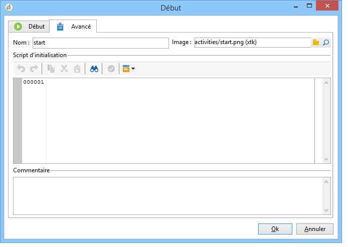
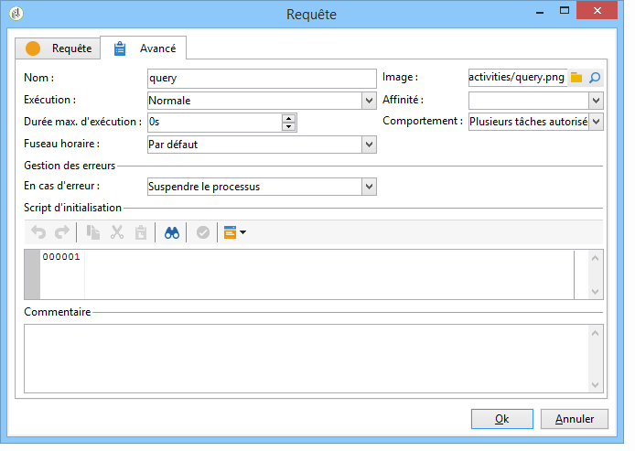

# Paramètres avancés{#advanced-parameters}

L&#39;écran des propriétés d&#39;une activité comporte un onglet **[!UICONTROL Avancé]** vous permettant notamment de définir le comportement en cas d&#39;erreur, la durée d&#39;exécution de l&#39;activité ou encore et de saisir un script d&#39;initialisation. Cet onglet se présente sous deux formes :

* une version simplifiée (par exemple pour les activités **[!UICONTROL Début]** ou **[!UICONTROL Fin]**)

   

* une version plus détaillée (par exemple pour l&#39;activité **[!UICONTROL Requête]**)

   

Les champs à renseigner dans l&#39;onglet **[!UICONTROL Avancé]** sont décrits dans les sections suivantes.

## Nom {#name}

Ce champ contient le nom interne de l&#39;activité.

## Image {#image}

Ce champ vous permet de modifier l’image liée à une activité. Pour plus d’informations à ce sujet, voir : [Gestion des images](../../workflow/using/managing-activity-images.md)d’activité.

## Exécution {#execution}

Ce champ vous permet de définir l&#39;action à effectuer au moment du déclenchement de la tâche. Trois options sont disponibles :

Ces options sont généralement sélectionnées au niveau du diagramme en cliquant sur l&#39;activité avec le bouton droit.

* **[!UICONTROL Normale]** : l&#39;activité est exécutée normalement.
* **[!UICONTROL Ne pas activer]** : cette tâche ainsi que toutes celles qui lui succèdent (dans la même branche) ne sont pas exécutées.
* **[!UICONTROL Activer mais ne pas exécuter]** : cette tâche ainsi que toutes celles qui lui succèdent (dans la même branche) sont automatiquement suspendues. Cela peut s&#39;avérer utile si vous désirez être présent au déclenchement de la tâche. Pour exécuter manuellement la tâche, cliquez sur l&#39;activité avec le bouton droit et sélectionnez **[!UICONTROL Exécution normale]**.

## Affinité {#affinity}

Ce champ vous permet de forcer l’exécution d’une activité sur un ordinateur spécifique. For more on this, refer to: [Managing propensity](../../workflow/using/managing-propensity.md).

## Max. execution period {#max--execution-period}

Ce champ vous permet de définir une alerte vous avertissant lorsque la tâche est trop longue. Cela n&#39;a aucun impact sur le fonctionnement du workflow. Si la tâche n&#39;est pas terminée au bout du temps défini dans le champ **[!UICONTROL Durée max. d&#39;exécution]**, la page **[!UICONTROL Supervision de l&#39;instance]** affichera une alerte concernant ce workflow. Cette page est accessible à partir de l&#39;onglet **[!UICONTROL Supervision]** de la page d&#39;accueil.

## Comportement {#behavior}

Ce champ vous permet de définir le comportement à effectuer dans le cas de l&#39;utilisation de tâches asynchrones. Deux options sont disponibles :

* **[!UICONTROL Plusieurs tâches autorisées]** : plusieurs tâches peuvent être exécutées en même temps, même si la première n&#39;est pas terminée.
* **[!UICONTROL La tâche en cours est prioritaire]** : lorsqu&#39;une tâche est en cours, celle-ci est prioritaire. Tant qu&#39;une tâche est toujours en cours, aucune autre tâche ne sera exécutée.

## Time zone {#time-zone}

Ce champ vous permet de sélectionner le fuseau horaire de l’activité. Pour en savoir plus : [Gestion des fuseaux](../../workflow/using/managing-time-zones.md)horaires.

## En cas d&#39;erreur {#in-case-of-errors}

Ce champ vous permet de définir l&#39;action à effectuer lorsque l&#39;activité est en erreur. Deux options sont disponibles :

* **[!UICONTROL Suspendre le processus]** : le workflow est automatiquement suspendu. Le statut du workflow est alors **[!UICONTROL En échec]**. Lorsque le problème est résolu, relancez le workflow.
* **[!UICONTROL Ignorer]** : cette tâche ainsi que toutes celles qui lui succèdent (dans la même branche) ne sont pas exécutées. Cela peut s&#39;avérer utile dans le cas de tâches récurrentes. Si la branche comporte un planificateur placé en amont, celui-ci se déclenchera normalement à sa prochaine date d&#39;exécution.

## Script d&#39;initialisation {#initialization-script}

Ce champ vous permet d’initialiser des variables ou de modifier des propriétés d’activité. Pour plus d’informations à ce sujet, voir : Scripts [JavaScript et modèles](../../workflow/using/javascript-scripts-and-templates.md).

## Commentaire {#comment}

Le champ **[!UICONTROL Commentaire]** est un champ libre vous permettant d&#39;ajouter une description.
