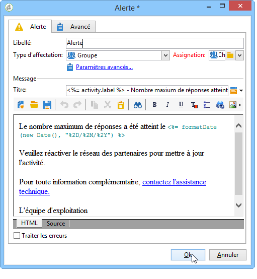

# Alerte{#alert}

Une activité de type **Alerte** envoie un message à un groupe d’opératrices et d’opérateurs. Son fonctionnement est le même qu’une activité de type validation, mais ici, aucune réponse n’est attendue.

Une alerte n&#39;est pas persistante et n&#39;est donc pas visible depuis la console. Les opérateurs du groupe assigné doivent avoir une adresse de messagerie renseignée pour recevoir la notification. Le paramétrage de cette activité est similaire à celui d&#39;une **Validation**. Le modèle de diffusion par défaut utilisé pour notifier les opérateurs est &#39;alertAssignee&#39;.
