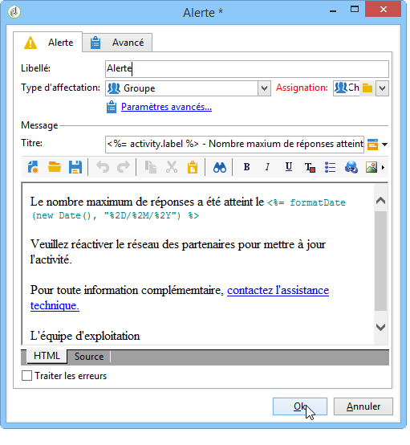

# Alerte{#alert}

Une activité de type **Alerte** envoie un message à un groupe d’opératrices et d’opérateurs. Son fonctionnement est le même qu’une activité de type validation, mais ici, aucune réponse n’est attendue.

Une alerte n’est pas persistante et n’est donc pas visible depuis la console. Les opérateurs et opératrices du groupe affecté doivent avoir une adresse e-mail complète pour recevoir la notification. La configuration de cette activité est similaire à celle d’une **Approbation**. Le modèle de diffusion par défaut utilisé pour alerter les opérateurs et opératrices est « alertAssignee ».
