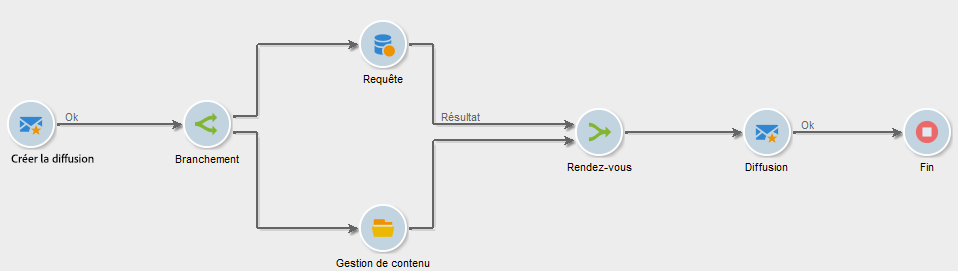

# Rendez-vous{#and-join}

Un rendez-vous ne déclenche sa transition sortante qu&#39;une fois toutes les transitions entrantes activées, donc quand toutes les activités précédentes sont terminées. Cela permet de s&#39;assurer que certaines activités sont bien terminées avant de continuer l&#39;exécution du workflow.

Par exemple, vous pouvez utiliser une activité Rendez-vous dans le cadre de la création de contenu et de l’automatisation de l’envoi de diffusions, afin de vous assurer qu’une diffusion n’est lancée qu’une fois les étapes d’interrogation de cible et de mise à jour du contenu terminées. Un cas pratique dédié est disponible dans [cette section](../../delivery/using/automating-via-workflows.md#creating-the-delivery-and-its-content)

La population transmise en sortie de l&#39;activité est déterminée par le choix d&#39;un ensemble principal parmi les transitions entrantes dans l&#39;activité.

La transition sortante ne peut contenir que l&#39;une des populations des transitions entrantes. Si l&#39;activité n&#39;est pas paramétrée, la transition sortante contiendra aléatoirement l&#39;une des populations entrantes.

>[!CAUTION]
>
>Dans le cas des activités de type **Rendez-vous**, les variables sont fusionnées. Toutefois, si une même variable est définie deux fois, il y a conflit et la valeur reste indéterminée. Voir à ce sujet la section .
