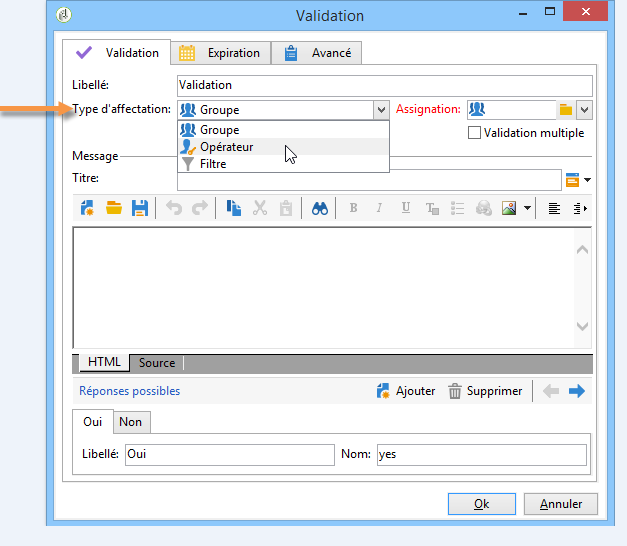
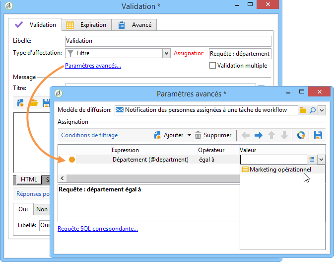
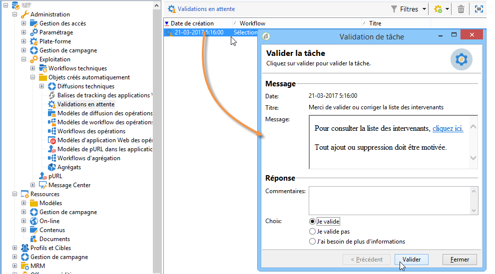
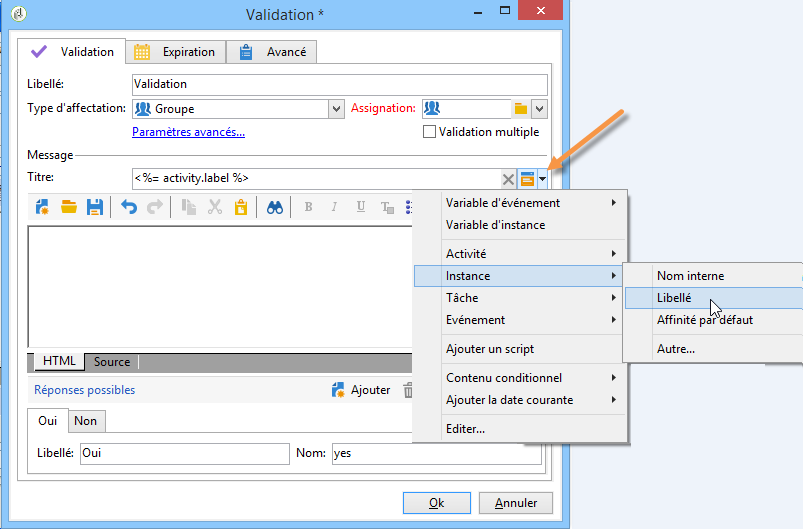

# Validation{#approval}

Une tâche de type **Validation** attend un signal ou une décision d&#39;un opérateur. L&#39;opérateur se voit assigner une tâche à laquelle il peut répondre depuis un email et via le web ou directement depuis la console.

## Assignation de la tâche {#task-assignment}

Par défaut, une validation est assignée à un groupe d&#39;opérateurs. Ce groupe représente un rôle, par exemple &#39;Groupe contenu newsletter&#39; ou &#39;Groupe ciblage newsletter&#39;. Chaque opérateur du groupe peut répondre mais seule la première réponse est prise en compte (sauf en cas de validation multiple).

Au besoin, vous pouvez affecter la tâche de validation à un opérateur unique ou à un ensemble d&#39;opérateurs défini par un filtre.

* To select a single operator, select the **[!UICONTROL Operator]** value in the **[!UICONTROL Assignment type]** field and select the relevant operator in the drop-down list of the **[!UICONTROL Assignee]** field.

   

   >[!CAUTION]
   >
   >Seul l&#39;opérateur sélectionné sera habilité à valider la tâche.

* Vous pouvez définir une requête pour le filtrage des opérateurs d’approbation. Pour ce faire, sélectionnez la **[!UICONTROL Filter]** valeur dans le **[!UICONTROL Assignment type]** champ et cliquez sur le **[!UICONTROL Advanced parameters...]** lien pour définir les conditions de filtrage, comme indiqué dans l’exemple suivant :

   

Dans le cas d&#39;une validation simple, la transition correspondant au choix de l&#39;opérateur est activée et la tâche est terminée : les autres opérateurs ne peuvent plus répondre.

Dans le cas d&#39;une validation multiple, les transitions correspondant au choix de chaque opérateur sont activées. La tâche est terminée lorsque tous les opérateurs du groupe ont répondu ou lorsque la tâche a expiré.

Cette activité n&#39;est pas bloquante et le workflow peut effectuer d&#39;autres traitements dans l&#39;attente d&#39;une réponse.

Un opérateur peut valider les tâches qui lui sont assignées depuis la console. Un opérateur ayant les droits administrateur peut visualiser et supprimer les tâches assignées à n&#39;importe quel opérateur, mais il ne peut y répondre.

La modification du titre ou du corps du message de l&#39;activité n&#39;affecte pas les tâches en cours, en revanche, la modification des choix possibles affecte directement les tâches en cours qui héritent automatiquement de la nouvelle liste de choix.

**Les tâches de type d’approbation** sont accessibles à partir du **[!UICONTROL Administration > Production > Objects created automatically > Approvals pending]** noeud : les opérateurs peuvent accéder directement au formulaire d’approbation via cette vue.

## Propriétés {#properties}

Les variables de personnalisation peuvent être utilisées dans le message envoyé au(x) validant(s). Elles peuvent être insérées dans le titre ou dans le contenu du message.

Ce **[!UICONTROL Title]** champ contient le titre du message : Il s’agit de l’objet du message électronique envoyé. Le titre, ainsi que le corps du message, sont des modèles JavaScript et peuvent donc contenir des valeurs calculées en fonction du contexte du flux de travail.

La section inférieure de l&#39;éditeur permet de définir la liste des réponses possibles. A chaque réponse correspond une transition. Le nom est l&#39;identifiant interne et le libellé est le texte qui sera affiché dans la liste des choix.

Cliquez sur le **[!UICONTROL Advanced parameters...]** lien pour sélectionner le modèle de remise à utiliser pour avertir les opérateurs. Le modèle par défaut (nom interne &#39;notifierAssignee&#39;) prend le titre et le message, et ajoute un lien à la page Web utilisée pour répondre.

Ce modèle peut être modifié pour personnaliser la présentation du message, mais il est préférable d&#39;en faire une copie. Le mécanisme de ciblage (fichier externe, mapping de ciblage) ne doit pas être modifié car il est nécessaire au bon fonctionnement de la notification.

An approval example is shown in [Defining approvals](../../workflow/using/executing-a-workflow.md#defining-approvals).

## Paramètres de sortie {#output-parameters}

* **[!UICONTROL response]**

   Commentaire associé à la réponse

* **[!UICONTROL responseOperator]**

   Identifiant de l’opérateur qui a répondu. Ce champ est une valeur numérique, mais un **[!UICONTROL String]** champ.

