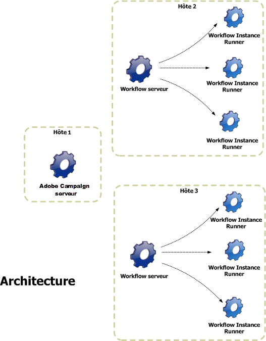

# Architecture {#architecture}

Les workflows sont pris en charge par un module spécifique. Ce module peut être démarré sur plusieurs serveurs afin de répartir la charge d&#39;exécution.

* Le processus &#39;Workflow Instance Runner&#39; (runwf) exécute toutes les tâches d&#39;une instance de workflow donnée. Lorsqu&#39;il n&#39;y a plus de tâche à exécuter dans l&#39;immédiat, ce processus devient passif, c&#39;est-à-dire qu&#39;il sauvegarde son état dans la base de données puis s&#39;arrête.
* Le module &#39;Workflow Server&#39; (wfserver) surveille les instances de workflow en cours. Lorsqu&#39;il y a une tâche à effectuer, ce module crée un processus pour activer (ou réactiver) l&#39;instance correspondante.
