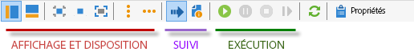
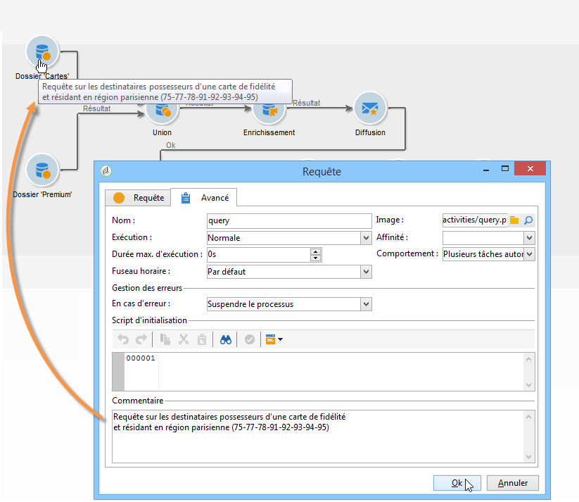
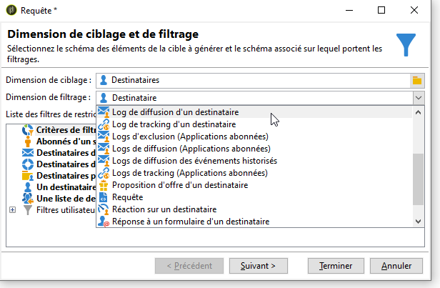
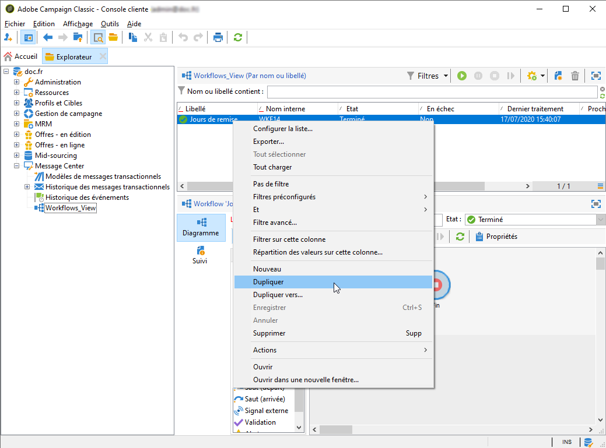

# Création d’un workflow {#building-a-workflow}

Cette section détaille les principes clés et les bonnes pratiques pour la création d’un workflow dans Campaign.

* Pour créer un workflow, voir [Créer un workflow](#creating-a-new-workflow)
* Pour concevoir le diagramme d’un workflow, voir [Ajouter et lier des activités](#adding-and-linking-activities)
* Pour accéder aux paramètres et aux propriétés des activités, voir [Configurer des activités](#configuring-activities)
* Pour concevoir des workflows de ciblage, voir [Cibler des workflows](#targeting-workflows)
* Pour utiliser des workflows afin d’exécuter une opération, voir [Workflows des opérations](#campaign-workflows)
* Pour créer des workflows techniques et y accéder, voir [Workflows techniques](#technical-workflows)
* Pour utiliser des modèles afin de créer des workflows, voir [Modèles de workflows](#workflow-templates)

## Création dʼun workflow {#creating-a-new-workflow}

A partir de l&#39;**[!UICONTROL Explorateur]**, accédez à un dossier de workflow. Par défaut, vous pouvez utiliser **[!UICONTROL Profils et cibles]** > **[!UICONTROL Traitements]** > **[!UICONTROL Workflows de ciblage]**.

Pour créer un workflow, cliquez sur le bouton **[!UICONTROL Nouveau]** situé au-dessus de la liste des workflows.

Vous pouvez également utiliser le bouton **[!UICONTROL Créer]** de la vue d’ensemble des workflows (**[!UICONTROL Supervision]** > lien **[!UICONTROL Workflow]**).

Saisissez un libellé puis cliquez sur **[!UICONTROL Enregistrer]**.

>[!NOTE]
>
>Lorsque vous modifiez le nom interne d&#39;une activité de workflow ou du workflow, assurez-vous de bien sauvegarder le workflow avant de le fermer pour que le nouveau nom interne soit correctement pris en compte.

## Ajout et liaison dʼactivités {#adding-and-linking-activities}

Vous devez maintenant définir les différentes activités et les relier entre elles dans un diagramme. À ce stade de la configuration, sont disponibles le libellé du diagramme et le statut du workflow (Édition en cours). La section inférieure de la fenêtre est réservée à l&#39;édition du diagramme. Elle contient une barre d&#39;outils, une palette d&#39;activités (à gauche) et le diagramme (à droite).

>[!NOTE]
>
>Si la palette n&#39;est pas visible, cliquez sur le premier bouton de la barre d&#39;outils.

Les activités sont regroupées par catégories dans les onglets de la palette. Les onglets et activités disponibles peuvent varier en fonction du type de workflow (technique, de ciblage ou workflow de campagne).

* Le premier onglet contient les activités de ciblage et de manipulation de données. Ces activités sont détaillées dans la section [Activités de ciblage](about-targeting-activities.md).
* Le deuxième Onglet contient les activités de planification qui servent principalement à coordonner les autres. Elles sont détaillées dans la section [Activités d&#39;ordonnancement](about-flow-control-activities.md).
* Le troisième onglet contient les outils et les actions utilisables dans le workflow. Ces activités sont décrites en détail dans la section [Activités d&#39;action](about-action-activities.md).
* Le quatrième onglet regroupe les activités qui dépendent d&#39;un événement particulier, par exemple la réception d&#39;un email ou l&#39;arrivée d&#39;un fichier sur un serveur. Ces activités sont décrites en détail dans la section [Activités événementielles](about-event-activities.md).

Pour construire le diagramme

1. Ajoutez une activité en la sélectionnant dans la palette et en la déplaçant jusqu&#39;au diagramme par un glisser-déposer.

   Positionnez une activité de type **Début**, puis une activité de type **Diffusion** sur le diagramme.

   

1. Reliez les deux activités en sélectionnant la transition de l&#39;activité **Début** et en la relâchant sur l&#39;activité **Diffusion**.

   

   Vous pouvez relier automatiquement une activité à celle qui la précède en déposant la nouvelle activité directement sur l&#39;extrémité de la transition.

1. Ajoutez les activités dont vous avez besoin et reliez-les entre elles, comme sur le diagramme ci-dessous.

   

>[!CAUTION]
>
>Vous pouvez copier et coller des activités dans un même workflow. Toutefois, nous vous déconseillons de copier et coller des activités dans différents workflows. Certains paramètres associés à des activités telles que Diffusions et Planificateur peuvent entraîner des conflits et des erreurs lors de l&#39;exécution du workflow de destination. Nous vous recommandons plutôt de **dupliquer** les workflows. Pour plus dʼinformations, consultez la section [Duplication des workflows](#duplicating-workflows).

Lʼaffichage et la mise en page du diagramme peuvent être modifiés à lʼaide des éléments suivants :

* **Utilisation de la barre d’outils**

   La barre d&#39;outils de l&#39;éditeur de diagramme permet d&#39;accéder aux fonctions de mise en page et d&#39;exécution du workflow.

   

   Vous pouvez ainsi adapter la mise en page de l&#39;éditeur : affichage de la palette et de la vue d&#39;ensemble, taille et alignement des objets graphiques.

   

   Les icônes relatives à la progression et l’affichage des logs sont présentées en détail dans les sections suivantes :

   * [Afficher la progression](../../workflow/using/monitoring-workflow-execution.md#displaying-progress)
   * [Afficher les journaux](../../workflow/using/monitoring-workflow-execution.md#displaying-logs)

* **Alignement des objets**

   Pour aligner les icônes, sélectionnez-les et cliquez sur l&#39;icône **[!UICONTROL Aligner verticalement]** ou **[!UICONTROL Aligner horizontalement]**.

   Utilisez la touche **CTRL** pour sélectionner plusieurs activités discontinues ou désélectionner une ou plusieurs activités d&#39;une sélection. Cliquez sur l&#39;arrière-plan du diagramme pour tout désélectionner.

* **Gestion des images**

   Vous pouvez personnaliser l&#39;image de fond du diagramme et les images associées aux différentes activités. Consultez la section [Modification des images dʼactivité](managing-activity-images.md).

## Configuration des activités {#configuring-activities}

Double-cliquez sur une activité pour la paramétrer ou cliquez avec le bouton droit et choisissez **[!UICONTROL Ouvrir…]**.

>[!NOTE]
>
>Les activités de workflow d’opérations disponibles sont présentées dans [cette section](about-activities.md).

Le premier onglet contient le paramétrage de base. L’onglet **[!UICONTROL Avancé]** contient des paramètres supplémentaires, qui permettent notamment de définir le comportement en cas d’erreur ainsi que la durée d’exécution de l’activité, et de saisir un script d’initialisation.

Afin de faciliter la compréhension des activités et améliorer la lisibilité du workflow, vous pouvez saisir des commentaires dans les activités : ces commentaires seront affichés automatiquement lorsqu&#39;un opérateur passe la souris sur l&#39;activité.

## Les workflows de ciblage {#targeting-workflows}

Un workflow de ciblage permet de construire une ou plusieurs cibles de diffusion. Vous pouvez créer des requêtes, définir des unions ou des exclusions sur des critères précis, ajouter une planification, à l&#39;aide des activités de workflows. Le résultat de ce ciblage peut être automatiquement transféré dans une liste qui pourra ensuite constituer la cible d&#39;actions de diffusion.

En complément de ces activités, les options de Data Management permettent de manipuler les données et d&#39;accéder à des fonctionnalités avancées pour répondre à des problématiques de ciblage complexes. Voir à ce sujet la section [Data Management](targeting-data.md#data-management).

Toutes ces activités sont regroupées dans le premier onglet du workflow.

>[!NOTE]
>
>Les activités de ciblage sont présentées dans [cette section](about-activities.md).

Les workflows de ciblage peuvent être créés et édités à partir du noeud **[!UICONTROL Profils et Cibles > Traitements > Workflows de ciblage]** de l&#39;arborescence Adobe Campaign ou à partir du menu **[!UICONTROL Profils et Cibles > Workflows de ciblage]** de la page d&#39;accueil.

Les workflows de ciblage qui s&#39;inscrivent dans le contexte d&#39;une opération sont stockés avec tous les workflows des opérations.

### Étapes essentielles pour créer un workflow de ciblage {#implementation-steps-}

Les étapes de création d’un workflow de ciblage sont détaillées dans les sections suivantes :

1. **Identification** des données dans la base de données : consultez la section [Création de requêtes](targeting-data.md#creating-queries).
1. **Préparation** des données pour répondre aux besoins des diffusions : consultez la section [Enrichissement et modification des données](targeting-data.md#enriching-and-modifying-data).
1. **Utilisation** des données pour effectuer des mises à jour ou dans une diffusion : consultez la section [Mise à jour de la base de données](how-to-use-workflow-data.md#updating-the-database).

Les résultats de tous les enrichissements et manipulations effectués lors du ciblage sont stockés pour être accessibles dans les champs de personnalisation, notamment pour les utiliser dans la création de messages personnalisés. Voir à ce sujet la section [Données de la cible](data-life-cycle.md#target-data)

### Dimension de ciblage et dimension de filtrage {#targeting-and-filtering-dimensions}

Lors des opérations de segmentation des données, la dimension de ciblage est associée à une dimension de filtrage. La dimension de ciblage permet de définir la population ciblée par l&#39;opération : destinataires, titulaires d&#39;un contrat, opérateur, abonnés, etc. La dimension de filtrage permet de sélectionner la population selon certains critères : détention d&#39;un contrat, inscription à une newsletter, etc.

Par exemple, pour sélectionner les clients détenteur d&#39;une assurance-vie depuis plus de 5 ans, vous pouvez choisir la dimension de ciblage **Clients** et la dimension de filtrage **Détention d&#39;un contrat**. Vous pourrez ensuite définir les conditions de filtrage dans l&#39;activité de requête.

Lors de la sélection d&#39;une dimension de ciblage, seules les dimensions de filtrage compatibles sont proposées dans l&#39;interface.

Ces deux dimensions doivent nécessairement avoir un lien. Ainsi, le contenu de la liste **[!UICONTROL Dimension de filtrage]** dépend de la dimension de ciblage indiquée dans le premier champ.

Par exemple, pour les destinataires (**recipient**), les dimensions de filtrage disponibles seront les suivantes :

Tandis que pour les **Applications Web**, la liste proposera les dimensions de filtrage suivantes :

## Les workflows des opérations {#campaign-workflows}

Pour chaque opération, vous pouvez créer des workflows à exécuter depuis l&#39;onglet **[!UICONTROL Ciblage et workflows]**. Ces workflows sont spécifiques aux opérations.

Cet onglet contient les mêmes activités que pour tous les workflows. [En savoir plus](#implementation-steps-)

En plus des opérations de ciblage, les workflows des opérations permettent de créer et paramétrer intégralement des diffusions sur tous les canaux disponibles. Une fois créées dans un workflow, ces diffusions sont accessibles depuis le tableau de bord de l&#39;opération. [En savoir plus](../../campaign/using/marketing-campaign-deliveries.md)

Tous les workflows des opérations sont centralisés sous le noeud **[!UICONTROL Administration > Exploitation > Objets créés automatiquement > Workflows des opérations]**.

Les workflows des opérations et des exemples de mise en œuvre sont présentés dans [cette page](../../campaign/using/marketing-campaign-deliveries.md#building-the-main-target-in-a-workflow).

## Workflows techniques {#technical-workflows}

Les workflows techniques sont livrés d&#39;usine avec Adobe Campaign. Les workflows techniques sont des opérations ou traitements programmés périodiquement pour s&#39;exécuter sur le serveur. Ils permettent de réaliser les opérations de maintenance sur la base, remonter les informations de tracking sur les diffusions et mettre en place les traitements prévisionnels sur les diffusions. La configuration des workflows techniques est réalisée depuis le noeud **[!UICONTROL Administration > Exploitation > Workflows techniques]**.

Des modèles natifs sont disponibles pour créer des workflows techniques. Ils peuvent être paramétrés selon vos besoins.

Le sous-dossier **[!UICONTROL Processus de campagne]** centralise les workflows nécessaires à l&#39;exécution des traitements dans les opérations : notification des tâches, gestion des stocks, calcul des coûts, etc.

>[!NOTE]
>
>La liste des workflows techniques installés avec chaque module est disponible dans une [section dédiée](about-technical-workflows.md).

Vous pouvez créer d&#39;autres workflows techniques dans le noeud **[!UICONTROL Administration > Exploitation > Workflows techniques]** de l&#39;arborescence. Cette manipulation est toutefois réservée à des utilisateurs experts.

Les activités proposées sont les mêmes que pour les workflows de ciblage. [En savoir plus](#implementation-steps-)

## Les modèles de workflows {#workflow-templates}

Un modèle de workflow contient le paramétrage global des propriétés et éventuellement d&#39;un ensemble d&#39;activités enchaînées dans un diagramme. Ce paramétrage peut être réutilisé pour créer de nouveaux workflows dont certains éléments sont pré-paramétrés.

Vous pouvez créer de nouveaux modèles de workflows à partir de modèles existants ou transformer directement un workflow en modèle.

Les modèles de workflows sont stockés dans le noeud **[!UICONTROL Ressources > Modèles > Modèles de workflow]** de l&#39;arborescence Adobe Campaign.

En plus des propriétés habituelles des workflows, les propriétés du modèle permettent d&#39;indiquer le dossier d&#39;exécution des workflows créés à partir de ce modèle.

## Duplication de workflows {#duplicating-workflows}

Vous pouvez dupliquer différents types de workflows. Une fois le workflow dupliqué, ses modifications ne sont pas appliquées à la copie de celui-ci.

>[!CAUTION]
>
>La fonction copier-coller est disponible dans les workflows, mais nous vous recommandons d&#39;utiliser **Dupliquer**. Une fois une activité copiée, l&#39;ensemble de sa configuration est conservée. Pour les activités de diffusion (email, SMS, notification Push...), l&#39;objet de la diffusion associé à l&#39;activité est également copié, ce qui peut entraîner un blocage.

1. Cliquez avec le bouton droit de la souris sur un workflow.
1. Cliquez sur **Dupliquer**.

   

1. Dans la fenêtre du workflow, modifiez le libellé du workflow.
1. Cliquez sur **Enregistrer**.

La fonction Dupliquer n&#39;est pas directement disponible dans l&#39;affichage d&#39;une campagne.

Vous pouvez toutefois créer une vue pour afficher tous les workflows de votre instance. Dans cette vue, vous pouvez dupliquer des workflows à l&#39;aide de la fonction **Dupliquer vers**.

**Création d’une vue**

1. Dans **Explorateur**, accédez au dossier dans lequel vous devez créer votre vue.
1. Cliquez avec le bouton droit de la souris, accédez à **Ajouter un nouveau dossier** > **Processus**, puis sélectionnez **Workflows**.

   

Le nouveau dossier **Workflows** est créé.

1. Cliquez avec le bouton droit et sélectionnez **Propriétés**.
1. Dans **Restriction**, cochez **Le dossier est une vue**, puis cliquez sur **Enregistrer**.

   

Le dossier est désormais renseigné avec tous les workflows de votre instance.

**Duplication dʼun workflow de campagne**

1. Sélectionnez un workflow de campagne dans la vue de workflow.
1. Cliquez avec le bouton droit de la souris sur **Dupliquer vers**.
   
1. Modifiez le libellé du workflow.
1. Cliquez sur **Enregistrer**.

Le workflow dupliqué est affiché dans la vue de workflow.
