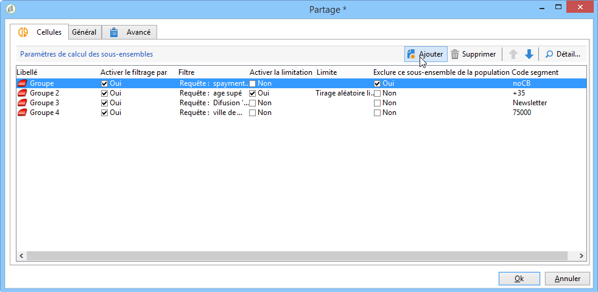
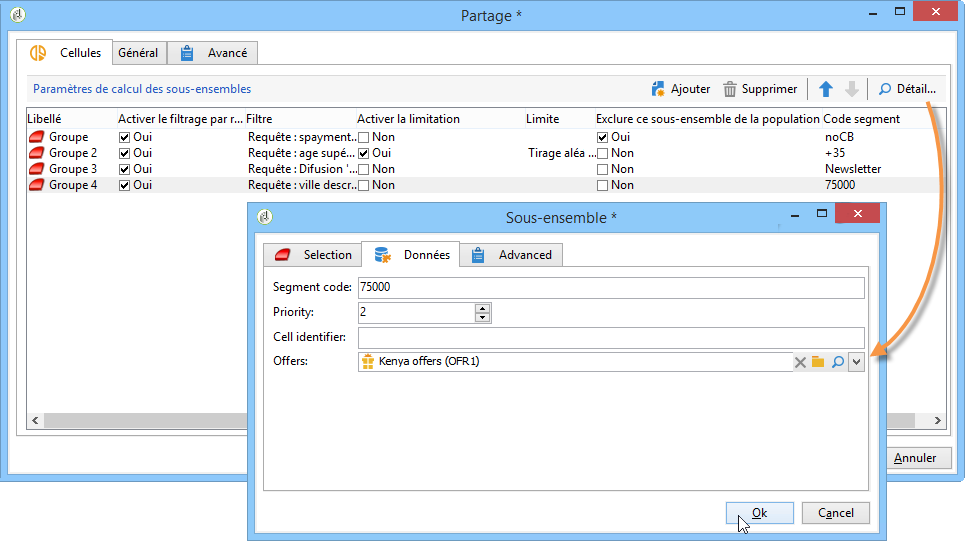

# Cellules{#cells}


L&#39;activité **[!UICONTROL Cellules]** propose une vue des différents sous-ensembles sous forme de colonnes de données. Elle permet de faciliter la manipulation de ces sous-ensembles, lorsqu&#39;ils sont nombreux. Elle est également conçue pour favoriser les possibilités de personnalisation.



Cette activité peut être configurée afin de renseigner des paramètres spécifiques, selon les besoins de l&#39;utilisateur. Par défaut, le détail de chaque sous-ensemble est décrit dans une fenêtre dédiée au travers des onglets **[!UICONTROL Sélection]** et **[!UICONTROL Avancé]**. Dans l&#39;exemple ci-dessous, le formulaire a été modifié : un onglet **[!UICONTROL Données]** a été ajouté afin de permettre l&#39;association d&#39;une offre et d&#39;un niveau de priorité à chaque sous-ensemble.



Pour réaliser ce paramétrage, les informations suivantes ont été ajoutées dans le formulaire des workflows (sous le noeud **[!UICONTROL Administration > Paramétrages > Formulaires de saisie]** de l&#39;arborescence Adobe Campaign) :

```
<container img="nms:miniatures/mini-enrich.png" label="Data">
                <input xpath="@code"/>
                <container xpath="select/node[@alias='@numTest']">
                  <input alwaysActive="true" expr="'long'" type="expr" xpath="@type"/>
                  <input alwaysActive="true" expr="'Priority'" type="expr" xpath="@label"/>
                  <input label="Priority" maxValue="12" minValue="0" type="number"
                         xpath="@value" xpathEditFromType="@type"/>
                </container>
                <container xpath="select/node[@alias='@test']">
                  <input alwaysActive="true" expr="'string'" type="expr" xpath="@type"/>
                  <input alwaysActive="true" expr="'Identifier'" type="expr" xpath="@label"/>
                  <input label="Cell identifier" xpath="@value"/>
                </container>
                <container xpath="select/node[@alias='linkTest']">
                  <input alwaysActive="true" expr="'link'" type="expr" xpath="@type"/>
                  <input alwaysActive="true" expr="'nms:offer'" type="expr" xpath="@dataType"/>
                  <input alwaysActive="true" expr="'Offre'" type="expr" xpath="@label"/>
                  <input computeStringAlias="@valueLabel" label="Offers" notifyPathList="@_cs|@valueLabel"
                         schema="nms:offer" type="linkEdit" xpath="@value"/>
                </container>
```

La personnalisation des formulaires de saisie sous Adobe Campaign est réservée à des utilisateurs experts. Reportez-vous à ce sujet à cette [section](../../configuration/using/identifying-a-form.md).
