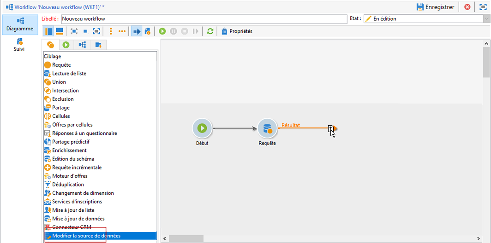
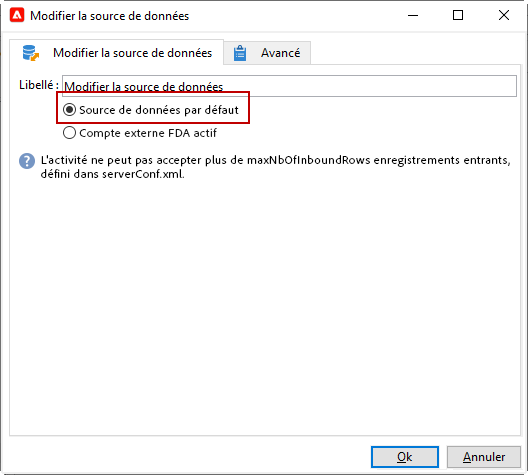
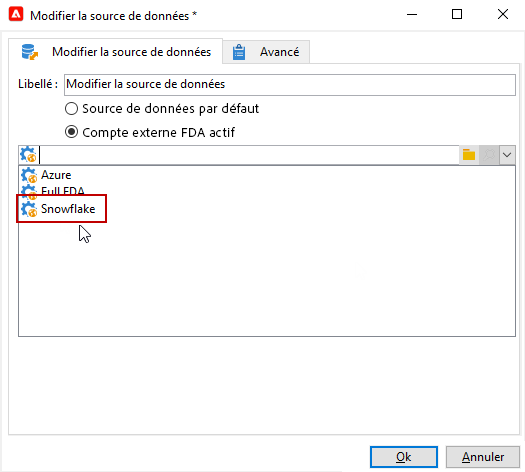

# Modifier la source de données {#change-data-source}

>[!NOTE]
>
> L&#39;activité **[!UICONTROL Modifier la source de données]** n&#39;est disponible qu&#39;avec le package **[!UICONTROL Accès aux données externes (Federated Data Access)]**. Pour plus d’informations sur les packages natifs d’Adobe Campaign Classic, consultez cette [page](../../installation/using/installing-campaign-standard-packages.md).

L&#39;activité **[!UICONTROL Modifier la source de données]** permet de modifier la source de données d&#39;un workflow **[!UICONTROL Table de travail]**. Vous bénéficiez ainsi d&#39;une plus grande flexibilité pour gérer les données entre différentes sources de données, telles que FDA, FFDA et base de données locale.

La **[!UICONTROL table de travail]** permet au workflow Adobe Campaign Classic de gérer les données et de partager les données avec les activités de workflow.
Par défaut, la **[!UICONTROL table de travail]** est créée dans la même base de données que la source des données sur lesquelles nous effectuons une requête.

Par exemple, lors de l&#39;interrogation de la table **[!UICONTROL Profils]** stockée dans la base de données cloud, vous allez créer une **[!UICONTROL table de travail]** sur la même base de données cloud.
Pour modifier ce paramètre, vous pouvez ajouter l&#39;activité **[!UICONTROL Modifier la source de données]** afin de choisir une autre source de données pour votre **[!UICONTROL table de travail]**.

Notez que lorsque vous utilisez l&#39;activité **[!UICONTROL Modifier la source de données]**, vous devez revenir à la base de données cloud pour continuer l&#39;exécution des workflows.

Pour utiliser l&#39;activité **[!UICONTROL Modifier la source de données]** :

1. Créez un workflow.

1. Interrogez vos destinataires ciblés avec une activité **[!UICONTROL Requête]**.

   Pour plus d&#39;informations sur l&#39;activité **[!UICONTROL Requête]**, consultez cette [page](../../workflow/using/query.md#creating-a-query).

1. Depuis l’onglet **[!UICONTROL Ciblage]**, ajoutez une activité **[!UICONTROL Modifier la source de données]**.

   

1. Double-cliquez sur votre activité **[!UICONTROL Modifier la source de données]** pour sélectionner **[!UICONTROL Source de données par défaut]**.

   La table de travail, qui contient le résultat de votre requête, est ensuite déplacée vers la base de données PostgreSQL par défaut.

   

1. Dans l&#39;onglet **[!UICONTROL Actions]**, effectuez un glisser-déposer d&#39;une activité **[!UICONTROL Code JavaScript]** pour réaliser des opérations unitaires sur la table de travail.

   Pour plus d&#39;informations sur l&#39;activité **[!UICONTROL Code JavaScript]**, consultez la page [Code JavaScript et Code JavaScript avancé](../../workflow/using/sql-code-and-javascript-code.md#javascript-code).

1. Ajoutez une autre activité **[!UICONTROL Modifier la source de données]** pour revenir à la base de données cloud.

1. Double-cliquez sur votre activité et sélectionnez **[!UICONTROL Compte externe FDA actif]** puis le compte externe **[!UICONTROL Base de données externe]** correspondant.

   

1. Vous pouvez maintenant démarrer votre workflow.
