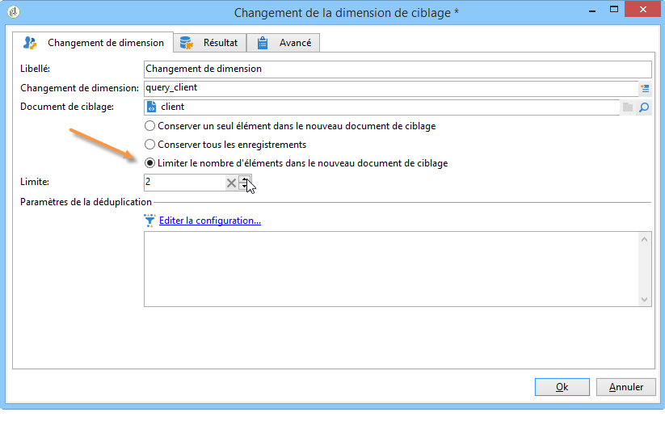

# Changement de dimension{#change-dimension}

L&#39;activité de changement de dimension permet de modifier la dimension de ciblage au cours du cycle de construction de la cible. Le basculement d&#39;axe dépend du modèle de données et de la dimension en entrée. Vous pouvez ainsi par exemple passer de la dimension &quot;contrats&quot; à la dimension &quot;clients&quot;.

Vous pouvez également utiliser cette activité pour définir les colonnes additionnelles de la nouvelle cible.

Il est possible de définir des critères de dédoublonnage des données.

## Mode de paramétrage {#configuration-mode}

Pour paramétrer l&#39;activité de changement de dimension, respectez les étapes suivantes :

1. Select the new targeting dimension via the **[!UICONTROL Change dimension]** field.

   

1. Lors du changement de dimension, vous pouvez conserver tous les éléments ou sélectionner ceux à conserver en sortie. Dans l&#39;exemple ci-dessous, le nombre maximal de doublons est fixé à 2.

   

   Lorsque vous choisissez de ne conserver qu&#39;un seul enregistrement, une collection apparaît dans le schéma de travail : cette collection représente tous les enregistrements qui ne seront pas ciblés dans le résultat final (puisqu&#39;un seul enregistrement est conservé). Cette collection permet, comme toute autre collection, de calculer des agrégats ou de récupérer des informations en colonne.

   For example, if you change the **[!UICONTROL Customers]** dimension to the **[!UICONTROL Recipients]** dimension, it will be possible to target customers of a specific store, while adding the number of purchases made.

1. Si vous choisissez de ne pas conserver tous les enregistrements, vous pouvez configurer le mode de gestion des doublons.

   

   Les flèches bleues permettent de définir l&#39;ordre de priorité de traitement des doublons.

   Dans l&#39;exemple ci-dessus, les destinataires seront dédoublonnés d&#39;abord sur leur adresse email, puis, au besoin, sur leur numéro de compte.

1. The **[!UICONTROL Result]** tab lets you add additional information.

   For example, you can recover the county based on the zip code by using a **Substring** type function. Pour cela :

   * Cliquez sur le **[!UICONTROL Add data...]** lien et sélectionnez **[!UICONTROL Data linked to the filtering dimension]**.

      

      >[!NOTE]
      >
      >For information on creating and managing additional columns, refer to [Adding data](../../workflow/using/query.md#adding-data).

   * Select the previous targeting dimension (before axis switch) and select the **[!UICONTROL Zip Code]** in the recipient&#39;s **[!UICONTROL Location]** sub-tree, then click **[!UICONTROL Edit expression]**.

      

   * Cliquez sur **[!UICONTROL Advanced selection]** , puis sélectionnez **[!UICONTROL Edit the formula using an expression]**.

      

   * Utilisez les fonctions proposées dans la liste et indiquez le calcul à réaliser.

      

   * Pour finir, saisissez le libellé de la colonne que vous venez de créer.

      

1. Exécutez le workflow pour visualiser le résultat de ce paramétrage. Comparez les données contenues dans les tables avant et après l&#39;activité de changement de dimension, comparez également la structure des tables du workflow, comme dans les exemples suivants :

   

   

