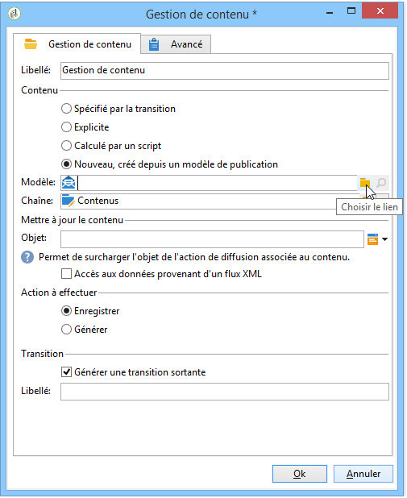
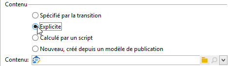
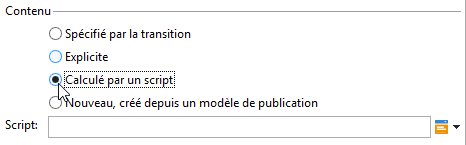
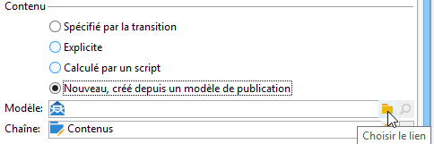
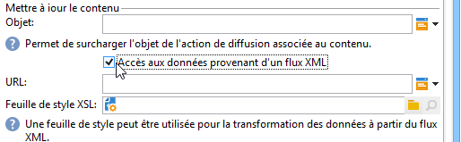
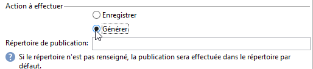

# Gestion de contenu{#content-management}

Une activité de type **Gestion de contenu** permet de créer et de manipuler un contenu ainsi que de générer les fichiers à partir de ce contenu. Ce contenu peut ensuite être diffusé à l&#39;aide d&#39;une activité de type &#39;Diffusion&#39;.

>[!CAUTION]
>
>La gestion de contenu est un module optionnel d&#39;Adobe Campaign. Vérifiez votre contrat de licence.

Les propriétés de l&#39;activité se divisent en trois étapes :

* **Sélection du contenu**: le contenu peut avoir été créé précédemment ou peut être créé depuis l&#39;activité.
* **Mise à jour du contenu**: la tâche peut modifier l&#39;objet du contenu ou importer tout le contenu XML.
* **Action**: le contenu résultant peut être enregistré ou généré.

   

   Le paramétrage et l&#39;utilisation de la gestion de contenu dans Adobe Campaign sont présentés dans cette [section](../../delivery/using/about-content-management.md).

1. **Content**

   * **[!UICONTROL Specified in the transition]**

      Cette option vous permet d’utiliser le contenu spécifié dans la transition, c’est-à-dire que l’événement qui active la gestion du contenu doit contenir une **[!UICONTROL contentId]** variable. Cette variable peut avoir été définie par une gestion de contenu précédente ou par n’importe quel script.

   * **[!UICONTROL Explicit]**

      Cette option vous permet de sélectionner un contenu déjà créé, via le **[!UICONTROL Content]** champ. Ce champ n’est visible que lorsque l’ **[!UICONTROL Explicit]** option est sélectionnée.

      

   * **[!UICONTROL Calculated by a script]**

      L’identifiant de contenu est calculé par un script. Le **[!UICONTROL Script]** champ vous permet de définir un modèle JavaScript évaluant l’identifiant (clé primaire) du contenu. Ce champ n’est visible que lorsque l’ **[!UICONTROL Calculated by a script]** option est sélectionnée.

      

   * **[!UICONTROL New, created from a publication template]**

      Crée un nouveau contenu à partir d’un modèle de publication. Ce nouveau contenu sera enregistré dans le fichier spécifié dans le **[!UICONTROL String]** champ. Le **[!UICONTROL Template]** champ spécifie le modèle de publication à utiliser pour créer le contenu.

      

1. **Mettre à jour le contenu**

   * **[!UICONTROL Subject]**

      Ce champ permet de modifier l&#39;objet du contenu.

   * **[!UICONTROL Access to data from an XML feed]**

      Cette option vous permet de construire le contenu à partir d’un document XML téléchargé via une feuille de style XSL. Lorsque cette option est sélectionnée, le **[!UICONTROL URL]** champ spécifie l’URL de téléchargement du contenu XML. Vous **[!UICONTROL XSL stylesheet]** permet de spécifier la feuille de style à utiliser pour transformer le document XML téléchargé. Cette propriété est facultative.

      

1. **Action à effectuer**

   * **[!UICONTROL Save]**

      Cette option enregistre le contenu créé ou modifié.

      La transition sortante est activée une seule fois avec pour paramètre l&#39;identifiant du contenu enregistré dans la variable **[!UICONTROL contentId]**.

   * **[!UICONTROL Generate]**

      Cette option enregistre le contenu puis génère les fichiers de sortie pour chacun des modèles de transformation dont le type de publication est &#39;Fichier&#39;.

      

      La transition sortante est activée pour chacun des fichiers générés avec pour paramètre l&#39;identifiant du contenu enregistré dans la variable **[!UICONTROL contentId]** et le nom du fichier dans la variable **[!UICONTROL filename]**.

## Paramètres d&#39;entrée {#input-parameters}

* contentId

Identifiant du contenu à utiliser si l’ **[!UICONTROL Specified in the transition]** option est activée.

## Paramètres de sortie {#output-parameters}

* contentId

   Identifiant du contenu.

* filename

   Full name of the generated file if the selected action is **[!UICONTROL Generate]**.

## Exemples {#examples}

Des exemples sont proposés dans cette [section](../../delivery/using/automating-via-workflows.md#examples).
