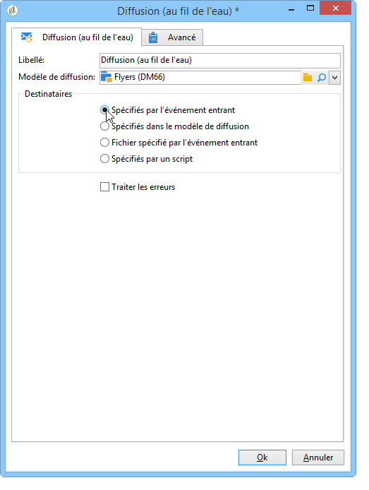
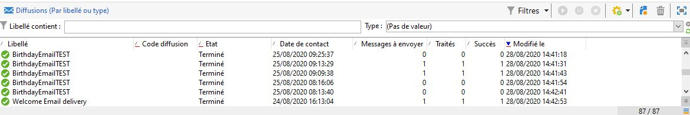

# Diffusion (au fil de l&#39;eau){#continuous-delivery}

Une activité de type **Diffusion au fil de l&#39;eau** permet d&#39;ajouter de nouveaux destinataires à une action de diffusion existante. Ce type de diffusion évite de créer une diffusion complète à chaque fois : ce mode de fonctionnement est souvent plus efficace, notamment pour les notifications ou alertes de faible volume effectuées au fil de l&#39;eau. Au niveau du modèle de diffusion, vous pouvez indiquer un script de calcul du libellé (et du dossier de campagne) de la diffusion associée. Si le script calcule une diffusion qui n&#39;existe pas encore, elle est alors créée à la volée.

L&#39;option **[!UICONTROL Traiter les erreurs]** fait apparaître une transition particulière qui sera activée si une erreur est générée. Dans ce cas, le workflow ne passe pas en état d&#39;erreur et continue son exécution.

Les erreurs prises en compte sont les erreurs du système de fichiers (impossible de déplacer un fichier, impossible d&#39;accéder au répertoire, etc.).

Cette option ne traite pas les erreurs liées au paramétrage de l&#39;activité, c&#39;est-à-dire des valeurs invalides.

## Paramètres d&#39;entrée {#input-parameters}

* tableName
* schema

Chacun des événements entrants doit spécifier une cible définie par ces paramètres.

Uniquement lorsque l&#39;action **[!UICONTROL Spécifiés par l&#39;événement entrant]** est sélectionnée.

## Paramètres de sortie {#output-parameters}

* tableName
* schema
* recCount

Ce triplet de valeurs identifie la cible résultant de la diffusion à la volée. **[!UICONTROL tableName]** est le nom de la table qui mémorise les identifiants de la cible, **[!UICONTROL schema]** est le schéma de la population (habituellement nms:recipient) et **[!UICONTROL recCount]** est le nombre d&#39;éléments dans la table.

La transition associée au complémentaire possède les mêmes paramètres.

## Comment configurer une diffusion (au fil de l’eau)

Cette section explique comment configurer une diffusion (au fil de l’eau).

Une **diffusion (au fil de l’eau)** permet d&#39;ajouter de nouveaux destinataires à une diffusion existante, ce qui évite d&#39;avoir à créer une diffusion chaque fois qu’un nouveau destinataire est ajouté. Vous pouvez mettre à jour le contenu créatif directement dans le workflow de campagne et le modèle sera mis à jour dans le dossier Ressource du modèle de diffusion.

Une diffusion (au fil de l’eau) crée une diffusion et des logs de diffusion UNIQUES (broadLog) et des logs de tracking qui font référence à l&#39;ajout d&#39;une diffusion chaque fois qu&#39;elle s&#39;exécute.

Cette vidéo montre comment configurer une diffusion (au fil de l’eau) avec une requête incrémentale.

>[!VIDEO](https://video.tv.adobe.com/v/25039?quality=12)
