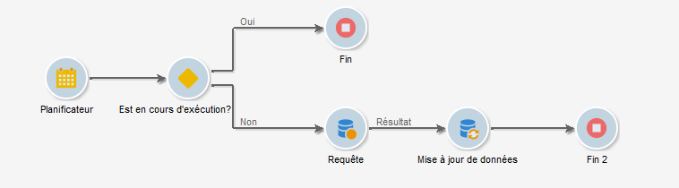
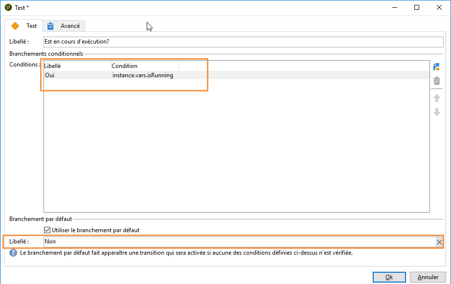
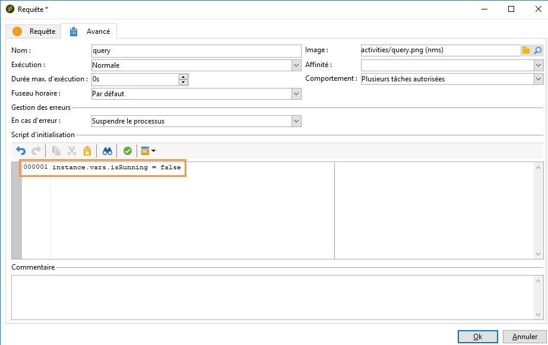
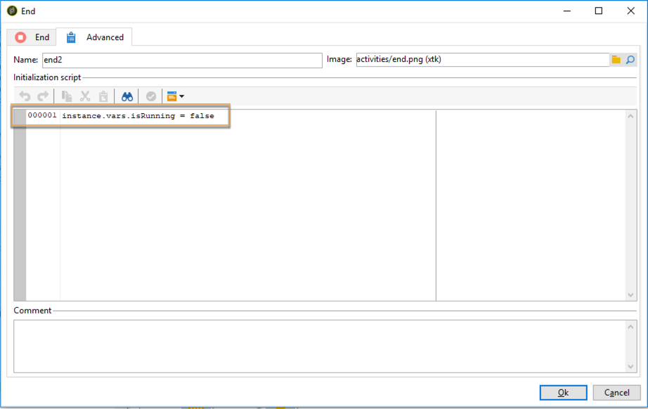

# Coordonner les mises à jour de données{#coordinating-data-updates}

Ce cas pratique présente la création d’un workflow permettant de gérer des mises à jour concomitantes lors de l’utilisation de plusieurs exécutions d’un workflow.

Le but est de vérifier que le processus de mise à jour est terminé avant d&#39;exécuter une autre opération de mise à jour. Pour ce faire, nous allons configurer une variable d’instance et laisser le workflow tester si l’instance est en cours d’exécution afin de décider de continuer ou non l’exécution du workflow et d’effectuer la mise à jour.

Ce workflow se compose de :

* une activité **Planificateur** exécutant le workflow à une fréquence spécifique,
* une activité **Test** vérifiant si le workflow est déjà en cours d&#39;exécution,
* des activités **Requête** et **Mise à jour de données** si le workflow n&#39;est pas déjà en cours d&#39;exécution, suivies d&#39;une activité **Fin** réinitialisant la variable d&#39;instance du workflow à la valeur false.
* une activité **Fin** si le workflow est déjà en cours d&#39;exécution.

Pour créer le workflow, procédez comme suit :

1. Ajoutez une activité **Planificateur**, puis configurez sa fréquence selon vos besoins.
1. Ajoutez une activité **Test** pour vérifier si le workflow est déjà en cours d&#39;exécution, puis configurez-la comme indiqué ci-dessous.

   >[!NOTE]
   >
   >« isRunning » est le nom de la variable d&#39;instance choisi pour cet exemple. Il ne s’agit pas d’une variable intégrée.

   

1. Ajoutez une activité **Fin** au branchement **Non**. Ainsi, rien ne sera exécuté si le workflow est déjà en cours d&#39;exécution.
1. Ajoutez les activités souhaitées au branchement **Oui**. Dans le cas présent, il s&#39;agit des activités **Requête** et **Mise à jour des données**.
1. Ouvrez la première activité, puis ajoutez la commande **instance.vars.isRunning = true** dans l&#39;onglet **[!UICONTROL Avancé]**. Ainsi, la variable d&#39;instance est définie comme étant en cours d&#39;exécution.

   

1. Ajoutez une activité **Fin** à l&#39;extrémité du branchement **[!UICONTROL Oui]**, puis la commande **instance.vars.isRunning = false** dans l&#39;onglet **[!UICONTROL Avancé]**.

   De cette manière, aucune action ne sera exécutée tant que le workflow sera en cours d&#39;exécution.

   

**Rubriques connexes :**

* [Empêcher les exécutions multiples simultanées](monitoring-workflow-execution.md#preventing-simultaneous-multiple-executions)
* [Activité Mise à jour de données](update-data.md)
