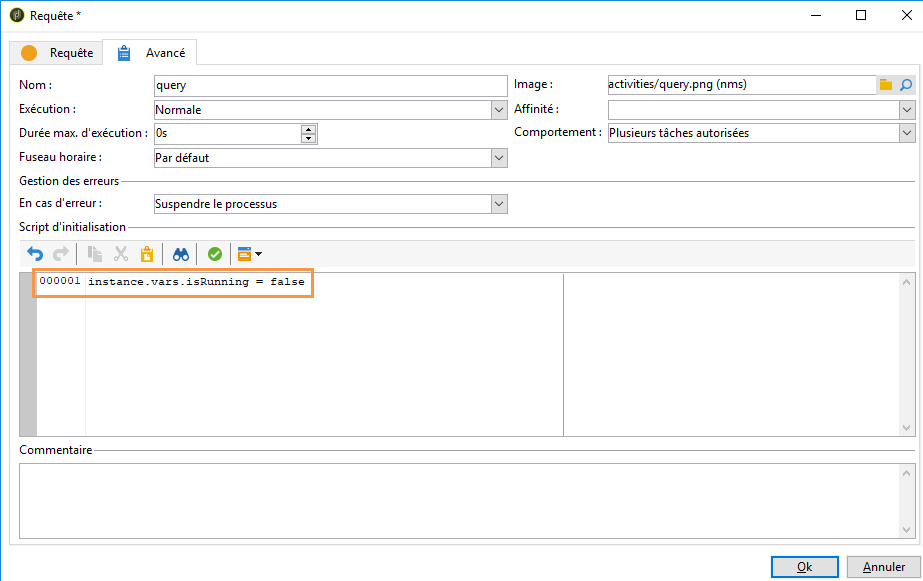

# Coordonner les mises à jour des données{#coordinating-data-updates}

Ce cas pratique présente la création d&#39;un workflow permettant de gérer des mises à jour concomitantes lors de l&#39;utilisation de plusieurs exécutions d&#39;un workflow.

Le but est de vérifier que la procédure de mise à jour est terminée avant d&#39;exécuter une autre opération de mise à jour. Pour cela, nous allons configurer une variable d&#39;instance et laisser le workflow tester si l&#39;instance est en cours d&#39;exécution afin de décider de poursuivre ou non l&#39;exécution du workflow et d&#39;effectuer la mise à jour.

Ce workflow se compose de :

* une activité **Planificateur** exécutant le workflow à une fréquence spécifique,
* une activité **Test** vérifiant si le workflow est déjà en cours d&#39;exécution,
* des activités **Requête** et **Mise à jour de données** si le workflow n&#39;est pas déjà en cours d&#39;exécution, suivies d&#39;une activité **Fin** réinitialisant la variable d&#39;instance du workflow à la valeur false.
* une activité **Fin** si le workflow est déjà en cours d&#39;exécution.

Pour créer le workflow, procédez comme suit :

1. Ajoutez une activité **Planificateur**, puis configurez sa fréquence selon vos besoins.
1. Ajoutez une activité **Test** pour vérifier si le workflow est déjà en cours d&#39;exécution, puis configurez-la comme indiqué ci-dessous.

   >[!NOTE]
   >
   >&quot;isRunning&quot; est le nom de la variable d&#39;instance choisi pour cet exemple. Il ne s&#39;agit pas d&#39;une variable intégrée.

   

1. Ajoutez une activité **Fin** au branchement **Non**. Ainsi, rien ne sera exécuté si le workflow est déjà en cours d&#39;exécution.
1. Ajoutez les activités souhaitées au branchement **Oui**. Dans le cas présent, il s&#39;agit des activités **Requête** et **Mise à jour des données**.
1. Ouvrez la première activité, puis ajoutez la commande **instance.vars.isRunning = true** dans l’onglet **[!UICONTROL Avancé]** . Ainsi, la variable d’instance est définie comme étant en cours d’exécution.

   

1. Add an **End** activity at the end of the **[!UICONTROL Yes]** fork, then add the **instance.vars.isRunning = false** command in the **[!UICONTROL Advanced]** tab.

   De cette manière, aucune action ne sera exécutée tant que le workflow sera en cours d&#39;exécution.

   

**Rubriques connexes :**

* [Empêcher les exécutions multiples simultanées](../../workflow/using/monitoring-workflow-execution.md#preventing-simultaneous-multiple-executions)
* [Activité Mise à jour de données](../../workflow/using/update-data.md)

